# Weekly Corn and Ethanol Intel Report

<strong>Week of August 13, 2026</strong>Market data through: August 12, 2026Narrative created: August 20, 2026

Weekly review of corn, ethanol, energy, co-product, policy, and related public-company performance for commodities risk managers at U.S. ethanol plants.

## Strategy Narrative

<nav class="strategy-narrative-links" aria-label="Strategy narrative sections">
<ul>
<li><a href="#strategy-executive-view-1-usda-tightened-corn-despite-a-second-largest-crop">1. USDA tightened corn despite a second-largest crop</a></li>
<li><a href="#strategy-executive-view-2-ethanol-production-rose-while-blending-inputs-weakened">2. Ethanol production rose while blending inputs weakened</a></li>
<li><a href="#strategy-executive-view-3-green-plains-demonstrated-why-crush-margin-now-requires-a-45z-bridge">3. Green Plains demonstrated why “crush margin” now requires a 45Z bridge</a></li>
<li><a href="#strategy-executive-view-4-e15-demand-protection-continued-but-the-policy-cliff-merely-moved">4. E15 demand protection continued, but the policy cliff merely moved</a></li>
<li><a href="#strategy-executive-view-5-record-soybean-supply-raises-the-competitive-bar-for-ddgs">5. Record soybean supply raises the competitive bar for DDGS</a></li>
</ul>
</nav>

<h3 id="executive-view">Executive View</h3>

- **Corn procurement risk increased.** USDA’s first survey-based yield forecast cut national yield to 180.7 bushels per acre, while stronger export assumptions reduced projected 2026/27 ending stocks to 1.653 billion bushels. The crop remains historically large, but the buffer against additional weather or demand surprises is smaller.
- **Ethanol supply again outran domestic blending.** Production rose to 1.117 million barrels per day and inventories increased to 24.8 million barrels, 9.5% above a year earlier, while refiner and blender ethanol inputs declined.
- **The petroleum complex provided mixed support.** Gasoline stocks fell and remained 6% below the five-year average, but gasoline demand was slightly below last year and crude and wholesale gasoline prices declined sharply during the week.
- **45Z moved from prospective value to reported earnings and cash-flow exposure.** Green Plains recognized $58.7 million of quarterly 45Z value; Aemetis reported both credit recognition and completed monetization. Plants now need to separate physical crush performance from tax-credit economics when benchmarking margins.
- **EPA preserved the E15 outlet through August 28, but only through another temporary waiver.** The extension protects incremental blending demand without resolving the recurring regulatory cliff.
- **Soybean supply became a clearer co-product risk.** USDA raised soybean production and crush, implying more soybean meal competition for DDGS and high-protein feed products this autumn.
- **Overall margin and risk conditions deteriorated modestly:** corn tightened, ethanol inventories rose and petroleum prices weakened, partially offset by inexpensive natural gas and substantial 45Z support for qualifying low-carbon production.

| Exposure | Current signal | Change | Horizon | Confidence |
|---|---|---:|---|---|
| Corn procurement | Tighter than July balance sheet | Deteriorated | Harvest–Q1 2027 | High |
| Ethanol selling | Heavy production and inventories | Deteriorated | 1–4 weeks | High |
| Natural gas | Historically manageable spot cost | Improved | 1–3 months | Medium |
| DDGS/protein | More soybean-meal competition | Deteriorated | Harvest–winter | Medium |
| Regulatory value | Strong 45Z, mixed RIN signals | Bifurcated | 2026–27 | Medium |
| Overall plant margin | Input/output squeeze outside 45Z | Deteriorated modestly | Near term | Medium |

The initial baseline is therefore a **large-crop but no-longer-loose corn market, high ethanol operating rates, and increasingly bifurcated plant economics between conventional and low-carbon facilities**. Long-running background issues—carbon-pipeline permitting, final 45Z compliance mechanics and structural year-round E15 legislation—are not repeated except where this week produced a measurable change.

<h3 id="strategy-executive-view-1-usda-tightened-corn-despite-a-second-largest-crop">1. USDA tightened corn despite a second-largest crop</h3>

**Status:** NEW

**What happened**

USDA’s August 12 survey-based forecast put corn production at 16.013 billion bushels. Harvested area increased 1.2 million acres from July, but yield fell 2.3 bushels to 180.7. USDA also reduced beginning stocks by 75 million bushels and raised 2026/27 exports by 75 million to 3.275 billion, lowering ending stocks by 137 million to 1.653 billion. Corn use for ethanol remained 5.6 billion bushels. ([USDA, “WASDE-674,” August 12, 2026](https://esmis.nal.usda.gov/sites/default/release-files/796014/wasde0826.pdf); [USDA NASS, “Crop Production,” August 12, 2026](https://esmis.nal.usda.gov/sites/default/release-files/796015/crop0826.pdf)) ([esmis.nal.usda.gov](https://esmis.nal.usda.gov/sites/default/release-files/796014/wasde0826.pdf?utm_source=openai))

The August 9 condition rating held at 61% good-to-excellent, but that was 11 percentage points below the prior year. Midwest moderate-or-worse drought coverage expanded to 24.7% by August 11, especially across Minnesota, Wisconsin and pockets of Iowa and Illinois. ([USDA NASS, “Crop Progress,” August 10, 2026](https://esmis.nal.usda.gov/sites/default/release-files/796012/prog3226.txt); [U.S. Drought Monitor, map released August 13, 2026](https://droughtmonitor.unl.edu/)) ([esmis.nal.usda.gov](https://esmis.nal.usda.gov/sites/default/release-files/796012/prog3226.txt))

**Why it matters**

The important change is not crop size but the reduced residual cushion. Export demand—not ethanol demand—drove most of the monthly tightening, leaving domestic processors more exposed to additional yield losses or stronger-than-expected shipments.

**Risk-manager implication**

New-crop corn is less safely viewed as a harvest-pressure procurement opportunity. Plants with thin post-harvest coverage face greater basis and futures upside risk, particularly where local drought has reduced deliverable supply despite strong state-level yields. Directionally: **corn higher risk, ethanol neutral, plant margins lower**, with the main exposure from harvest through early 2027.

**Watch next**

Whether late-August rainfall stabilizes kernel weight and whether export inspections validate USDA’s record-scale assumptions.

---

<h3 id="strategy-executive-view-2-ethanol-production-rose-while-blending-inputs-weakened">2. Ethanol production rose while blending inputs weakened</h3>

**Status:** UPDATE

**What happened**

For the week ended August 7, ethanol production increased 10,000 barrels per day to 1.117 million, including 1.060 million in the Midwest. Inventories rose 274,000 barrels to 24.798 million—9.5% above the comparable 2025 week. Meanwhile, refiner and blender ethanol inputs fell 21,000 barrels per day to 915,000. ([EIA, “Weekly Petroleum Status Report,” released August 12, 2026](https://www.eia.gov/petroleum/supply/weekly/archive/2026/2026_08_12/wpsr_2026_08_12.php)) ([eia.gov](https://www.eia.gov/petroleum/supply/weekly/archive/2026/2026_08_12/pdf/table1.pdf))

Gasoline supplied slipped to 8.964 million barrels per day, with the four-week average down 0.5% year over year. Gasoline stocks nevertheless fell 1.0 million barrels and remained 6% below the five-year seasonal average. WTI ended August 7 at $79.77 per barrel, down $6.39 week over week, while New York Harbor conventional gasoline fell 25.6 cents to $2.970 per gallon. ([EIA, “Weekly Petroleum Status Report Highlights,” August 12, 2026](https://www.eia.gov/petroleum/supply/weekly/archive/2026/2026_08_12/pdf/highlights.pdf)) ([eia.gov](https://www.eia.gov/petroleum/supply/weekly/archive/2026/2026_08_12/pdf/highlights.pdf))

**Why it matters**

The weekly balance was unfavorable for prompt ethanol values: production expanded, domestic disappearance weakened and inventory accumulated. Low gasoline inventories limit the downside, but declining petroleum prices reduced gasoline’s value umbrella.

**Risk-manager implication**

Plants should treat the immediate ethanol-selling environment as softer unless exports absorb the surplus; a reliable public weekly ethanol-export value is unavailable. Directionally: **ethanol weaker, corn slightly supported by run rates, plant margins lower**, primarily over the next several weeks.

**Watch next**

Whether production retreats from the 1.1-million-barrel-per-day area before maintenance season and whether Gulf and East Coast stocks continue building.

---

<h3 id="strategy-executive-view-3-green-plains-demonstrated-why-crush-margin-now-requires-a-45z-bridge">3. Green Plains demonstrated why “crush margin” now requires a 45Z bridge</h3>

**Status:** CONFIRM

**What happened**

On its August 6 earnings call, Green Plains reported second-quarter adjusted EBITDA of $93.3 million, a $95.1 million consolidated ethanol crush margin and $58.7 million of recognized 45Z production-credit value. Utilization was 88% because of planned maintenance and work at Madison, while management characterized physical ethanol and co-product conditions as strong. ([The Motley Fool, “Green Plains Q2 2026 Earnings Call Transcript,” published August 13, 2026; call held August 6](https://www.fool.com/earnings/call-transcripts/2026/08/13/green-plains-gpre-q2-2026-earnings-call-transcript/)) ([fool.com](https://www.fool.com/earnings/call-transcripts/2026/08/13/green-plains-gpre-q2-2026-earnings-call-transcript/?utm_source=openai))

Aemetis separately reported $8.6 million of second-quarter 45Z value and disclosed $17.6 million of July 9 net cash proceeds from a transfer of previously recognized credits. ([The Motley Fool, “Aemetis Q2 2026 Earnings Call Transcript,” published August 13, 2026; call held August 6](https://www.fool.com/earnings/call-transcripts/2026/08/13/aemetis-amtx-q2-2026-earnings-call-transcript/)) ([fool.com](https://www.fool.com/earnings/call-transcripts/2026/08/13/aemetis-amtx-q2-2026-earnings-call-transcript/?utm_source=openai))

**Why it matters**

These disclosures confirm that 45Z is already materially affecting reported plant profitability and working capital. Reported crush metrics may no longer represent purely physical ethanol, corn, energy and co-product economics.

**Risk-manager implication**

Benchmarking should separate **physical crush, accrued credit value, monetization haircut and timing risk**. Qualifying plants have a substantial margin buffer; conventional or higher-carbon facilities do not. Credit eligibility and verification errors now constitute operating-margin risks, not merely tax risks.

**Watch next**

Transfer pricing, audit reserves, final emissions-rate substantiation and the cash-conversion lag between production, recognition and credit sale.

---

<h3 id="strategy-executive-view-4-e15-demand-protection-continued-but-the-policy-cliff-merely-moved">4. E15 demand protection continued, but the policy cliff merely moved</h3>

**Status:** UPDATE

**What happened**

EPA’s latest nationwide waiver became effective August 9 and permits a common gasoline pool containing 9%–15% ethanol at a 10-psi Reid Vapor Pressure standard through August 28. EPA also provided a sell-through provision for compliant fuel introduced into pipelines or certified before expiration. ([EPA, “Fuel Waivers,” July 30, 2026 action; effective August 9–28](https://www.epa.gov/gasoline-standards/fuel-waivers)) ([epa.gov](https://www.epa.gov/gasoline-standards/fuel-waivers))

Separately, EPA’s August 3 small-refinery action granted one full and two partial exemptions for 2024, found three petitions ineligible and denied none. The action covered six petitions from four refineries. ([EPA, “August 3, 2026 Decision on Petitions for RFS Small Refinery Exemptions,” August 3, 2026](https://www.epa.gov/system/files/documents/2026-08/frn-2026-0803-sre-decision.rev_.pdf)) ([epa.gov](https://www.epa.gov/system/files/documents/2026-08/frn-2026-0803-sre-decision.rev_.pdf?utm_source=openai))

**Why it matters**

The waiver prevents an abrupt seasonal loss of E15 demand during a period of already-heavy ethanol inventories. Conversely, additional refinery relief reinforces the risk that RIN support can be diluted through case-specific exemptions, even under the new reallocation framework.

**Risk-manager implication**

The net signal is **supportive for physical ethanol demand but mixed for D6 RIN exposure**. Do not treat the waiver as structural demand growth: unless extended, the current authority expires August 28.

---

<h3 id="strategy-executive-view-5-record-soybean-supply-raises-the-competitive-bar-for-ddgs">5. Record soybean supply raises the competitive bar for DDGS</h3>

**Status:** NEW

**What happened**

USDA raised 2026/27 soybean production by 44 million bushels to a record 4.519 billion, largely because harvested area increased 1.4 million acres. Projected crush rose 30 million bushels to 2.78 billion, while ending stocks increased to 320 million. ([USDA, “WASDE-674,” August 12, 2026](https://esmis.nal.usda.gov/sites/default/release-files/796014/wasde0826.pdf)) ([ers.usda.gov](https://www.ers.usda.gov/topics/crops/soybeans-and-oil-crops/market-outlook?utm_source=openai))

**Why it matters**

Higher crush implies additional soybean-meal availability. That does not mechanically determine DDGS prices, but it increases the probability that meal competes aggressively in feed rations during harvest and winter.

**Risk-manager implication**

The incremental risk is **softer DDGS and high-protein product realizations**, especially for plants relying on co-product strength to offset weaker ethanol. Distillers corn oil faces a more mixed setup because additional soybean oil supply is countered by strong biofuel-policy demand.

<h3 id="strategic-synthesis">Strategic Synthesis</h3>

The week replaced the simple “large crop equals cheap corn” thesis with a tighter one: **the United States can harvest its second-largest corn crop and still leave ethanol plants exposed because export demand is consuming the surplus**. At the same time, high industry run rates are accumulating ethanol stocks faster than domestic blending, making low-carbon credits and disciplined product sales increasingly important to plant-level margin differentiation.

<h3 id="what-i-m-watching-next">What I’m Watching Next</h3>

- **August 19, 2026:** EIA petroleum and ethanol data for the week ending August 14.
- **August 28, 2026:** Current EPA national gasoline-pool and E15 waiver expires.
- **September 11, 2026:** USDA September WASDE and Crop Production reports.

<h3 id="bottom-line">Bottom Line</h3>

The most consequential change was USDA’s reduction of the corn carryout cushion despite a 16-billion-bushel crop. **Post-harvest corn coverage now deserves the closest attention**, while the August 19 EIA report will determine whether this week’s ethanol inventory build was temporary or the start of a more persistent product-margin squeeze.

## Notable Changes

- No earlier final report is available; this report establishes the baseline.

## Subcategory Performance

<table class="sortable"><thead><tr><th class="sortable-heading" data-column="0" data-type="text">Subcategory</th><th class="sortable-heading" data-column="1" data-type="number">Companies</th><th class="sortable-heading" data-column="2" data-type="number">Market cap</th><th class="sortable-heading" data-column="3" data-type="number">3m Return</th><th class="sortable-heading" data-column="4" data-type="number">12m Return</th><th class="sortable-heading" data-column="5" data-type="number">24m Return</th></tr></thead><tbody><tr><td class="text" data-sort="crop inputs, equipment, and irrigation" style=""><a href="#category-crop-inputs-equipment-and-irrigation">Crop inputs, equipment, and irrigation</a></td><td class="" data-sort="11" style="">11</td><td class="" data-sort="300745184479.0" style="">$300.7B</td><td class="" data-sort="0.00521551947028" style="background:#d6ecd4;color:#111820;">+0.5%</td><td class="" data-sort="0.149410201738" style="background:#d6ecd4;color:#111820;">+14.9%</td><td class="" data-sort="0.523723833841" style="background:#7cc077;color:#111820;">+52.4%</td></tr><tr><td class="text" data-sort="grain origination and agribusiness" style=""><a href="#category-grain-origination-and-agribusiness">Grain origination and agribusiness</a></td><td class="" data-sort="3" style="">3</td><td class="" data-sort="63125801301.2" style="">$63.1B</td><td class="" data-sort="-0.0658527264517" style="background:#f5aead;color:#111820;">-6.6%</td><td class="" data-sort="0.347022590289" style="background:#a9d9a4;color:#111820;">+34.7%</td><td class="" data-sort="0.289511643478" style="background:#a9d9a4;color:#111820;">+29.0%</td></tr><tr><td class="text" data-sort="u.s. ethanol and process technology" style=""><a href="#category-u-s-ethanol-and-process-technology">U.S. ethanol and process technology</a></td><td class="" data-sort="6" style="">6</td><td class="" data-sort="143490589722.0" style="">$143.5B</td><td class="" data-sort="0.231599321588" style="background:#2f9e44;color:#111820;">+23.2%</td><td class="" data-sort="1.10172662747" style="background:#1a7a3c;color:#ffffff;">+110.2%</td><td class="" data-sort="1.04022794712" style="background:#1a7a3c;color:#ffffff;">+104.0%</td></tr><tr><td class="text" data-sort="wet milling, ingredients, and co-products" style=""><a href="#category-wet-milling-ingredients-and-co-products">Wet milling, ingredients, and co-products</a></td><td class="" data-sort="5" style="">5</td><td class="" data-sort="122070417790.0" style="">$122.1B</td><td class="" data-sort="-0.0792489625698" style="background:#f5aead;color:#111820;">-7.9%</td><td class="" data-sort="0.138485766905" style="background:#d6ecd4;color:#111820;">+13.8%</td><td class="" data-sort="0.216521885413" style="background:#a9d9a4;color:#111820;">+21.7%</td></tr><tr><td class="text" data-sort="fuel blending, refining, and retail" style=""><a href="#category-fuel-blending-refining-and-retail">Fuel blending, refining, and retail</a></td><td class="" data-sort="8" style="">8</td><td class="" data-sort="374068702481.0" style="">$374.1B</td><td class="" data-sort="0.291577385299" style="background:#1a7a3c;color:#ffffff;">+29.2%</td><td class="" data-sort="1.03507124571" style="background:#1a7a3c;color:#ffffff;">+103.5%</td><td class="" data-sort="0.981562745492" style="background:#1a7a3c;color:#ffffff;">+98.2%</td></tr><tr><td class="text" data-sort="advanced biofuels and saf" style=""><a href="#category-advanced-biofuels-and-saf">Advanced biofuels and SAF</a></td><td class="" data-sort="2" style="">2</td><td class="" data-sort="403619489658.0" style="">$403.6B</td><td class="" data-sort="0.0569892473118" style="background:#d6ecd4;color:#111820;">+5.7%</td><td class="" data-sort="0.26130749984" style="background:#a9d9a4;color:#111820;">+26.1%</td><td class="" data-sort="0.358767019144" style="background:#a9d9a4;color:#111820;">+35.9%</td></tr><tr><td class="text" data-sort="international ethanol" style=""><a href="#category-international-ethanol">International ethanol</a></td><td class="" data-sort="2" style="">2</td><td class="" data-sort="4030007905.26" style="">$4.0B</td><td class="" data-sort="-0.304094998799" style="background:#c0302f;color:#ffffff;">-30.4%</td><td class="" data-sort="-0.247303536721" style="background:#f5aead;color:#111820;">-24.7%</td><td class="" data-sort="-0.524128164325" style="background:#ee8483;color:#111820;">-52.4%</td></tr><tr><td class="text" data-sort="logistics" style=""><a href="#category-logistics">Logistics</a></td><td class="" data-sort="6" style="">6</td><td class="" data-sort="366182560910.0" style="">$366.2B</td><td class="" data-sort="0.103560720734" style="background:#a9d9a4;color:#111820;">+10.4%</td><td class="" data-sort="0.307355240471" style="background:#a9d9a4;color:#111820;">+30.7%</td><td class="" data-sort="0.262369072572" style="background:#a9d9a4;color:#111820;">+26.2%</td></tr></tbody></table>

Subcategory returns use the most recently saved market capitalizations as weights.

## Stock Performance vs. SPY

The same selected stocks appear in every chart. Each line is labeled at the right with its ticker and return for the displayed window.
### Last 6 months

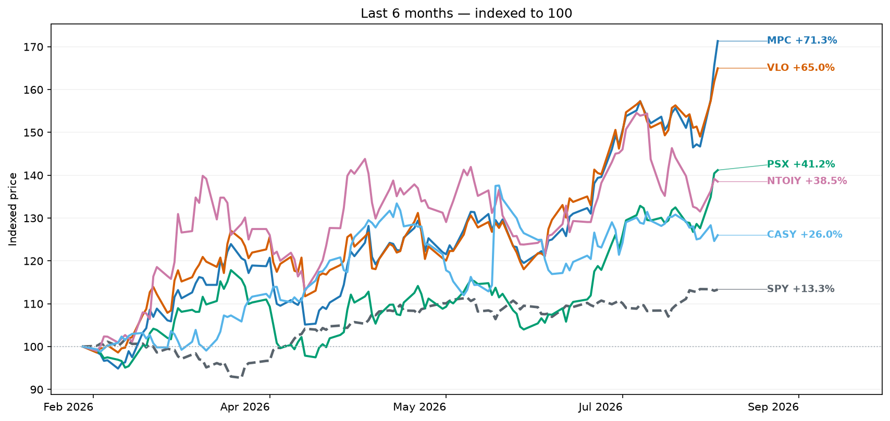

### Last 12 months

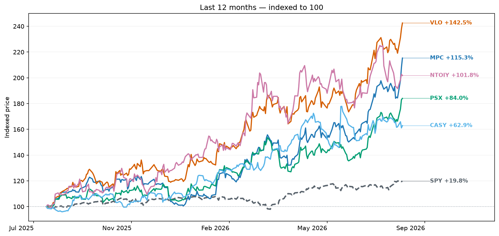

### Last 24 months

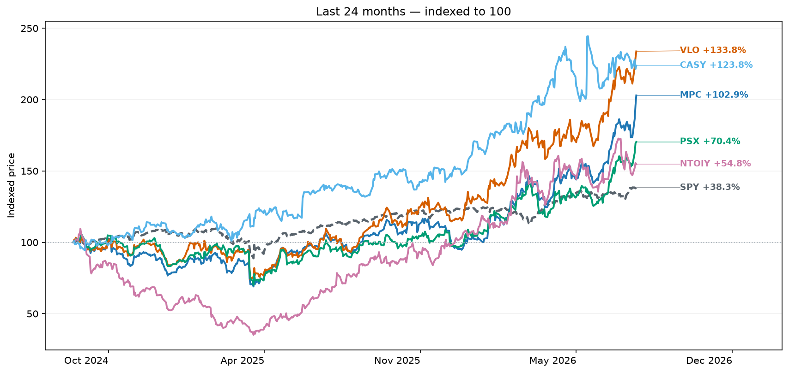

## Current Top Stocks

### Last 3 months

<table class="sortable"><thead><tr><th class="sortable-heading" data-column="0" data-type="number">Rank</th><th class="sortable-heading" data-column="1" data-type="text">Company</th><th class="sortable-heading" data-column="2" data-type="text">Ticker</th><th class="sortable-heading" data-column="3" data-type="number">Market cap</th><th class="sortable-heading" data-column="4" data-type="number">Return</th></tr></thead><tbody><tr><td class="" data-sort="1" style="">1</td><td class="text" data-sort="marathon petroleum" style="">Marathon Petroleum</td><td class="text text" data-sort="mpc" style=""><a href="#company-mpc">MPC</a></td><td class="" data-sort="101307533252.0" style="">$101.3B</td><td class="" data-sort="0.398089044121" style="background:#1a7a3c;color:#ffffff;">+39.8%</td></tr><tr><td class="" data-sort="2" style="">2</td><td class="text" data-sort="valero energy" style="">Valero Energy</td><td class="text text" data-sort="vlo" style=""><a href="#company-vlo">VLO</a></td><td class="" data-sort="99697762645.9" style="">$99.7B</td><td class="" data-sort="0.352765260139" style="background:#1a7a3c;color:#ffffff;">+35.3%</td></tr><tr><td class="" data-sort="3" style="">3</td><td class="text" data-sort="phillips 66" style="">Phillips 66</td><td class="text text" data-sort="psx" style=""><a href="#company-psx">PSX</a></td><td class="" data-sort="96678777737.6" style="">$96.7B</td><td class="" data-sort="0.31288557793" style="background:#2f9e44;color:#111820;">+31.3%</td></tr><tr><td class="" data-sort="4" style="">4</td><td class="text" data-sort="hf sinclair" style="">HF Sinclair</td><td class="text text" data-sort="dino" style=""><a href="#company-dino">DINO</a></td><td class="" data-sort="16821907792.4" style="">$16.8B</td><td class="" data-sort="0.267368117613" style="background:#2f9e44;color:#111820;">+26.7%</td></tr><tr><td class="" data-sort="5" style="">5</td><td class="text" data-sort="bayer" style="">Bayer</td><td class="text text" data-sort="bayry" style=""><a href="#company-bayry">BAYRY</a></td><td class="" data-sort="n/a" style="">n/a</td><td class="" data-sort="0.257685352622" style="background:#2f9e44;color:#111820;">+25.8%</td></tr></tbody></table>

### Last 12 months

<table class="sortable"><thead><tr><th class="sortable-heading" data-column="0" data-type="number">Rank</th><th class="sortable-heading" data-column="1" data-type="text">Company</th><th class="sortable-heading" data-column="2" data-type="text">Ticker</th><th class="sortable-heading" data-column="3" data-type="number">Market cap</th><th class="sortable-heading" data-column="4" data-type="number">Return</th></tr></thead><tbody><tr><td class="" data-sort="1" style="">1</td><td class="text" data-sort="valero energy" style="">Valero Energy</td><td class="text text" data-sort="vlo" style=""><a href="#company-vlo">VLO</a></td><td class="" data-sort="99697762645.9" style="">$99.7B</td><td class="" data-sort="1.42533969886" style="background:#1a7a3c;color:#ffffff;">+142.5%</td></tr><tr><td class="" data-sort="2" style="">2</td><td class="text" data-sort="marathon petroleum" style="">Marathon Petroleum</td><td class="text text" data-sort="mpc" style=""><a href="#company-mpc">MPC</a></td><td class="" data-sort="101307533252.0" style="">$101.3B</td><td class="" data-sort="1.15328015829" style="background:#1a7a3c;color:#ffffff;">+115.3%</td></tr><tr><td class="" data-sort="3" style="">3</td><td class="text" data-sort="neste" style="">Neste</td><td class="text text" data-sort="ntoiy" style=""><a href="#company-ntoiy">NTOIY</a></td><td class="" data-sort="n/a" style="">n/a</td><td class="" data-sort="1.01779359431" style="background:#2f9e44;color:#111820;">+101.8%</td></tr><tr><td class="" data-sort="4" style="">4</td><td class="text" data-sort="darling ingredients" style="">Darling Ingredients</td><td class="text text" data-sort="dar" style=""><a href="#company-dar">DAR</a></td><td class="" data-sort="10563327197.0" style="">$10.6B</td><td class="" data-sort="0.979095163807" style="background:#2f9e44;color:#111820;">+97.9%</td></tr><tr><td class="" data-sort="5" style="">5</td><td class="text" data-sort="hf sinclair" style="">HF Sinclair</td><td class="text text" data-sort="dino" style=""><a href="#company-dino">DINO</a></td><td class="" data-sort="16821907792.4" style="">$16.8B</td><td class="" data-sort="0.951398135819" style="background:#2f9e44;color:#111820;">+95.1%</td></tr></tbody></table>

### Last 24 months

<table class="sortable"><thead><tr><th class="sortable-heading" data-column="0" data-type="number">Rank</th><th class="sortable-heading" data-column="1" data-type="text">Company</th><th class="sortable-heading" data-column="2" data-type="text">Ticker</th><th class="sortable-heading" data-column="3" data-type="number">Market cap</th><th class="sortable-heading" data-column="4" data-type="number">Return</th></tr></thead><tbody><tr><td class="" data-sort="1" style="">1</td><td class="text" data-sort="valero energy" style="">Valero Energy</td><td class="text text" data-sort="vlo" style=""><a href="#company-vlo">VLO</a></td><td class="" data-sort="99697762645.9" style="">$99.7B</td><td class="" data-sort="1.33760441739" style="background:#1a7a3c;color:#ffffff;">+133.8%</td></tr><tr><td class="" data-sort="2" style="">2</td><td class="text" data-sort="casey&#x27;s general stores" style="">Casey&#x27;s General Stores</td><td class="text text" data-sort="casy" style=""><a href="#company-casy">CASY</a></td><td class="" data-sort="30941658841.1" style="">$30.9B</td><td class="" data-sort="1.23848780748" style="background:#1a7a3c;color:#ffffff;">+123.8%</td></tr><tr><td class="" data-sort="3" style="">3</td><td class="text" data-sort="marathon petroleum" style="">Marathon Petroleum</td><td class="text text" data-sort="mpc" style=""><a href="#company-mpc">MPC</a></td><td class="" data-sort="101307533252.0" style="">$101.3B</td><td class="" data-sort="1.02931064623" style="background:#2f9e44;color:#111820;">+102.9%</td></tr><tr><td class="" data-sort="4" style="">4</td><td class="text" data-sort="rex american resources" style="">REX American Resources</td><td class="text text" data-sort="rex" style=""><a href="#company-rex">REX</a></td><td class="" data-sort="1444977688.66" style="">$1.4B</td><td class="" data-sort="0.903331156107" style="background:#2f9e44;color:#111820;">+90.3%</td></tr><tr><td class="" data-sort="5" style="">5</td><td class="text" data-sort="hf sinclair" style="">HF Sinclair</td><td class="text text" data-sort="dino" style=""><a href="#company-dino">DINO</a></td><td class="" data-sort="16821907792.4" style="">$16.8B</td><td class="" data-sort="0.86016500952" style="background:#2f9e44;color:#111820;">+86.0%</td></tr></tbody></table>

## Companies by Subcategory

<h3 id="category-crop-inputs-equipment-and-irrigation"><a href="#subcategory-performance">Crop inputs, equipment, and irrigation</a>Last 3m: +0.5%</h3>

<table class="sortable"><thead><tr><th class="sortable-heading" data-column="0" data-type="text">Company</th><th class="sortable-heading" data-column="1" data-type="text">Ticker</th><th class="sortable-heading" data-column="2" data-type="number">Market cap</th><th class="sortable-heading" data-column="3" data-type="number">3m Return</th><th class="sortable-heading" data-column="4" data-type="number">12m Return</th><th class="sortable-heading" data-column="5" data-type="number">24m Return</th></tr></thead><tbody><tr><td class="text" data-sort="corteva" style="">Corteva</td><td class="text text" data-sort="ctva" style=""><a href="#company-ctva">CTVA</a></td><td class="" data-sort="52421589720.0" style="">$52.4B</td><td class="" data-sort="-0.0938212357528" style="background:#f5aead;color:#111820;">-9.4%</td><td class="" data-sort="0.044241670123" style="background:#d6ecd4;color:#111820;">+4.4%</td><td class="" data-sort="0.409141791045" style="background:#7cc077;color:#111820;">+40.9%</td></tr><tr><td class="text" data-sort="bayer" style="">Bayer</td><td class="text text" data-sort="bayry" style=""><a href="#company-bayry">BAYRY</a></td><td class="" data-sort="n/a" style="">n/a</td><td class="" data-sort="0.257685352622" style="background:#1a7a3c;color:#ffffff;">+25.8%</td><td class="" data-sort="0.778772378517" style="background:#1a7a3c;color:#ffffff;">+77.9%</td><td class="" data-sort="0.774234693878" style="background:#1a7a3c;color:#ffffff;">+77.4%</td></tr><tr><td class="text" data-sort="basf" style="">BASF</td><td class="text text" data-sort="basfy" style=""><a href="#company-basfy">BASFY</a></td><td class="" data-sort="n/a" style="">n/a</td><td class="" data-sort="-0.0696058615462" style="background:#f5aead;color:#111820;">-7.0%</td><td class="" data-sort="0.100896860987" style="background:#d6ecd4;color:#111820;">+10.1%</td><td class="" data-sort="0.226988754686" style="background:#a9d9a4;color:#111820;">+22.7%</td></tr><tr><td class="text" data-sort="nutrien" style="">Nutrien</td><td class="text text" data-sort="ntr" style=""><a href="#company-ntr">NTR</a></td><td class="" data-sort="33643310217.0" style="">$33.6B</td><td class="" data-sort="-0.0576518445785" style="background:#f5aead;color:#111820;">-5.8%</td><td class="" data-sort="0.181082981716" style="background:#a9d9a4;color:#111820;">+18.1%</td><td class="" data-sort="0.43547008547" style="background:#7cc077;color:#111820;">+43.5%</td></tr><tr><td class="text" data-sort="cf industries" style=""><a href="#earnings-cf">CF Industries</a></td><td class="text text" data-sort="cf" style=""><a href="#company-cf">CF</a></td><td class="" data-sort="18012264232.6" style="">$18.0B</td><td class="" data-sort="-0.0437450199203" style="background:#fbd5d4;color:#111820;">-4.4%</td><td class="" data-sort="0.388683175191" style="background:#7cc077;color:#111820;">+38.9%</td><td class="" data-sort="0.499000749438" style="background:#2f9e44;color:#111820;">+49.9%</td></tr><tr><td class="text" data-sort="yara international" style="">Yara International</td><td class="text text" data-sort="yariy" style=""><a href="#company-yariy">YARIY</a></td><td class="" data-sort="n/a" style="">n/a</td><td class="" data-sort="-0.25702811245" style="background:#c0302f;color:#ffffff;">-25.7%</td><td class="" data-sort="0.207834602829" style="background:#a9d9a4;color:#111820;">+20.8%</td><td class="" data-sort="0.542738012509" style="background:#2f9e44;color:#111820;">+54.3%</td></tr><tr><td class="text" data-sort="mosaic" style="">Mosaic</td><td class="text text" data-sort="mos" style=""><a href="#company-mos">MOS</a></td><td class="" data-sort="7066820210.58" style="">$7.1B</td><td class="" data-sort="-0.00790166812994" style="background:#fbd5d4;color:#111820;">-0.8%</td><td class="" data-sort="-0.298354548277" style="background:#f5aead;color:#111820;">-29.8%</td><td class="" data-sort="-0.170946441673" style="background:#f5aead;color:#111820;">-17.1%</td></tr><tr><td class="text" data-sort="deere" style="">Deere</td><td class="text text" data-sort="de" style=""><a href="#company-de">DE</a></td><td class="" data-sort="156733767078.0" style="">$156.7B</td><td class="" data-sort="0.0673727718936" style="background:#a9d9a4;color:#111820;">+6.7%</td><td class="" data-sort="0.206858277836" style="background:#a9d9a4;color:#111820;">+20.7%</td><td class="" data-sort="0.663410182775" style="background:#1a7a3c;color:#ffffff;">+66.3%</td></tr><tr><td class="text" data-sort="cnh industrial" style="">CNH Industrial</td><td class="text text" data-sort="cnh" style=""><a href="#company-cnh">CNH</a></td><td class="" data-sort="16547953475.8" style="">$16.5B</td><td class="" data-sort="-0.00278810408922" style="background:#fbd5d4;color:#111820;">-0.3%</td><td class="" data-sort="-0.163678877631" style="background:#f5aead;color:#111820;">-16.4%</td><td class="" data-sort="0.0960163432074" style="background:#d6ecd4;color:#111820;">+9.6%</td></tr><tr><td class="text" data-sort="agco" style="">AGCO</td><td class="text text" data-sort="agco" style=""><a href="#company-agco">AGCO</a></td><td class="" data-sort="6969557670.08" style="">$7.0B</td><td class="" data-sort="-0.124266988617" style="background:#ee8483;color:#111820;">-12.4%</td><td class="" data-sort="-0.119559563031" style="background:#fbd5d4;color:#111820;">-12.0%</td><td class="" data-sort="0.144096439838" style="background:#d6ecd4;color:#111820;">+14.4%</td></tr><tr><td class="text" data-sort="valmont industries" style="">Valmont Industries</td><td class="text text" data-sort="vmi" style=""><a href="#company-vmi">VMI</a></td><td class="" data-sort="9349921875.14" style="">$9.3B</td><td class="" data-sort="-0.0403403228005" style="background:#fbd5d4;color:#111820;">-4.0%</td><td class="" data-sort="0.294168613963" style="background:#a9d9a4;color:#111820;">+29.4%</td><td class="" data-sort="0.75475258099" style="background:#1a7a3c;color:#ffffff;">+75.5%</td></tr></tbody></table>

<h3 id="category-grain-origination-and-agribusiness"><a href="#subcategory-performance">Grain origination and agribusiness</a>Last 3m: -6.6%</h3>

<table class="sortable"><thead><tr><th class="sortable-heading" data-column="0" data-type="text">Company</th><th class="sortable-heading" data-column="1" data-type="text">Ticker</th><th class="sortable-heading" data-column="2" data-type="number">Market cap</th><th class="sortable-heading" data-column="3" data-type="number">3m Return</th><th class="sortable-heading" data-column="4" data-type="number">12m Return</th><th class="sortable-heading" data-column="5" data-type="number">24m Return</th></tr></thead><tbody><tr><td class="text" data-sort="archer daniels midland" style="">Archer Daniels Midland</td><td class="text text" data-sort="adm" style=""><a href="#company-adm">ADM</a></td><td class="" data-sort="38923055923.1" style="">$38.9B</td><td class="" data-sort="-0.0381228133671" style="background:#f5aead;color:#111820;">-3.8%</td><td class="" data-sort="0.33283182882" style="background:#7cc077;color:#111820;">+33.3%</td><td class="" data-sort="0.351126927639" style="background:#1a7a3c;color:#ffffff;">+35.1%</td></tr><tr><td class="text" data-sort="bunge" style="">Bunge</td><td class="text text" data-sort="bg" style=""><a href="#company-bg">BG</a></td><td class="" data-sort="21901580022.0" style="">$21.9B</td><td class="" data-sort="-0.113235994287" style="background:#c0302f;color:#ffffff;">-11.3%</td><td class="" data-sort="0.342503604037" style="background:#7cc077;color:#111820;">+34.3%</td><td class="" data-sort="0.174091195629" style="background:#7cc077;color:#111820;">+17.4%</td></tr><tr><td class="text" data-sort="the andersons" style="">The Andersons</td><td class="text text" data-sort="ande" style=""><a href="#company-ande">ANDE</a></td><td class="" data-sort="2301165356.1" style="">$2.3B</td><td class="" data-sort="-0.0839151075119" style="background:#e34948;color:#111820;">-8.4%</td><td class="" data-sort="0.630062111801" style="background:#1a7a3c;color:#ffffff;">+63.0%</td><td class="" data-sort="0.345846153846" style="background:#1a7a3c;color:#ffffff;">+34.6%</td></tr></tbody></table>

<h3 id="category-u-s-ethanol-and-process-technology"><a href="#subcategory-performance">U.S. ethanol and process technology</a>Last 3m: +23.2%</h3>

<table class="sortable"><thead><tr><th class="sortable-heading" data-column="0" data-type="text">Company</th><th class="sortable-heading" data-column="1" data-type="text">Ticker</th><th class="sortable-heading" data-column="2" data-type="number">Market cap</th><th class="sortable-heading" data-column="3" data-type="number">3m Return</th><th class="sortable-heading" data-column="4" data-type="number">12m Return</th><th class="sortable-heading" data-column="5" data-type="number">24m Return</th></tr></thead><tbody><tr><td class="text" data-sort="valero energy" style="">Valero Energy</td><td class="text text" data-sort="vlo" style=""><a href="#company-vlo">VLO</a></td><td class="" data-sort="99697762645.9" style="">$99.7B</td><td class="" data-sort="0.352765260139" style="background:#1a7a3c;color:#ffffff;">+35.3%</td><td class="" data-sort="1.42533969886" style="background:#1a7a3c;color:#ffffff;">+142.5%</td><td class="" data-sort="1.33760441739" style="background:#1a7a3c;color:#ffffff;">+133.8%</td></tr><tr><td class="text" data-sort="green plains" style=""><a href="#earnings-gpre">Green Plains</a></td><td class="text text" data-sort="gpre" style=""><a href="#company-gpre">GPRE</a></td><td class="" data-sort="1123628107.84" style="">$1.1B</td><td class="" data-sort="-0.101130279595" style="background:#f5aead;color:#111820;">-10.1%</td><td class="" data-sort="0.640608034745" style="background:#7cc077;color:#111820;">+64.1%</td><td class="" data-sort="0.123420074349" style="background:#d6ecd4;color:#111820;">+12.3%</td></tr><tr><td class="text" data-sort="rex american resources" style="">REX American Resources</td><td class="text text" data-sort="rex" style=""><a href="#company-rex">REX</a></td><td class="" data-sort="1444977688.66" style="">$1.4B</td><td class="" data-sort="-0.101726263872" style="background:#f5aead;color:#111820;">-10.2%</td><td class="" data-sort="0.594964422551" style="background:#7cc077;color:#111820;">+59.5%</td><td class="" data-sort="0.903331156107" style="background:#2f9e44;color:#111820;">+90.3%</td></tr><tr><td class="text" data-sort="novonesis" style="">Novonesis</td><td class="text text" data-sort="nvzmy" style=""><a href="#company-nvzmy">NVZMY</a></td><td class="" data-sort="n/a" style="">n/a</td><td class="" data-sort="0.0838252656434" style="background:#a9d9a4;color:#111820;">+8.4%</td><td class="" data-sort="-0.0239975698663" style="background:#fbd5d4;color:#111820;">-2.4%</td><td class="" data-sort="-0.025182038835" style="background:#fbd5d4;color:#111820;">-2.5%</td></tr><tr><td class="text" data-sort="archer daniels midland" style="">Archer Daniels Midland</td><td class="text text" data-sort="adm" style=""><a href="#company-adm">ADM</a></td><td class="" data-sort="38923055923.1" style="">$38.9B</td><td class="" data-sort="-0.0381228133671" style="background:#fbd5d4;color:#111820;">-3.8%</td><td class="" data-sort="0.33283182882" style="background:#a9d9a4;color:#111820;">+33.3%</td><td class="" data-sort="0.351126927639" style="background:#a9d9a4;color:#111820;">+35.1%</td></tr><tr><td class="text" data-sort="the andersons" style="">The Andersons</td><td class="text text" data-sort="ande" style=""><a href="#company-ande">ANDE</a></td><td class="" data-sort="2301165356.1" style="">$2.3B</td><td class="" data-sort="-0.0839151075119" style="background:#f5aead;color:#111820;">-8.4%</td><td class="" data-sort="0.630062111801" style="background:#7cc077;color:#111820;">+63.0%</td><td class="" data-sort="0.345846153846" style="background:#a9d9a4;color:#111820;">+34.6%</td></tr></tbody></table>

<h3 id="category-wet-milling-ingredients-and-co-products"><a href="#subcategory-performance">Wet milling, ingredients, and co-products</a>Last 3m: -7.9%</h3>

<table class="sortable"><thead><tr><th class="sortable-heading" data-column="0" data-type="text">Company</th><th class="sortable-heading" data-column="1" data-type="text">Ticker</th><th class="sortable-heading" data-column="2" data-type="number">Market cap</th><th class="sortable-heading" data-column="3" data-type="number">3m Return</th><th class="sortable-heading" data-column="4" data-type="number">12m Return</th><th class="sortable-heading" data-column="5" data-type="number">24m Return</th></tr></thead><tbody><tr><td class="text" data-sort="ingredion" style="">Ingredion</td><td class="text text" data-sort="ingr" style=""><a href="#company-ingr">INGR</a></td><td class="" data-sort="6757305349.85" style="">$6.8B</td><td class="" data-sort="-0.0211340692518" style="background:#fbd5d4;color:#111820;">-2.1%</td><td class="" data-sort="-0.188819390149" style="background:#fbd5d4;color:#111820;">-18.9%</td><td class="" data-sort="-0.213299969669" style="background:#f5aead;color:#111820;">-21.3%</td></tr><tr><td class="text" data-sort="darling ingredients" style="">Darling Ingredients</td><td class="text text" data-sort="dar" style=""><a href="#company-dar">DAR</a></td><td class="" data-sort="10563327197.0" style="">$10.6B</td><td class="" data-sort="0.0187921619017" style="background:#d6ecd4;color:#111820;">+1.9%</td><td class="" data-sort="0.979095163807" style="background:#1a7a3c;color:#ffffff;">+97.9%</td><td class="" data-sort="0.623911930364" style="background:#1a7a3c;color:#ffffff;">+62.4%</td></tr><tr><td class="text" data-sort="tyson foods" style="">Tyson Foods</td><td class="text text" data-sort="tsn" style=""><a href="#company-tsn">TSN</a></td><td class="" data-sort="20597978527.6" style="">$20.6B</td><td class="" data-sort="-0.165645088952" style="background:#c0302f;color:#ffffff;">-16.6%</td><td class="" data-sort="-0.0325879701855" style="background:#fbd5d4;color:#111820;">-3.3%</td><td class="" data-sort="-0.105752283288" style="background:#fbd5d4;color:#111820;">-10.6%</td></tr><tr><td class="text" data-sort="jbs" style=""><a href="#earnings-jbs">JBS</a></td><td class="text text" data-sort="jbs" style=""><a href="#company-jbs">JBS</a></td><td class="" data-sort="45228750792.5" style="">$45.2B</td><td class="" data-sort="-0.106875425459" style="background:#e34948;color:#111820;">-10.7%</td><td class="" data-sort="-0.0982817869416" style="background:#fbd5d4;color:#111820;">-9.8%</td><td class="missing" data-sort="—" style="background:#f0efec;color:#111820;">—</td></tr><tr><td class="text" data-sort="archer daniels midland" style="">Archer Daniels Midland</td><td class="text text" data-sort="adm" style=""><a href="#company-adm">ADM</a></td><td class="" data-sort="38923055923.1" style="">$38.9B</td><td class="" data-sort="-0.0381228133671" style="background:#f5aead;color:#111820;">-3.8%</td><td class="" data-sort="0.33283182882" style="background:#a9d9a4;color:#111820;">+33.3%</td><td class="" data-sort="0.351126927639" style="background:#7cc077;color:#111820;">+35.1%</td></tr></tbody></table>

<h3 id="category-fuel-blending-refining-and-retail"><a href="#subcategory-performance">Fuel blending, refining, and retail</a>Last 3m: +29.2%</h3>

<table class="sortable"><thead><tr><th class="sortable-heading" data-column="0" data-type="text">Company</th><th class="sortable-heading" data-column="1" data-type="text">Ticker</th><th class="sortable-heading" data-column="2" data-type="number">Market cap</th><th class="sortable-heading" data-column="3" data-type="number">3m Return</th><th class="sortable-heading" data-column="4" data-type="number">12m Return</th><th class="sortable-heading" data-column="5" data-type="number">24m Return</th></tr></thead><tbody><tr><td class="text" data-sort="valero energy" style="">Valero Energy</td><td class="text text" data-sort="vlo" style=""><a href="#company-vlo">VLO</a></td><td class="" data-sort="99697762645.9" style="">$99.7B</td><td class="" data-sort="0.352765260139" style="background:#1a7a3c;color:#ffffff;">+35.3%</td><td class="" data-sort="1.42533969886" style="background:#1a7a3c;color:#ffffff;">+142.5%</td><td class="" data-sort="1.33760441739" style="background:#1a7a3c;color:#ffffff;">+133.8%</td></tr><tr><td class="text" data-sort="marathon petroleum" style="">Marathon Petroleum</td><td class="text text" data-sort="mpc" style=""><a href="#company-mpc">MPC</a></td><td class="" data-sort="101307533252.0" style="">$101.3B</td><td class="" data-sort="0.398089044121" style="background:#1a7a3c;color:#ffffff;">+39.8%</td><td class="" data-sort="1.15328015829" style="background:#1a7a3c;color:#ffffff;">+115.3%</td><td class="" data-sort="1.02931064623" style="background:#2f9e44;color:#111820;">+102.9%</td></tr><tr><td class="text" data-sort="phillips 66" style="">Phillips 66</td><td class="text text" data-sort="psx" style=""><a href="#company-psx">PSX</a></td><td class="" data-sort="96678777737.6" style="">$96.7B</td><td class="" data-sort="0.31288557793" style="background:#2f9e44;color:#111820;">+31.3%</td><td class="" data-sort="0.840267580356" style="background:#7cc077;color:#111820;">+84.0%</td><td class="" data-sort="0.703905128786" style="background:#7cc077;color:#111820;">+70.4%</td></tr><tr><td class="text" data-sort="hf sinclair" style="">HF Sinclair</td><td class="text text" data-sort="dino" style=""><a href="#company-dino">DINO</a></td><td class="" data-sort="16821907792.4" style="">$16.8B</td><td class="" data-sort="0.267368117613" style="background:#2f9e44;color:#111820;">+26.7%</td><td class="" data-sort="0.951398135819" style="background:#2f9e44;color:#111820;">+95.1%</td><td class="" data-sort="0.86016500952" style="background:#2f9e44;color:#111820;">+86.0%</td></tr><tr><td class="text" data-sort="cvr energy" style="">CVR Energy</td><td class="text text" data-sort="cvi" style=""><a href="#company-cvi">CVI</a></td><td class="" data-sort="3689472983.3" style="">$3.7B</td><td class="" data-sort="0.0354609929078" style="background:#d6ecd4;color:#111820;">+3.5%</td><td class="" data-sort="0.302118171683" style="background:#a9d9a4;color:#111820;">+30.2%</td><td class="" data-sort="0.439014373717" style="background:#a9d9a4;color:#111820;">+43.9%</td></tr><tr><td class="text" data-sort="sunoco lp" style="">Sunoco LP</td><td class="text text" data-sort="sun" style=""><a href="#company-sun">SUN</a></td><td class="" data-sort="14487140849.6" style="">$14.5B</td><td class="" data-sort="0.0794399199886" style="background:#d6ecd4;color:#111820;">+7.9%</td><td class="" data-sort="0.442344406262" style="background:#a9d9a4;color:#111820;">+44.2%</td><td class="" data-sort="0.436858120959" style="background:#a9d9a4;color:#111820;">+43.7%</td></tr><tr><td class="text" data-sort="casey&#x27;s general stores" style="">Casey&#x27;s General Stores</td><td class="text text" data-sort="casy" style=""><a href="#company-casy">CASY</a></td><td class="" data-sort="30941658841.1" style="">$30.9B</td><td class="" data-sort="-0.0555292899275" style="background:#fbd5d4;color:#111820;">-5.6%</td><td class="" data-sort="0.628899803918" style="background:#7cc077;color:#111820;">+62.9%</td><td class="" data-sort="1.23848780748" style="background:#1a7a3c;color:#ffffff;">+123.8%</td></tr><tr><td class="text" data-sort="murphy usa" style=""><a href="#earnings-musa">Murphy USA</a></td><td class="text text" data-sort="musa" style=""><a href="#company-musa">MUSA</a></td><td class="" data-sort="10444448379.3" style="">$10.4B</td><td class="" data-sort="-0.0708424647062" style="background:#fbd5d4;color:#111820;">-7.1%</td><td class="" data-sort="0.385474718816" style="background:#a9d9a4;color:#111820;">+38.5%</td><td class="" data-sort="0.0715293287881" style="background:#d6ecd4;color:#111820;">+7.2%</td></tr></tbody></table>

<h3 id="category-advanced-biofuels-and-saf"><a href="#subcategory-performance">Advanced biofuels and SAF</a>Last 3m: +5.7%</h3>

<table class="sortable"><thead><tr><th class="sortable-heading" data-column="0" data-type="text">Company</th><th class="sortable-heading" data-column="1" data-type="text">Ticker</th><th class="sortable-heading" data-column="2" data-type="number">Market cap</th><th class="sortable-heading" data-column="3" data-type="number">3m Return</th><th class="sortable-heading" data-column="4" data-type="number">12m Return</th><th class="sortable-heading" data-column="5" data-type="number">24m Return</th></tr></thead><tbody><tr><td class="text" data-sort="neste" style="">Neste</td><td class="text text" data-sort="ntoiy" style=""><a href="#company-ntoiy">NTOIY</a></td><td class="" data-sort="n/a" style="">n/a</td><td class="" data-sort="0.0253164556962" style="background:#7cc077;color:#111820;">+2.5%</td><td class="" data-sort="1.01779359431" style="background:#1a7a3c;color:#ffffff;">+101.8%</td><td class="" data-sort="0.547770700637" style="background:#1a7a3c;color:#ffffff;">+54.8%</td></tr><tr><td class="text" data-sort="chevron" style="">Chevron</td><td class="text text" data-sort="cvx" style=""><a href="#company-cvx">CVX</a></td><td class="" data-sort="403619489658.0" style="">$403.6B</td><td class="" data-sort="0.0569892473118" style="background:#1a7a3c;color:#ffffff;">+5.7%</td><td class="" data-sort="0.26130749984" style="background:#a9d9a4;color:#111820;">+26.1%</td><td class="" data-sort="0.358767019144" style="background:#2f9e44;color:#111820;">+35.9%</td></tr></tbody></table>

<h3 id="category-international-ethanol"><a href="#subcategory-performance">International ethanol</a>Last 3m: -30.4%</h3>

<table class="sortable"><thead><tr><th class="sortable-heading" data-column="0" data-type="text">Company</th><th class="sortable-heading" data-column="1" data-type="text">Ticker</th><th class="sortable-heading" data-column="2" data-type="number">Market cap</th><th class="sortable-heading" data-column="3" data-type="number">3m Return</th><th class="sortable-heading" data-column="4" data-type="number">12m Return</th><th class="sortable-heading" data-column="5" data-type="number">24m Return</th></tr></thead><tbody><tr><td class="text" data-sort="cosan" style="">Cosan</td><td class="text text" data-sort="csan" style=""><a href="#company-csan">CSAN</a></td><td class="" data-sort="2504672704.64" style="">$2.5B</td><td class="" data-sort="-0.29476584022" style="background:#c0302f;color:#ffffff;">-29.5%</td><td class="" data-sort="-0.401869158879" style="background:#c0302f;color:#ffffff;">-40.2%</td><td class="" data-sort="-0.746785361029" style="background:#c0302f;color:#ffffff;">-74.7%</td></tr><tr><td class="text" data-sort="adecoagro" style=""><a href="#earnings-agro">Adecoagro</a></td><td class="text text" data-sort="agro" style=""><a href="#company-agro">AGRO</a></td><td class="" data-sort="1525335200.62" style="">$1.5B</td><td class="" data-sort="-0.319413919414" style="background:#c0302f;color:#ffffff;">-31.9%</td><td class="" data-sort="0.00650054171181" style="background:#d6ecd4;color:#111820;">+0.7%</td><td class="" data-sort="-0.158514492754" style="background:#f5aead;color:#111820;">-15.9%</td></tr></tbody></table>

<h3 id="category-logistics"><a href="#subcategory-performance">Logistics</a>Last 3m: +10.4%</h3>

<table class="sortable"><thead><tr><th class="sortable-heading" data-column="0" data-type="text">Company</th><th class="sortable-heading" data-column="1" data-type="text">Ticker</th><th class="sortable-heading" data-column="2" data-type="number">Market cap</th><th class="sortable-heading" data-column="3" data-type="number">3m Return</th><th class="sortable-heading" data-column="4" data-type="number">12m Return</th><th class="sortable-heading" data-column="5" data-type="number">24m Return</th></tr></thead><tbody><tr><td class="text" data-sort="union pacific" style="">Union Pacific</td><td class="text text" data-sort="unp" style=""><a href="#company-unp">UNP</a></td><td class="" data-sort="179291985296.0" style="">$179.3B</td><td class="" data-sort="0.109880974872" style="background:#7cc077;color:#111820;">+11.0%</td><td class="" data-sort="0.316112554888" style="background:#1a7a3c;color:#ffffff;">+31.6%</td><td class="" data-sort="0.191602434077" style="background:#a9d9a4;color:#111820;">+19.2%</td></tr><tr><td class="text" data-sort="csx" style="">CSX</td><td class="text text" data-sort="csx" style=""><a href="#company-csx">CSX</a></td><td class="" data-sort="93883428793.6" style="">$93.9B</td><td class="" data-sort="0.127927927928" style="background:#2f9e44;color:#111820;">+12.8%</td><td class="" data-sort="0.388026607539" style="background:#1a7a3c;color:#ffffff;">+38.8%</td><td class="" data-sort="0.491363907088" style="background:#1a7a3c;color:#ffffff;">+49.1%</td></tr><tr><td class="text" data-sort="canadian pacific kansas city" style="">Canadian Pacific Kansas City</td><td class="text text" data-sort="cp" style=""><a href="#company-cp">CP</a></td><td class="" data-sort="83020241914.6" style="">$83.0B</td><td class="" data-sort="0.0823213451658" style="background:#a9d9a4;color:#111820;">+8.2%</td><td class="" data-sort="0.225571863017" style="background:#7cc077;color:#111820;">+22.6%</td><td class="" data-sort="0.168705081326" style="background:#a9d9a4;color:#111820;">+16.9%</td></tr><tr><td class="text" data-sort="gatx" style="">GATX</td><td class="text text" data-sort="gatx" style=""><a href="#company-gatx">GATX</a></td><td class="" data-sort="6219339017.28" style="">$6.2B</td><td class="" data-sort="-0.00116848430893" style="background:#fbd5d4;color:#111820;">-0.1%</td><td class="" data-sort="0.125242901022" style="background:#a9d9a4;color:#111820;">+12.5%</td><td class="" data-sort="0.296101083032" style="background:#2f9e44;color:#111820;">+29.6%</td></tr><tr><td class="text" data-sort="trinity industries" style="">Trinity Industries</td><td class="text text" data-sort="trn" style=""><a href="#company-trn">TRN</a></td><td class="" data-sort="2359810175.32" style="">$2.4B</td><td class="" data-sort="-0.209849521204" style="background:#c0302f;color:#ffffff;">-21.0%</td><td class="" data-sort="0.0" style="background:#f0efec;color:#111820;">+0.0%</td><td class="" data-sort="-0.0963704630788" style="background:#fbd5d4;color:#111820;">-9.6%</td></tr><tr><td class="text" data-sort="greenbrier" style="">Greenbrier</td><td class="text text" data-sort="gbx" style=""><a href="#company-gbx">GBX</a></td><td class="" data-sort="1407755713.0" style="">$1.4B</td><td class="" data-sort="-0.0858291457286" style="background:#ee8483;color:#111820;">-8.6%</td><td class="" data-sort="-0.0451396178879" style="background:#fbd5d4;color:#111820;">-4.5%</td><td class="" data-sort="-0.0204609088951" style="background:#fbd5d4;color:#111820;">-2.0%</td></tr></tbody></table>

## Upcoming Earnings

No saved earnings dates fall within the next seven days.

## Recent Earnings Highlights — 3m Ret

Companies covered in this section:
<ul class="section-jump-list">
<li><a href="#earnings-jbs">JBS (JBS)</a></li>
<li><a href="#earnings-cf">CF Industries (CF)</a></li>
<li><a href="#earnings-musa">Murphy USA (MUSA)</a></li>
<li><a href="#earnings-agro">Adecoagro (AGRO)</a></li>
<li><a href="#earnings-gpre">Green Plains (GPRE)</a></li>
</ul>
<h3 id="earnings-jbs">JBS (<a href="#company-jbs">JBS</a>) -10.7%</h3>

**Reported:** August 11, 2026 · [Google Finance earnings page](https://www.google.com/finance/quote/JBS:NYSE?tab=earnings&hl=en)

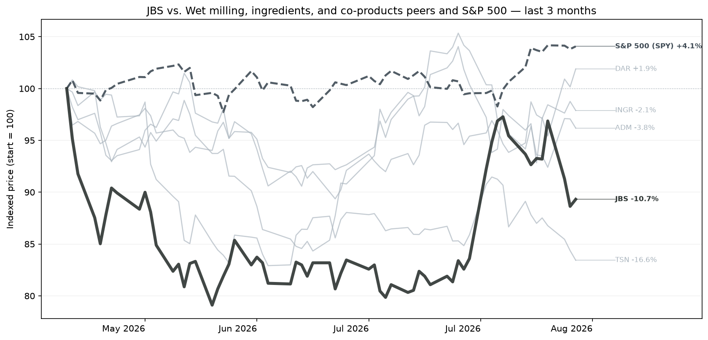

#### Earnings Call Summary

JBS announced that Global CEO Gilberto Tomazoni will transition leadership to Wesley Batista Filho, effective January 2027. Tomazoni highlighted that the company's long-term strategy, priorities, and operations will remain unchanged following this planned succession from a position of strength.

#### At a Glance

- **JBS Misses EPS Despite Revenue Growth:** JBS reported an adjusted EPS of $0.20, falling short of the estimated $1.659, even as reported revenue grew to $121,942,929,080, beating expectations.
- **Margin Squeeze Impacts Global Protein Portfolios:** The company&#x27;s IFRS adjusted EBITDA margin compressed to 6.0% from 8.4% last year, heavily pressured by tight cattle supplies and negative margins in the North America beef segment.
- **Capital Expenditures Revised Lower in Guidance:** JBS adjusted its forward outlook by reducing its planned full-year 2026 capital expenditures by $400 million to a new target of $2.0 billion.
- **Major Structural Shakeup and Leadership Changes:** The earnings release was paired with a significant succession announcement, naming Wesley Batista Filho as incoming Global CEO effective January 2027.
- **Cash Flow Rebounds into Positive Territory:** Free cash flow improved substantially year-over-year to a positive $130 million, primarily driven by optimized working-capital movements and advanced customer payments.

#### Key Moments from the Call

- **1m — CEO Succession and Continuity Plans:** The announcement of Wesley Batista Filho succeeding Gilberto Tomazoni as Global CEO in January 2027 provides a clear transition timeline, reassuring investors of strategic continuity and operational stability.
- **14m — Mexican Border Reopening Boosts Outlook:** The anticipated reopening of three Mexican border ports of entry will restore historical cattle flows, adding over 1 million head of heavier cattle to alleviate tight U.S. beef slaughter capacity by 2027.
- **15m — U.S. Reporting and Index Inclusion:** Voluntary compliance as a U.S. domestic company and inclusion in the Russell 1000 and 3000 indexes will please investors by expanding the shareholding base and accelerating global liquidity and market visibility.
- **16m — Non-Recurring Financial Charges Depress Earnings:** A net loss of $102M and negative $0.10 EPS may disappoint, but underlying adjusted net income remains positive at $218M ($0.20 EPS) when isolating non-recurring liability management costs and antitrust settlements.
<h3 id="earnings-cf">CF Industries (<a href="#company-cf">CF</a>) -4.4%</h3>

**Reported:** August 6, 2026 · [Google Finance earnings page](https://www.google.com/finance/quote/CF:NYSE?tab=earnings&hl=en)

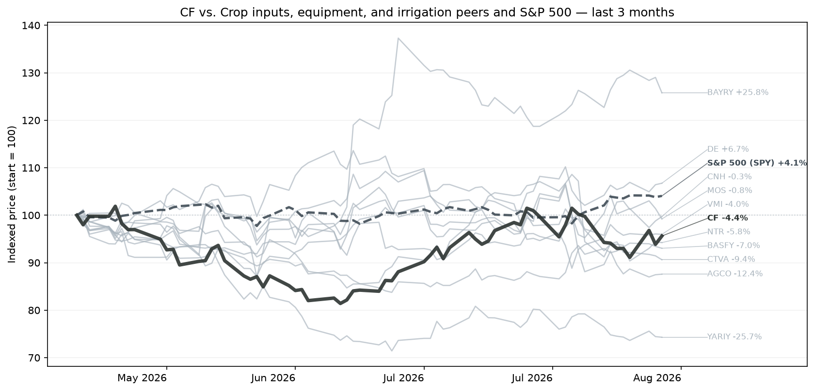

#### Earnings Call Summary

CF Industries reported robust H1 2026 results, generating $2.2 billion in adjusted EBITDA. The performance was supported by strong operational utilization, reaching nearly 98% of available ammonia capacity, and a tight global nitrogen supply-demand balance that was further strained by geopolitical conflict in the Middle East.

#### At a Glance

- **Earnings Miss Wall Street Expectations:** CF Industries reported a Q2 2026 Adjusted EPS of $4.73 on revenue of $2.22 billion, missing analyst estimates of $5.614 per share and $2.45 billion in revenue.
- **Strong Ammonia Capacity Utilization Sustained:** The company sustained exceptional operational performance, achieving a 98% ammonia capacity utilization rate across its available assets during the first half of 2026.
- **Upward Revision in Mid-Cycle Expectations:** Management raised its baseline mid-cycle outlook to approximately $2.9 billion of EBITDA and $1.7 billion of free cash flow, supported by a tighter multi-year structural outlook for global nitrogen markets.
- **Higher Prices Mitigate Volume Declines:** A 15% decline in sales volumes caused by softer customer buying and maintenance outages was heavily offset by a surge in average global nitrogen selling prices.
- **Shareholder Returns Boost Investor Narrative:** CF Industries highlighted robust capital allocation programs, increasing its quarterly dividend by 20% to $0.60 per share and deploying $958 million in share repurchases over the trailing twelve months.
- **Strategic Project and Outage Adjustments:** Construction on the low-carbon Blue Point project is set to begin in August 2026, while management announced a delay in the restart of the Yazoo City facility to the first half of 2027.

#### Key Moments from the Call

- **3m — Raised Baseline Mid-Cycle Guidance:** CF Industries raised its baseline mid-cycle EBITDA guidance to $2.9 billion and free cash flow to $1.7 billion. This revision pleases investors as it reflects structural changes, including higher global capital costs that elevate the required incentive price for new capacity, rather than just temporary geopolitical windfalls.
- **23m — Yazoo City Restart Timeline Delayed:** The resumption of operations at the Yazoo City complex was adjusted to the first half of 2027 due to extended procurement timelines for electrical gear. While the delay could disappoint investors, management is reconfiguring the site for more lucrative products and expects insurance recoveries to fully offset construction costs.
- **30m — New DEF Project Evaluation:** CF Industries is initiating a front-end engineering and design (FEED) study for a new Diesel Exhaust Fluid (DEF) upgrade project at its Courtright facility. This strategic pivot will please investors by upgrading lower-margin ammonia into high-margin DEF to serve a rapidly expanding North American market.
- **44m — Addressing Peer Valuation Disconnect:** CEO Chris Bohn addressed a persistent valuation disconnect, arguing that the market treats the stock like an over-leveraged fertilizer company from a decade ago. Investors will be pleased by management's commitment to aggressive share repurchases, utilizing their low working capital and robust free cash flow conversion to exploit this undervaluation.
<h3 id="earnings-musa">Murphy USA (<a href="#company-musa">MUSA</a>) -7.1%</h3>

**Reported:** August 6, 2026 · [Google Finance earnings page](https://www.google.com/finance/quote/MUSA:NYSE?tab=earnings&hl=en)

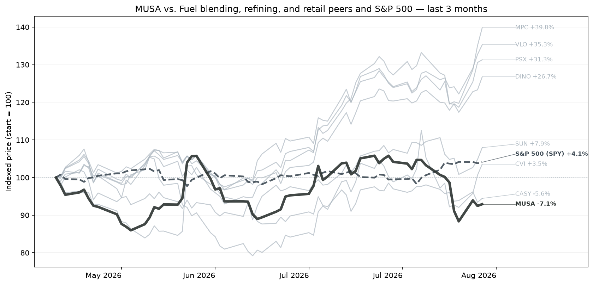

#### Earnings Call Summary

CEO Mindy West noted that the 2026 fuel margin forecast is intentionally conservative due to heightened macro volatility and ongoing global crises. However, the company is observing a higher floor for retail margins as competitors remain rational, with pricing reflecting the needs of marginal retailers to maintain required returns.

#### At a Glance

- **Murphy USA Beats Earnings Expectations:** Murphy USA reported a Reported Adjusted EPS of 11.27, beating the Estimated Adjusted EPS of 10.021, and posted a Reported Revenue of $6,201,700,000, which also cleared the estimated $6,031,478,560.
- **Fuel Margins Drive Record Growth:** Total fuel contribution surged 32% year-over-year to 40.6 cents per gallon, expanding from 32.0 cents per gallon last year, while total retail fuel volume grew 3.9% and same-store volume returned to positive territory at 0.5%.
- **Conservative Second Half Guidance Maintained:** Management forecasts full-year net income of approximately $636 million and adjusted EBITDA of $1.25 billion based on a conservative 35-cent per gallon fuel margin expectation for the second half of 2026.
- **Board Approves Significant Dividend Hike:** Following the strong quarterly results, Murphy USA declared a quarterly cash dividend of $0.65 per share, representing a 23% increase over the Q3 2025 payout.
- **Merchandise Mix Shows Muted Variance:** Total merchandise contribution rose 4.0% to $227.4 million on solid unit margins of 20.1%, though performance was bifurcated by a 2.4% same-store sales increase in nicotine offsetting a 1.4% drop in non-nicotine categories.

#### Key Moments from the Call

- **11m — Loyalty Program Sign-ups Expand Top of Funnel:** Monthly loyalty program sign-ups accelerated past 600,000 in Q2, with 46% representing new or lapsed customers. This surge expands the loyalty funnel, enabling targeted promotions like pump-to-store discounts that effectively drive higher frequency inside-store transactions and sticky consumer behaviors.
- **16m — CapEx Raised for Growth and Life Cycle Investments:** Murphy USA raised capital spending toward the high end of its range. The additional capital is being deliberately deployed into future growth via land bank expansion and proactive life cycle asset replacements—such as dispensers, safes, and HVAC units—to improve structural efficiency rather than conducting repeating repairs.
- **27m — Rising Fuel Margin Floors Sustainable Long-Term:** Executives tracking structural dynamics confirmed that breakeven equilibriums continue to move higher for marginal retailers who pass rising operating costs to consumers. This ongoing virtuous cycle solidifies a higher baseline retail fuel margin floor, making a $0.35 all-in margin achievable for the back half of the year.
- **38m — Conservative Full-Year Volume Guidance Justification:** Management maintained its conservative same-store gallon guidance of down 1% to down 3% for the second half of 2026. The company chooses not to bake in prolonged wholesale price declines, though they noted that historical downward trends allow them to differentiate on price, capture market share, and outperform these base assumptions.
<h3 id="earnings-agro">Adecoagro (<a href="#company-agro">AGRO</a>) -31.9%</h3>

**Reported:** August 12, 2026 · [Google Finance earnings page](https://www.google.com/finance/quote/AGRO:NYSE?tab=earnings&hl=en)

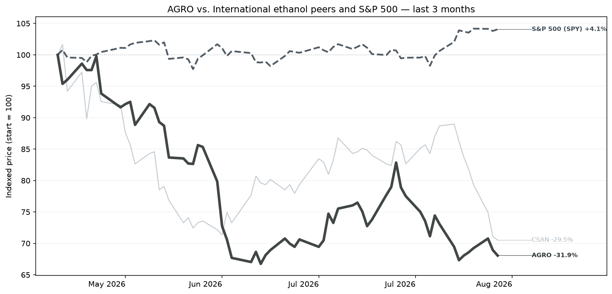

#### Earnings Call Summary

Adecoagro achieved record consolidated adjusted EBITDA of $258 million year-to-date and $173 million for Q2 2026. This strong operational performance was heavily driven by the fertilizer segment, which benefited from higher production volumes, elevated prices, and cost efficiencies, compensating for softer results in other business segments.

#### At a Glance

- **Adecoagro Misses Estimates Significantly:** Adecoagro reported a Q2 2026 adjusted EPS of $0.12, missing the estimated $0.494, and reported revenue of $538,501,000, which fell short of the estimated $602,008,310.
- **Fertilizers Drive Record EBITDA Results:** Despite missing top-line expectations, consolidated adjusted EBITDA reached a record $173 million for the quarter, driven by a 22% year-over-year surge in urea production.
- **Management Reaffirms Key Full-Year Targets:** Management reaffirmed its full-year sugarcane crushing and deleveraging targets while anticipating long-term productivity and capacity gains across core operational segments.
- **Strategic Inventory Buildup in Ethanol:** The company ended the quarter storing approximately 41% of its year-to-date ethanol production to avoid selling into depressed domestic prices and capture better margins later.
- **Expansion via Caarapo Mill Acquisition:** Adecoagro expects to close the acquisition of the Caarapó Mill in the coming weeks, a move projected to expand long-term crushing capacity without disrupting year-end leverage goals.

#### Key Moments from the Call

- **7m — Ethanol Inventory Building Strategy:** Adecoagro intentionally stored 41% of its year-to-date ethanol production in inventory during Q2, capitalizing on industrial flexibility to defer sales during a sharp domestic price decline. This strategy allows the company to secure higher margins in Q4 2026 and Q1 2027 as market demand recovers.
- **9m — Fertilizer Segment Outperformance:** The fertilizer segment's adjusted EBITDA more than doubled year-over-year, driven by a 22% increase in urea production and soaring global prices near $800 per ton. This outperformance comfortably mitigated softer results in the sugar, ethanol, and agriculture segments, prompting management to raise full-year segment expectations.
- **22m — Caarapó Mill Operational Synergies:** The upcoming Caarapó Mill acquisition presents significant potential to eventually double its effective crushing volumes. Synergies include an immediate diversion of 500,000 to 1,000,000 tons of surplus cluster cane, a 2% improvement in industrial efficiency, and enhanced G&A cost dilution across the Mato Grosso do Sul cluster.
- **24m — Sugar and Ethanol Cost Reductions:** Management maintains a target of 10% unit production cost reductions for the current crop cycle. Efficiencies are driven by a projected 10% increase in crushing volumes, lower leasing costs tied to Consecana prices, and operational headcount reductions from implementing two-row harvesting technologies.
<h3 id="earnings-gpre">Green Plains (<a href="#company-gpre">GPRE</a>) -10.1%</h3>

**Reported:** August 6, 2026 · [Google Finance earnings page](https://www.google.com/finance/quote/GPRE:NASDAQ?tab=earnings&hl=en)

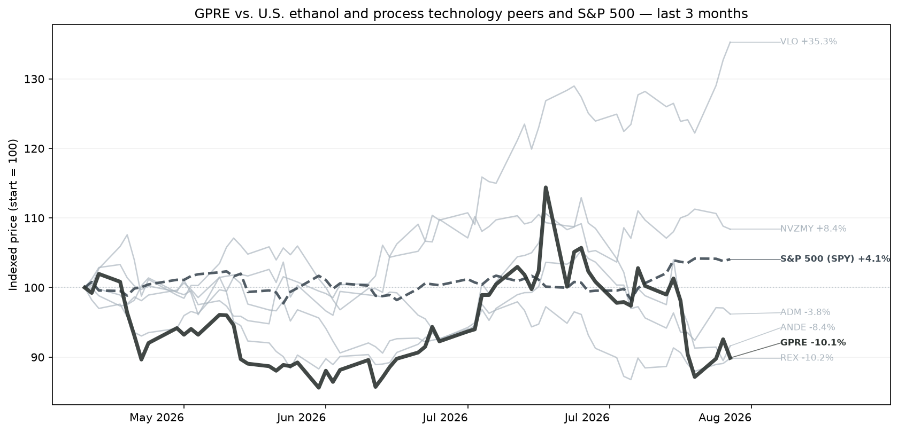

#### Earnings Call Summary

Green Plains reported strong operational execution for Q2 2026, delivering adjusted EBITDA of $93.3 million, up from $71.5 million in Q1 and a substantial improvement from $16.4 million in Q2 2025, driven by operational excellence, its carbon business, and favorable ethanol, corn oil, and protein demand.

#### At a Glance

- **Bottom-Line Beat Despite Top-Line Miss:** Green Plains reported an adjusted EPS of $0.83, significantly beating the estimated $0.635, while quarterly revenue of $446.22 million missed the projected $542.44 million.
- **Crush Margins Drive Segment Performance:** The company&#x27;s consolidated ethanol crush margin improved significantly to $95.1 million compared to $26.3 million in the prior year quarter, even though ethanol production volumes fell to 160.7 million gallons due to a plant divestiture.
- **Utilization Targets Maintained for 2026:** Green Plains maintained its full-year 2026 capacity utilization target of approximately 95%, expecting a recovery in the second half of the year following planned spring maintenance that pulled Q2 utilization down to nearly 90%.
- **Carbon Platform Backs EBITDA Growth:** The company&#x27;s low-carbon platform served as a significant core earnings driver, contributing $58.7 million in 45Z production tax credit value toward the total adjusted EBITDA of $93.3 million.
- **Negative Post-Earnings Stock Market Reaction:** Despite the substantial bottom-line earnings beat, the market reacted with disappointment as shares of Green Plains declined by nearly 3% immediately following the announcement.

#### Key Moments from the Call

- **5m — Earnings Beat Performance:** Green Plains delivered a strong financial performance, reporting an EPS of $0.83, significantly beating analyst estimates of $0.635, driven by a highly profitable commercial environment and robust $59 million EBITDA contributions from its 45Z carbon platform.
- **18m — Temporary Utilization Dip from Extended Maintenance:** Capacity utilization averaged 90% in Q2 due to planned spring maintenance and an infrequent 8-to-10-year molecular sieve bed change-out at the Madison facility. Management expects a rebound back to 95% in Q3, reassuring investors on full-year targets.
- **25m — Potential Share Repurchases Evaluated:** Addressing analyst focus on capital allocation, management revealed they are actively considering share repurchases alongside internal projects and debt reduction. While no buybacks are officially announced yet, the prospect introduces positive long-term optionality for shareholders.
- **29m — Carbon Credit Monetization Patient Strategy:** Management confirmed they have yet to monetize any 2026 45Z carbon credits. While it has not yet announced a partner, the company is progressing through complex audit and compliance requirements to ensure predictable, long-term cash flow rather than rushing a deal.

## Company Overviews

<h3 id="company-ctva">Corteva (CTVA)</h3>

*Crop inputs, equipment, and irrigation · $52.4B · 3m -9.4% · 12m +4.4% · 24m +40.9%*

[Google Finance](https://www.google.com/finance/quote/CTVA:NYSE?tab=earnings&hl=en)

Largest U.S. corn-seed franchise (Pioneer) and a primary input cost for Corn Belt acres.

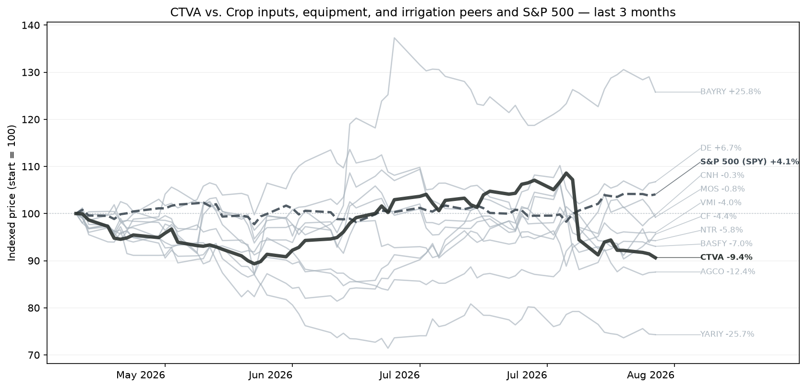

Corteva is an agricultural inputs pure play that was formed in 2019 when it was spun off from DowDuPont. The company is a leader in the development of new seed and crop protection products. Seeds generate the majority of profits with the remainder coming from crop protection products. Corteva plans to spin off its seeds business in late 2026. The seeds business will be named Vylor, while the crop protection business will retain the Corteva name and be a pure-play crop protection company following the divestiture. Corteva operates globally, but around half of revenue comes from North America.

<h3 id="company-bayry">Bayer (BAYRY)</h3>

*Crop inputs, equipment, and irrigation · n/a · 3m +25.8% · 12m +77.9% · 24m +77.4%*

[Google Finance](https://www.google.com/finance/quote/BAYRY:NYSE?tab=earnings&hl=en)

Dekalb and former Monsanto corn-seed brands; together with Corteva dominates U.S. corn seed.

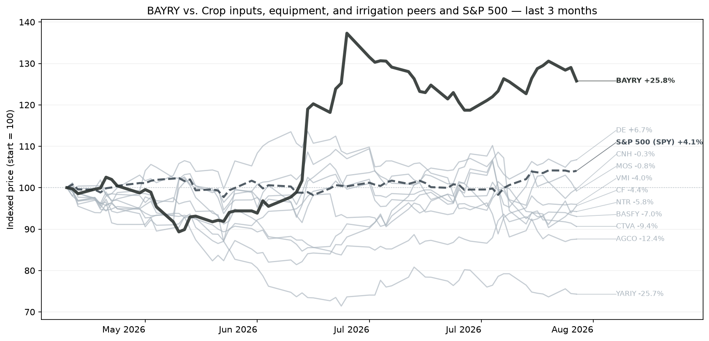

BAYER AG S/ADR

<h3 id="company-basfy">BASF (BASFY)</h3>

*Crop inputs, equipment, and irrigation · n/a · 3m -7.0% · 12m +10.1% · 24m +22.7%*

[Google Finance](https://www.google.com/finance/quote/BASFY:NYSE?tab=earnings&hl=en)

Crop-protection chemistry used on U.S. corn acres.

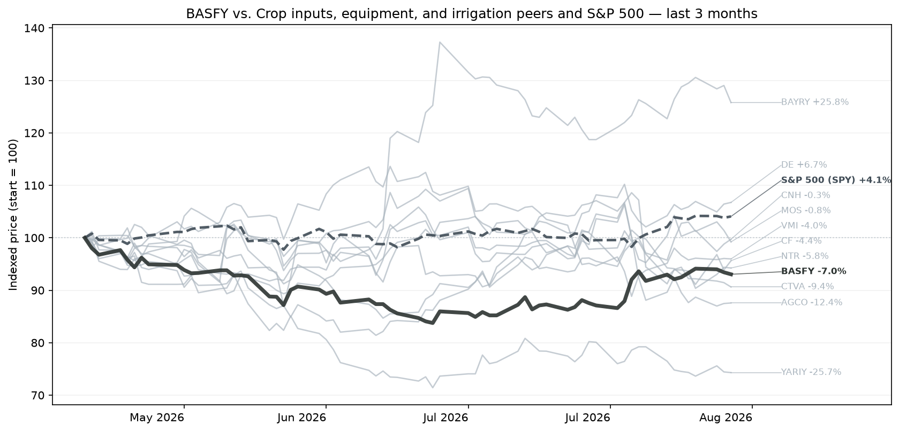

BASF SE S/ADR

<h3 id="company-ntr">Nutrien (NTR)</h3>

*Crop inputs, equipment, and irrigation · $33.6B · 3m -5.8% · 12m +18.1% · 24m +43.5%*

[Google Finance](https://www.google.com/finance/quote/NTR:NYSE?tab=earnings&hl=en)

Largest North American agricultural retailer and a major potash and nitrogen producer.

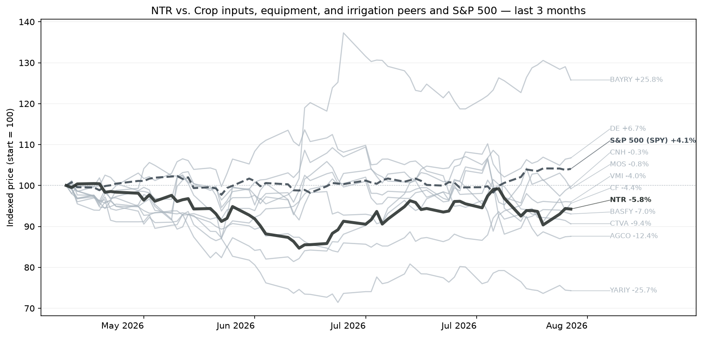

Created in 2018 as a result of the merger between PotashCorp and Agrium, Nutrien is the world's largest fertilizer producer by capacity. Nutrien produces the three main crop nutrients—nitrogen, potash, and phosphate—although its main focus is potash, where it is the global leader in installed capacity with a roughly 20% market share. The company is also the largest agricultural retailer in North America and Australia, selling fertilizers, crop chemicals, seeds, and services directly to farm customers through its brick-and-mortar stores and online platforms.

<h3 id="company-cf">CF Industries (CF)</h3>

*Crop inputs, equipment, and irrigation · $18.0B · 3m -4.4% · 12m +38.9% · 24m +49.9%*

[Google Finance](https://www.google.com/finance/quote/CF:NYSE?tab=earnings&hl=en)

Nitrogen fertilizer producer; corn is the crop that most moves UAN and urea demand.

CF Industries is a leading producer and distributor of nitrogen, which is primarily used in fertilizers. The company operates nitrogen manufacturing plants primarily in North America. CF also produces nitrogen in the United Kingdom and holds a joint venture interest in a nitrogen production facility in Trinidad and Tobago. CF makes nitrogen primarily using low-cost US natural gas as its feedstock, making the company one of the lowest-cost nitrogen producers globally. It is also investing in carbon-free blue and green ammonia, which can be used as an alternative fuel to hydrogen or as a means to transport hydrogen.

<h3 id="company-yariy">Yara International (YARIY)</h3>

*Crop inputs, equipment, and irrigation · n/a · 3m -25.7% · 12m +20.8% · 24m +54.3%*

[Google Finance](https://www.google.com/finance/quote/YARIY:NYSE?tab=earnings&hl=en)

Global nitrogen producer that sets the international urea and ammonia reference.

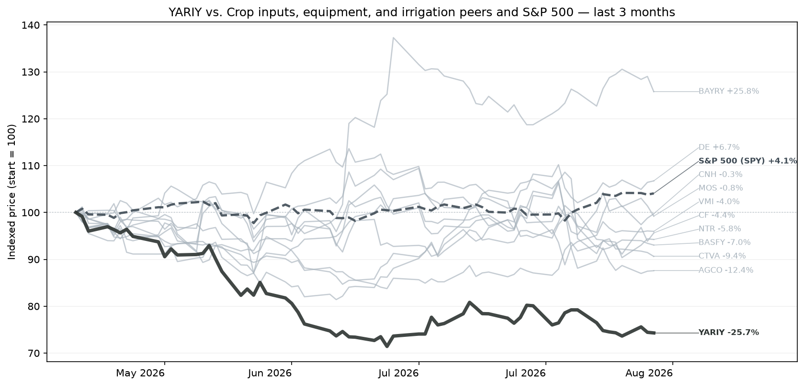

YARA INTL ASA S/ADR

<h3 id="company-mos">Mosaic (MOS)</h3>

*Crop inputs, equipment, and irrigation · $7.1B · 3m -0.8% · 12m -29.8% · 24m -17.1%*

[Google Finance](https://www.google.com/finance/quote/MOS:NYSE?tab=earnings&hl=en)

Phosphate and potash producer that completes corn production budgets.

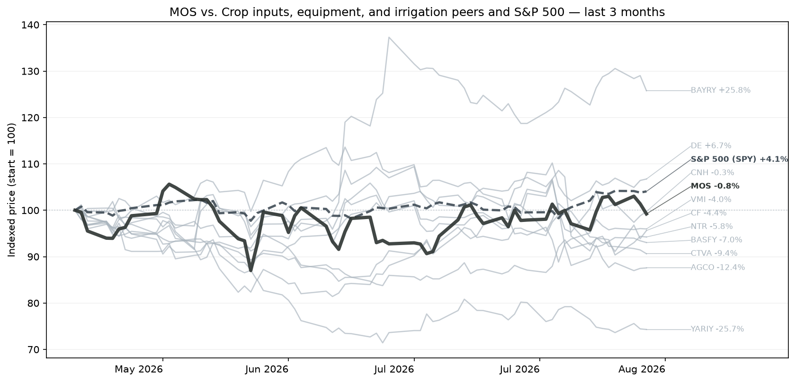

Mosaic is one of the largest phosphate and potash producers in the world. The company's assets include phosphate rock mines in the US and potash mines in Canada. Mosaic also runs a large fertilizer distribution operation in Brazil through its Mosaic Fertilizantes business.

<h3 id="company-de">Deere (DE)</h3>

*Crop inputs, equipment, and irrigation · $156.7B · 3m +6.7% · 12m +20.7% · 24m +66.3%*

[Google Finance](https://www.google.com/finance/quote/DE:NYSE?tab=earnings&hl=en)

Dominant North American farm-equipment maker for corn planting, harvest, and grain handling.

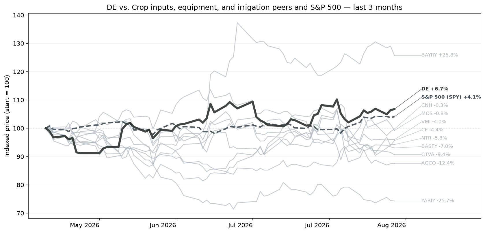

Deere is the world's leading manufacturer of agricultural equipment and a major producer of construction machinery. The company is divided into four reporting segments: production & precision agriculture, or PPA, small agriculture & turf, or SAT, construction & forestry, or CF, and financial services, or FS, its captive finance subsidiary. The core PPA business is the largest contributor to sales and profits by far. Geographically, Deere sales are 60% US/Canada, 17% Europe, 14% Latin America, and 9% rest of the world. Deere goes to market through a robust dealer network that includes over 2,000 dealer locations in North America with reach into over 100 countries. John Deere Financial provides retail financing for machinery to its customers and wholesale financing for dealers.

<h3 id="company-cnh">CNH Industrial (CNH)</h3>

*Crop inputs, equipment, and irrigation · $16.5B · 3m -0.3% · 12m -16.4% · 24m +9.6%*

[Google Finance](https://www.google.com/finance/quote/CNH:NYSE?tab=earnings&hl=en)

Case IH and New Holland farm equipment serving corn growers.

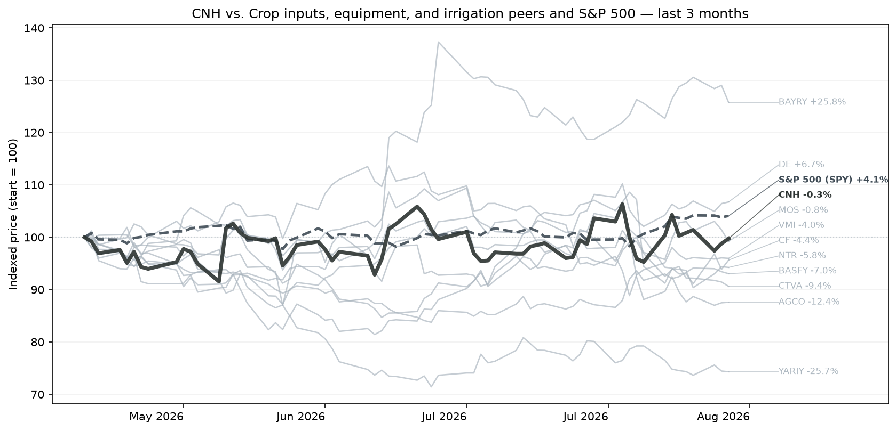

CNH Industrial is the world's second largest manufacturer of agricultural machinery (82% of industrial net sales) as well as a major player in construction equipment (18% of industrial net sales). Its Case and New Holland brands have served farmers for generations. Geographically, agricultural sales are 40% in North America, 32% in Europe, the Middle East, and Africa, 18% in South America, and 10% in Asia-Pacific. CNH's products are available through a robust independent dealer network, which includes over 2,600 dealer and distribution locations and reach into 164 countries. The construction business leverages over 400 dealers. The company's captive finance arm provides retail financing to its customers and wholesale financing to dealers to maintain inventory, thereby supporting sales.

<h3 id="company-agco">AGCO (AGCO)</h3>

*Crop inputs, equipment, and irrigation · $7.0B · 3m -12.4% · 12m -12.0% · 24m +14.4%*

[Google Finance](https://www.google.com/finance/quote/AGCO:NYSE?tab=earnings&hl=en)

Fendt, Massey Ferguson, and Challenger farm equipment with Corn Belt exposure.

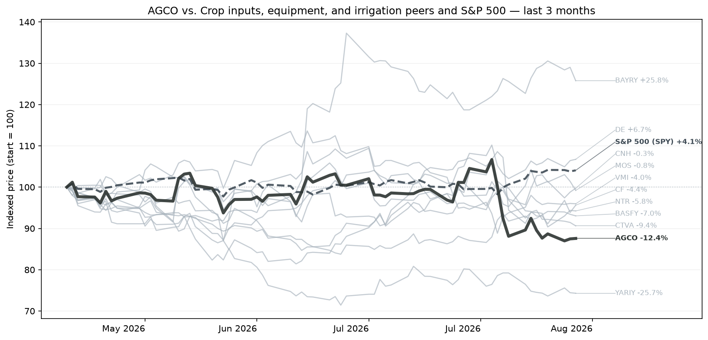

Agco is a global manufacturer of agricultural equipment. Its main machine brands are Fendt, Massey Ferguson, and Valtra; its initiatives in precision agriculture have been organized under the PTx umbrella following a series of acquisitions. While a global business, Agco's sales skew heavily toward Europe/Middle East, representing 50%-60% of sales and even more of operating profits. The company is trying to increase its exposure to the larger North and South American markets. Its products are available through a global dealer network, which includes over 3,000 dealers and distribution locations and reaches into over 140 countries. Additionally, Agco offers retail and wholesale financing to customers through its partnership with Rabobank of the Netherlands, having exited their JV in 2026.

<h3 id="company-vmi">Valmont Industries (VMI)</h3>

*Crop inputs, equipment, and irrigation · $9.3B · 3m -4.0% · 12m +29.4% · 24m +75.5%*

[Google Finance](https://www.google.com/finance/quote/VMI:NYSE?tab=earnings&hl=en)

Center-pivot irrigation (Valley) used on irrigated High Plains corn.

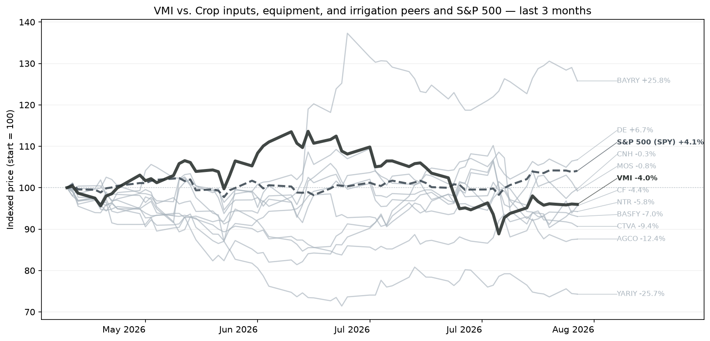

Valmont Industries Inc, along with its subsidiaries, operates as a manufacturer of products and services for infrastructure and agriculture markets. Its reportable segments are Infrastructure and Agriculture. The company generates maximum revenue from the Infrastructure segment, which includes the manufacturing and distribution of products and solutions to serve the infrastructure markets of utility, solar, lighting, transportation, and telecommunications, along with coatings services to protect metal products. The Agriculture segment provides irrigation equipment components, including aftermarket parts and tubular products, and technology solutions for precision agriculture. Geographically, it derives key revenue from the United States, followed by Australia, Brazil, and other regions.

<h3 id="company-adm">Archer Daniels Midland (ADM)</h3>

*Grain origination and agribusiness, U.S. ethanol and process technology, Wet milling, ingredients, and co-products · $38.9B · 3m -3.8% · 12m +33.3% · 24m +35.1%*

[Google Finance](https://www.google.com/finance/quote/ADM:NYSE?tab=earnings&hl=en)

Global grain trader, top U.S. ethanol producer, and major corn wet miller.

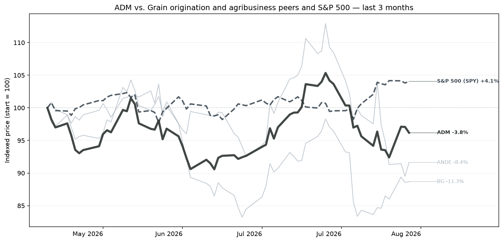

Archer-Daniels-Midland is a major processor of oilseeds, corn, wheat, and other agricultural commodities. The company is also one of the largest grain merchandisers through its extensive network of logistical assets to store and transport crops around the globe. ADM also runs a nutrition business that focuses on both human and animal ingredients and is a large producer of corn-based sweeteners, starches, and ethanol.

<h3 id="company-bg">Bunge (BG)</h3>

*Grain origination and agribusiness · $21.9B · 3m -11.3% · 12m +34.3% · 24m +17.4%*

[Google Finance](https://www.google.com/finance/quote/BG:NYSE?tab=earnings&hl=en)

Global grain and oilseed merchant after the Viterra combination; competitor for corn origination.

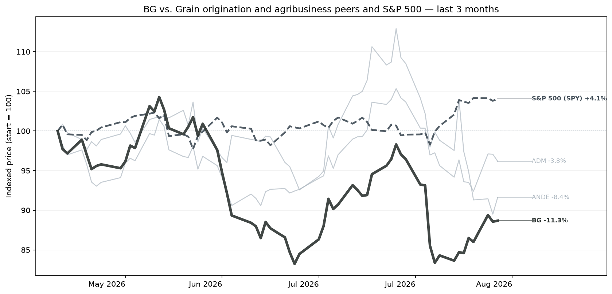

Bunge Global SA is an agribusiness solutions company, connecting farmers to consumers and delivering essential food, feed and fuel to the globe. The company segments include Soybean Processing and Refining; Softseed Processing and Refining; Other Oilseeds Processing and Refining; Grain Merchandising and Milling; and Corporate and Other. It generates maximum revenue from the Soybean Processing and Refining segment, which includes integrated business principally involved in the purchase, storage, transportation, processing, distribution, refining, marketing, and sale of soybeans and soybean related products, as well as biodiesel and fertilizer production and distribution. Geographically, the company operates in United States, Switzerland, Netherlands, and Rest of the World.

<h3 id="company-ande">The Andersons (ANDE)</h3>

*Grain origination and agribusiness, U.S. ethanol and process technology · $2.3B · 3m -8.4% · 12m +63.0% · 24m +34.6%*

[Google Finance](https://www.google.com/finance/quote/ANDE:NASDAQ?tab=earnings&hl=en)

Grain elevators plus four wholly owned ethanol plants totaling about 500 million gallons a year.

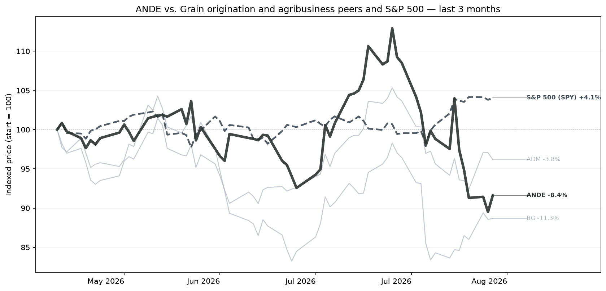

Andersons Inc is an agriculture and renewable fuels company. Its operations are classified into two reportable business segments: Agribusiness, which generates maximum revenue, and Renewables. The Agribusiness segment includes merchandising and managing logistics across various commodities, as well as being a manufacturer, distributor, and retailer of agricultural and related plant nutrients. The segment specializes in the movement of physical commodities such as whole grains, grain products, feed ingredients, and domestic fuel products, among other agricultural commodities. The Renewables segment mainly produces, purchases, and sells ethanol and co-products. Geographically, the company generates maximum revenue from the United States, followed by Canada, Mexico, and other markets.

<h3 id="company-vlo">Valero Energy (VLO)</h3>

*U.S. ethanol and process technology, Fuel blending, refining, and retail · $99.7B · 3m +35.3% · 12m +142.5% · 24m +133.8%*

[Google Finance](https://www.google.com/finance/quote/VLO:NYSE?tab=earnings&hl=en)

World's second-largest corn-ethanol producer with a distinct Ethanol segment and a major blender.

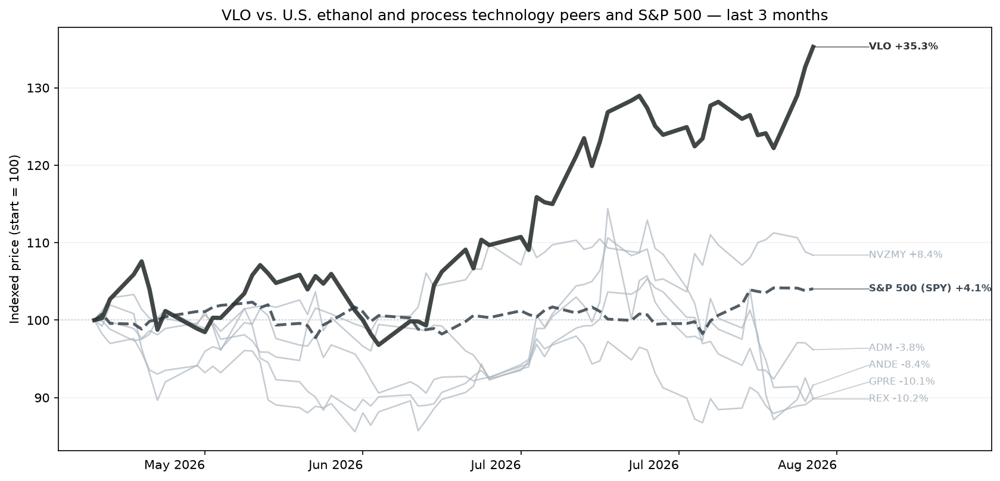

Valero Energy is one of the largest independent refiners in the United States. It operates 15 refineries, with a total throughput capacity of 3.2 million barrels a day in the US, Canada, and the United Kingdom. Valero also owns 12 ethanol plants with capacity of 1.6 billion gallons a year and holds a 50% stake in Diamond Green Diesel, which can produce 1.2 billion gallons per year of renewable diesel.

<h3 id="company-gpre">Green Plains (GPRE)</h3>

*U.S. ethanol and process technology · $1.1B · 3m -10.1% · 12m +64.1% · 24m +12.3%*

[Google Finance](https://www.google.com/finance/quote/GPRE:NASDAQ?tab=earnings&hl=en)

Largest U.S. ethanol pure play, with high-protein feed, corn oil, and Nebraska carbon-capture work.

Green Plains Inc manufactures and sells ethanol and ethanol byproducts in two segments based on function. The ethanol production segment, which generates the majority of revenue, includes the production of ethanol, distillers grains, Ultra-High Protein and renewable corn oil. The agribusiness and energy services segment includes grain handling and storage, commodity marketing and merchant trading for company-produced and third-party ethanol, distillers grains, Ultra-High Protein, renewable corn oil, natural gas and other commodities.

<h3 id="company-rex">REX American Resources (REX)</h3>

*U.S. ethanol and process technology · $1.4B · 3m -10.2% · 12m +59.5% · 24m +90.3%*

[Google Finance](https://www.google.com/finance/quote/REX:NYSE?tab=earnings&hl=en)

Holding company with interests in six Corn Belt ethanol plants; cleanest public crush-margin equity.

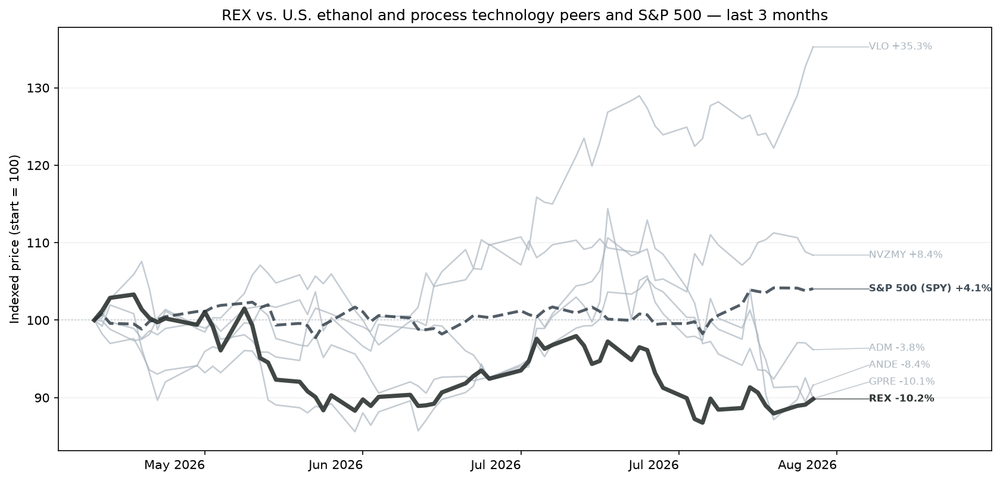

REX American Resources Corp operates as a holding company that engages in investments in alternative energy and ethanol production entities. Its operating segments include Ethanol and By-Products. Its products include Ethanol, dried distillers grains, modified distillers grains, Distillers corn oil, Modified distillers grains, and Other.

<h3 id="company-nvzmy">Novonesis (NVZMY)</h3>

*U.S. ethanol and process technology · n/a · 3m +8.4% · 12m -2.4% · 24m -2.5%*

[Google Finance](https://www.google.com/finance/quote/NVZMY:NYSE?tab=earnings&hl=en)

Dominant supplier of enzymes used in dry-mill ethanol fermentation.

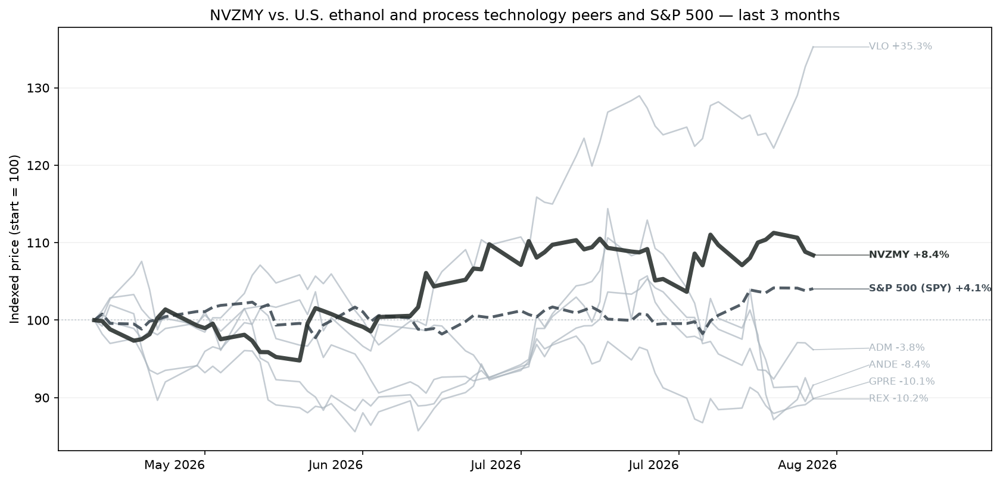

NOVONESIS B UNSP/ADR

<h3 id="company-ingr">Ingredion (INGR)</h3>

*Wet milling, ingredients, and co-products · $6.8B · 3m -2.1% · 12m -18.9% · 24m -21.3%*

[Google Finance](https://www.google.com/finance/quote/INGR:NYSE?tab=earnings&hl=en)

Major corn wet miller producing sweeteners, starches, and specialty ingredients.

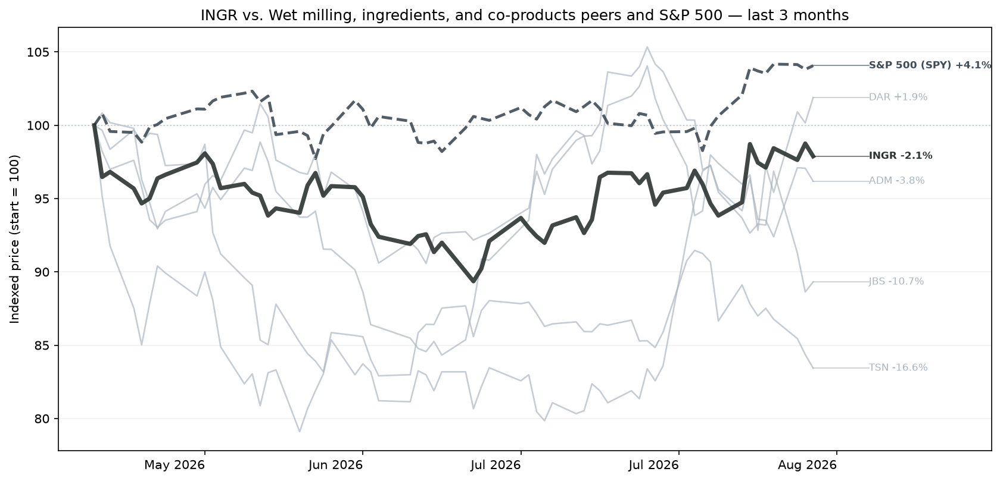

Ingredion is an ingredients provider for the food, beverage, brewing, and animal nutrition industries. The company processes corn, tapioca, potatoes, stevia, grains, fruits, gums, and vegetables into value-added ingredients. The company sells specialty ingredients that include starch-based texturizers and natural alternative sweeteners such as stevia. Ingredion also sells commodity ingredients that include sweeteners, such as high-fructose corn syrup, and starches, such as those used for sustainable packaging, as well as plant-based proteins. The company plans to acquire Tate & Lyle in an all-cash deal that should close in 2027.

<h3 id="company-dar">Darling Ingredients (DAR)</h3>

*Wet milling, ingredients, and co-products · $10.6B · 3m +1.9% · 12m +97.9% · 24m +62.4%*

[Google Finance](https://www.google.com/finance/quote/DAR:NYSE?tab=earnings&hl=en)

Rendering and used cooking oil; 50/50 owner of Diamond Green Diesel with Valero.

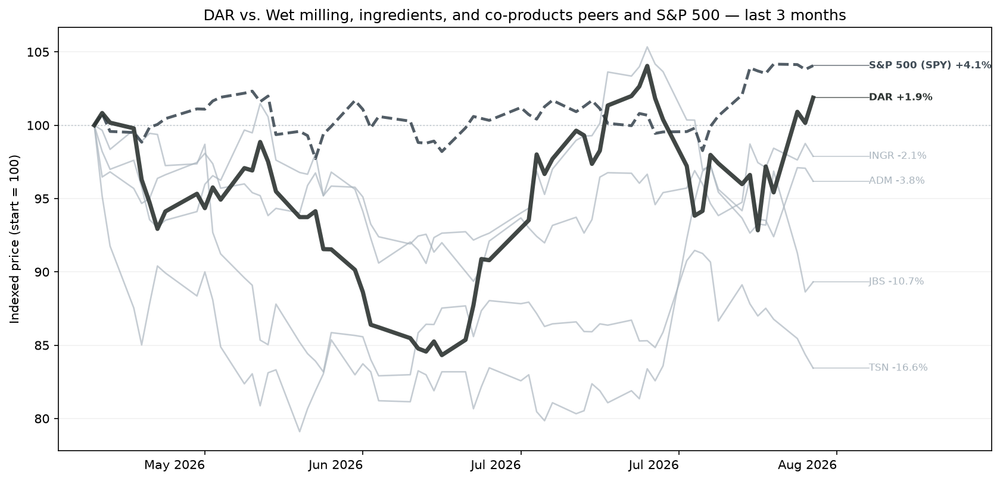

Darling Ingredients Inc is a developer and producer of sustainable natural ingredients from edible and inedible bio-nutrients, creating a wide range of ingredients and customized specialty solutions for customers in the pharmaceutical, food, pet food, animal feed, industrial, fuel, bioenergy and fertilizer industries. It processes by-products from the animal agriculture and food industries into ingredients and products for human nutrition, animal feed, crop inputs, and renewable energy applications. The company operates processing facilities across multiple countries and produces collagen, including gelatin and hydrolyzed collagen, as well as renewable energy products.

<h3 id="company-tsn">Tyson Foods (TSN)</h3>

*Wet milling, ingredients, and co-products · $20.6B · 3m -16.6% · 12m -3.3% · 24m -10.6%*

[Google Finance](https://www.google.com/finance/quote/TSN:NYSE?tab=earnings&hl=en)

Largest U.S. protein company and a primary domestic sink for distillers grains.

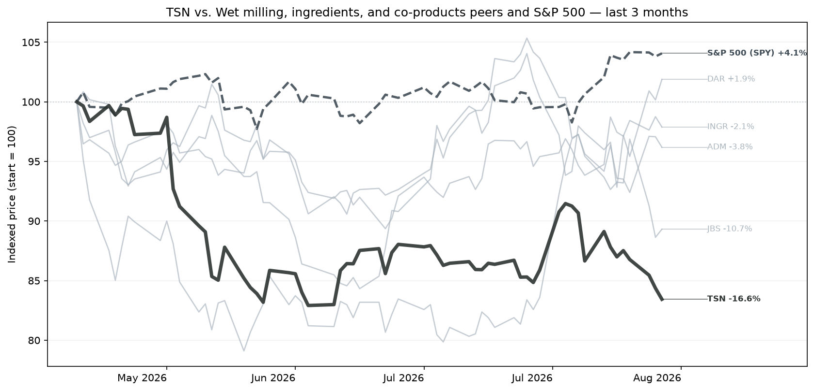

Tyson Foods is a protein-focused food producer, selling raw chicken, beef, pork, and prepared foods. Chicken and beef are its two largest segments, composing about 40% and 30% of sales, respectively. Prepared foods constituted 18% of fiscal 2025 sales and include brands like Tyson, Jimmy Dean, Hillshire Farm, Ball Park, and Sara Lee. However, most of these are in product categories rife with competition where Tyson does not have a massive market share lead. Tyson sells some products overseas, but the international segment accounts for just 4% of total revenue. The company is an active acquirer, with more recent years' purchases focused on international and food-service markets.

<h3 id="company-jbs">JBS (JBS)</h3>

*Wet milling, ingredients, and co-products · $45.2B · 3m -10.7% · 12m -9.8% · 24m n/a*

[Google Finance](https://www.google.com/finance/quote/JBS:NYSE?tab=earnings&hl=en)

World's largest protein company and a major DDGS buyer in the U.S. and Brazil.

JBS NV is a protein food company, selling protein products, which include fresh and frozen cuts of beef, pork, lamb, fish, whole chickens, and chicken parts, to retailers, and foodservice companies. The food products are marketed under different brands such as Swift, Just Bare, Pilgrim's Pride, Sunnyvalley, Reserva Friboi, Great Southern, etc., globally. The company's reportable segments are Beef North America, which generates maximum revenue, Brazil, Seara, Pork USA, Pilgrim's Pride, Australia, and Others. Geographically, it derives majority of its revenue from United States of America.

<h3 id="company-mpc">Marathon Petroleum (MPC)</h3>

*Fuel blending, refining, and retail · $101.3B · 3m +39.8% · 12m +115.3% · 24m +102.9%*

[Google Finance](https://www.google.com/finance/quote/MPC:NYSE?tab=earnings&hl=en)

Largest U.S. independent refiner and a major Midwest ethanol blender.

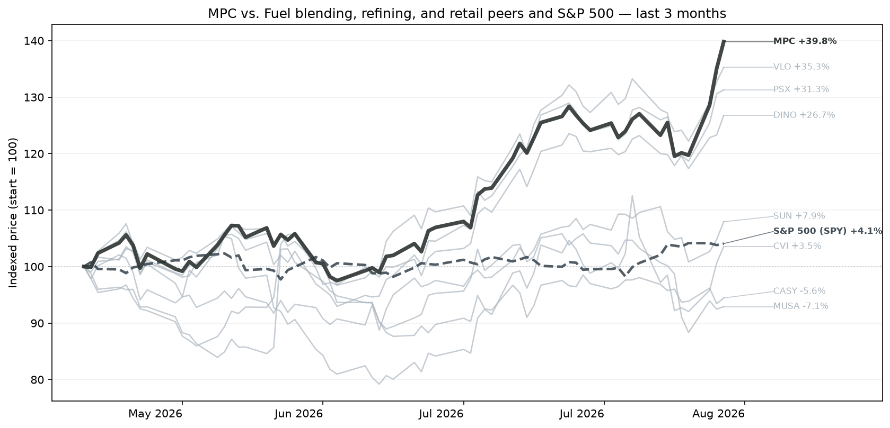

Marathon Petroleum is a leading integrated downstream and midstream energy company that operates 13 refineries in the Gulf Coast, Mid-Continent, and West Coast regions of the United States with an aggregate crude oil refining capacity of 3.0 million barrels per day. The company is one of the largest producers of renewable diesel in the US; its Dickinson, North Dakota facility has the capacity to produce 184 million gallons per year, and its Martinez, California, joint venture facility (a 50/50 partnership with Neste) reached its full capacity of 730 million gallons per year in late 2024. Marathon also owns the general partner and approximately 64% of MPLX LP, a large-cap master limited partnership that owns and operates midstream energy infrastructure and logistics assets.

<h3 id="company-psx">Phillips 66 (PSX)</h3>

*Fuel blending, refining, and retail · $96.7B · 3m +31.3% · 12m +84.0% · 24m +70.4%*

[Google Finance](https://www.google.com/finance/quote/PSX:NYSE?tab=earnings&hl=en)

Large blender and marketer with West Coast renewable-diesel capacity.

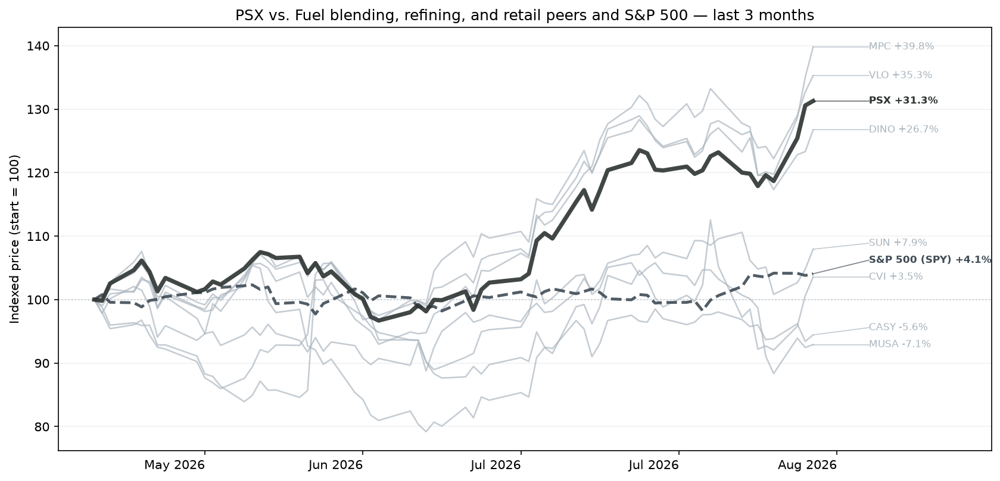

Phillips 66 is an independent refiner that owns or holds interest in 10 refineries with a total crude throughput capacity of 2.0 million barrels per day, or mmb/d, at the end of 2025. The midstream segment comprises extensive transportation and NGL processing assets. It includes 70,000 miles of crude oil, refined petroleum product, NGL and natural gas pipeline systems, and a comprehensive set of refined petroleum product, NGL and crude oil terminals, gathering and processing plants and fractionation facilities and various other storage and loading facilities. Its CPChem chemical joint venture operates facilities primarily in the United States and the Middle East and produces olefins and polyolefins.

<h3 id="company-dino">HF Sinclair (DINO)</h3>

*Fuel blending, refining, and retail · $16.8B · 3m +26.7% · 12m +95.1% · 24m +86.0%*

[Google Finance](https://www.google.com/finance/quote/DINO:NYSE?tab=earnings&hl=en)

Independent Mid-Continent and Rockies refiner with renewable diesel and RFS blending obligations.

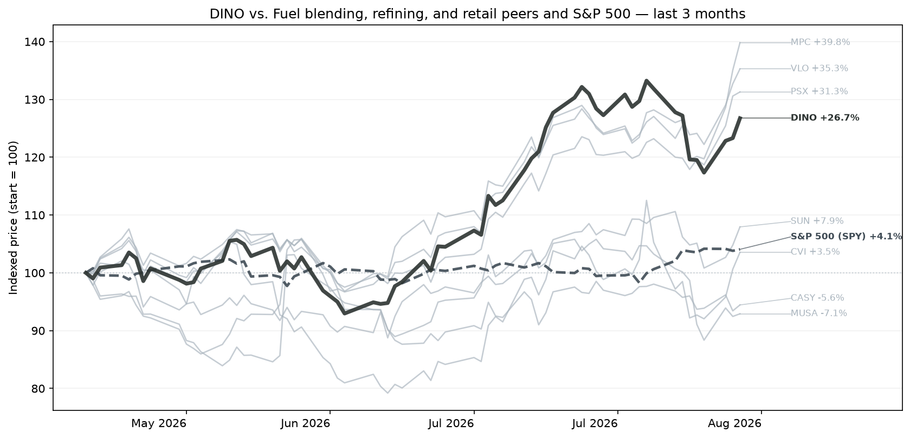

HF Sinclair is an integrated petroleum refiner that owns and operates seven refineries serving the Rockies, midcontinent, Southwest, and Pacific Northwest, with a total crude oil throughput capacity of 678,000 barrels per day. It can produce 380 million gallons of renewable diesel annually. It operates a marketing business with over 350 distributors and 1,700 branded wholesale sites across 30 states. It also owns and operates 4,500 miles of petroleum product pipelines and terminals principally in the Southwestern United States.

<h3 id="company-cvi">CVR Energy (CVI)</h3>

*Fuel blending, refining, and retail · $3.7B · 3m +3.5% · 12m +30.2% · 24m +43.9%*

[Google Finance](https://www.google.com/finance/quote/CVI:NYSE?tab=earnings&hl=en)

Coffeyville, Kansas refiner in the corn complex with renewable diesel and a nitrogen affiliate.

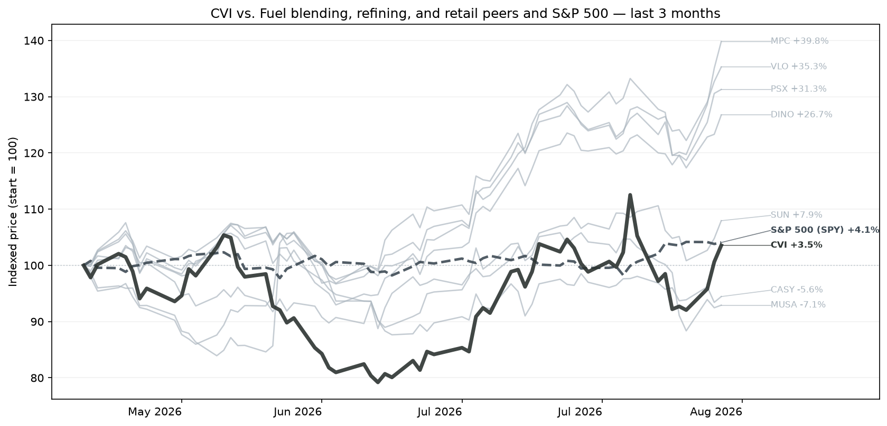

CVR Energy Inc is a holding company that engages in petroleum refining and nitrogen fertilizer manufacturing through its subsidiaries. Subsidiaries include several complex, full-coking crude oil refineries, along with a crude oil gathering system, pipelines, storage tanks, and marketing and supply. The company's refineries can process blends of a variety of crude oil ranging from heavy sour to light sweet crude oil. Crude oil for CVR's refineries is supplied through its wholly-owned gathering system and pipeline. From its refineries, CVR supplies products through tanker trucks directly to customers located in close geographic proximity and customers at throughput terminals. The company's customers include retailers, railroads, and farm cooperatives.

<h3 id="company-sun">Sunoco LP (SUN)</h3>

*Fuel blending, refining, and retail · $14.5B · 3m +7.9% · 12m +44.2% · 24m +43.7%*

[Google Finance](https://www.google.com/finance/quote/SUN:NYSE?tab=earnings&hl=en)

Fuel distributor and terminal operator that moves finished gasoline and ethanol.

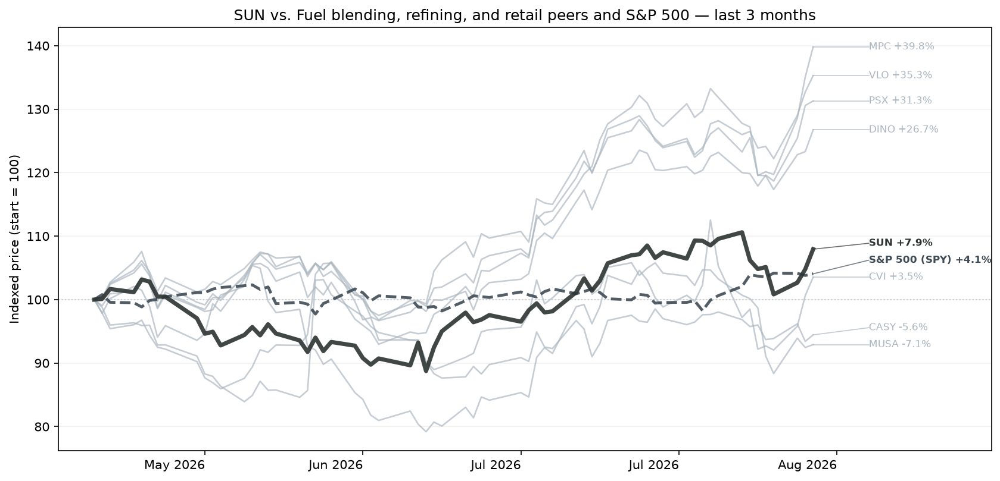

Sunoco LP is engaged in the distribution of motor fuels to independent dealers, distributors, and other commercial customers as well as the distribution of motor fuels to end-use customers at retail sites operated by commission agents. It is a growth-oriented master limited partnership (MLP) that operates as a wholesale and retail fuel distributor in the United States. The firm operates through the Fuel Distribution; Pipeline Systems; Refinery and Terminals segments. It generates the majority of its revenue from the Fuel Distribution segment. It distributes motor fuel to convenience stores, dealers, and commercial customers in various states.

<h3 id="company-casy">Casey&#x27;s General Stores (CASY)</h3>

*Fuel blending, refining, and retail · $30.9B · 3m -5.6% · 12m +62.9% · 24m +123.8%*

[Google Finance](https://www.google.com/finance/quote/CASY:NASDAQ?tab=earnings&hl=en)

Corn Belt convenience-store chain with high E10/E15/E85 exposure.

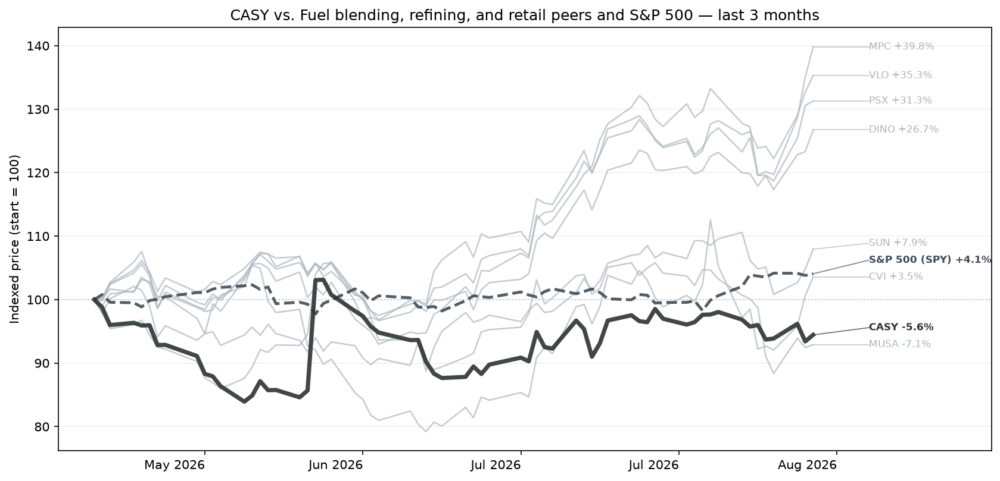

Casey's General Stores Inc, along with its subsidiaries, operates convenience stores mainly under the names Casey's, GoodStop (by Casey's), and Casey's General Store throughout various states in the USA, approximately half of which are located in Iowa, Missouri, and Illinois. These stores offer a broad selection of food items (which includes prepared foods such as regular and breakfast pizza, donuts, hot breakfast items, and hot and cold sandwiches), beverages, tobacco and nicotine products, groceries, health and beauty aids, automotive products, and other non-food items. The majority of the company's revenue is mainly derived from the retail sale of fuel and the products offered inside its stores.

<h3 id="company-musa">Murphy USA (MUSA)</h3>

*Fuel blending, refining, and retail · $10.4B · 3m -7.1% · 12m +38.5% · 24m +7.2%*

[Google Finance](https://www.google.com/finance/quote/MUSA:NYSE?tab=earnings&hl=en)

High-volume fuel retailer and national ethanol blender.

Murphy USA Inc is mainly engaged in the marketing of retail motor fuel products and convenience merchandise through a network of several retail stores in the Southwest, Southeast, Midwest, and Northeast United States. The majority of Murphy USA's stores are located in proximity to Walmart Supercenters, but it also operates standalone stores that market gasoline and other products under the Murphy USA, Murphy Express, and QuickChek brands. In addition, the company also markets fuel to unbranded wholesale customers through a mixture of company-owned and third-party product distribution terminals and pipeline positions. The firm generates maximum revenue through retail sales of petroleum products, and the rest from merchandise sales and wholesale of petroleum products.

<h3 id="company-ntoiy">Neste (NTOIY)</h3>

*Advanced biofuels and SAF · n/a · 3m +2.5% · 12m +101.8% · 24m +54.8%*

[Google Finance](https://www.google.com/finance/quote/NTOIY:NYSE?tab=earnings&hl=en)

Largest global producer of renewable diesel and SAF; sets the price umbrella for corn oil.

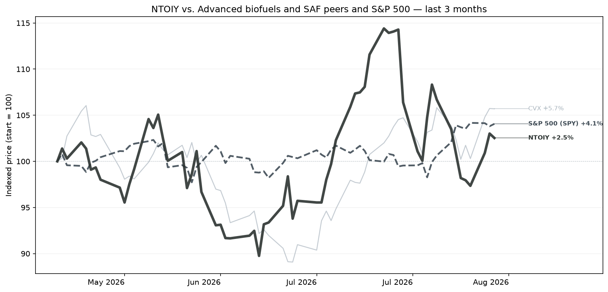

NESTE OYJ UNSP/ADR

<h3 id="company-cvx">Chevron (CVX)</h3>

*Advanced biofuels and SAF · $403.6B · 3m +5.7% · 12m +26.1% · 24m +35.9%*

[Google Finance](https://www.google.com/finance/quote/CVX:NYSE?tab=earnings&hl=en)

Owner of Renewable Energy Group biodiesel and renewable-diesel plants that take corn oil at the margin.

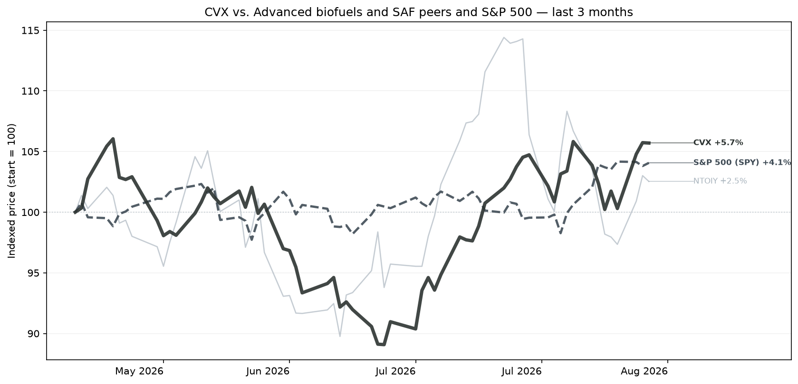

Chevron is an integrated energy company with exploration, production, and refining operations worldwide. It is the second-largest oil company in the United States with 2025 worldwide net oil-equivalent production of 3.7 million barrels per day, including 8.5 billion cubic feet per day of natural gas and 2.3 million barrels of liquids per day. Production takes place in North America, South America, Europe, Africa, Asia, and Australia. The company's refining networks arelocated in the United States and Asia, with a total worldwide refining capacity of 1.8 million barrels of oil a day at year-end 2025. Net proved reserves at year-end 2025 stood at 10.6 billion barrels of oil equivalent, consisting of 5.7 billion barrels of liquids and 29.2 trillion cubic feet of natural gas.

<h3 id="company-csan">Cosan (CSAN)</h3>

*International ethanol · $2.5B · 3m -29.5% · 12m -40.2% · 24m -74.7%*

[Google Finance](https://www.google.com/finance/quote/CSAN:NYSE?tab=earnings&hl=en)

Brazilian holding company and the liquid U.S.-listed proxy for sugarcane ethanol via Raizen.

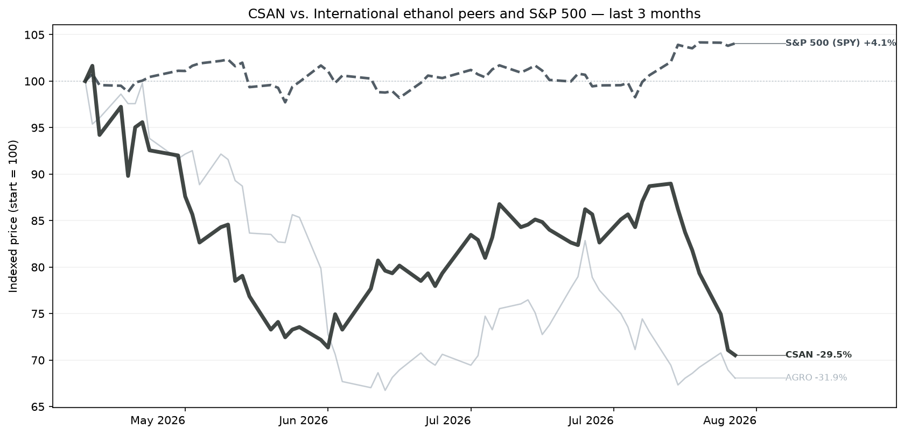

Cosan SA engages in several services throughout the energy and logistics sectors. Its reportable segments are Raizen, Compass, Moove, Rumo, and Radar. It generates the majority of its revenue from Raizen which operates in the production, commercialization, origination, and trading of ethanol, bioenergy, resale, and trading of electricity, renewable sources, marketing, origination, and trading of sugar and fuels, and lubricant.

<h3 id="company-agro">Adecoagro (AGRO)</h3>

*International ethanol · $1.5B · 3m -31.9% · 12m +0.7% · 24m -15.9%*

[Google Finance](https://www.google.com/finance/quote/AGRO:NYSE?tab=earnings&hl=en)

South American farmland and sugar/ethanol producer with U.S.-listed equity.

Adecoagro SA is a Luxembourg-based agricultural company. It is involved in a wide range of businesses, including farming crops and other agricultural products, dairy operations sugar, ethanol, energy production, and land transformation. The group operates in two lines of business, namely, Farming and Sugar, Ethanol and Energy. The Farming is further comprised of three reportable segments: Crops, Rice and Dairy. Sugar, Ethanol and Energy Segment, consists of cultivating sugarcane, which is processed in owned sugar mills, transformed into ethanol, sugar and electricity, in addition to biomethane and then marketed.

<h3 id="company-unp">Union Pacific (UNP)</h3>

*Logistics · $179.3B · 3m +11.0% · 12m +31.6% · 24m +19.2%*

[Google Finance](https://www.google.com/finance/quote/UNP:NYSE?tab=earnings&hl=en)

Primary western Class I for Corn Belt corn, ethanol unit trains, DDGS, and corn oil.

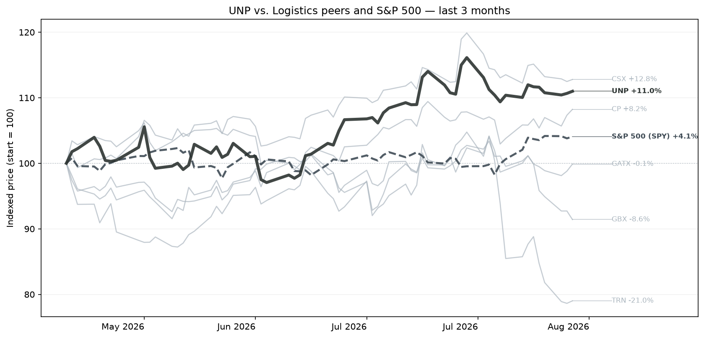

Omaha, Nebraska-based Union Pacific is the largest public railroad in North America. Operating on more than 30,000 miles of track in the western two-thirds of the US, Union Pacific generated $24.5 billion of revenue in 2025 by hauling coal, industrial products, intermodal containers, agricultural goods, chemicals, fertilizers, and automotive goods. Union Pacific owns about one-fourth of Mexican railroad Ferromex and historically derives roughly 10% of its revenue hauling freight to and from Mexico.

<h3 id="company-csx">CSX (CSX)</h3>

*Logistics · $93.9B · 3m +12.8% · 12m +38.8% · 24m +49.1%*

[Google Finance](https://www.google.com/finance/quote/CSX:NASDAQ?tab=earnings&hl=en)

Primary eastern Class I into Northeast and Southeast gasoline markets for ethanol unit trains.

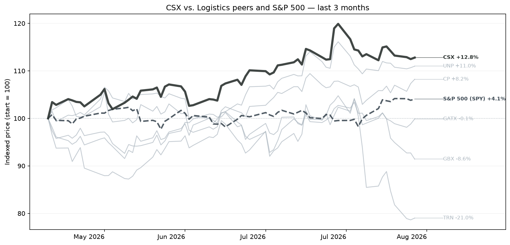

Operating in the Eastern United States, Class I railroad CSX generated revenue of nearly $14 billion in 2025. On its more than 21,000 miles of track, CSX hauls shipments of coal (16% of consolidated revenue), chemicals (17%), intermodal containers (16%), automotive cargo (7%), and a diverse mix of other bulk and industrial merchandise.

<h3 id="company-cp">Canadian Pacific Kansas City (CP)</h3>

*Logistics · $83.0B · 3m +8.2% · 12m +22.6% · 24m +16.9%*

[Google Finance](https://www.google.com/finance/quote/CP:NYSE?tab=earnings&hl=en)

North-south railroad for Midwest corn and ethanol to the Gulf and Mexico.

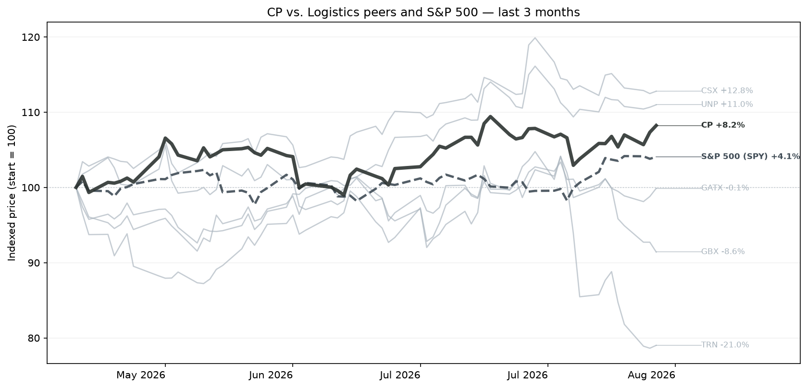

Canadian Pacific Kansas City is a Class I railroad operating on tracks that span most of Canada and into parts of the Midwestern and Northeastern United States. Following the April 2023 Kansas City Southern merger, CPKC operates new single-linehaul services from Canada and the Upper Midwest down through Texas, the Gulf of Mexico, and into Mexico. It also hauls cross-border and intra-Mexico freight via operating concessions on more than 3,000 miles of rail in Mexico. CPKC hauls shipments of grain, intermodal containers, energy products (like crude and frac sand), chemicals, plastics, coal, fertilizer and potash, automotive products, and a diverse mix of other merchandise.

<h3 id="company-gatx">GATX (GATX)</h3>

*Logistics · $6.2B · 3m -0.1% · 12m +12.5% · 24m +29.6%*

[Google Finance](https://www.google.com/finance/quote/GATX:NYSE?tab=earnings&hl=en)

Largest public railcar lessor of ethanol tank cars and grain/DDGS hoppers.

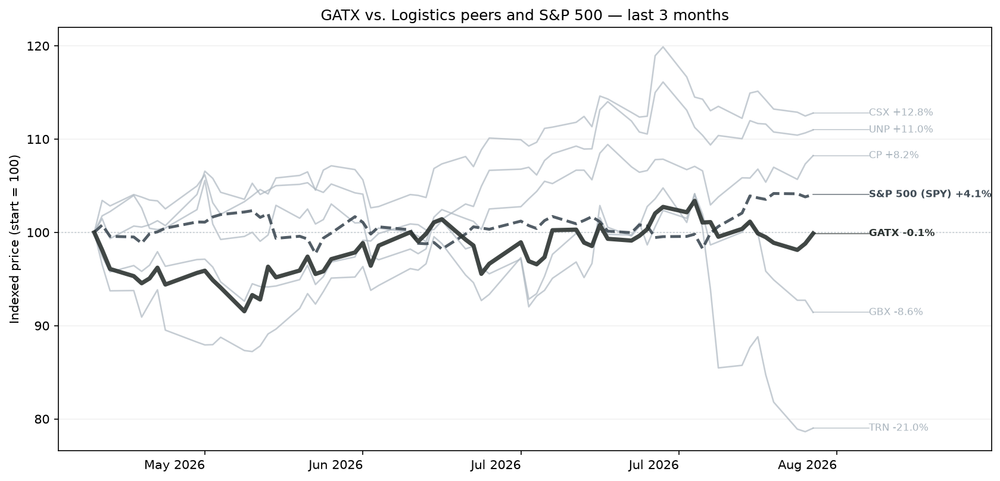

GATX Corp leases transportation assets, including railcars, aircraft spare engines, and tank containers, to customers in North America, Europe, and India. The company's reportable business segments are: Rail North America, Rail International, Engine Leasing, and Other. The majority of its revenue is generated from the Rail North America segment, which is composed of the company's operations in the United States, Canada, and Mexico. This segment mainly provides railcars pursuant to full-service leases under which it maintains the railcars, pays ad valorem taxes and insurance, and provides other ancillary services.

<h3 id="company-trn">Trinity Industries (TRN)</h3>

*Logistics · $2.4B · 3m -21.0% · 12m +0.0% · 24m -9.6%*

[Google Finance](https://www.google.com/finance/quote/TRN:NYSE?tab=earnings&hl=en)

Builds and leases covered hoppers and tank cars used for grain, DDGS, and ethanol.

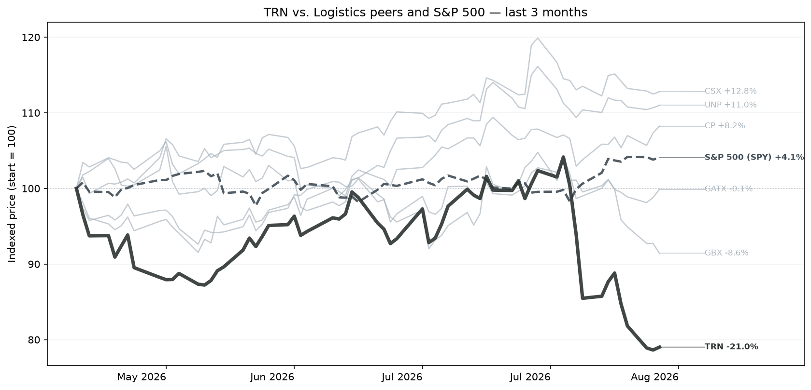

Trinity Industries Inc sells and leases railroad products and railcar maintenance services in North America. The company operates under the name TrinityRail in two main segments: railcar leasing and management services, which owns railcars and provides fleet management and administration services; rail products, which builds, sells, and modifies freight and tank railcars and their components; and all other, which sells highway products such as guardrail and other highway barriers. Customers include railroads, leasing companies, and shipping companies in agriculture, construction, consumer products, energy, and chemicals.

<h3 id="company-gbx">Greenbrier (GBX)</h3>

*Logistics · $1.4B · 3m -8.6% · 12m -4.5% · 24m -2.0%*

[Google Finance](https://www.google.com/finance/quote/GBX:NYSE?tab=earnings&hl=en)

Builds tank cars used for ethanol, renewable fuels, and CO2.

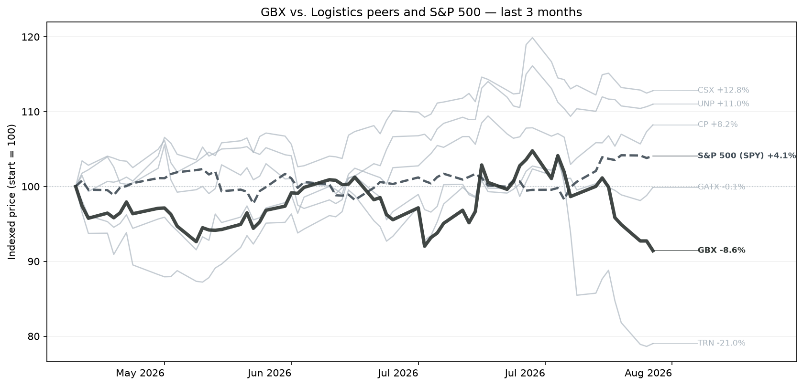

Greenbrier Companies Inc supplies equipment and services to international freight transportation markets, designing and marketing freight railcars in North America, Europe, and Brazil through subsidiaries and joint ventures. It provides railcar wheel services, parts, maintenance, and conversion services in North America. The company owns a lease fleet sourced mainly from its manufacturing operations and offers railcar management, regulatory compliance, and leasing services to railroads and owners. It operates two segments: Manufacturing and Leasing & Fleet Management, with the majority of revenue from Manufacturing. The company operates in the U.S. and internationally, with the majority of revenue from the U.S. market.

