# Weekly Corn and Ethanol Intel Report

<strong>Week of August 27, 2026</strong>Market data through: August 26, 2026Narrative created: August 28, 2026Nearby corn: $5.103/bu (+$0.315 (+6.6%) week)

Weekly review of corn, ethanol, energy, co-product, policy, and related public-company performance for commodities risk managers at U.S. ethanol plants.

## Strategy Narrative

Nearby futures from Yahoo Finance. Nearby corn is the market&#x27;s current perception of yield and demand risk.

<table><thead><tr><th>Contract</th><th>Last</th><th>Week change</th><th>As of</th></tr></thead><tbody><tr><td>Nearby corn</td><td>$5.103/bu</td><td>+$0.315 (+6.6%)</td><td>August 27, 2026</td></tr><tr><td>RBOB gasoline</td><td>$3.384/gal</td><td>+0.121 (+3.7%)</td><td>August 27, 2026</td></tr><tr><td>Henry Hub</td><td>$2.907/MMBtu</td><td>+0.174 (+6.4%)</td><td>August 27, 2026</td></tr></tbody></table>

<nav class="strategy-narrative-links" aria-label="Strategy narrative sections">
<ul>
<li><a href="#strategy-executive-view-1-crop-tour-reversed-the-prior-week-s-corn-risk-improvement">1. Crop tour reversed the prior week’s corn-risk improvement</a></li>
<li><a href="#strategy-executive-view-2-prospective-refinery-exemptions-weakened-rin-protection">2. Prospective refinery exemptions weakened RIN protection</a></li>
<li><a href="#strategy-executive-view-3-epa-resolved-the-late-august-e15-cliff">3. EPA resolved the late-August E15 cliff</a></li>
<li><a href="#strategy-executive-view-4-exports-slowed-but-did-not-reverse-the-ethanol-stock-build">4. Exports slowed—but did not reverse—the ethanol stock build</a></li>
</ul>
</nav>

<h3 id="executive-view">Executive View</h3>

- **Field evidence materially challenged USDA’s corn balance sheet.** Pro Farmer estimated a **173.2-bushel national yield and 15.344-billion-bushel crop**, versus USDA’s controlling August estimates of **180.7 bushels and 16.013 billion bushels**. Nearby corn closed at **$5.103 per bushel, up $0.315, or 6.6%, for the week**, confirming that the market increased—not reduced—the yield-risk premium.
- **Corn procurement is now the dominant plant-margin risk.** The 669-million-bushel gap between Pro Farmer and USDA would, if mechanically applied before demand rationing, reduce USDA’s **1.653-billion-bushel projected carryout to roughly 984 million bushels**. That is an illustrative sensitivity, not a forecast, but it shows why delayed harvest and first-quarter coverage became more exposed.
- **RFS credit risk deteriorated before any final EPA action.** D6 RINs reportedly fell **34 cents to $1.75 on August 24** after EPA signaled an extension of the September 1 compliance deadline and an end-August decision on pending small-refinery exemptions. Administration officials are reportedly considering relief covering **1.2–1.8 billion RINs**, but EPA said no decisions had been made.
- **The ethanol balance improved only at the margin.** Production rebounded **23,000 barrels per day to 1.112 million**, while inventories rose another **85,000 barrels to 25.206 million**, 11.8% above last year. Stronger reported exports helped slow the stock build, but output remains high relative to domestic inputs.
- **Energy provided a stronger ethanol price umbrella but higher plant costs.** RBOB rose **3.7%** and gasoline stocks fell 2.536 million barrels, while Henry Hub rose **6.4%**. Midwest gas storage remains 5.9% above its five-year average, limiting scarcity risk but not preventing a near-term cost increase.
- **Overall margin and risk conditions deteriorated:** sharply higher corn and natural-gas futures, combined with weaker RIN values, outweighed firmer gasoline and the slower ethanol inventory build.

| Exposure | Current signal | Change from last week | Horizon | Confidence | Main driver |
|---|---|---:|---|---|---|
| Corn procurement | USDA yield increasingly contested | Deteriorated sharply | Harvest–Q1 2027 | High | Crop-tour results and futures rally |
| Ethanol selling | Heavy stocks; slower accumulation | Improved modestly | 1–4 weeks | High | Stronger exports offset high production |
| Natural gas | Ample Midwest storage, higher price | Deteriorated modestly | 1–3 months | High | Henry Hub +6.4% |
| RINs/RFS | Large exemption outcome under discussion | Deteriorated | Days–months | Medium | Pending EPA decisions |
| 45Z/feedstock CI | Major plant-level margin differentiator | Unchanged | 2026–27 | Medium | Verification and monetization execution |
| Overall plant margin | Higher feedstock and energy costs | Deteriorated | Near term | High | Corn repricing |

The incremental thesis is that **last week’s weather-based reduction in national yield risk was premature**. USDA’s August balance sheet remains the official regime, but crop-tour measurements, deteriorating conditions and a 6.6% corn rally have raised the probability of a meaningful September production cut. Continuing 45Z monetization, regenerative-ag feedstock documentation, monthly ethanol-export strength and carbon infrastructure are not re-narrated because no material new federal or commercial development emerged this week.

<h3 id="strategy-executive-view-1-crop-tour-reversed-the-prior-week-s-corn-risk-improvement">1. Crop tour reversed the prior week’s corn-risk improvement</h3>

**Status:** REFUTE

**What happened**

Pro Farmer’s August 21 national estimate placed corn yield at **173.2 bushels per acre**, with a range of 171.5–175.0, and production at **15.344 billion bushels**, plus or minus 1%. Scouts reported lower ear populations, shorter grain length and substantial field-to-field variability. USDA’s August 12 survey-based forecast remains 180.7 bushels and 16.013 billion bushels. (Pro Farmer, *“Pro Farmer Estimates 2026 U.S. Corn Crop at 15.344 Billion Bushels,”* August 21, 2026.) ([profarmer.com](https://www.profarmer.com/news/pro-farmer-estimates-2026-u-s-corn-crop-15-344-billion-bushels-soybeans-4-572-billion-bushels))

USDA subsequently cut national corn condition by three points to **57% good-to-excellent** for the week ended August 23, versus 60% the prior week and 71% last year. The crop was 81% in dough, 41% dented and 6% mature. (USDA NASS, *Crop Progress*, August 24, 2026.) ([nass.usda.gov](https://www.nass.usda.gov/Publications/Todays_Reports/reports/prog3426.pdf))

**Why it matters**

The new field evidence does not prove that USDA is seven-plus bushels too high; crop-tour estimates are not equivalent to USDA’s survey process. However, the magnitude and geographic consistency of the disappointment are too large to dismiss as routine sampling noise. Nearby corn above $5 and up 31.5 cents validates the conclusion that the trade now assigns materially greater probability to tighter supply.

**Risk-manager implication**

Plants that treated recent rainfall as justification for leaving harvest or winter corn uncovered now face greater futures risk. The first transmission is through December and March corn; local basis will depend on whether tour weakness overlaps each plant’s procurement radius. Directionally: **corn bullish, ethanol feedstock cost higher and physical margins lower**, with high confidence through the September crop reports.

**Watch next**

Whether early harvest results validate low ear counts and whether USDA moves yield closer to the Pro Farmer range.

---

<h3 id="strategy-executive-view-2-prospective-refinery-exemptions-weakened-rin-protection">2. Prospective refinery exemptions weakened RIN protection</h3>

**Status:** UPDATE

**What happened**

EPA plans to extend the current **September 1, 2026** deadline for refiners to demonstrate 2025 RFS compliance; a final rule entered White House regulatory review on August 26. EPA also indicated it expected to decide pending small-refinery petitions by the end of August. (Office of Information and Regulatory Affairs, *“RFS Program: Extension of 2025 Compliance Reporting Deadline,”* received August 26, 2026.) ([reginfo.gov](https://www.reginfo.gov/public/do/eoDetails?rrid=1512912&utm_source=openai))

Reuters reported that D6 RINs fell to **$1.75 on August 24**, their lowest since April 15. Subsequent reporting said administration officials were pressing for exemptions covering approximately **1.2–1.8 billion RINs**, versus roughly 1 billion previously contemplated. EPA stated that no petition decisions had been made. (Reuters, *“US Ethanol Credit Prices Slump After EPA Delays Biofuel Compliance Deadline,”* August 24; *“White House Pushes for More Refinery Waivers,”* August 26, 2026.) ([investing.com](https://www.investing.com/news/commodities-news/us-ethanol-credit-prices-slump-after-epa-delays-biofuel-compliance-deadline-4874064?utm_source=openai))

**Why it matters**

The immediate impact is on RIN value and obligated-party compliance strategy, not necessarily physical ethanol disappearance. Still, exemptions materially above the assumptions embedded in EPA’s 2026 RVO would weaken the marginal incentive to blend and reduce the value of RIN-linked ethanol contracts.

**Risk-manager implication**

Treat the reported exemption range as a scenario, not confirmed policy. Plants should separate outright ethanol exposure from D6-linked pricing and avoid assuming the record headline RVO fully protects credit value. The largest near-term exposure is **RIN price and counterparty contract value**, followed by physical blend demand if EPA does not offset exemptions.

---

<h3 id="strategy-executive-view-3-epa-resolved-the-late-august-e15-cliff">3. EPA resolved the late-August E15 cliff</h3>

**Status:** RESOLVE

**What happened**

EPA’s August 20 waiver extended the common national gasoline pool containing **9%–15% ethanol through August 31**, closing the previously perceived August 29–31 gap. Beginning September 1, EPA permits the earlier transition to higher-volatility winter-grade gasoline through the remainder of the federal summer-control period. (EPA, *“National Fuel Waiver to Bring Forward Wintertime Gasoline Beginning September 1, 2026,”* August 20, 2026.) ([epa.gov](https://www.epa.gov/system/files/documents/2026-08/national-fuel-waiver-governors-8-20-2026.pdf))

**Why it matters**

This resolves the immediate E15 distribution concern identified last week. Once winter-grade gasoline becomes permissible, the summer RVP restriction no longer creates the same E15 constraint. The trade-off is that earlier winter-grade supply can pressure petroleum blending-component values.

**Risk-manager implication**

The result is **supportive for continued E15 availability but not a new structural demand mandate**. With RBOB nevertheless rising 3.7% this week, the petroleum price umbrella strengthened despite the additional supply flexibility.

---

<h3 id="strategy-executive-view-4-exports-slowed-but-did-not-reverse-the-ethanol-stock-build">4. Exports slowed—but did not reverse—the ethanol stock build</h3>

**Status:** UPDATE

**What happened**

| EIA ethanol balance | Week ended Aug. 14 | Week ended Aug. 21 | Change |
|---|---:|---:|---:|
| Production, million bpd | 1.089 | 1.112 | +0.023 |
| Inventories, million bbl | 25.121 | 25.206 | +0.085 |
| Refiner/blender inputs, million bpd | 0.926 | 0.923 | -0.003 |

Inventories remained **11.8% above the comparable 2025 week**. The Midwest accounted for most of the weekly build, rising 299,000 barrels to 10.045 million, while East and Gulf Coast stocks declined. (EIA, *Weekly Petroleum Status Report*, August 26, 2026.) ([eia.gov](https://www.eia.gov/dnav/pet/pet_stoc_wstk_a_epooxe_sae_mbbl_w.htm?utm_source=openai))

Gasoline inventories fell **2.536 million barrels to 206.842 million**, with refinery utilization at 97.4%, reinforcing the stronger RBOB environment. ([ir.eia.gov](https://ir.eia.gov/wpsr/table5.csv))

**Why it matters**

The stock increase was much smaller than the prior week’s 323,000-barrel build despite higher production, indicating better total disappearance. It does not yet resolve the underlying imbalance: inventories have increased for three consecutive reported weeks and remain historically heavy.

**Risk-manager implication**

Prompt ethanol exposure improved from “steadily worsening” to **heavy but stabilizing**. Plants still need export support or maintenance-season production cuts to produce an outright draw. Corn demand remains supported by the 1.112-million-barrel-per-day run rate, intensifying the feedstock squeeze created by the crop-tour estimate.

<h3 id="strategic-synthesis">Strategic Synthesis</h3>

The week created a more adverse plant-margin combination: **field evidence challenged corn supply just as plants maintained high operating rates, while prospective refinery exemptions reduced regulatory-credit protection**. Strong gasoline values and improved ethanol disappearance are meaningful offsets, but neither compensates for a 31.5-cent corn rally unless ethanol prices and basis respond further.

<h3 id="what-i-m-watching-next">What I’m Watching Next</h3>

- **By August 31, 2026:** EPA’s targeted decision window for pending small-refinery exemptions and the RFS compliance-deadline extension.
- **August 31, 2026:** USDA Crop Progress and Condition.
- **September 2, 2026:** EIA ethanol and petroleum balances; REX American Resources fiscal second-quarter results.
- **September 11, 2026:** USDA WASDE and Crop Production—the first official opportunity to reconcile crop-tour evidence with the 180.7-bushel yield.

<h3 id="bottom-line">Bottom Line</h3>

The most consequential weekly change was the **reversal from easing to rising corn-yield risk**, confirmed by both the crop tour and a 6.6% nearby-corn rally. Harvest and winter corn coverage now requires the closest attention, while EPA’s end-August refinery-exemption decision is the catalyst most capable of further changing ethanol and RIN economics.

## Notable Changes

Comparison with the final report dated August 20, 2026 (market data through August 19, 2026).

### Sectors

#### Top-three comparison

<table class="sortable"><thead><tr><th class="sortable-heading" data-column="0" data-type="text">Entity</th><th class="sortable-heading" data-column="1" data-type="number">Previous</th><th class="sortable-heading" data-column="2" data-type="number">Current</th><th class="sortable-heading" data-column="3" data-type="number">Change</th><th class="sortable-heading" data-column="4" data-type="number">Current return</th></tr></thead><tbody><tr><td class="text" data-sort="u.s. ethanol and process technology" style=""><a href="#category-u-s-ethanol-and-process-technology">U.S. ethanol and process technology</a></td><td class="" data-sort="1" style="">#1</td><td class="" data-sort="1" style="">#1</td><td class="" data-sort="0" style="">— 0</td><td class="" data-sort="1.0017870819893" style="background:#1a7a3c;color:#ffffff;">+100.2%</td></tr><tr><td class="text" data-sort="fuel blending, refining, and retail" style=""><a href="#category-fuel-blending-refining-and-retail">Fuel blending, refining, and retail</a></td><td class="" data-sort="2" style="">#2</td><td class="" data-sort="2" style="">#2</td><td class="" data-sort="0" style="">— 0</td><td class="" data-sort="0.9680102499874936" style="background:#1a7a3c;color:#ffffff;">+96.8%</td></tr><tr><td class="text" data-sort="logistics" style=""><a href="#category-logistics">Logistics</a></td><td class="" data-sort="5" style="">#5</td><td class="" data-sort="3" style="">#3</td><td class="rank-change-up" data-sort="-2" style="">↑ 2</td><td class="" data-sort="0.40415687938902667" style="background:#7cc077;color:#111820;">+40.4%</td></tr><tr><td class="text" data-sort="grain origination and agribusiness" style=""><a href="#category-grain-origination-and-agribusiness">Grain origination and agribusiness</a></td><td class="" data-sort="3" style="">#3</td><td class="" data-sort="4" style="">#4</td><td class="rank-change-down" data-sort="1" style="">↓ 1</td><td class="" data-sort="0.30998017677575584" style="background:#a9d9a4;color:#111820;">+31.0%</td></tr></tbody></table>

#### Largest rank changes

<table class="sortable"><thead><tr><th class="sortable-heading" data-column="0" data-type="text">Entity</th><th class="sortable-heading" data-column="1" data-type="number">Previous</th><th class="sortable-heading" data-column="2" data-type="number">Current</th><th class="sortable-heading" data-column="3" data-type="number">Change</th><th class="sortable-heading" data-column="4" data-type="number">Current return</th></tr></thead><tbody><tr><td class="text" data-sort="logistics" style=""><a href="#category-logistics">Logistics</a></td><td class="" data-sort="5" style="">#5</td><td class="" data-sort="3" style="">#3</td><td class="rank-change-up" data-sort="-2" style="">↑ 2</td><td class="" data-sort="0.40415687938902667" style="background:#1a7a3c;color:#ffffff;">+40.4%</td></tr></tbody></table>

### Stocks

#### Top-three comparison

<table class="sortable"><thead><tr><th class="sortable-heading" data-column="0" data-type="text">Entity</th><th class="sortable-heading" data-column="1" data-type="number">Previous</th><th class="sortable-heading" data-column="2" data-type="number">Current</th><th class="sortable-heading" data-column="3" data-type="number">Change</th><th class="sortable-heading" data-column="4" data-type="number">Current return</th></tr></thead><tbody><tr><td class="text" data-sort="valero energy" style="">Valero Energy (<a href="#company-vlo">VLO</a>)</td><td class="" data-sort="1" style="">#1</td><td class="" data-sort="1" style="">#1</td><td class="" data-sort="0" style="">— 0</td><td class="" data-sort="1.308350467599655" style="background:#1a7a3c;color:#ffffff;">+130.8%</td></tr><tr><td class="text" data-sort="marathon petroleum" style="">Marathon Petroleum (<a href="#company-mpc">MPC</a>)</td><td class="" data-sort="2" style="">#2</td><td class="" data-sort="2" style="">#2</td><td class="" data-sort="0" style="">— 0</td><td class="" data-sort="1.0364832199673955" style="background:#2f9e44;color:#111820;">+103.6%</td></tr><tr><td class="text" data-sort="hf sinclair" style="">HF Sinclair (<a href="#company-dino">DINO</a>)</td><td class="" data-sort="5" style="">#5</td><td class="" data-sort="3" style="">#3</td><td class="rank-change-up" data-sort="-2" style="">↑ 2</td><td class="" data-sort="0.9246261216350946" style="background:#2f9e44;color:#111820;">+92.5%</td></tr><tr><td class="text" data-sort="darling ingredients" style="">Darling Ingredients (<a href="#company-dar">DAR</a>)</td><td class="" data-sort="3" style="">#3</td><td class="" data-sort="6" style="">#6</td><td class="rank-change-down" data-sort="3" style="">↓ 3</td><td class="" data-sort="0.8147502903600465" style="background:#2f9e44;color:#111820;">+81.5%</td></tr></tbody></table>

#### Largest rank changes

<table class="sortable"><thead><tr><th class="sortable-heading" data-column="0" data-type="text">Entity</th><th class="sortable-heading" data-column="1" data-type="number">Previous</th><th class="sortable-heading" data-column="2" data-type="number">Current</th><th class="sortable-heading" data-column="3" data-type="number">Change</th><th class="sortable-heading" data-column="4" data-type="number">Current return</th></tr></thead><tbody><tr><td class="text" data-sort="green plains" style="">Green Plains (<a href="#company-gpre">GPRE</a>)</td><td class="" data-sort="4" style="">#4</td><td class="" data-sort="11" style="">#11</td><td class="rank-change-down" data-sort="7" style="">↓ 7</td><td class="" data-sort="0.4954773869346736" style="background:#1a7a3c;color:#ffffff;">+49.5%</td></tr><tr><td class="text" data-sort="deere" style=""><a href="#earnings-de">Deere</a> (<a href="#company-de">DE</a>)</td><td class="" data-sort="26" style="">#26</td><td class="" data-sort="20" style="">#20</td><td class="rank-change-up" data-sort="-6" style="">↑ 6</td><td class="" data-sort="0.28689056542548874" style="background:#7cc077;color:#111820;">+28.7%</td></tr><tr><td class="text" data-sort="chevron" style="">Chevron (<a href="#company-cvx">CVX</a>)</td><td class="" data-sort="17" style="">#17</td><td class="" data-sort="24" style="">#24</td><td class="rank-change-down" data-sort="7" style="">↓ 7</td><td class="" data-sort="0.2572846018588295" style="background:#7cc077;color:#111820;">+25.7%</td></tr></tbody></table>

### Subcategory movement since the previous report

<table class="sortable"><thead><tr><th class="sortable-heading" data-column="0" data-type="text">Subcategory</th><th class="sortable-heading" data-column="1" data-type="number">Move</th><th class="sortable-heading" data-column="2" data-type="number">Last Report, 12m Ret</th><th class="sortable-heading" data-column="3" data-type="number">Current Report, 12m Ret</th></tr></thead><tbody><tr><td class="text" data-sort="international ethanol" style=""><a href="#category-international-ethanol">International ethanol</a></td><td class="" data-sort="0.08677469706289288" style="background:#1a7a3c;color:#ffffff;">+8.7%</td><td class="" data-sort="-0.118632855019" style="background:#fbd5d4;color:#111820;">-11.9%</td><td class="" data-sort="-0.0744591863328881" style="background:#fbd5d4;color:#111820;">-7.4%</td></tr><tr><td class="text" data-sort="crop inputs, equipment, and irrigation" style=""><a href="#category-crop-inputs-equipment-and-irrigation">Crop inputs, equipment, and irrigation</a></td><td class="" data-sort="0.0777292060651076" style="background:#1a7a3c;color:#ffffff;">+7.8%</td><td class="" data-sort="0.147901403071" style="background:#d6ecd4;color:#111820;">+14.8%</td><td class="" data-sort="0.22419537117577898" style="background:#a9d9a4;color:#111820;">+22.4%</td></tr><tr><td class="text" data-sort="logistics" style=""><a href="#category-logistics">Logistics</a></td><td class="" data-sort="0.0206841163699739" style="background:#a9d9a4;color:#111820;">+2.1%</td><td class="" data-sort="0.333344023704" style="background:#a9d9a4;color:#111820;">+33.3%</td><td class="" data-sort="0.40415687938902667" style="background:#7cc077;color:#111820;">+40.4%</td></tr><tr><td class="text" data-sort="u.s. ethanol and process technology" style=""><a href="#category-u-s-ethanol-and-process-technology">U.S. ethanol and process technology</a></td><td class="" data-sort="-0.00015539190495539247" style="background:#fbd5d4;color:#111820;">-0.0%</td><td class="" data-sort="1.13348283203" style="background:#1a7a3c;color:#ffffff;">+113.3%</td><td class="" data-sort="1.0017870819893" style="background:#1a7a3c;color:#ffffff;">+100.2%</td></tr><tr><td class="text" data-sort="fuel blending, refining, and retail" style=""><a href="#category-fuel-blending-refining-and-retail">Fuel blending, refining, and retail</a></td><td class="" data-sort="-0.0013343376269624998" style="background:#fbd5d4;color:#111820;">-0.1%</td><td class="" data-sort="1.08874102264" style="background:#1a7a3c;color:#ffffff;">+108.9%</td><td class="" data-sort="0.9680102499874936" style="background:#1a7a3c;color:#ffffff;">+96.8%</td></tr><tr><td class="text" data-sort="grain origination and agribusiness" style=""><a href="#category-grain-origination-and-agribusiness">Grain origination and agribusiness</a></td><td class="" data-sort="-0.008738129588696204" style="background:#fbd5d4;color:#111820;">-0.9%</td><td class="" data-sort="0.364639589785" style="background:#a9d9a4;color:#111820;">+36.5%</td><td class="" data-sort="0.30998017677575584" style="background:#a9d9a4;color:#111820;">+31.0%</td></tr><tr><td class="text" data-sort="wet milling, ingredients, and co-products" style=""><a href="#category-wet-milling-ingredients-and-co-products">Wet milling, ingredients, and co-products</a></td><td class="" data-sort="-0.015393943226045564" style="background:#fbd5d4;color:#111820;">-1.5%</td><td class="" data-sort="0.171564941644" style="background:#d6ecd4;color:#111820;">+17.2%</td><td class="" data-sort="0.08347964103291144" style="background:#d6ecd4;color:#111820;">+8.3%</td></tr><tr><td class="text" data-sort="advanced biofuels and saf" style=""><a href="#category-advanced-biofuels-and-saf">Advanced biofuels and SAF</a></td><td class="" data-sort="-0.026973172628304787" style="background:#f5aead;color:#111820;">-2.7%</td><td class="" data-sort="0.342905625897" style="background:#a9d9a4;color:#111820;">+34.3%</td><td class="" data-sort="0.2572846018588295" style="background:#a9d9a4;color:#111820;">+25.7%</td></tr></tbody></table>

### Largest company moves

<table class="sortable"><thead><tr><th class="sortable-heading" data-column="0" data-type="text">Direction</th><th class="sortable-heading" data-column="1" data-type="text">Company</th><th class="sortable-heading" data-column="2" data-type="text">Ticker</th><th class="sortable-heading" data-column="3" data-type="number">Move</th></tr></thead><tbody><tr><td class="text" data-sort="0" style="">Gain</td><td class="text" data-sort="cnh industrial" style="">CNH Industrial</td><td class="text text" data-sort="cnh" style=""><a href="#company-cnh">CNH</a></td><td class="" data-sort="0.12925170068027203" style="background:#1a7a3c;color:#ffffff;">+12.9%</td></tr><tr><td class="text" data-sort="0" style="">Gain</td><td class="text" data-sort="agco" style="">AGCO</td><td class="text text" data-sort="agco" style=""><a href="#company-agco">AGCO</a></td><td class="" data-sort="0.12098070739549849" style="background:#1a7a3c;color:#ffffff;">+12.1%</td></tr><tr><td class="text" data-sort="0" style="">Gain</td><td class="text" data-sort="cosan" style="">Cosan</td><td class="text text" data-sort="csan" style=""><a href="#company-csan">CSAN</a></td><td class="" data-sort="0.11023622047244097" style="background:#1a7a3c;color:#ffffff;">+11.0%</td></tr><tr><td class="text" data-sort="1" style="">Decline</td><td class="text" data-sort="green plains" style="">Green Plains</td><td class="text text" data-sort="gpre" style=""><a href="#company-gpre">GPRE</a></td><td class="" data-sort="-0.0717404865876482" style="background:#ee8483;color:#111820;">-7.2%</td></tr><tr><td class="text" data-sort="1" style="">Decline</td><td class="text" data-sort="darling ingredients" style="">Darling Ingredients</td><td class="text text" data-sort="dar" style=""><a href="#company-dar">DAR</a></td><td class="" data-sort="-0.06632805497460414" style="background:#ee8483;color:#111820;">-6.6%</td></tr><tr><td class="text" data-sort="1" style="">Decline</td><td class="text" data-sort="murphy usa" style="">Murphy USA</td><td class="text text" data-sort="musa" style=""><a href="#company-musa">MUSA</a></td><td class="" data-sort="-0.06440940447698162" style="background:#ee8483;color:#111820;">-6.4%</td></tr></tbody></table>

## Subcategory Performance

<table class="sortable"><thead><tr><th class="sortable-heading" data-column="0" data-type="text">Subcategory</th><th class="sortable-heading" data-column="1" data-type="number">Companies</th><th class="sortable-heading" data-column="2" data-type="number">Market cap</th><th class="sortable-heading" data-column="3" data-type="number">3m Return</th><th class="sortable-heading" data-column="4" data-type="number">12m Return</th><th class="sortable-heading" data-column="5" data-type="number">24m Return</th></tr></thead><tbody><tr><td class="text" data-sort="crop inputs, equipment, and irrigation" style=""><a href="#category-crop-inputs-equipment-and-irrigation">Crop inputs, equipment, and irrigation</a></td><td class="" data-sort="11" style="">11</td><td class="" data-sort="300745184478.91" style="">$300.7B</td><td class="" data-sort="0.12574029237924952" style="background:#a9d9a4;color:#111820;">+12.6%</td><td class="" data-sort="0.22419537117577898" style="background:#a9d9a4;color:#111820;">+22.4%</td><td class="" data-sort="0.5651097005526622" style="background:#7cc077;color:#111820;">+56.5%</td></tr><tr><td class="text" data-sort="grain origination and agribusiness" style=""><a href="#category-grain-origination-and-agribusiness">Grain origination and agribusiness</a></td><td class="" data-sort="3" style="">3</td><td class="" data-sort="63125801301.18" style="">$63.1B</td><td class="" data-sort="-0.02198270825156122" style="background:#fbd5d4;color:#111820;">-2.2%</td><td class="" data-sort="0.30998017677575584" style="background:#a9d9a4;color:#111820;">+31.0%</td><td class="" data-sort="0.2545891074637675" style="background:#a9d9a4;color:#111820;">+25.5%</td></tr><tr><td class="text" data-sort="u.s. ethanol and process technology" style=""><a href="#category-u-s-ethanol-and-process-technology">U.S. ethanol and process technology</a></td><td class="" data-sort="6" style="">6</td><td class="" data-sort="143490589721.54" style="">$143.5B</td><td class="" data-sort="0.30988618535671436" style="background:#1a7a3c;color:#ffffff;">+31.0%</td><td class="" data-sort="1.0017870819893" style="background:#1a7a3c;color:#ffffff;">+100.2%</td><td class="" data-sort="1.1229500102685963" style="background:#1a7a3c;color:#ffffff;">+112.3%</td></tr><tr><td class="text" data-sort="wet milling, ingredients, and co-products" style=""><a href="#category-wet-milling-ingredients-and-co-products">Wet milling, ingredients, and co-products</a></td><td class="" data-sort="5" style="">5</td><td class="" data-sort="122070417790.07" style="">$122.1B</td><td class="" data-sort="-0.0012309518614921971" style="background:#fbd5d4;color:#111820;">-0.1%</td><td class="" data-sort="0.08347964103291144" style="background:#d6ecd4;color:#111820;">+8.3%</td><td class="" data-sort="0.18366834531971302" style="background:#d6ecd4;color:#111820;">+18.4%</td></tr><tr><td class="text" data-sort="fuel blending, refining, and retail" style=""><a href="#category-fuel-blending-refining-and-retail">Fuel blending, refining, and retail</a></td><td class="" data-sort="8" style="">8</td><td class="" data-sort="374068702481.42" style="">$374.1B</td><td class="" data-sort="0.3754582576429514" style="background:#1a7a3c;color:#ffffff;">+37.5%</td><td class="" data-sort="0.9680102499874936" style="background:#1a7a3c;color:#ffffff;">+96.8%</td><td class="" data-sort="1.0713571019043227" style="background:#1a7a3c;color:#ffffff;">+107.1%</td></tr><tr><td class="text" data-sort="advanced biofuels and saf" style=""><a href="#category-advanced-biofuels-and-saf">Advanced biofuels and SAF</a></td><td class="" data-sort="2" style="">2</td><td class="" data-sort="403619489658.24" style="">$403.6B</td><td class="" data-sort="0.09764254385964909" style="background:#a9d9a4;color:#111820;">+9.8%</td><td class="" data-sort="0.2572846018588295" style="background:#a9d9a4;color:#111820;">+25.7%</td><td class="" data-sort="0.3624362027900647" style="background:#a9d9a4;color:#111820;">+36.2%</td></tr><tr><td class="text" data-sort="international ethanol" style=""><a href="#category-international-ethanol">International ethanol</a></td><td class="" data-sort="2" style="">2</td><td class="" data-sort="4030007905.26" style="">$4.0B</td><td class="" data-sort="-0.11548961703974318" style="background:#f5aead;color:#111820;">-11.5%</td><td class="" data-sort="-0.0744591863328881" style="background:#fbd5d4;color:#111820;">-7.4%</td><td class="" data-sort="-0.43922423873089456" style="background:#f5aead;color:#111820;">-43.9%</td></tr><tr><td class="text" data-sort="logistics" style=""><a href="#category-logistics">Logistics</a></td><td class="" data-sort="6" style="">6</td><td class="" data-sort="366182560910.12" style="">$366.2B</td><td class="" data-sort="0.0883411699914533" style="background:#a9d9a4;color:#111820;">+8.8%</td><td class="" data-sort="0.40415687938902667" style="background:#7cc077;color:#111820;">+40.4%</td><td class="" data-sort="0.29217448142252667" style="background:#a9d9a4;color:#111820;">+29.2%</td></tr></tbody></table>

Subcategory returns use the most recently saved market capitalizations as weights.

## Stock Performance vs. SPY

The same selected stocks appear in every chart. Each line is labeled at the right with its ticker and return for the displayed window.
### Last 6 months

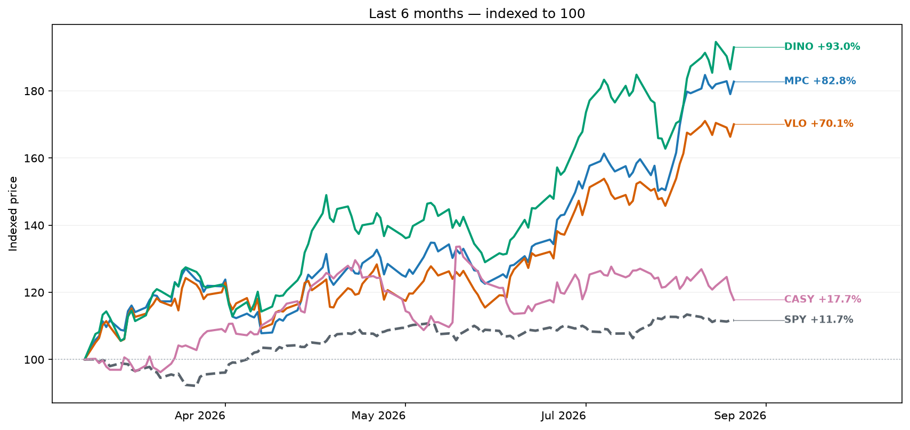

### Last 12 months

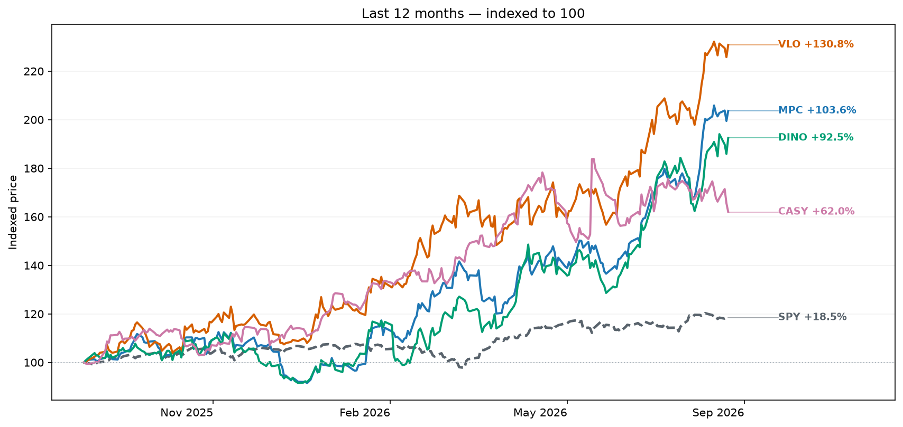

### Last 24 months

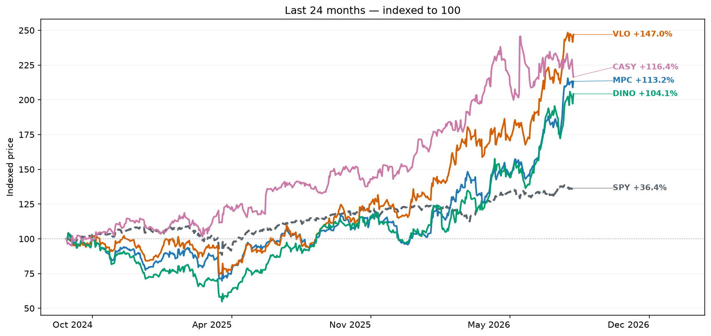

## Current Top Stocks

### Last 3 months

<table class="sortable"><thead><tr><th class="sortable-heading" data-column="0" data-type="number">Rank</th><th class="sortable-heading" data-column="1" data-type="text">Company</th><th class="sortable-heading" data-column="2" data-type="text">Ticker</th><th class="sortable-heading" data-column="3" data-type="number">Market cap</th><th class="sortable-heading" data-column="4" data-type="number">Return</th></tr></thead><tbody><tr><td class="" data-sort="1" style="">1</td><td class="text" data-sort="marathon petroleum" style="">Marathon Petroleum</td><td class="text text" data-sort="mpc" style=""><a href="#company-mpc">MPC</a></td><td class="" data-sort="101307533252.25" style="">$101.3B</td><td class="" data-sort="0.46638332321392406" style="background:#1a7a3c;color:#ffffff;">+46.6%</td></tr><tr><td class="" data-sort="2" style="">2</td><td class="text" data-sort="valero energy" style="">Valero Energy</td><td class="text text" data-sort="vlo" style=""><a href="#company-vlo">VLO</a></td><td class="" data-sort="99697762645.86" style="">$99.7B</td><td class="" data-sort="0.4480735624531911" style="background:#1a7a3c;color:#ffffff;">+44.8%</td></tr><tr><td class="" data-sort="3" style="">3</td><td class="text" data-sort="hf sinclair" style="">HF Sinclair</td><td class="text text" data-sort="dino" style=""><a href="#company-dino">DINO</a></td><td class="" data-sort="16821907792.380001" style="">$16.8B</td><td class="" data-sort="0.4177438307873089" style="background:#1a7a3c;color:#ffffff;">+41.8%</td></tr><tr><td class="" data-sort="4" style="">4</td><td class="text" data-sort="phillips 66" style="">Phillips 66</td><td class="text text" data-sort="psx" style=""><a href="#company-psx">PSX</a></td><td class="" data-sort="96678777737.64" style="">$96.7B</td><td class="" data-sort="0.38710416308767104" style="background:#1a7a3c;color:#ffffff;">+38.7%</td></tr><tr><td class="" data-sort="5" style="">5</td><td class="text" data-sort="bayer" style="">Bayer</td><td class="text text" data-sort="bayry" style=""><a href="#company-bayry">BAYRY</a></td><td class="" data-sort="n/a" style="">n/a</td><td class="" data-sort="0.2633969118982744" style="background:#7cc077;color:#111820;">+26.3%</td></tr></tbody></table>

### Last 12 months

<table class="sortable"><thead><tr><th class="sortable-heading" data-column="0" data-type="number">Rank</th><th class="sortable-heading" data-column="1" data-type="text">Company</th><th class="sortable-heading" data-column="2" data-type="text">Ticker</th><th class="sortable-heading" data-column="3" data-type="number">Market cap</th><th class="sortable-heading" data-column="4" data-type="number">Return</th></tr></thead><tbody><tr><td class="" data-sort="1" style="">1</td><td class="text" data-sort="valero energy" style="">Valero Energy</td><td class="text text" data-sort="vlo" style=""><a href="#company-vlo">VLO</a></td><td class="" data-sort="99697762645.86" style="">$99.7B</td><td class="" data-sort="1.308350467599655" style="background:#1a7a3c;color:#ffffff;">+130.8%</td></tr><tr><td class="" data-sort="2" style="">2</td><td class="text" data-sort="marathon petroleum" style="">Marathon Petroleum</td><td class="text text" data-sort="mpc" style=""><a href="#company-mpc">MPC</a></td><td class="" data-sort="101307533252.25" style="">$101.3B</td><td class="" data-sort="1.0364832199673955" style="background:#2f9e44;color:#111820;">+103.6%</td></tr><tr><td class="" data-sort="3" style="">3</td><td class="text" data-sort="hf sinclair" style="">HF Sinclair</td><td class="text text" data-sort="dino" style=""><a href="#company-dino">DINO</a></td><td class="" data-sort="16821907792.380001" style="">$16.8B</td><td class="" data-sort="0.9246261216350946" style="background:#2f9e44;color:#111820;">+92.5%</td></tr><tr><td class="" data-sort="4" style="">4</td><td class="text" data-sort="neste" style="">Neste</td><td class="text text" data-sort="ntoiy" style=""><a href="#company-ntoiy">NTOIY</a></td><td class="" data-sort="n/a" style="">n/a</td><td class="" data-sort="0.8290322580645162" style="background:#2f9e44;color:#111820;">+82.9%</td></tr><tr><td class="" data-sort="5" style="">5</td><td class="text" data-sort="phillips 66" style="">Phillips 66</td><td class="text text" data-sort="psx" style=""><a href="#company-psx">PSX</a></td><td class="" data-sort="96678777737.64" style="">$96.7B</td><td class="" data-sort="0.8264967576534459" style="background:#2f9e44;color:#111820;">+82.6%</td></tr></tbody></table>

### Last 24 months

<table class="sortable"><thead><tr><th class="sortable-heading" data-column="0" data-type="number">Rank</th><th class="sortable-heading" data-column="1" data-type="text">Company</th><th class="sortable-heading" data-column="2" data-type="text">Ticker</th><th class="sortable-heading" data-column="3" data-type="number">Market cap</th><th class="sortable-heading" data-column="4" data-type="number">Return</th></tr></thead><tbody><tr><td class="" data-sort="1" style="">1</td><td class="text" data-sort="valero energy" style="">Valero Energy</td><td class="text text" data-sort="vlo" style=""><a href="#company-vlo">VLO</a></td><td class="" data-sort="99697762645.86" style="">$99.7B</td><td class="" data-sort="1.469523877102107" style="background:#1a7a3c;color:#ffffff;">+147.0%</td></tr><tr><td class="" data-sort="2" style="">2</td><td class="text" data-sort="casey&#x27;s general stores" style="">Casey&#x27;s General Stores</td><td class="text text" data-sort="casy" style=""><a href="#company-casy">CASY</a></td><td class="" data-sort="30941658841.1" style="">$30.9B</td><td class="" data-sort="1.164092664092664" style="background:#2f9e44;color:#111820;">+116.4%</td></tr><tr><td class="" data-sort="3" style="">3</td><td class="text" data-sort="marathon petroleum" style="">Marathon Petroleum</td><td class="text text" data-sort="mpc" style=""><a href="#company-mpc">MPC</a></td><td class="" data-sort="101307533252.25" style="">$101.3B</td><td class="" data-sort="1.1323797751486255" style="background:#2f9e44;color:#111820;">+113.2%</td></tr><tr><td class="" data-sort="4" style="">4</td><td class="text" data-sort="hf sinclair" style="">HF Sinclair</td><td class="text text" data-sort="dino" style=""><a href="#company-dino">DINO</a></td><td class="" data-sort="16821907792.380001" style="">$16.8B</td><td class="" data-sort="1.0414551607445008" style="background:#2f9e44;color:#111820;">+104.1%</td></tr><tr><td class="" data-sort="5" style="">5</td><td class="text" data-sort="rex american resources" style="">REX American Resources</td><td class="text text" data-sort="rex" style=""><a href="#company-rex">REX</a></td><td class="" data-sort="1444977688.6599998" style="">$1.4B</td><td class="" data-sort="0.8969899665551839" style="background:#2f9e44;color:#111820;">+89.7%</td></tr></tbody></table>

## Companies by Subcategory

<h3 id="category-crop-inputs-equipment-and-irrigation"><a href="#subcategory-performance">Crop inputs, equipment, and irrigation</a>Last 3m: +12.6%</h3>

<table class="sortable"><thead><tr><th class="sortable-heading" data-column="0" data-type="text">Company</th><th class="sortable-heading" data-column="1" data-type="text">Ticker</th><th class="sortable-heading" data-column="2" data-type="number">Market cap</th><th class="sortable-heading" data-column="3" data-type="number">3m Return</th><th class="sortable-heading" data-column="4" data-type="number">12m Return</th><th class="sortable-heading" data-column="5" data-type="number">24m Return</th></tr></thead><tbody><tr><td class="text" data-sort="corteva" style="">Corteva</td><td class="text text" data-sort="ctva" style=""><a href="#company-ctva">CTVA</a></td><td class="" data-sort="52421589719.99999" style="">$52.4B</td><td class="" data-sort="0.03742646138440353" style="background:#d6ecd4;color:#111820;">+3.7%</td><td class="" data-sort="0.1046248167399706" style="background:#d6ecd4;color:#111820;">+10.5%</td><td class="" data-sort="0.49172066234701206" style="background:#2f9e44;color:#111820;">+49.2%</td></tr><tr><td class="text" data-sort="bayer" style="">Bayer</td><td class="text text" data-sort="bayry" style=""><a href="#company-bayry">BAYRY</a></td><td class="" data-sort="n/a" style="">n/a</td><td class="" data-sort="0.2633969118982744" style="background:#1a7a3c;color:#ffffff;">+26.3%</td><td class="" data-sort="0.692214111922141" style="background:#1a7a3c;color:#ffffff;">+69.2%</td><td class="" data-sort="0.8041504539559015" style="background:#1a7a3c;color:#ffffff;">+80.4%</td></tr><tr><td class="text" data-sort="basf" style="">BASF</td><td class="text text" data-sort="basfy" style=""><a href="#company-basfy">BASFY</a></td><td class="" data-sort="n/a" style="">n/a</td><td class="" data-sort="-0.008748317631224745" style="background:#fbd5d4;color:#111820;">-0.9%</td><td class="" data-sort="0.0967982129560685" style="background:#d6ecd4;color:#111820;">+9.7%</td><td class="" data-sort="0.16534810126582267" style="background:#a9d9a4;color:#111820;">+16.5%</td></tr><tr><td class="text" data-sort="nutrien" style="">Nutrien</td><td class="text text" data-sort="ntr" style=""><a href="#company-ntr">NTR</a></td><td class="" data-sort="33643310217.0" style="">$33.6B</td><td class="" data-sort="0.07100247344682087" style="background:#a9d9a4;color:#111820;">+7.1%</td><td class="" data-sort="0.2654289152484097" style="background:#a9d9a4;color:#111820;">+26.5%</td><td class="" data-sort="0.5196118909991743" style="background:#2f9e44;color:#111820;">+52.0%</td></tr><tr><td class="text" data-sort="cf industries" style="">CF Industries</td><td class="text text" data-sort="cf" style=""><a href="#company-cf">CF</a></td><td class="" data-sort="18012264232.6" style="">$18.0B</td><td class="" data-sort="0.08045384218669427" style="background:#a9d9a4;color:#111820;">+8.0%</td><td class="" data-sort="0.4557035321366534" style="background:#2f9e44;color:#111820;">+45.6%</td><td class="" data-sort="0.5400637098750305" style="background:#2f9e44;color:#111820;">+54.0%</td></tr><tr><td class="text" data-sort="yara international" style="">Yara International</td><td class="text text" data-sort="yariy" style=""><a href="#company-yariy">YARIY</a></td><td class="" data-sort="n/a" style="">n/a</td><td class="" data-sort="-0.17960088691796006" style="background:#e34948;color:#111820;">-18.0%</td><td class="" data-sort="0.21212121212121193" style="background:#a9d9a4;color:#111820;">+21.2%</td><td class="" data-sort="0.5091774303195105" style="background:#2f9e44;color:#111820;">+50.9%</td></tr><tr><td class="text" data-sort="mosaic" style="">Mosaic</td><td class="text text" data-sort="mos" style=""><a href="#company-mos">MOS</a></td><td class="" data-sort="7066820210.58" style="">$7.1B</td><td class="" data-sort="0.018549747048903997" style="background:#d6ecd4;color:#111820;">+1.9%</td><td class="" data-sort="-0.27859062406688573" style="background:#ee8483;color:#111820;">-27.9%</td><td class="" data-sort="-0.16372447213568708" style="background:#f5aead;color:#111820;">-16.4%</td></tr><tr><td class="text" data-sort="deere" style=""><a href="#earnings-de">Deere</a></td><td class="text text" data-sort="de" style=""><a href="#company-de">DE</a></td><td class="" data-sort="156733767077.75" style="">$156.7B</td><td class="" data-sort="0.19862483235421902" style="background:#2f9e44;color:#111820;">+19.9%</td><td class="" data-sort="0.28689056542548874" style="background:#7cc077;color:#111820;">+28.7%</td><td class="" data-sort="0.6876961540507471" style="background:#1a7a3c;color:#ffffff;">+68.8%</td></tr><tr><td class="text" data-sort="cnh industrial" style="">CNH Industrial</td><td class="text text" data-sort="cnh" style=""><a href="#company-cnh">CNH</a></td><td class="" data-sort="16547953475.759998" style="">$16.5B</td><td class="" data-sort="0.1045627376425855" style="background:#a9d9a4;color:#111820;">+10.5%</td><td class="" data-sort="-0.03728251864125942" style="background:#fbd5d4;color:#111820;">-3.7%</td><td class="" data-sort="0.1459566074950689" style="background:#d6ecd4;color:#111820;">+14.6%</td></tr><tr><td class="text" data-sort="agco" style="">AGCO</td><td class="text text" data-sort="agco" style=""><a href="#company-agco">AGCO</a></td><td class="" data-sort="6969557670.08" style="">$7.0B</td><td class="" data-sort="-0.023801190059502986" style="background:#fbd5d4;color:#111820;">-2.4%</td><td class="" data-sort="-0.020200245916037196" style="background:#fbd5d4;color:#111820;">-2.0%</td><td class="" data-sort="0.24134861466562807" style="background:#a9d9a4;color:#111820;">+24.1%</td></tr><tr><td class="text" data-sort="valmont industries" style="">Valmont Industries</td><td class="text text" data-sort="vmi" style=""><a href="#company-vmi">VMI</a></td><td class="" data-sort="9349921875.14" style="">$9.3B</td><td class="" data-sort="-0.08671759817718794" style="background:#f5aead;color:#111820;">-8.7%</td><td class="" data-sort="0.27422327892501275" style="background:#a9d9a4;color:#111820;">+27.4%</td><td class="" data-sort="0.6676456191874696" style="background:#1a7a3c;color:#ffffff;">+66.8%</td></tr></tbody></table>

<h3 id="category-grain-origination-and-agribusiness"><a href="#subcategory-performance">Grain origination and agribusiness</a>Last 3m: -2.2%</h3>

<table class="sortable"><thead><tr><th class="sortable-heading" data-column="0" data-type="text">Company</th><th class="sortable-heading" data-column="1" data-type="text">Ticker</th><th class="sortable-heading" data-column="2" data-type="number">Market cap</th><th class="sortable-heading" data-column="3" data-type="number">3m Return</th><th class="sortable-heading" data-column="4" data-type="number">12m Return</th><th class="sortable-heading" data-column="5" data-type="number">24m Return</th></tr></thead><tbody><tr><td class="text" data-sort="archer daniels midland" style="">Archer Daniels Midland</td><td class="text text" data-sort="adm" style=""><a href="#company-adm">ADM</a></td><td class="" data-sort="38923055923.08" style="">$38.9B</td><td class="" data-sort="0.006788183532369763" style="background:#d6ecd4;color:#111820;">+0.7%</td><td class="" data-sort="0.2771487800988679" style="background:#7cc077;color:#111820;">+27.7%</td><td class="" data-sort="0.3224900924702774" style="background:#1a7a3c;color:#ffffff;">+32.2%</td></tr><tr><td class="text" data-sort="bunge" style="">Bunge</td><td class="text text" data-sort="bg" style=""><a href="#company-bg">BG</a></td><td class="" data-sort="21901580022.0" style="">$21.9B</td><td class="" data-sort="-0.06543984155801297" style="background:#e34948;color:#111820;">-6.5%</td><td class="" data-sort="0.33754576591472785" style="background:#7cc077;color:#111820;">+33.8%</td><td class="" data-sort="0.12888755980861255" style="background:#a9d9a4;color:#111820;">+12.9%</td></tr><tr><td class="text" data-sort="the andersons" style="">The Andersons</td><td class="text text" data-sort="ande" style=""><a href="#company-ande">ANDE</a></td><td class="" data-sort="2301165356.1" style="">$2.3B</td><td class="" data-sort="-0.0950201137467056" style="background:#c0302f;color:#ffffff;">-9.5%</td><td class="" data-sort="0.6029484029484027" style="background:#1a7a3c;color:#ffffff;">+60.3%</td><td class="" data-sort="0.30245557995607886" style="background:#1a7a3c;color:#ffffff;">+30.2%</td></tr></tbody></table>

<h3 id="category-u-s-ethanol-and-process-technology"><a href="#subcategory-performance">U.S. ethanol and process technology</a>Last 3m: +31.0%</h3>

<table class="sortable"><thead><tr><th class="sortable-heading" data-column="0" data-type="text">Company</th><th class="sortable-heading" data-column="1" data-type="text">Ticker</th><th class="sortable-heading" data-column="2" data-type="number">Market cap</th><th class="sortable-heading" data-column="3" data-type="number">3m Return</th><th class="sortable-heading" data-column="4" data-type="number">12m Return</th><th class="sortable-heading" data-column="5" data-type="number">24m Return</th></tr></thead><tbody><tr><td class="text" data-sort="valero energy" style="">Valero Energy</td><td class="text text" data-sort="vlo" style=""><a href="#company-vlo">VLO</a></td><td class="" data-sort="99697762645.86" style="">$99.7B</td><td class="" data-sort="0.4480735624531911" style="background:#1a7a3c;color:#ffffff;">+44.8%</td><td class="" data-sort="1.308350467599655" style="background:#1a7a3c;color:#ffffff;">+130.8%</td><td class="" data-sort="1.469523877102107" style="background:#1a7a3c;color:#ffffff;">+147.0%</td></tr><tr><td class="text" data-sort="green plains" style="">Green Plains</td><td class="text text" data-sort="gpre" style=""><a href="#company-gpre">GPRE</a></td><td class="" data-sort="1123628107.8400002" style="">$1.1B</td><td class="" data-sort="-0.05041480536056153" style="background:#fbd5d4;color:#111820;">-5.0%</td><td class="" data-sort="0.4954773869346736" style="background:#a9d9a4;color:#111820;">+49.5%</td><td class="" data-sort="0.0712742980561556" style="background:#d6ecd4;color:#111820;">+7.1%</td></tr><tr><td class="text" data-sort="rex american resources" style="">REX American Resources</td><td class="text text" data-sort="rex" style=""><a href="#company-rex">REX</a></td><td class="" data-sort="1444977688.6599998" style="">$1.4B</td><td class="" data-sort="-0.13501423342822283" style="background:#f5aead;color:#111820;">-13.5%</td><td class="" data-sort="0.39842209072978285" style="background:#a9d9a4;color:#111820;">+39.8%</td><td class="" data-sort="0.8969899665551839" style="background:#2f9e44;color:#111820;">+89.7%</td></tr><tr><td class="text" data-sort="novonesis" style="">Novonesis</td><td class="text text" data-sort="nvzmy" style=""><a href="#company-nvzmy">NVZMY</a></td><td class="" data-sort="n/a" style="">n/a</td><td class="" data-sort="0.09509202453987742" style="background:#a9d9a4;color:#111820;">+9.5%</td><td class="" data-sort="0.01661129568106312" style="background:#d6ecd4;color:#111820;">+1.7%</td><td class="" data-sort="-0.05597179374173633" style="background:#fbd5d4;color:#111820;">-5.6%</td></tr><tr><td class="text" data-sort="archer daniels midland" style="">Archer Daniels Midland</td><td class="text text" data-sort="adm" style=""><a href="#company-adm">ADM</a></td><td class="" data-sort="38923055923.08" style="">$38.9B</td><td class="" data-sort="0.006788183532369763" style="background:#d6ecd4;color:#111820;">+0.7%</td><td class="" data-sort="0.2771487800988679" style="background:#a9d9a4;color:#111820;">+27.7%</td><td class="" data-sort="0.3224900924702774" style="background:#a9d9a4;color:#111820;">+32.2%</td></tr><tr><td class="text" data-sort="the andersons" style="">The Andersons</td><td class="text text" data-sort="ande" style=""><a href="#company-ande">ANDE</a></td><td class="" data-sort="2301165356.1" style="">$2.3B</td><td class="" data-sort="-0.0950201137467056" style="background:#f5aead;color:#111820;">-9.5%</td><td class="" data-sort="0.6029484029484027" style="background:#7cc077;color:#111820;">+60.3%</td><td class="" data-sort="0.30245557995607886" style="background:#a9d9a4;color:#111820;">+30.2%</td></tr></tbody></table>

<h3 id="category-wet-milling-ingredients-and-co-products"><a href="#subcategory-performance">Wet milling, ingredients, and co-products</a>Last 3m: -0.1%</h3>

<table class="sortable"><thead><tr><th class="sortable-heading" data-column="0" data-type="text">Company</th><th class="sortable-heading" data-column="1" data-type="text">Ticker</th><th class="sortable-heading" data-column="2" data-type="number">Market cap</th><th class="sortable-heading" data-column="3" data-type="number">3m Return</th><th class="sortable-heading" data-column="4" data-type="number">12m Return</th><th class="sortable-heading" data-column="5" data-type="number">24m Return</th></tr></thead><tbody><tr><td class="text" data-sort="ingredion" style="">Ingredion</td><td class="text text" data-sort="ingr" style=""><a href="#company-ingr">INGR</a></td><td class="" data-sort="6757305349.85" style="">$6.8B</td><td class="" data-sort="0.007502885725279018" style="background:#d6ecd4;color:#111820;">+0.8%</td><td class="" data-sort="-0.18963249516441005" style="background:#f5aead;color:#111820;">-19.0%</td><td class="" data-sort="-0.2104033169996231" style="background:#ee8483;color:#111820;">-21.0%</td></tr><tr><td class="text" data-sort="darling ingredients" style="">Darling Ingredients</td><td class="text text" data-sort="dar" style=""><a href="#company-dar">DAR</a></td><td class="" data-sort="10563327197.039999" style="">$10.6B</td><td class="" data-sort="0.06401089547156968" style="background:#7cc077;color:#111820;">+6.4%</td><td class="" data-sort="0.8147502903600465" style="background:#1a7a3c;color:#ffffff;">+81.5%</td><td class="" data-sort="0.5074770863482874" style="background:#1a7a3c;color:#ffffff;">+50.7%</td></tr><tr><td class="text" data-sort="tyson foods" style="">Tyson Foods</td><td class="text text" data-sort="tsn" style=""><a href="#company-tsn">TSN</a></td><td class="" data-sort="20597978527.6" style="">$20.6B</td><td class="" data-sort="-0.14344138139957585" style="background:#c0302f;color:#ffffff;">-14.3%</td><td class="" data-sort="-0.015323001915375278" style="background:#fbd5d4;color:#111820;">-1.5%</td><td class="" data-sort="-0.1154387611450024" style="background:#f5aead;color:#111820;">-11.5%</td></tr><tr><td class="text" data-sort="jbs" style="">JBS</td><td class="text text" data-sort="jbs" style=""><a href="#company-jbs">JBS</a></td><td class="" data-sort="45228750792.5" style="">$45.2B</td><td class="" data-sort="0.04009077155824503" style="background:#a9d9a4;color:#111820;">+4.0%</td><td class="" data-sort="-0.16817906836055663" style="background:#f5aead;color:#111820;">-16.8%</td><td class="missing" data-sort="—" style="background:#f0efec;color:#111820;">—</td></tr><tr><td class="text" data-sort="archer daniels midland" style="">Archer Daniels Midland</td><td class="text text" data-sort="adm" style=""><a href="#company-adm">ADM</a></td><td class="" data-sort="38923055923.08" style="">$38.9B</td><td class="" data-sort="0.006788183532369763" style="background:#d6ecd4;color:#111820;">+0.7%</td><td class="" data-sort="0.2771487800988679" style="background:#a9d9a4;color:#111820;">+27.7%</td><td class="" data-sort="0.3224900924702774" style="background:#2f9e44;color:#111820;">+32.2%</td></tr></tbody></table>

<h3 id="category-fuel-blending-refining-and-retail"><a href="#subcategory-performance">Fuel blending, refining, and retail</a>Last 3m: +37.5%</h3>

<table class="sortable"><thead><tr><th class="sortable-heading" data-column="0" data-type="text">Company</th><th class="sortable-heading" data-column="1" data-type="text">Ticker</th><th class="sortable-heading" data-column="2" data-type="number">Market cap</th><th class="sortable-heading" data-column="3" data-type="number">3m Return</th><th class="sortable-heading" data-column="4" data-type="number">12m Return</th><th class="sortable-heading" data-column="5" data-type="number">24m Return</th></tr></thead><tbody><tr><td class="text" data-sort="valero energy" style="">Valero Energy</td><td class="text text" data-sort="vlo" style=""><a href="#company-vlo">VLO</a></td><td class="" data-sort="99697762645.86" style="">$99.7B</td><td class="" data-sort="0.4480735624531911" style="background:#1a7a3c;color:#ffffff;">+44.8%</td><td class="" data-sort="1.308350467599655" style="background:#1a7a3c;color:#ffffff;">+130.8%</td><td class="" data-sort="1.469523877102107" style="background:#1a7a3c;color:#ffffff;">+147.0%</td></tr><tr><td class="text" data-sort="marathon petroleum" style="">Marathon Petroleum</td><td class="text text" data-sort="mpc" style=""><a href="#company-mpc">MPC</a></td><td class="" data-sort="101307533252.25" style="">$101.3B</td><td class="" data-sort="0.46638332321392406" style="background:#1a7a3c;color:#ffffff;">+46.6%</td><td class="" data-sort="1.0364832199673955" style="background:#2f9e44;color:#111820;">+103.6%</td><td class="" data-sort="1.1323797751486255" style="background:#2f9e44;color:#111820;">+113.2%</td></tr><tr><td class="text" data-sort="phillips 66" style="">Phillips 66</td><td class="text text" data-sort="psx" style=""><a href="#company-psx">PSX</a></td><td class="" data-sort="96678777737.64" style="">$96.7B</td><td class="" data-sort="0.38710416308767104" style="background:#1a7a3c;color:#ffffff;">+38.7%</td><td class="" data-sort="0.8264967576534459" style="background:#2f9e44;color:#111820;">+82.6%</td><td class="" data-sort="0.8025747879148684" style="background:#7cc077;color:#111820;">+80.3%</td></tr><tr><td class="text" data-sort="hf sinclair" style="">HF Sinclair</td><td class="text text" data-sort="dino" style=""><a href="#company-dino">DINO</a></td><td class="" data-sort="16821907792.380001" style="">$16.8B</td><td class="" data-sort="0.4177438307873089" style="background:#1a7a3c;color:#ffffff;">+41.8%</td><td class="" data-sort="0.9246261216350946" style="background:#2f9e44;color:#111820;">+92.5%</td><td class="" data-sort="1.0414551607445008" style="background:#2f9e44;color:#111820;">+104.1%</td></tr><tr><td class="text" data-sort="cvr energy" style="">CVR Energy</td><td class="text text" data-sort="cvi" style=""><a href="#company-cvi">CVI</a></td><td class="" data-sort="3689472983.3" style="">$3.7B</td><td class="" data-sort="0.25015615240474687" style="background:#7cc077;color:#111820;">+25.0%</td><td class="" data-sort="0.3532792427315754" style="background:#a9d9a4;color:#111820;">+35.3%</td><td class="" data-sort="0.6432676518883416" style="background:#7cc077;color:#111820;">+64.3%</td></tr><tr><td class="text" data-sort="sunoco lp" style="">Sunoco LP</td><td class="text text" data-sort="sun" style=""><a href="#company-sun">SUN</a></td><td class="" data-sort="14487140849.61" style="">$14.5B</td><td class="" data-sort="0.13392722331269802" style="background:#a9d9a4;color:#111820;">+13.4%</td><td class="" data-sort="0.4478503952188162" style="background:#a9d9a4;color:#111820;">+44.8%</td><td class="" data-sort="0.39668960386832786" style="background:#a9d9a4;color:#111820;">+39.7%</td></tr><tr><td class="text" data-sort="casey&#x27;s general stores" style="">Casey&#x27;s General Stores</td><td class="text text" data-sort="casy" style=""><a href="#company-casy">CASY</a></td><td class="" data-sort="30941658841.1" style="">$30.9B</td><td class="" data-sort="0.02899105025625337" style="background:#d6ecd4;color:#111820;">+2.9%</td><td class="" data-sort="0.619779646390656" style="background:#7cc077;color:#111820;">+62.0%</td><td class="" data-sort="1.164092664092664" style="background:#2f9e44;color:#111820;">+116.4%</td></tr><tr><td class="text" data-sort="murphy usa" style="">Murphy USA</td><td class="text text" data-sort="musa" style=""><a href="#company-musa">MUSA</a></td><td class="" data-sort="10444448379.28" style="">$10.4B</td><td class="" data-sort="0.030150364284606823" style="background:#d6ecd4;color:#111820;">+3.0%</td><td class="" data-sort="0.40519109795422104" style="background:#a9d9a4;color:#111820;">+40.5%</td><td class="" data-sort="0.027184728635740063" style="background:#d6ecd4;color:#111820;">+2.7%</td></tr></tbody></table>

<h3 id="category-advanced-biofuels-and-saf"><a href="#subcategory-performance">Advanced biofuels and SAF</a>Last 3m: +9.8%</h3>

<table class="sortable"><thead><tr><th class="sortable-heading" data-column="0" data-type="text">Company</th><th class="sortable-heading" data-column="1" data-type="text">Ticker</th><th class="sortable-heading" data-column="2" data-type="number">Market cap</th><th class="sortable-heading" data-column="3" data-type="number">3m Return</th><th class="sortable-heading" data-column="4" data-type="number">12m Return</th><th class="sortable-heading" data-column="5" data-type="number">24m Return</th></tr></thead><tbody><tr><td class="text" data-sort="neste" style="">Neste</td><td class="text text" data-sort="ntoiy" style=""><a href="#company-ntoiy">NTOIY</a></td><td class="" data-sort="n/a" style="">n/a</td><td class="" data-sort="0.07318611987381707" style="background:#2f9e44;color:#111820;">+7.3%</td><td class="" data-sort="0.8290322580645162" style="background:#1a7a3c;color:#ffffff;">+82.9%</td><td class="" data-sort="0.4651162790697676" style="background:#1a7a3c;color:#ffffff;">+46.5%</td></tr><tr><td class="text" data-sort="chevron" style="">Chevron</td><td class="text text" data-sort="cvx" style=""><a href="#company-cvx">CVX</a></td><td class="" data-sort="403619489658.24" style="">$403.6B</td><td class="" data-sort="0.0976425438596491" style="background:#1a7a3c;color:#ffffff;">+9.8%</td><td class="" data-sort="0.2572846018588295" style="background:#a9d9a4;color:#111820;">+25.7%</td><td class="" data-sort="0.3624362027900647" style="background:#2f9e44;color:#111820;">+36.2%</td></tr></tbody></table>

<h3 id="category-international-ethanol"><a href="#subcategory-performance">International ethanol</a>Last 3m: -11.5%</h3>

<table class="sortable"><thead><tr><th class="sortable-heading" data-column="0" data-type="text">Company</th><th class="sortable-heading" data-column="1" data-type="text">Ticker</th><th class="sortable-heading" data-column="2" data-type="number">Market cap</th><th class="sortable-heading" data-column="3" data-type="number">3m Return</th><th class="sortable-heading" data-column="4" data-type="number">12m Return</th><th class="sortable-heading" data-column="5" data-type="number">24m Return</th></tr></thead><tbody><tr><td class="text" data-sort="cosan" style="">Cosan</td><td class="text text" data-sort="csan" style=""><a href="#company-csan">CSAN</a></td><td class="" data-sort="2504672704.64" style="">$2.5B</td><td class="" data-sort="-0.1132075471698114" style="background:#c0302f;color:#ffffff;">-11.3%</td><td class="" data-sort="-0.31219512195121946" style="background:#c0302f;color:#ffffff;">-31.2%</td><td class="" data-sort="-0.7213438735177866" style="background:#c0302f;color:#ffffff;">-72.1%</td></tr><tr><td class="text" data-sort="adecoagro" style="">Adecoagro</td><td class="text text" data-sort="agro" style=""><a href="#company-agro">AGRO</a></td><td class="" data-sort="1525335200.6200001" style="">$1.5B</td><td class="" data-sort="-0.11923688394276633" style="background:#c0302f;color:#ffffff;">-11.9%</td><td class="" data-sort="0.31591448931116384" style="background:#1a7a3c;color:#ffffff;">+31.6%</td><td class="" data-sort="0.02402957486136792" style="background:#d6ecd4;color:#111820;">+2.4%</td></tr></tbody></table>

<h3 id="category-logistics"><a href="#subcategory-performance">Logistics</a>Last 3m: +8.8%</h3>

<table class="sortable"><thead><tr><th class="sortable-heading" data-column="0" data-type="text">Company</th><th class="sortable-heading" data-column="1" data-type="text">Ticker</th><th class="sortable-heading" data-column="2" data-type="number">Market cap</th><th class="sortable-heading" data-column="3" data-type="number">3m Return</th><th class="sortable-heading" data-column="4" data-type="number">12m Return</th><th class="sortable-heading" data-column="5" data-type="number">24m Return</th></tr></thead><tbody><tr><td class="text" data-sort="union pacific" style="">Union Pacific</td><td class="text text" data-sort="unp" style=""><a href="#company-unp">UNP</a></td><td class="" data-sort="179291985296.4" style="">$179.3B</td><td class="" data-sort="0.11177923332975426" style="background:#1a7a3c;color:#ffffff;">+11.2%</td><td class="" data-sort="0.405838424983028" style="background:#2f9e44;color:#111820;">+40.6%</td><td class="" data-sort="0.24074295985620142" style="background:#7cc077;color:#111820;">+24.1%</td></tr><tr><td class="text" data-sort="csx" style="">CSX</td><td class="text text" data-sort="csx" style=""><a href="#company-csx">CSX</a></td><td class="" data-sort="93883428793.56" style="">$93.9B</td><td class="" data-sort="0.09800593975392435" style="background:#1a7a3c;color:#ffffff;">+9.8%</td><td class="" data-sort="0.5906576521204672" style="background:#1a7a3c;color:#ffffff;">+59.1%</td><td class="" data-sort="0.5413936867182847" style="background:#1a7a3c;color:#ffffff;">+54.1%</td></tr><tr><td class="text" data-sort="canadian pacific kansas city" style="">Canadian Pacific Kansas City</td><td class="text text" data-sort="cp" style=""><a href="#company-cp">CP</a></td><td class="" data-sort="83020241914.56" style="">$83.0B</td><td class="" data-sort="0.03780407626561466" style="background:#a9d9a4;color:#111820;">+3.8%</td><td class="" data-sort="0.23224043715846987" style="background:#a9d9a4;color:#111820;">+23.2%</td><td class="" data-sort="0.13861505169511878" style="background:#a9d9a4;color:#111820;">+13.9%</td></tr><tr><td class="text" data-sort="gatx" style="">GATX</td><td class="text text" data-sort="gatx" style=""><a href="#company-gatx">GATX</a></td><td class="" data-sort="6219339017.28" style="">$6.2B</td><td class="" data-sort="0.03568527329697124" style="background:#a9d9a4;color:#111820;">+3.6%</td><td class="" data-sort="0.07504667831114853" style="background:#d6ecd4;color:#111820;">+7.5%</td><td class="" data-sort="0.2784900795071985" style="background:#7cc077;color:#111820;">+27.8%</td></tr><tr><td class="text" data-sort="trinity industries" style="">Trinity Industries</td><td class="text text" data-sort="trn" style=""><a href="#company-trn">TRN</a></td><td class="" data-sort="2359810175.32" style="">$2.4B</td><td class="" data-sort="-0.08182949595519595" style="background:#e34948;color:#111820;">-8.2%</td><td class="" data-sort="0.02500868357068442" style="background:#d6ecd4;color:#111820;">+2.5%</td><td class="" data-sort="-0.08581164807930608" style="background:#fbd5d4;color:#111820;">-8.6%</td></tr><tr><td class="text" data-sort="greenbrier" style="">Greenbrier</td><td class="text text" data-sort="gbx" style=""><a href="#company-gbx">GBX</a></td><td class="" data-sort="1407755713.0" style="">$1.4B</td><td class="" data-sort="-0.04304635761589404" style="background:#f5aead;color:#111820;">-4.3%</td><td class="" data-sort="-0.019715921136315484" style="background:#fbd5d4;color:#111820;">-2.0%</td><td class="" data-sort="-0.027958797561488336" style="background:#fbd5d4;color:#111820;">-2.8%</td></tr></tbody></table>

## Upcoming Earnings

No saved earnings dates fall within the next seven days.

## Recent Earnings Highlights — 3m Ret

Companies covered in this section:
<ul class="section-jump-list">
<li><a href="#earnings-de">Deere (DE)</a></li>
</ul>
<h3 id="earnings-de">Deere (<a href="#company-de">DE</a>) +19.9%</h3>

**Reported:** August 20, 2026 · [Google Finance earnings page](https://www.google.com/finance/quote/DE:NYSE?tab=earnings&hl=en)

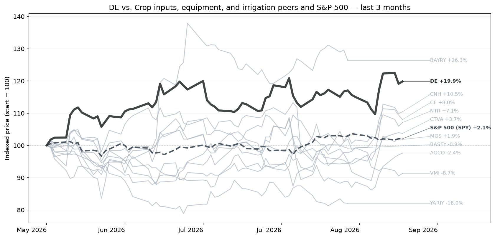

#### Earnings Call Summary

John Deere delivered strong Q3 2026 results, with net sales and revenues up 5% year-over-year to $12.608B, and equipment operations net sales up 6% to $10.999B. Net income reached $1.379B, or $5.10 per diluted share, comfortably beating the estimated EPS of $4.679. Equipment operations achieved a 14.4% operating margin.

#### At a Glance

- **Deere Tops Q3 Financial Estimates:** Deere &amp; Company reported an adjusted EPS of $5.10, comfortably beating Wall Street expectations of $4.679, while reported revenue reached $10.999 billion to surpass the estimated $10.734 billion.
- **Segment Divergence Drives KPI Resilience:** Operating performance was driven by a robust 18% net sales increase in Construction &amp; Forestry and a 12% gain in Small Ag &amp; Turf, which successfully offset a 6% revenue decline in the Production &amp; Precision Ag segment.
- **Full Year Income Outlook Raised:** Management narrowed and raised its fiscal 2026 net income guidance to a range of $4.75 billion to $5.00 billion, confidently establishing 2026 as the structural bottom of the current agricultural equipment cycle.
- **Market Responds with Upward Momentum:** Following the stronger-than-expected third-quarter results and updated full-year forecast, Deere&#x27;s shares jumped over 7% during trading on Thursday.
- **Tariff Costs Face Future Headwinds:** The company recorded a beneficial $110 million in tariff recoveries during the quarter, but projects a higher net run rate of direct tariff expenses near $1 billion heading into fiscal 2027.

#### Key Moments from the Call

- **10m — Fiscal 2026 Guidance Raised on Execution:** Deere raised its full-year 2026 net income outlook to $4.75B-$5.00B and equipment cash flows to $5.0B-$5.5B. Strong factory output, disciplined execution, and robust Q4 order books across all segments gave management the confidence to narrow and lift guidance despite dynamic, challenging agricultural end markets.
- **21m — EOP Signals 2026 as Cycle Bottom:** Model year 2027 Early Order Programs (EOP) for planters and sprayers in North America are up mid-single digits year-over-year. Management believes this encourages the view that 2026 represents the bottom of the agricultural equipment cycle, backed by normalized new/used inventory spreads and healthy dealer channel inventory.
- **25m — Precision Ag Technology Adoption Doubles:** Despite a compressed farm economy, technology adoption continues to accelerate. Factory installation trends suggest See & Spray adoption will nearly double, making its way onto 1/3 of North American sprayer orders. Advanced planter technologies like ExactRate and FurrowVision are appearing on over 40% of model year 2027 orders.
- **33m — Tariff Costs Set to Shift in 2027:** Deere lowered its 2026 direct tariff expense expectation to $1.1B (down from $1.2B) due to Section 232 adjustments. However, after factoring in $382M of 2026 refunds that will not recur, net tariff exposure will rise from ~$750M in 2026 to ~$1.0B in 2027, creating a minor headwind.

## Company Overviews

<h3 id="company-ctva">Corteva (CTVA)</h3>

*Crop inputs, equipment, and irrigation · $52.4B · 3m +3.7% · 12m +10.5% · 24m +49.2%*

[Google Finance](https://www.google.com/finance/quote/CTVA:NYSE?tab=earnings&hl=en)

Largest U.S. corn-seed franchise (Pioneer) and a primary input cost for Corn Belt acres.

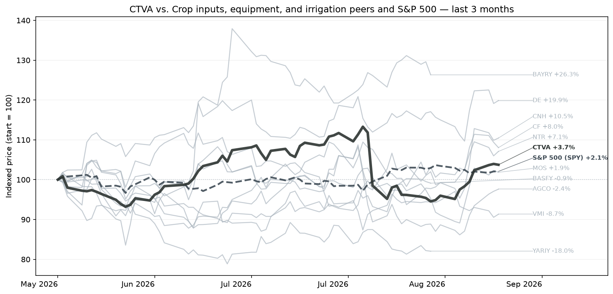

Corteva is an agricultural inputs pure play that was formed in 2019 when it was spun off from DowDuPont. The company is a leader in the development of new seed and crop protection products. Seeds generate the majority of profits with the remainder coming from crop protection products. Corteva plans to spin off its seeds business in late 2026. The seeds business will be named Vylor, while the crop protection business will retain the Corteva name and be a pure-play crop protection company following the divestiture. Corteva operates globally, but around half of revenue comes from North America.

<h3 id="company-bayry">Bayer (BAYRY)</h3>

*Crop inputs, equipment, and irrigation · n/a · 3m +26.3% · 12m +69.2% · 24m +80.4%*

[Google Finance](https://www.google.com/finance/quote/BAYRY:NYSE?tab=earnings&hl=en)

Dekalb and former Monsanto corn-seed brands; together with Corteva dominates U.S. corn seed.

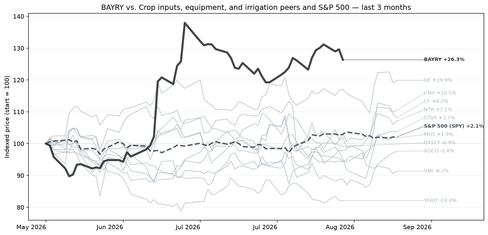

BAYER AG S/ADR

<h3 id="company-basfy">BASF (BASFY)</h3>

*Crop inputs, equipment, and irrigation · n/a · 3m -0.9% · 12m +9.7% · 24m +16.5%*

[Google Finance](https://www.google.com/finance/quote/BASFY:NYSE?tab=earnings&hl=en)

Crop-protection chemistry used on U.S. corn acres.

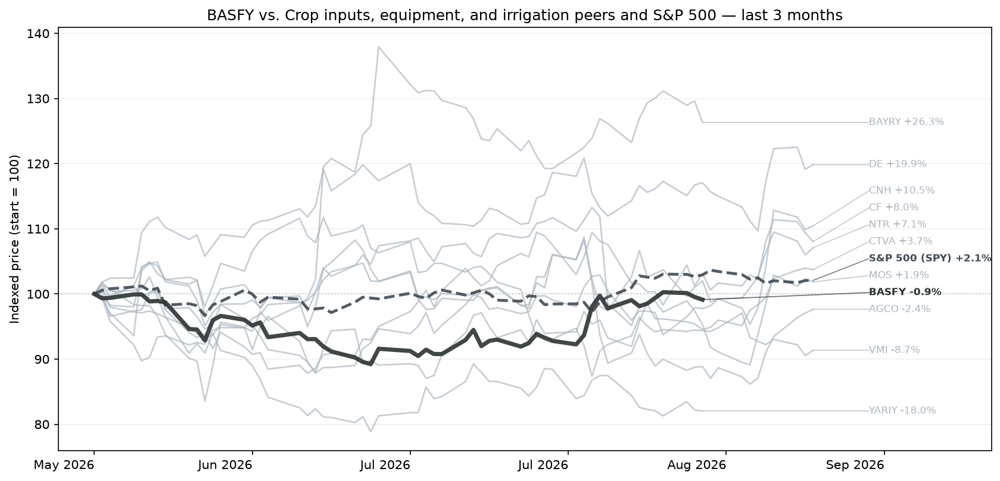

BASF SE S/ADR

<h3 id="company-ntr">Nutrien (NTR)</h3>

*Crop inputs, equipment, and irrigation · $33.6B · 3m +7.1% · 12m +26.5% · 24m +52.0%*

[Google Finance](https://www.google.com/finance/quote/NTR:NYSE?tab=earnings&hl=en)

Largest North American agricultural retailer and a major potash and nitrogen producer.

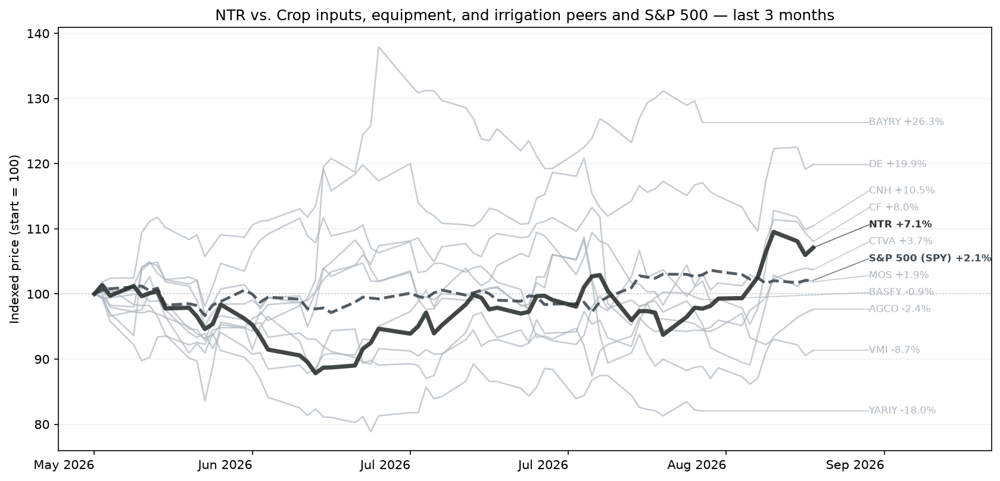

Created in 2018 as a result of the merger between PotashCorp and Agrium, Nutrien is the world's largest fertilizer producer by capacity. Nutrien produces the three main crop nutrients—nitrogen, potash, and phosphate—although its main focus is potash, where it is the global leader in installed capacity with a roughly 20% market share. The company is also the largest agricultural retailer in North America and Australia, selling fertilizers, crop chemicals, seeds, and services directly to farm customers through its brick-and-mortar stores and online platforms.

<h3 id="company-cf">CF Industries (CF)</h3>

*Crop inputs, equipment, and irrigation · $18.0B · 3m +8.0% · 12m +45.6% · 24m +54.0%*

[Google Finance](https://www.google.com/finance/quote/CF:NYSE?tab=earnings&hl=en)

Nitrogen fertilizer producer; corn is the crop that most moves UAN and urea demand.

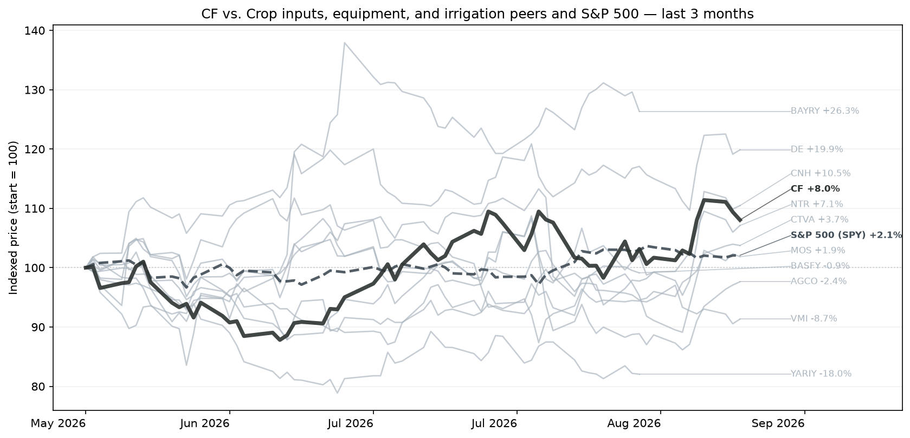

CF Industries is a leading producer and distributor of nitrogen, which is primarily used in fertilizers. The company operates nitrogen manufacturing plants primarily in North America. CF also produces nitrogen in the United Kingdom and holds a joint venture interest in a nitrogen production facility in Trinidad and Tobago. CF makes nitrogen primarily using low-cost US natural gas as its feedstock, making the company one of the lowest-cost nitrogen producers globally. It is also investing in carbon-free blue and green ammonia, which can be used as an alternative fuel to hydrogen or as a means to transport hydrogen.

<h3 id="company-yariy">Yara International (YARIY)</h3>

*Crop inputs, equipment, and irrigation · n/a · 3m -18.0% · 12m +21.2% · 24m +50.9%*

[Google Finance](https://www.google.com/finance/quote/YARIY:NYSE?tab=earnings&hl=en)

Global nitrogen producer that sets the international urea and ammonia reference.

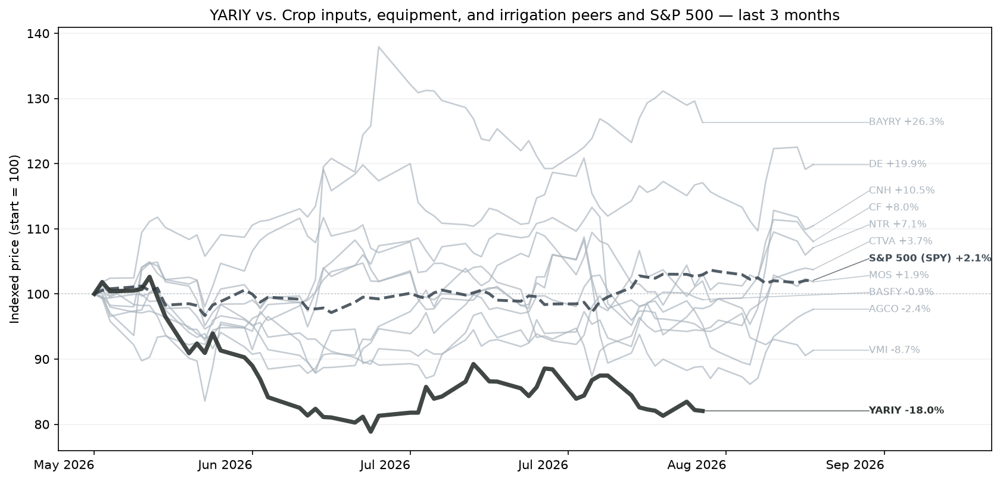

YARA INTL ASA S/ADR

<h3 id="company-mos">Mosaic (MOS)</h3>

*Crop inputs, equipment, and irrigation · $7.1B · 3m +1.9% · 12m -27.9% · 24m -16.4%*

[Google Finance](https://www.google.com/finance/quote/MOS:NYSE?tab=earnings&hl=en)

Phosphate and potash producer that completes corn production budgets.

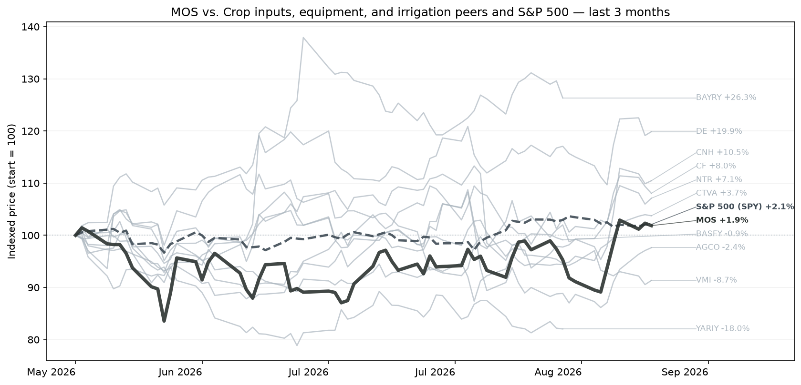

Mosaic is one of the largest phosphate and potash producers in the world. The company's assets include phosphate rock mines in the US and potash mines in Canada. Mosaic also runs a large fertilizer distribution operation in Brazil through its Mosaic Fertilizantes business.

<h3 id="company-de">Deere (DE)</h3>

*Crop inputs, equipment, and irrigation · $156.7B · 3m +19.9% · 12m +28.7% · 24m +68.8%*

[Google Finance](https://www.google.com/finance/quote/DE:NYSE?tab=earnings&hl=en)

Dominant North American farm-equipment maker for corn planting, harvest, and grain handling.

Deere is the world's leading manufacturer of agricultural equipment and a major producer of construction machinery. The company is divided into four reporting segments: production & precision agriculture, or PPA, small agriculture & turf, or SAT, construction & forestry, or CF, and financial services, or FS, its captive finance subsidiary. The core PPA business is the largest contributor to sales and profits by far. Geographically, Deere sales are 60% US/Canada, 17% Europe, 14% Latin America, and 9% rest of the world. Deere goes to market through a robust dealer network that includes over 2,000 dealer locations in North America with reach into over 100 countries. John Deere Financial provides retail financing for machinery to its customers and wholesale financing for dealers.

<h3 id="company-cnh">CNH Industrial (CNH)</h3>

*Crop inputs, equipment, and irrigation · $16.5B · 3m +10.5% · 12m -3.7% · 24m +14.6%*

[Google Finance](https://www.google.com/finance/quote/CNH:NYSE?tab=earnings&hl=en)

Case IH and New Holland farm equipment serving corn growers.

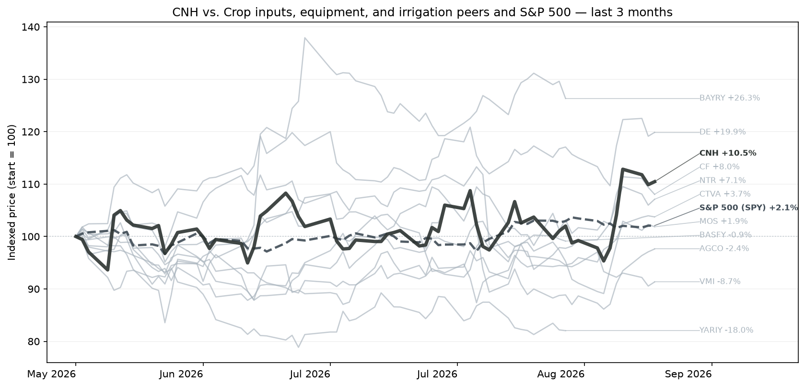

CNH Industrial is the world's second largest manufacturer of agricultural machinery (82% of industrial net sales) as well as a major player in construction equipment (18% of industrial net sales). Its Case and New Holland brands have served farmers for generations. Geographically, agricultural sales are 40% in North America, 32% in Europe, the Middle East, and Africa, 18% in South America, and 10% in Asia-Pacific. CNH's products are available through a robust independent dealer network, which includes over 2,600 dealer and distribution locations and reach into 164 countries. The construction business leverages over 400 dealers. The company's captive finance arm provides retail financing to its customers and wholesale financing to dealers to maintain inventory, thereby supporting sales.

<h3 id="company-agco">AGCO (AGCO)</h3>

*Crop inputs, equipment, and irrigation · $7.0B · 3m -2.4% · 12m -2.0% · 24m +24.1%*

[Google Finance](https://www.google.com/finance/quote/AGCO:NYSE?tab=earnings&hl=en)

Fendt, Massey Ferguson, and Challenger farm equipment with Corn Belt exposure.

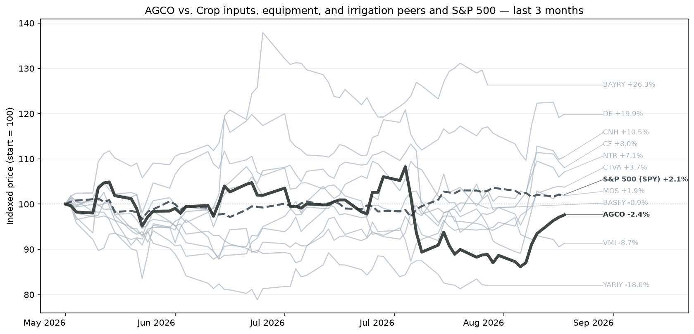

Agco is a global manufacturer of agricultural equipment. Its main machine brands are Fendt, Massey Ferguson, and Valtra; its initiatives in precision agriculture have been organized under the PTx umbrella following a series of acquisitions. While a global business, Agco's sales skew heavily toward Europe/Middle East, representing 50%-60% of sales and even more of operating profits. The company is trying to increase its exposure to the larger North and South American markets. Its products are available through a global dealer network, which includes over 3,000 dealers and distribution locations and reaches into over 140 countries. Additionally, Agco offers retail and wholesale financing to customers through its partnership with Rabobank of the Netherlands, having exited their JV in 2026.

<h3 id="company-vmi">Valmont Industries (VMI)</h3>

*Crop inputs, equipment, and irrigation · $9.3B · 3m -8.7% · 12m +27.4% · 24m +66.8%*

[Google Finance](https://www.google.com/finance/quote/VMI:NYSE?tab=earnings&hl=en)

Center-pivot irrigation (Valley) used on irrigated High Plains corn.

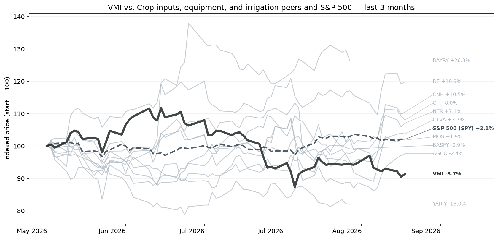

Valmont Industries Inc, along with its subsidiaries, operates as a manufacturer of products and services for infrastructure and agriculture markets. Its reportable segments are Infrastructure and Agriculture. The company generates maximum revenue from the Infrastructure segment, which includes the manufacturing and distribution of products and solutions to serve the infrastructure markets of utility, solar, lighting, transportation, and telecommunications, along with coatings services to protect metal products. The Agriculture segment provides irrigation equipment components, including aftermarket parts and tubular products, and technology solutions for precision agriculture. Geographically, it derives key revenue from the United States, followed by Australia, Brazil, and other regions.

<h3 id="company-adm">Archer Daniels Midland (ADM)</h3>

*Grain origination and agribusiness, U.S. ethanol and process technology, Wet milling, ingredients, and co-products · $38.9B · 3m +0.7% · 12m +27.7% · 24m +32.2%*

[Google Finance](https://www.google.com/finance/quote/ADM:NYSE?tab=earnings&hl=en)

Global grain trader, top U.S. ethanol producer, and major corn wet miller.

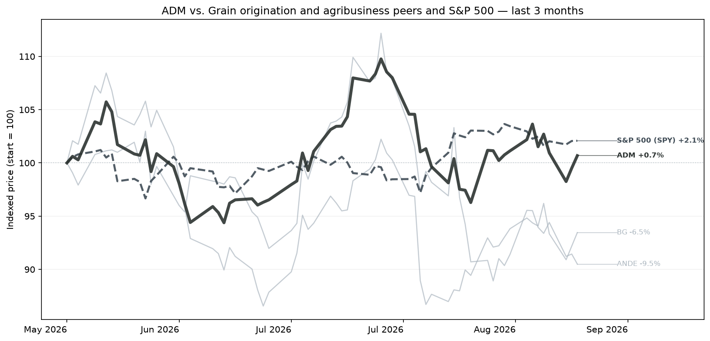

Archer-Daniels-Midland is a major processor of oilseeds, corn, wheat, and other agricultural commodities. The company is also one of the largest grain merchandisers through its extensive network of logistical assets to store and transport crops around the globe. ADM also runs a nutrition business that focuses on both human and animal ingredients and is a large producer of corn-based sweeteners, starches, and ethanol.

<h3 id="company-bg">Bunge (BG)</h3>

*Grain origination and agribusiness · $21.9B · 3m -6.5% · 12m +33.8% · 24m +12.9%*

[Google Finance](https://www.google.com/finance/quote/BG:NYSE?tab=earnings&hl=en)

Global grain and oilseed merchant after the Viterra combination; competitor for corn origination.

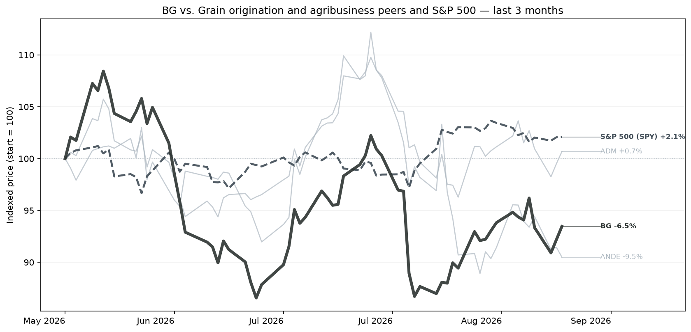

Bunge Global SA is an agribusiness solutions company, connecting farmers to consumers and delivering essential food, feed and fuel to the globe. The company segments include Soybean Processing and Refining; Softseed Processing and Refining; Other Oilseeds Processing and Refining; Grain Merchandising and Milling; and Corporate and Other. It generates maximum revenue from the Soybean Processing and Refining segment, which includes integrated business principally involved in the purchase, storage, transportation, processing, distribution, refining, marketing, and sale of soybeans and soybean related products, as well as biodiesel and fertilizer production and distribution. Geographically, the company operates in United States, Switzerland, Netherlands, and Rest of the World.

<h3 id="company-ande">The Andersons (ANDE)</h3>

*Grain origination and agribusiness, U.S. ethanol and process technology · $2.3B · 3m -9.5% · 12m +60.3% · 24m +30.2%*

[Google Finance](https://www.google.com/finance/quote/ANDE:NASDAQ?tab=earnings&hl=en)

Grain elevators plus four wholly owned ethanol plants totaling about 500 million gallons a year.

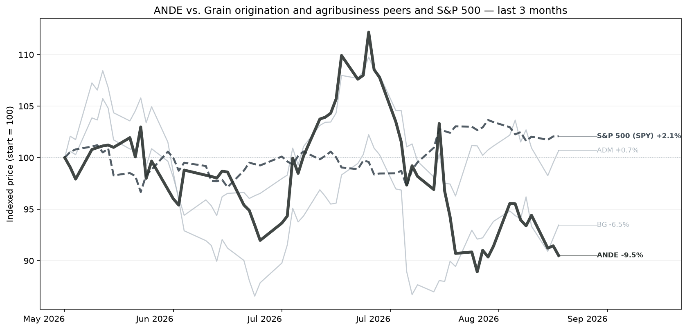

Andersons Inc is an agriculture and renewable fuels company. Its operations are classified into two reportable business segments: Agribusiness, which generates maximum revenue, and Renewables. The Agribusiness segment includes merchandising and managing logistics across various commodities, as well as being a manufacturer, distributor, and retailer of agricultural and related plant nutrients. The segment specializes in the movement of physical commodities such as whole grains, grain products, feed ingredients, and domestic fuel products, among other agricultural commodities. The Renewables segment mainly produces, purchases, and sells ethanol and co-products. Geographically, the company generates maximum revenue from the United States, followed by Canada, Mexico, and other markets.

<h3 id="company-vlo">Valero Energy (VLO)</h3>

*U.S. ethanol and process technology, Fuel blending, refining, and retail · $99.7B · 3m +44.8% · 12m +130.8% · 24m +147.0%*

[Google Finance](https://www.google.com/finance/quote/VLO:NYSE?tab=earnings&hl=en)

World's second-largest corn-ethanol producer with a distinct Ethanol segment and a major blender.

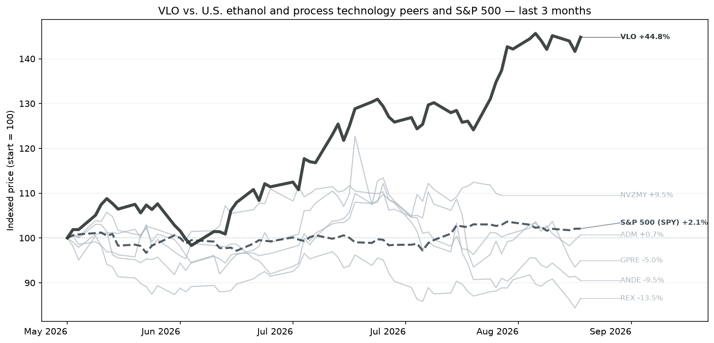

Valero Energy is one of the largest independent refiners in the United States. It operates 15 refineries, with a total throughput capacity of 3.2 million barrels a day in the US, Canada, and the United Kingdom. Valero also owns 12 ethanol plants with capacity of 1.6 billion gallons a year and holds a 50% stake in Diamond Green Diesel, which can produce 1.2 billion gallons per year of renewable diesel.

<h3 id="company-gpre">Green Plains (GPRE)</h3>

*U.S. ethanol and process technology · $1.1B · 3m -5.0% · 12m +49.5% · 24m +7.1%*

[Google Finance](https://www.google.com/finance/quote/GPRE:NASDAQ?tab=earnings&hl=en)

Largest U.S. ethanol pure play, with high-protein feed, corn oil, and Nebraska carbon-capture work.

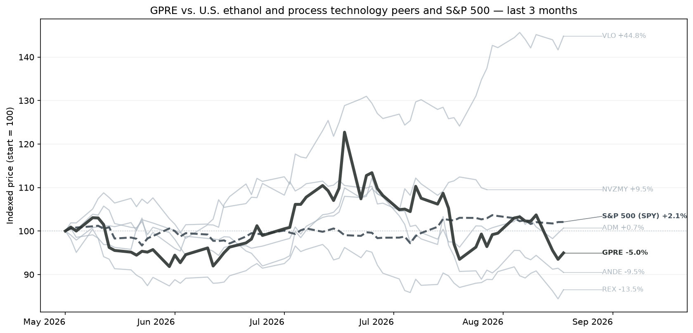

Green Plains Inc manufactures and sells ethanol and ethanol byproducts in two segments based on function. The ethanol production segment, which generates the majority of revenue, includes the production of ethanol, distillers grains, Ultra-High Protein and renewable corn oil. The agribusiness and energy services segment includes grain handling and storage, commodity marketing and merchant trading for company-produced and third-party ethanol, distillers grains, Ultra-High Protein, renewable corn oil, natural gas and other commodities.

<h3 id="company-rex">REX American Resources (REX)</h3>

*U.S. ethanol and process technology · $1.4B · 3m -13.5% · 12m +39.8% · 24m +89.7%*

[Google Finance](https://www.google.com/finance/quote/REX:NYSE?tab=earnings&hl=en)

Holding company with interests in six Corn Belt ethanol plants; cleanest public crush-margin equity.

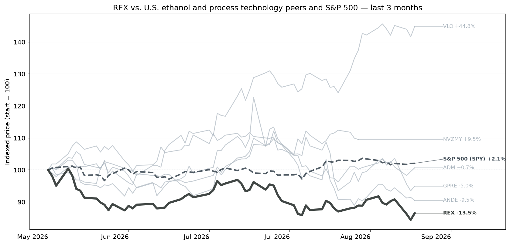

REX American Resources Corp operates as a holding company that engages in investments in alternative energy and ethanol production entities. Its operating segments include Ethanol and By-Products. Its products include Ethanol, dried distillers grains, modified distillers grains, Distillers corn oil, Modified distillers grains, and Other.

<h3 id="company-nvzmy">Novonesis (NVZMY)</h3>

*U.S. ethanol and process technology · n/a · 3m +9.5% · 12m +1.7% · 24m -5.6%*

[Google Finance](https://www.google.com/finance/quote/NVZMY:NYSE?tab=earnings&hl=en)

Dominant supplier of enzymes used in dry-mill ethanol fermentation.

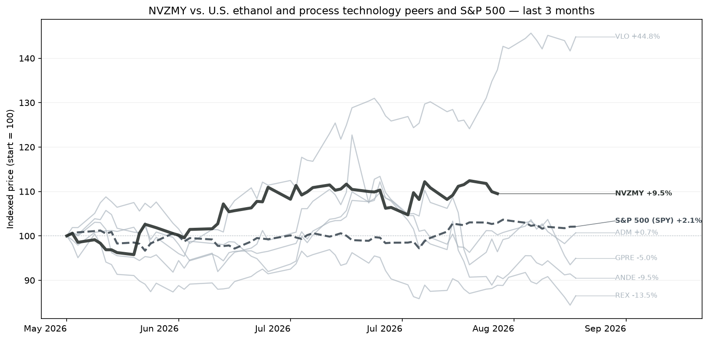

NOVONESIS B UNSP/ADR

<h3 id="company-ingr">Ingredion (INGR)</h3>

*Wet milling, ingredients, and co-products · $6.8B · 3m +0.8% · 12m -19.0% · 24m -21.0%*

[Google Finance](https://www.google.com/finance/quote/INGR:NYSE?tab=earnings&hl=en)

Major corn wet miller producing sweeteners, starches, and specialty ingredients.

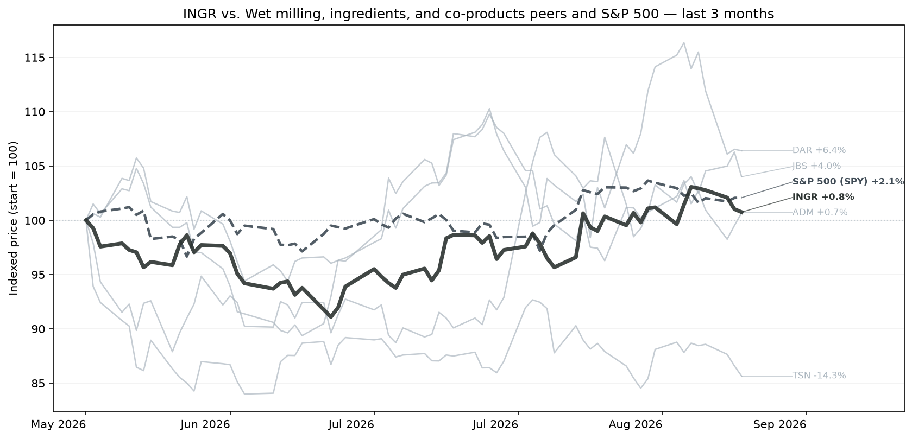

Ingredion is an ingredients provider for the food, beverage, brewing, and animal nutrition industries. The company processes corn, tapioca, potatoes, stevia, grains, fruits, gums, and vegetables into value-added ingredients. The company sells specialty ingredients that include starch-based texturizers and natural alternative sweeteners such as stevia. Ingredion also sells commodity ingredients that include sweeteners, such as high-fructose corn syrup, and starches, such as those used for sustainable packaging, as well as plant-based proteins. The company plans to acquire Tate & Lyle in an all-cash deal that should close in 2027.

<h3 id="company-dar">Darling Ingredients (DAR)</h3>

*Wet milling, ingredients, and co-products · $10.6B · 3m +6.4% · 12m +81.5% · 24m +50.7%*

[Google Finance](https://www.google.com/finance/quote/DAR:NYSE?tab=earnings&hl=en)

Rendering and used cooking oil; 50/50 owner of Diamond Green Diesel with Valero.

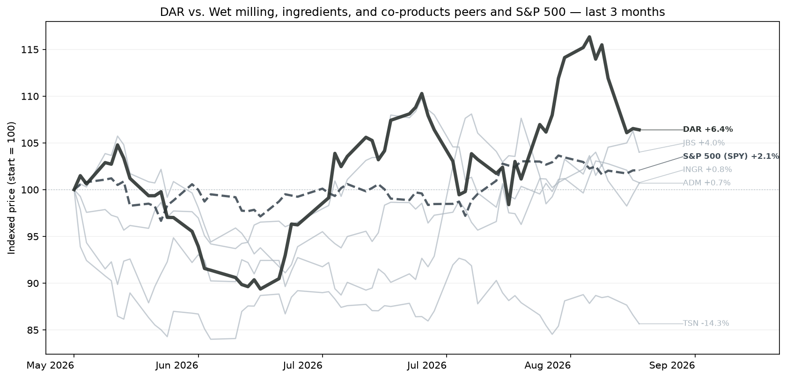

Darling Ingredients Inc is a developer and producer of sustainable natural ingredients from edible and inedible bio-nutrients, creating a wide range of ingredients and customized specialty solutions for customers in the pharmaceutical, food, pet food, animal feed, industrial, fuel, bioenergy and fertilizer industries. It processes by-products from the animal agriculture and food industries into ingredients and products for human nutrition, animal feed, crop inputs, and renewable energy applications. The company operates processing facilities across multiple countries and produces collagen, including gelatin and hydrolyzed collagen, as well as renewable energy products.

<h3 id="company-tsn">Tyson Foods (TSN)</h3>

*Wet milling, ingredients, and co-products · $20.6B · 3m -14.3% · 12m -1.5% · 24m -11.5%*

[Google Finance](https://www.google.com/finance/quote/TSN:NYSE?tab=earnings&hl=en)

Largest U.S. protein company and a primary domestic sink for distillers grains.

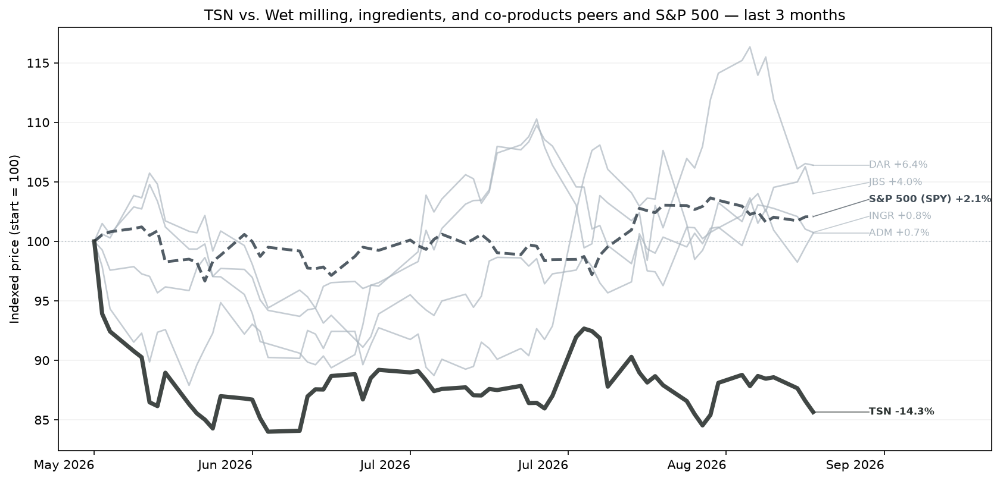

Tyson Foods is a protein-focused food producer, selling raw chicken, beef, pork, and prepared foods. Chicken and beef are its two largest segments, composing about 40% and 30% of sales, respectively. Prepared foods constituted 18% of fiscal 2025 sales and include brands like Tyson, Jimmy Dean, Hillshire Farm, Ball Park, and Sara Lee. However, most of these are in product categories rife with competition where Tyson does not have a massive market share lead. Tyson sells some products overseas, but the international segment accounts for just 4% of total revenue. The company is an active acquirer, with more recent years' purchases focused on international and food-service markets.

<h3 id="company-jbs">JBS (JBS)</h3>

*Wet milling, ingredients, and co-products · $45.2B · 3m +4.0% · 12m -16.8% · 24m n/a*

[Google Finance](https://www.google.com/finance/quote/JBS:NYSE?tab=earnings&hl=en)

World's largest protein company and a major DDGS buyer in the U.S. and Brazil.

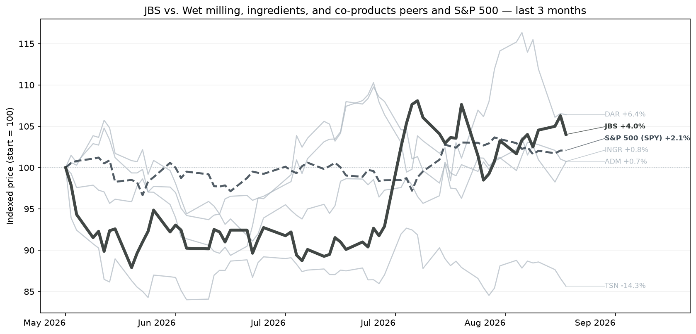

JBS NV is a protein food company, selling protein products, which include fresh and frozen cuts of beef, pork, lamb, fish, whole chickens, and chicken parts, to retailers, and foodservice companies. The food products are marketed under different brands such as Swift, Just Bare, Pilgrim's Pride, Sunnyvalley, Reserva Friboi, Great Southern, etc., globally. The company's reportable segments are Beef North America, which generates maximum revenue, Brazil, Seara, Pork USA, Pilgrim's Pride, Australia, and Others. Geographically, it derives majority of its revenue from United States of America.

<h3 id="company-mpc">Marathon Petroleum (MPC)</h3>

*Fuel blending, refining, and retail · $101.3B · 3m +46.6% · 12m +103.6% · 24m +113.2%*

[Google Finance](https://www.google.com/finance/quote/MPC:NYSE?tab=earnings&hl=en)

Largest U.S. independent refiner and a major Midwest ethanol blender.

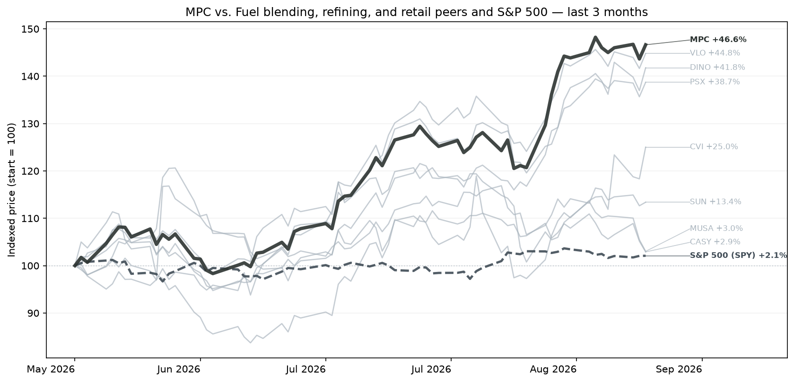

Marathon Petroleum is a leading integrated downstream and midstream energy company that operates 13 refineries in the Gulf Coast, Mid-Continent, and West Coast regions of the United States with an aggregate crude oil refining capacity of 3.0 million barrels per day. The company is one of the largest producers of renewable diesel in the US; its Dickinson, North Dakota facility has the capacity to produce 184 million gallons per year, and its Martinez, California, joint venture facility (a 50/50 partnership with Neste) reached its full capacity of 730 million gallons per year in late 2024. Marathon also owns the general partner and approximately 64% of MPLX LP, a large-cap master limited partnership that owns and operates midstream energy infrastructure and logistics assets.

<h3 id="company-psx">Phillips 66 (PSX)</h3>

*Fuel blending, refining, and retail · $96.7B · 3m +38.7% · 12m +82.6% · 24m +80.3%*

[Google Finance](https://www.google.com/finance/quote/PSX:NYSE?tab=earnings&hl=en)

Large blender and marketer with West Coast renewable-diesel capacity.

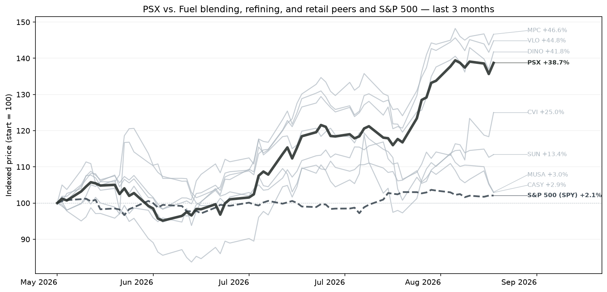

Phillips 66 is an independent refiner that owns or holds interest in 10 refineries with a total crude throughput capacity of 2.0 million barrels per day, or mmb/d, at the end of 2025. The midstream segment comprises extensive transportation and NGL processing assets. It includes 70,000 miles of crude oil, refined petroleum product, NGL and natural gas pipeline systems, and a comprehensive set of refined petroleum product, NGL and crude oil terminals, gathering and processing plants and fractionation facilities and various other storage and loading facilities. Its CPChem chemical joint venture operates facilities primarily in the United States and the Middle East and produces olefins and polyolefins.

<h3 id="company-dino">HF Sinclair (DINO)</h3>

*Fuel blending, refining, and retail · $16.8B · 3m +41.8% · 12m +92.5% · 24m +104.1%*

[Google Finance](https://www.google.com/finance/quote/DINO:NYSE?tab=earnings&hl=en)

Independent Mid-Continent and Rockies refiner with renewable diesel and RFS blending obligations.

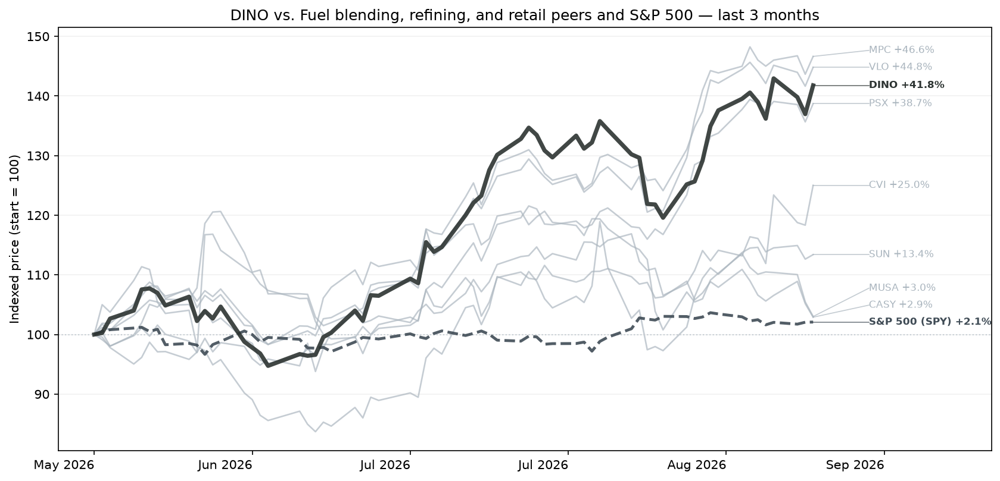

HF Sinclair is an integrated petroleum refiner that owns and operates seven refineries serving the Rockies, midcontinent, Southwest, and Pacific Northwest, with a total crude oil throughput capacity of 678,000 barrels per day. It can produce 380 million gallons of renewable diesel annually. It operates a marketing business with over 350 distributors and 1,700 branded wholesale sites across 30 states. It also owns and operates 4,500 miles of petroleum product pipelines and terminals principally in the Southwestern United States.

<h3 id="company-cvi">CVR Energy (CVI)</h3>

*Fuel blending, refining, and retail · $3.7B · 3m +25.0% · 12m +35.3% · 24m +64.3%*

[Google Finance](https://www.google.com/finance/quote/CVI:NYSE?tab=earnings&hl=en)

Coffeyville, Kansas refiner in the corn complex with renewable diesel and a nitrogen affiliate.

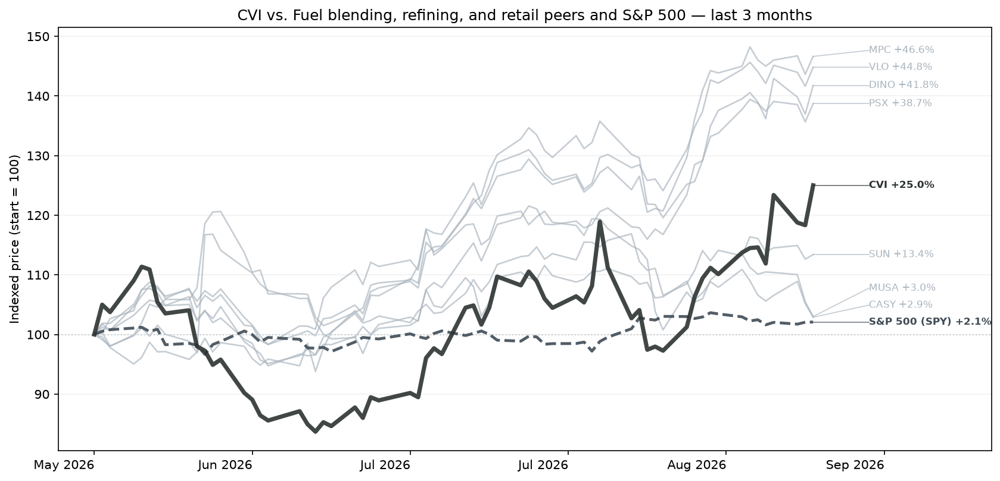

CVR Energy Inc is a holding company that engages in petroleum refining and nitrogen fertilizer manufacturing through its subsidiaries. Subsidiaries include several complex, full-coking crude oil refineries, along with a crude oil gathering system, pipelines, storage tanks, and marketing and supply. The company's refineries can process blends of a variety of crude oil ranging from heavy sour to light sweet crude oil. Crude oil for CVR's refineries is supplied through its wholly-owned gathering system and pipeline. From its refineries, CVR supplies products through tanker trucks directly to customers located in close geographic proximity and customers at throughput terminals. The company's customers include retailers, railroads, and farm cooperatives.

<h3 id="company-sun">Sunoco LP (SUN)</h3>

*Fuel blending, refining, and retail · $14.5B · 3m +13.4% · 12m +44.8% · 24m +39.7%*

[Google Finance](https://www.google.com/finance/quote/SUN:NYSE?tab=earnings&hl=en)

Fuel distributor and terminal operator that moves finished gasoline and ethanol.

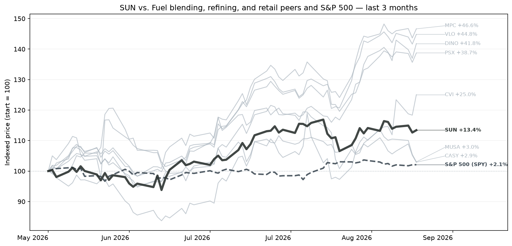

Sunoco LP is engaged in the distribution of motor fuels to independent dealers, distributors, and other commercial customers as well as the distribution of motor fuels to end-use customers at retail sites operated by commission agents. It is a growth-oriented master limited partnership (MLP) that operates as a wholesale and retail fuel distributor in the United States. The firm operates through the Fuel Distribution; Pipeline Systems; Refinery and Terminals segments. It generates the majority of its revenue from the Fuel Distribution segment. It distributes motor fuel to convenience stores, dealers, and commercial customers in various states.

<h3 id="company-casy">Casey&#x27;s General Stores (CASY)</h3>

*Fuel blending, refining, and retail · $30.9B · 3m +2.9% · 12m +62.0% · 24m +116.4%*

[Google Finance](https://www.google.com/finance/quote/CASY:NASDAQ?tab=earnings&hl=en)

Corn Belt convenience-store chain with high E10/E15/E85 exposure.

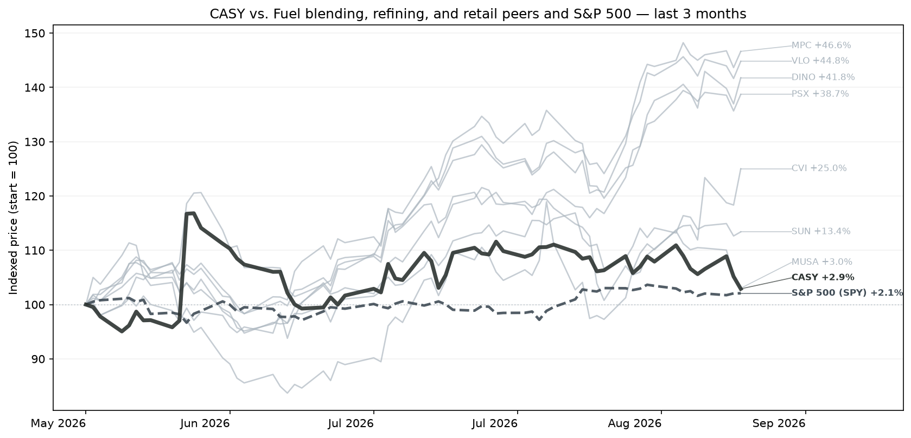

Casey's General Stores Inc, along with its subsidiaries, operates convenience stores mainly under the names Casey's, GoodStop (by Casey's), and Casey's General Store throughout various states in the USA, approximately half of which are located in Iowa, Missouri, and Illinois. These stores offer a broad selection of food items (which includes prepared foods such as regular and breakfast pizza, donuts, hot breakfast items, and hot and cold sandwiches), beverages, tobacco and nicotine products, groceries, health and beauty aids, automotive products, and other non-food items. The majority of the company's revenue is mainly derived from the retail sale of fuel and the products offered inside its stores.

<h3 id="company-musa">Murphy USA (MUSA)</h3>

*Fuel blending, refining, and retail · $10.4B · 3m +3.0% · 12m +40.5% · 24m +2.7%*

[Google Finance](https://www.google.com/finance/quote/MUSA:NYSE?tab=earnings&hl=en)

High-volume fuel retailer and national ethanol blender.

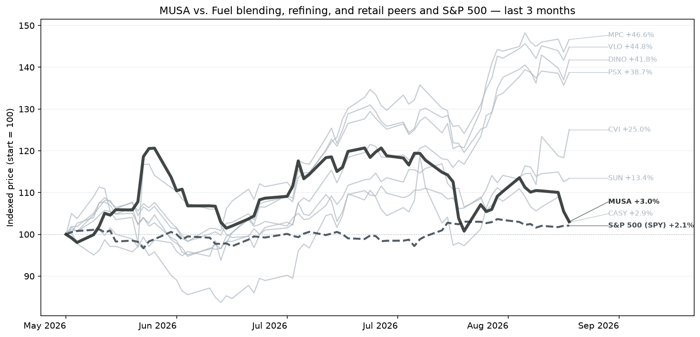

Murphy USA Inc is mainly engaged in the marketing of retail motor fuel products and convenience merchandise through a network of several retail stores in the Southwest, Southeast, Midwest, and Northeast United States. The majority of Murphy USA's stores are located in proximity to Walmart Supercenters, but it also operates standalone stores that market gasoline and other products under the Murphy USA, Murphy Express, and QuickChek brands. In addition, the company also markets fuel to unbranded wholesale customers through a mixture of company-owned and third-party product distribution terminals and pipeline positions. The firm generates maximum revenue through retail sales of petroleum products, and the rest from merchandise sales and wholesale of petroleum products.

<h3 id="company-ntoiy">Neste (NTOIY)</h3>

*Advanced biofuels and SAF · n/a · 3m +7.3% · 12m +82.9% · 24m +46.5%*

[Google Finance](https://www.google.com/finance/quote/NTOIY:NYSE?tab=earnings&hl=en)

Largest global producer of renewable diesel and SAF; sets the price umbrella for corn oil.

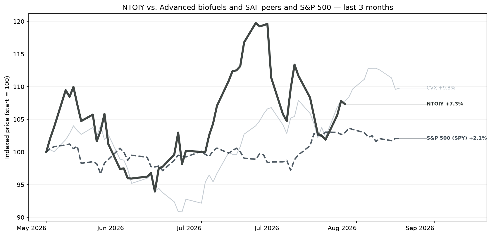

NESTE OYJ UNSP/ADR

<h3 id="company-cvx">Chevron (CVX)</h3>

*Advanced biofuels and SAF · $403.6B · 3m +9.8% · 12m +25.7% · 24m +36.2%*

[Google Finance](https://www.google.com/finance/quote/CVX:NYSE?tab=earnings&hl=en)

Owner of Renewable Energy Group biodiesel and renewable-diesel plants that take corn oil at the margin.

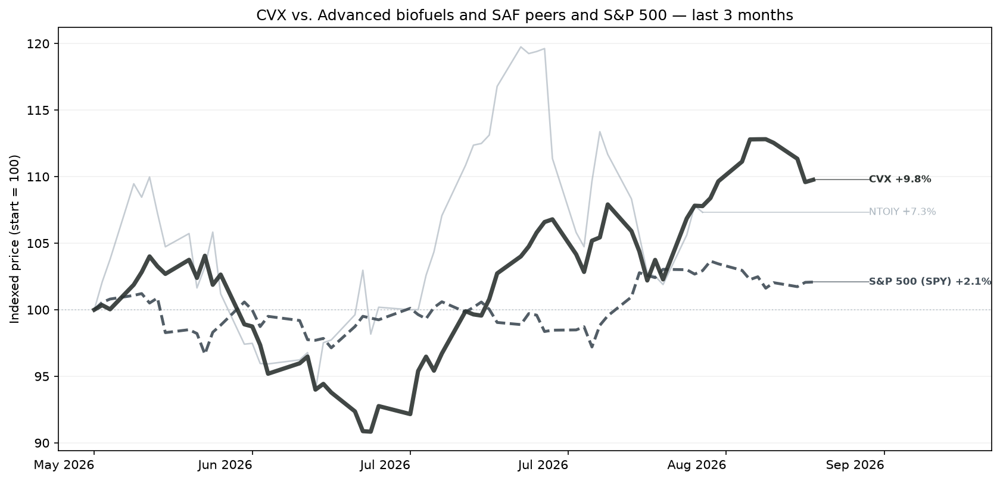

Chevron is an integrated energy company with exploration, production, and refining operations worldwide. It is the second-largest oil company in the United States with 2025 worldwide net oil-equivalent production of 3.7 million barrels per day, including 8.5 billion cubic feet per day of natural gas and 2.3 million barrels of liquids per day. Production takes place in North America, South America, Europe, Africa, Asia, and Australia. The company's refining networks arelocated in the United States and Asia, with a total worldwide refining capacity of 1.8 million barrels of oil a day at year-end 2025. Net proved reserves at year-end 2025 stood at 10.6 billion barrels of oil equivalent, consisting of 5.7 billion barrels of liquids and 29.2 trillion cubic feet of natural gas.

<h3 id="company-csan">Cosan (CSAN)</h3>

*International ethanol · $2.5B · 3m -11.3% · 12m -31.2% · 24m -72.1%*

[Google Finance](https://www.google.com/finance/quote/CSAN:NYSE?tab=earnings&hl=en)

Brazilian holding company and the liquid U.S.-listed proxy for sugarcane ethanol via Raizen.

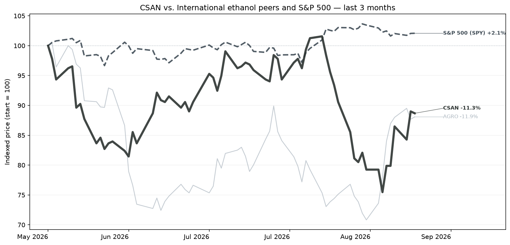

Cosan SA engages in several services throughout the energy and logistics sectors. Its reportable segments are Raizen, Compass, Moove, Rumo, and Radar. It generates the majority of its revenue from Raizen which operates in the production, commercialization, origination, and trading of ethanol, bioenergy, resale, and trading of electricity, renewable sources, marketing, origination, and trading of sugar and fuels, and lubricant.

<h3 id="company-agro">Adecoagro (AGRO)</h3>

*International ethanol · $1.5B · 3m -11.9% · 12m +31.6% · 24m +2.4%*

[Google Finance](https://www.google.com/finance/quote/AGRO:NYSE?tab=earnings&hl=en)

South American farmland and sugar/ethanol producer with U.S.-listed equity.

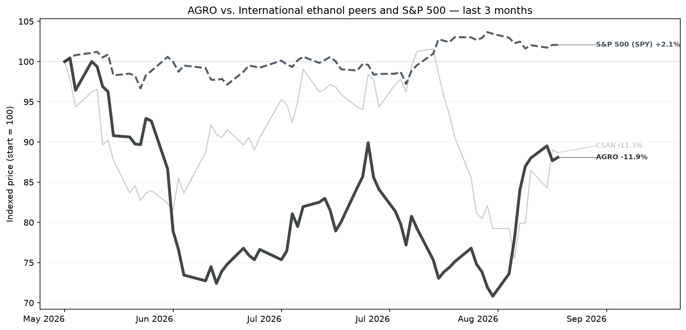

Adecoagro SA is a Luxembourg-based agricultural company. It is involved in a wide range of businesses, including farming crops and other agricultural products, dairy operations sugar, ethanol, energy production, and land transformation. The group operates in two lines of business, namely, Farming and Sugar, Ethanol and Energy. The Farming is further comprised of three reportable segments: Crops, Rice and Dairy. Sugar, Ethanol and Energy Segment, consists of cultivating sugarcane, which is processed in owned sugar mills, transformed into ethanol, sugar and electricity, in addition to biomethane and then marketed.

<h3 id="company-unp">Union Pacific (UNP)</h3>

*Logistics · $179.3B · 3m +11.2% · 12m +40.6% · 24m +24.1%*

[Google Finance](https://www.google.com/finance/quote/UNP:NYSE?tab=earnings&hl=en)

Primary western Class I for Corn Belt corn, ethanol unit trains, DDGS, and corn oil.

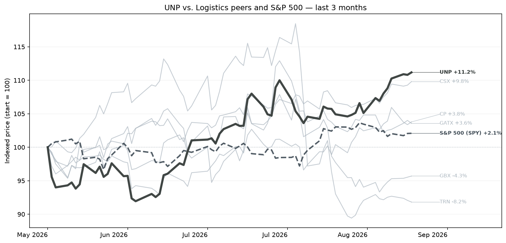

Omaha, Nebraska-based Union Pacific is the largest public railroad in North America. Operating on more than 30,000 miles of track in the western two-thirds of the US, Union Pacific generated $24.5 billion of revenue in 2025 by hauling coal, industrial products, intermodal containers, agricultural goods, chemicals, fertilizers, and automotive goods. Union Pacific owns about one-fourth of Mexican railroad Ferromex and historically derives roughly 10% of its revenue hauling freight to and from Mexico.

<h3 id="company-csx">CSX (CSX)</h3>

*Logistics · $93.9B · 3m +9.8% · 12m +59.1% · 24m +54.1%*

[Google Finance](https://www.google.com/finance/quote/CSX:NASDAQ?tab=earnings&hl=en)

Primary eastern Class I into Northeast and Southeast gasoline markets for ethanol unit trains.

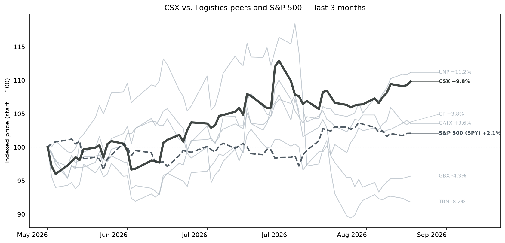

Operating in the Eastern United States, Class I railroad CSX generated revenue of nearly $14 billion in 2025. On its more than 21,000 miles of track, CSX hauls shipments of coal (16% of consolidated revenue), chemicals (17%), intermodal containers (16%), automotive cargo (7%), and a diverse mix of other bulk and industrial merchandise.

<h3 id="company-cp">Canadian Pacific Kansas City (CP)</h3>

*Logistics · $83.0B · 3m +3.8% · 12m +23.2% · 24m +13.9%*

[Google Finance](https://www.google.com/finance/quote/CP:NYSE?tab=earnings&hl=en)

North-south railroad for Midwest corn and ethanol to the Gulf and Mexico.

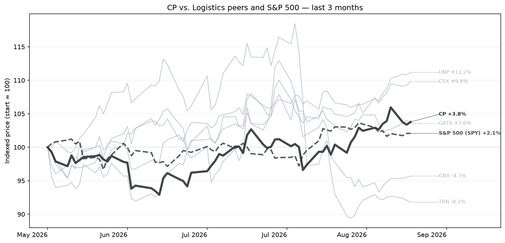

Canadian Pacific Kansas City is a Class I railroad operating on tracks that span most of Canada and into parts of the Midwestern and Northeastern United States. Following the April 2023 Kansas City Southern merger, CPKC operates new single-linehaul services from Canada and the Upper Midwest down through Texas, the Gulf of Mexico, and into Mexico. It also hauls cross-border and intra-Mexico freight via operating concessions on more than 3,000 miles of rail in Mexico. CPKC hauls shipments of grain, intermodal containers, energy products (like crude and frac sand), chemicals, plastics, coal, fertilizer and potash, automotive products, and a diverse mix of other merchandise.

<h3 id="company-gatx">GATX (GATX)</h3>

*Logistics · $6.2B · 3m +3.6% · 12m +7.5% · 24m +27.8%*

[Google Finance](https://www.google.com/finance/quote/GATX:NYSE?tab=earnings&hl=en)

Largest public railcar lessor of ethanol tank cars and grain/DDGS hoppers.

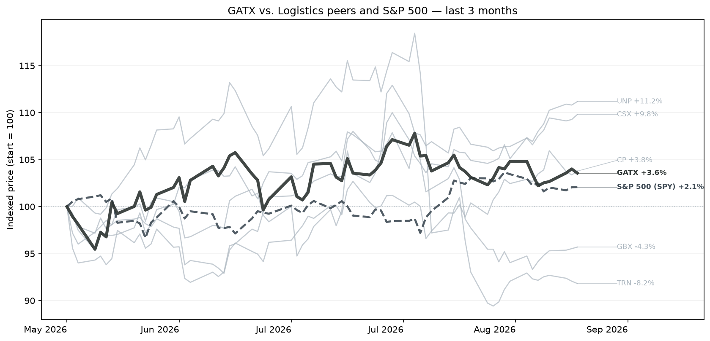

GATX Corp leases transportation assets, including railcars, aircraft spare engines, and tank containers, to customers in North America, Europe, and India. The company's reportable business segments are: Rail North America, Rail International, Engine Leasing, and Other. The majority of its revenue is generated from the Rail North America segment, which is composed of the company's operations in the United States, Canada, and Mexico. This segment mainly provides railcars pursuant to full-service leases under which it maintains the railcars, pays ad valorem taxes and insurance, and provides other ancillary services.

<h3 id="company-trn">Trinity Industries (TRN)</h3>

*Logistics · $2.4B · 3m -8.2% · 12m +2.5% · 24m -8.6%*

[Google Finance](https://www.google.com/finance/quote/TRN:NYSE?tab=earnings&hl=en)

Builds and leases covered hoppers and tank cars used for grain, DDGS, and ethanol.

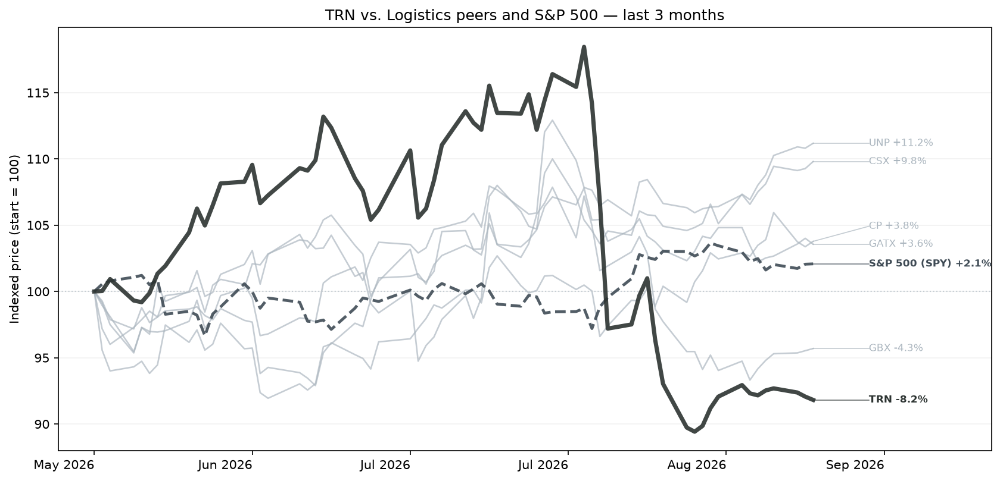

Trinity Industries Inc sells and leases railroad products and railcar maintenance services in North America. The company operates under the name TrinityRail in two main segments: railcar leasing and management services, which owns railcars and provides fleet management and administration services; rail products, which builds, sells, and modifies freight and tank railcars and their components; and all other, which sells highway products such as guardrail and other highway barriers. Customers include railroads, leasing companies, and shipping companies in agriculture, construction, consumer products, energy, and chemicals.

<h3 id="company-gbx">Greenbrier (GBX)</h3>

*Logistics · $1.4B · 3m -4.3% · 12m -2.0% · 24m -2.8%*

[Google Finance](https://www.google.com/finance/quote/GBX:NYSE?tab=earnings&hl=en)

Builds tank cars used for ethanol, renewable fuels, and CO2.

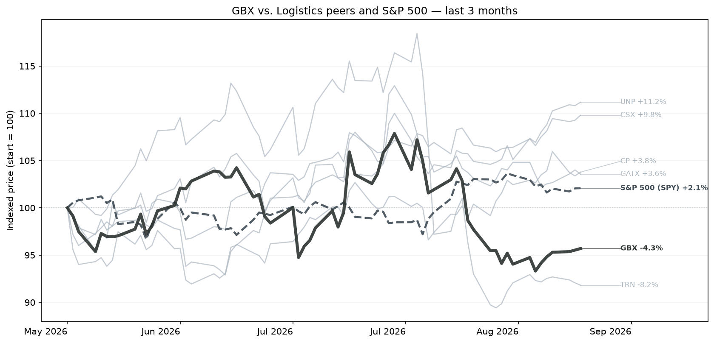

Greenbrier Companies Inc supplies equipment and services to international freight transportation markets, designing and marketing freight railcars in North America, Europe, and Brazil through subsidiaries and joint ventures. It provides railcar wheel services, parts, maintenance, and conversion services in North America. The company owns a lease fleet sourced mainly from its manufacturing operations and offers railcar management, regulatory compliance, and leasing services to railroads and owners. It operates two segments: Manufacturing and Leasing & Fleet Management, with the majority of revenue from Manufacturing. The company operates in the U.S. and internationally, with the majority of revenue from the U.S. market.

