# Weekly Corn and Ethanol Intel Report

<strong>Week of September 3, 2026</strong>Market data through: September 2, 2026Narrative created: September 4, 2026Nearby corn: $5.188/bu (+$0.085 (+1.7%) week)

Weekly review of corn, ethanol, energy, co-product, policy, and related public-company performance for commodities risk managers at U.S. ethanol plants.

## Strategy Narrative

Nearby futures from Yahoo Finance. Nearby corn is the market&#x27;s current perception of yield and demand risk.

<table><thead><tr><th>Contract</th><th>Last</th><th>Week change</th><th>As of</th></tr></thead><tbody><tr><td>Nearby corn</td><td>$5.188/bu</td><td>+$0.085 (+1.7%)</td><td>September 2, 2026</td></tr><tr><td>RBOB gasoline</td><td>$3.104/gal</td><td>-0.280 (-8.3%)</td><td>September 2, 2026</td></tr><tr><td>Henry Hub</td><td>$2.956/MMBtu</td><td>+0.049 (+1.7%)</td><td>September 2, 2026</td></tr></tbody></table>

<nav class="strategy-narrative-links" aria-label="Strategy narrative sections">
<ul>
<li><a href="#strategy-executive-view-1-corn-held-its-risk-premium-as-supply-evidence-diverged">1. Corn held its risk premium as supply evidence diverged</a></li>
<li><a href="#strategy-executive-view-2-epa-finalized-the-exemptions-but-not-their-full-reallocation">2. EPA finalized the exemptions, but not their full reallocation</a></li>
<li><a href="#strategy-executive-view-3-gasoline-futures-weakened-despite-tight-physical-stocks">3. Gasoline futures weakened despite tight physical stocks</a></li>
<li><a href="#strategy-executive-view-4-ethanol-inventories-finally-drew-with-exports-providing-structural-support">4. Ethanol inventories finally drew, with exports providing structural support</a></li>
<li><a href="#strategy-executive-view-5-rex-confirmed-that-physical-crush-and-45z-both-contributed-to-profitability">5. REX confirmed that physical crush and 45Z both contributed to profitability</a></li>
</ul>
</nav>

<h3 id="executive-view">Executive View</h3>

- **Corn-yield risk remained elevated but did not intensify at last week’s pace.** USDA’s controlling August balance sheet still assumes a **180.7-bushel yield and 1.653-billion-bushel 2026/27 carryout**, while Pro Farmer’s field-based estimate remains **173.2 bushels and 15.344 billion bushels**. Corn condition held at 57% good-to-excellent, and a University of Nebraska model supplied a counterweight by indicating near-trend regional yield potential. Nevertheless, nearby corn closed at **$5.188 per bushel, up $0.085, or 1.7%, for the week**—a modest extension, not a reversal, of the crop-tour risk premium.
- **EPA confirmed a large refinery-relief package but deferred the offsetting demand repair.** The agency exempted **1.76 billion 2025 RINs** for 29 refineries. EPA had already incorporated 990 million RINs into its prior projection and said it would propose reallocating the roughly **770-million-RIN difference** into the 2026 and 2027 obligations. The exemption is final; the incremental reallocation is not.
- **The petroleum price umbrella weakened sharply.** Nearby RBOB fell **$0.280 to $3.104 per gallon, down 8.3%**, despite gasoline inventories falling to their lowest level in nearly ten months. High refinery utilization, weaker year-over-year gasoline demand and the early transition to winter-grade gasoline outweighed physical stock tightness.
- **The ethanol balance improved, but stocks remain heavy.** Production edged down to **1.110 million barrels per day**, inventories drew **171,000 barrels to 25.035 million**, and EIA refiner and blender ethanol inputs rose to **940,000 barrels per day**. Stocks were still 11% above last year, with Gulf Coast inventories 32.8% higher.
- **Export demand continues to prevent a larger product overhang.** July ethanol exports totaled **199.5 million gallons**, taking year-to-date shipments to **1.41 billion gallons, 13% above 2025**. DDGS exports were also 13% ahead, supporting co-product clearance.
- **Overall margin and risk conditions deteriorated modestly:** higher corn, slightly higher natural gas and an 8.3% RBOB decline outweighed the first weekly ethanol inventory draw in a month.

| Exposure | Current signal | Change from last week | Horizon | Confidence | Main driver |
|---|---|---:|---|---|---|
| Corn procurement | Yield gap unresolved | Deteriorated modestly | Harvest–Q1 2027 | High | Corn +1.7%; USDA versus field evidence |
| Ethanol selling | Heavy stocks, improving clearance | Improved modestly | 1–4 weeks | High | First inventory draw after three builds |
| RINs/RFS | Exemptions final; reallocation pending | Mixed | 1–6 months | High | 1.76 billion RINs exempted |
| Gasoline linkage | Petroleum support weakened | Deteriorated | 1–8 weeks | High | RBOB −8.3% |
| Natural gas | Manageable but slightly firmer | Broadly unchanged | 1–3 months | High | $2.956; ample Midwest storage |
| Overall plant margin | Feedstock/output squeeze | Deteriorated modestly | Near term | Medium-high | Corn higher, gasoline lower |

The week did not resolve the central corn question created by the crop tour. Instead, it added mixed evidence while the futures market retained and modestly increased its risk premium. Ongoing 45Z feedstock-documentation requirements and regenerative-ag carbon-intensity execution remain important but are not re-narrated absent a new federal rule.

<h3 id="strategy-executive-view-1-corn-held-its-risk-premium-as-supply-evidence-diverged">1. Corn held its risk premium as supply evidence diverged</h3>

**What happened**

Corn condition held at **57% good-to-excellent** for the week ended August 30, 12 points below last year. The crop advanced rapidly: 62% was dented versus a 56% five-year average, and 13% was mature, matching average. That reduces the remaining weather window and shifts attention toward harvest measurements. ([USDA NASS, “Crop Progress,” August 31, 2026](https://esmis.nal.usda.gov/sites/default/release-files/796042/prog3526.txt)) ([esmis.nal.usda.gov](https://esmis.nal.usda.gov/sites/default/release-files/796042/prog3526.txt))

The University of Nebraska’s August 25 Hybrid-Maize simulations estimated regional yield potential near its historical trend, approximately 2% above trend in aggregate. However, the model excludes yield losses from flooding, nitrate leaching, disease, poor stands and hail—several issues relevant to this year’s crop-tour findings. ([University of Nebraska–Lincoln CropWatch, “2026 Corn Yield Forecasts as of Aug. 25,” published August 2026](https://cropwatch.unl.edu/2026-corn-yield-forecasts-aug-25/)) ([cropwatch.unl.edu](https://cropwatch.unl.edu/2026-corn-yield-forecasts-aug-25/?utm_source=openai))

Demand evidence remains firm. USDA reported **475 million bushels** used for fuel alcohol in July, 2% above June and 4% above July 2025. Corn export inspections finished the 2025/26 marketing year at **83.806 million metric tons, 25.1% ahead of the prior year**. ([USDA NASS, “Grain Crushings and Co-Products Production,” September 1, 2026](https://esmis.nal.usda.gov/publication/grain-crushings-and-co-products-production); [USDA export-inspection data, week ended August 27](https://www.indexbox.io/blog/usda-grain-export-inspections-report-week-ending-august-27-2026/)) ([esmis.nal.usda.gov](https://esmis.nal.usda.gov/publication/grain-crushings-and-co-products-production?utm_source=openai))

**Why it matters**

The new information does not validate Pro Farmer’s 173.2-bushel estimate, but neither does it restore confidence in USDA’s 180.7. With crop condition low, demand strong and corn up another 8.5 cents, the market is treating the September survey report—not late-season weather—as the next decisive evidence.

**Risk-manager implication**

Do not characterize national procurement risk as improving merely because condition stopped declining. The smaller weekly rally suggests urgency moderated after last week’s repricing, but harvest and winter coverage remain exposed to a USDA yield cut. Local basis risk will increasingly depend on early receipts and whether yield shortfalls overlap plant draw areas.

**Watch next**

Early harvest results and USDA’s September 11 Crop Production report.

---

<h3 id="strategy-executive-view-2-epa-finalized-the-exemptions-but-not-their-full-reallocation">2. EPA finalized the exemptions, but not their full reallocation</h3>

**What happened**

On August 31, EPA granted 18 full and 11 partial small-refinery exemptions for 2025, denied three petitions and found two ineligible. The exemptions cover **1.76 billion RINs**. EPA said it would propose reallocating 100% of the difference between that amount and the **990 million RINs previously projected**, split across 2026 and 2027, before the end of October. EPA also extended the 2025 compliance date to **October 1, 2026**. ([EPA, “EPA Announces Action on 2025 Small Refinery Exemptions and Related Actions,” August 31, 2026](https://www.epa.gov/newsreleases/epa-announces-action-2025-small-refinery-exemptions-and-related-actions)) ([epa.gov](https://www.epa.gov/newsreleases/epa-announces-action-2025-small-refinery-exemptions-and-related-actions))

**Why it matters**

The action resolves the exemption package’s size near the upper end of the range discussed last week. EPA’s reallocation commitment limits the expected long-term demand loss, but a proposed future adjustment is not equivalent to an operative obligation. Timing, allocation between years and litigation remain relevant.

**Risk-manager implication**

The immediate exposure remains **D6 RIN value and RIN-linked contract settlement**, rather than a confirmed reduction in current physical ethanol blending. Plants should not assume that the roughly 770-million-RIN incremental shortfall is economically repaired until EPA publishes and finalizes the adjustment.

---

<h3 id="strategy-executive-view-3-gasoline-futures-weakened-despite-tight-physical-stocks">3. Gasoline futures weakened despite tight physical stocks</h3>

**What happened**

RBOB fell 8.3% to $3.104 per gallon on the supplied tape. EIA reported gasoline stocks down **1.2 million barrels to 205.7 million**, approximately 6% below the five-year average, while refinery utilization increased to **98%**. Four-week gasoline supplied averaged 8.9 million barrels per day, down 2% year over year. ([EIA, “Weekly Petroleum Status Report,” September 2, 2026](https://www.eia.gov/petroleum/supply/weekly/index.php)) ([eia.gov](https://www.eia.gov/petroleum/supply/weekly/index.php?utm_source=openai))

**Why it matters**

The futures decline shows that seasonal supply and demand expectations overwhelmed tight inventories. EPA’s September 1 switch to winter volatility limits increased gasoline-production flexibility, while high refinery runs and softer consumption reduced scarcity value.

**Risk-manager implication**

The first transmission is through wholesale gasoline and ethanol’s relative blend value. Directionally, the move is **bearish for ethanol selling and plant margins**, even though cheaper pump prices may eventually support gasoline volumes. Plants should not expect tight gasoline inventories alone to restore last week’s petroleum-derived ethanol support.

---

<h3 id="strategy-executive-view-4-ethanol-inventories-finally-drew-with-exports-providing-structural-support">4. Ethanol inventories finally drew, with exports providing structural support</h3>

**What happened**

| EIA ethanol balance | Week ended Aug. 21 | Week ended Aug. 28 | Change |
|---|---:|---:|---:|
| Production, million bpd | 1.112 | 1.110 | −0.002 |
| Inventories, million bbl | 25.206 | 25.035 | −0.171 |
| Refiner/blender inputs, million bpd | 0.923 | 0.940 | +0.017 |

The national draw was driven by a 605,000-barrel Midwest reduction. East Coast stocks rose 340,000 barrels and Gulf stocks increased 133,000, leaving Gulf inventory 32.8% above last year. ([DTN, “EIA: Ethanol Stocks Edge Lower on Week, Up 11% on Year,” September 2, 2026](https://www.dtnpf.com/agriculture/web/ag/news/business-inputs/article/2026/09/02/eia-ethanol-stocks-edge-lower-week)) ([dtnpf.com](https://www.dtnpf.com/agriculture/web/ag/news/business-inputs/article/2026/09/02/eia-ethanol-stocks-edge-lower-week))

July ethanol exports slipped 3% month over month to **199.5 million gallons**, but year-to-date exports remained 13% ahead. DDGS exports totaled 1.10 million metric tons in July and 7.27 million year to date, also 13% higher. ([Renewable Fuels Association, “July U.S. Ethanol and DDGS Exports Maintain a Steady Pace,” September 3, 2026](https://ethanolrfa.org/media-and-news/category/trade-monitor/article/2026/09/july-u-s-ethanol-and-ddgs-exports-maintain-a-steady-pace)) ([ethanolrfa.org](https://ethanolrfa.org/media-and-news/category/trade-monitor/article/2026/09/july-u-s-ethanol-and-ddgs-exports-maintain-a-steady-pace?utm_source=openai))

**Risk-manager implication**

Prompt ethanol exposure improved from accumulating surplus to **heavy but clearing**. Coastal builds caution against declaring the export channel tight, while the 1.110-million-barrel production rate remains high enough to support corn and limit rapid inventory normalization.

---

<h3 id="strategy-executive-view-5-rex-confirmed-that-physical-crush-and-45z-both-contributed-to-profitability">5. REX confirmed that physical crush and 45Z both contributed to profitability</h3>

REX American Resources reported fiscal second-quarter gross profit of **$53.3 million**, including **$18.4 million of 45Z production-credit income net of estimated monetization costs**. Management said core gross profit excluding 45Z increased 144% year over year. Ethanol volumes were flat at 70.6 million gallons, while average DDGS realization rose to $166.55 per ton from $143.63 and distillers corn oil to $0.72 per pound from $0.54. ([REX American Resources, “Fiscal Second Quarter 2026 Results,” September 2, 2026](https://investors.rexamerican.com/news-releases/news-release-details/rex-american-resources-reports-record-fiscal-second-quarter-2026)) ([investors.rexamerican.com](https://investors.rexamerican.com/news-releases/news-release-details/rex-american-resources-reports-record-fiscal-second-quarter-2026))

The disclosure confirms that favorable co-product realizations and physical crush—not only tax credits—supported summer economics. Plant benchmarking should nevertheless continue to separate physical margin, accrued 45Z value and monetization cost.

<h3 id="strategic-synthesis">Strategic Synthesis</h3>

The incremental thesis is **persistent corn uncertainty combined with weaker gasoline linkage, partially cushioned by better ethanol clearance and strong exports**. The corn market is no longer repricing yield risk as violently as last week, but it has not surrendered the premium. Until USDA reconciles its survey with crop-tour and harvest evidence, corn procurement remains the primary margin exposure.

<h3 id="what-i-m-watching-next">What I’m Watching Next</h3>

- **September 8, 2026:** USDA Crop Progress, delayed by Labor Day.
- **September 10, 2026:** EIA petroleum, ethanol and natural-gas storage releases.
- **September 11, 2026:** USDA WASDE and Crop Production.
- **October 1, 2026:** Extended 2025 RFS compliance deadline.

<h3 id="bottom-line">Bottom Line</h3>

The week’s most consequential change was EPA’s final **1.76-billion-RIN exemption package**, but the closest plant-margin exposure remains corn: nearby futures added another 8.5 cents while the USDA–crop-tour yield gap stayed unresolved. **September 11 Crop Production is the event most likely to reset procurement risk and the overall margin view.**

## Notable Changes

Comparison with the final report dated August 27, 2026 (market data through August 26, 2026).

### Sectors

#### Top-three comparison

<table class="sortable"><thead><tr><th class="sortable-heading" data-column="0" data-type="text">Entity</th><th class="sortable-heading" data-column="1" data-type="number">Previous</th><th class="sortable-heading" data-column="2" data-type="number">Current</th><th class="sortable-heading" data-column="3" data-type="number">Change</th><th class="sortable-heading" data-column="4" data-type="number">Current return</th></tr></thead><tbody><tr><td class="text" data-sort="u.s. ethanol and process technology" style=""><a href="#category-u-s-ethanol-and-process-technology">U.S. ethanol and process technology</a></td><td class="" data-sort="1" style="">#1</td><td class="" data-sort="1" style="">#1</td><td class="" data-sort="0" style="">— 0</td><td class="" data-sort="1.06527394286" style="background:#1a7a3c;color:#ffffff;">+106.5%</td></tr><tr><td class="text" data-sort="fuel blending, refining, and retail" style=""><a href="#category-fuel-blending-refining-and-retail">Fuel blending, refining, and retail</a></td><td class="" data-sort="2" style="">#2</td><td class="" data-sort="2" style="">#2</td><td class="" data-sort="0" style="">— 0</td><td class="" data-sort="1.04799419469" style="background:#1a7a3c;color:#ffffff;">+104.8%</td></tr><tr><td class="text" data-sort="grain origination and agribusiness" style=""><a href="#category-grain-origination-and-agribusiness">Grain origination and agribusiness</a></td><td class="" data-sort="4" style="">#4</td><td class="" data-sort="3" style="">#3</td><td class="rank-change-up" data-sort="-1" style="">↑ 1</td><td class="" data-sort="0.441386868843" style="background:#7cc077;color:#111820;">+44.1%</td></tr><tr><td class="text" data-sort="logistics" style=""><a href="#category-logistics">Logistics</a></td><td class="" data-sort="3" style="">#3</td><td class="" data-sort="6" style="">#6</td><td class="rank-change-down" data-sort="3" style="">↓ 3</td><td class="" data-sort="0.31873634703" style="background:#a9d9a4;color:#111820;">+31.9%</td></tr></tbody></table>

#### Largest rank changes

<table class="sortable"><thead><tr><th class="sortable-heading" data-column="0" data-type="text">Entity</th><th class="sortable-heading" data-column="1" data-type="number">Previous</th><th class="sortable-heading" data-column="2" data-type="number">Current</th><th class="sortable-heading" data-column="3" data-type="number">Change</th><th class="sortable-heading" data-column="4" data-type="number">Current return</th></tr></thead><tbody><tr><td class="text" data-sort="crop inputs, equipment, and irrigation" style=""><a href="#category-crop-inputs-equipment-and-irrigation">Crop inputs, equipment, and irrigation</a></td><td class="" data-sort="6" style="">#6</td><td class="" data-sort="4" style="">#4</td><td class="rank-change-up" data-sort="-2" style="">↑ 2</td><td class="" data-sort="0.400325158896" style="background:#1a7a3c;color:#ffffff;">+40.0%</td></tr><tr><td class="text" data-sort="logistics" style=""><a href="#category-logistics">Logistics</a></td><td class="" data-sort="3" style="">#3</td><td class="" data-sort="6" style="">#6</td><td class="rank-change-down" data-sort="3" style="">↓ 3</td><td class="" data-sort="0.31873634703" style="background:#2f9e44;color:#111820;">+31.9%</td></tr></tbody></table>

### Stocks

#### Top-three comparison

<table class="sortable"><thead><tr><th class="sortable-heading" data-column="0" data-type="text">Entity</th><th class="sortable-heading" data-column="1" data-type="number">Previous</th><th class="sortable-heading" data-column="2" data-type="number">Current</th><th class="sortable-heading" data-column="3" data-type="number">Change</th><th class="sortable-heading" data-column="4" data-type="number">Current return</th></tr></thead><tbody><tr><td class="text" data-sort="valero energy" style="">Valero Energy (<a href="#company-vlo">VLO</a>)</td><td class="" data-sort="1" style="">#1</td><td class="" data-sort="1" style="">#1</td><td class="" data-sort="0" style="">— 0</td><td class="" data-sort="1.35609473549" style="background:#1a7a3c;color:#ffffff;">+135.6%</td></tr><tr><td class="text" data-sort="marathon petroleum" style="">Marathon Petroleum (<a href="#company-mpc">MPC</a>)</td><td class="" data-sort="2" style="">#2</td><td class="" data-sort="2" style="">#2</td><td class="" data-sort="0" style="">— 0</td><td class="" data-sort="1.16201117318" style="background:#1a7a3c;color:#ffffff;">+116.2%</td></tr><tr><td class="text" data-sort="darling ingredients" style="">Darling Ingredients (<a href="#company-dar">DAR</a>)</td><td class="" data-sort="6" style="">#6</td><td class="" data-sort="3" style="">#3</td><td class="rank-change-up" data-sort="-3" style="">↑ 3</td><td class="" data-sort="1.1197492163" style="background:#1a7a3c;color:#ffffff;">+112.0%</td></tr><tr><td class="text" data-sort="hf sinclair" style="">HF Sinclair (<a href="#company-dino">DINO</a>)</td><td class="" data-sort="3" style="">#3</td><td class="" data-sort="4" style="">#4</td><td class="rank-change-down" data-sort="1" style="">↓ 1</td><td class="" data-sort="1.05662206709" style="background:#2f9e44;color:#111820;">+105.7%</td></tr></tbody></table>

#### Largest rank changes

<table class="sortable"><thead><tr><th class="sortable-heading" data-column="0" data-type="text">Entity</th><th class="sortable-heading" data-column="1" data-type="number">Previous</th><th class="sortable-heading" data-column="2" data-type="number">Current</th><th class="sortable-heading" data-column="3" data-type="number">Change</th><th class="sortable-heading" data-column="4" data-type="number">Current return</th></tr></thead><tbody><tr><td class="text" data-sort="bunge" style="">Bunge (<a href="#company-bg">BG</a>)</td><td class="" data-sort="18" style="">#18</td><td class="" data-sort="10" style="">#10</td><td class="rank-change-up" data-sort="-8" style="">↑ 8</td><td class="" data-sort="0.512495383479" style="background:#1a7a3c;color:#ffffff;">+51.2%</td></tr><tr><td class="text" data-sort="union pacific" style="">Union Pacific (<a href="#company-unp">UNP</a>)</td><td class="" data-sort="14" style="">#14</td><td class="" data-sort="23" style="">#23</td><td class="rank-change-down" data-sort="9" style="">↓ 9</td><td class="" data-sort="0.306502525253" style="background:#7cc077;color:#111820;">+30.7%</td></tr><tr><td class="text" data-sort="cnh industrial" style="">CNH Industrial (<a href="#company-cnh">CNH</a>)</td><td class="" data-sort="35" style="">#35</td><td class="" data-sort="27" style="">#27</td><td class="rank-change-up" data-sort="-8" style="">↑ 8</td><td class="" data-sort="0.216577540107" style="background:#7cc077;color:#111820;">+21.7%</td></tr></tbody></table>

### Subcategory movement since the previous report

<table class="sortable"><thead><tr><th class="sortable-heading" data-column="0" data-type="text">Subcategory</th><th class="sortable-heading" data-column="1" data-type="number">Move</th><th class="sortable-heading" data-column="2" data-type="number">Last Report, 12m Ret</th><th class="sortable-heading" data-column="3" data-type="number">Current Report, 12m Ret</th></tr></thead><tbody><tr><td class="text" data-sort="crop inputs, equipment, and irrigation" style=""><a href="#category-crop-inputs-equipment-and-irrigation">Crop inputs, equipment, and irrigation</a></td><td class="" data-sort="0.09743216999859036" style="background:#1a7a3c;color:#ffffff;">+9.7%</td><td class="" data-sort="0.224195371176" style="background:#a9d9a4;color:#111820;">+22.4%</td><td class="" data-sort="0.400325158896" style="background:#a9d9a4;color:#111820;">+40.0%</td></tr><tr><td class="text" data-sort="grain origination and agribusiness" style=""><a href="#category-grain-origination-and-agribusiness">Grain origination and agribusiness</a></td><td class="" data-sort="0.073341377372701" style="background:#2f9e44;color:#111820;">+7.3%</td><td class="" data-sort="0.309980176776" style="background:#a9d9a4;color:#111820;">+31.0%</td><td class="" data-sort="0.441386868843" style="background:#7cc077;color:#111820;">+44.1%</td></tr><tr><td class="text" data-sort="advanced biofuels and saf" style=""><a href="#category-advanced-biofuels-and-saf">Advanced biofuels and SAF</a></td><td class="" data-sort="0.05778932121272651" style="background:#7cc077;color:#111820;">+5.8%</td><td class="" data-sort="0.257284601859" style="background:#a9d9a4;color:#111820;">+25.7%</td><td class="" data-sort="0.339870935088" style="background:#a9d9a4;color:#111820;">+34.0%</td></tr><tr><td class="text" data-sort="u.s. ethanol and process technology" style=""><a href="#category-u-s-ethanol-and-process-technology">U.S. ethanol and process technology</a></td><td class="" data-sort="0.05560569462085193" style="background:#7cc077;color:#111820;">+5.6%</td><td class="" data-sort="1.00178708199" style="background:#1a7a3c;color:#ffffff;">+100.2%</td><td class="" data-sort="1.06527394286" style="background:#1a7a3c;color:#ffffff;">+106.5%</td></tr><tr><td class="text" data-sort="fuel blending, refining, and retail" style=""><a href="#category-fuel-blending-refining-and-retail">Fuel blending, refining, and retail</a></td><td class="" data-sort="0.046866149474486904" style="background:#7cc077;color:#111820;">+4.7%</td><td class="" data-sort="0.968010249987" style="background:#1a7a3c;color:#ffffff;">+96.8%</td><td class="" data-sort="1.04799419469" style="background:#1a7a3c;color:#ffffff;">+104.8%</td></tr><tr><td class="text" data-sort="international ethanol" style=""><a href="#category-international-ethanol">International ethanol</a></td><td class="" data-sort="0.043747384455839075" style="background:#7cc077;color:#111820;">+4.4%</td><td class="" data-sort="-0.0744591863329" style="background:#fbd5d4;color:#111820;">-7.4%</td><td class="" data-sort="-0.0907916830065" style="background:#fbd5d4;color:#111820;">-9.1%</td></tr><tr><td class="text" data-sort="wet milling, ingredients, and co-products" style=""><a href="#category-wet-milling-ingredients-and-co-products">Wet milling, ingredients, and co-products</a></td><td class="" data-sort="0.01915184495480997" style="background:#d6ecd4;color:#111820;">+1.9%</td><td class="" data-sort="0.0834796410329" style="background:#d6ecd4;color:#111820;">+8.3%</td><td class="" data-sort="0.150997935617" style="background:#d6ecd4;color:#111820;">+15.1%</td></tr><tr><td class="text" data-sort="logistics" style=""><a href="#category-logistics">Logistics</a></td><td class="" data-sort="-0.06158717344010794" style="background:#e34948;color:#111820;">-6.2%</td><td class="" data-sort="0.404156879389" style="background:#7cc077;color:#111820;">+40.4%</td><td class="" data-sort="0.31873634703" style="background:#a9d9a4;color:#111820;">+31.9%</td></tr></tbody></table>

### Largest company moves

<table class="sortable"><thead><tr><th class="sortable-heading" data-column="0" data-type="text">Direction</th><th class="sortable-heading" data-column="1" data-type="text">Company</th><th class="sortable-heading" data-column="2" data-type="text">Ticker</th><th class="sortable-heading" data-column="3" data-type="number">Move</th></tr></thead><tbody><tr><td class="text" data-sort="0" style="">Gain</td><td class="text" data-sort="cnh industrial" style="">CNH Industrial</td><td class="text text" data-sort="cnh" style=""><a href="#company-cnh">CNH</a></td><td class="" data-sort="0.17469879518072307" style="background:#1a7a3c;color:#ffffff;">+17.5%</td></tr><tr><td class="text" data-sort="0" style="">Gain</td><td class="text" data-sort="agco" style="">AGCO</td><td class="text text" data-sort="agco" style=""><a href="#company-agco">AGCO</a></td><td class="" data-sort="0.1356220867694513" style="background:#2f9e44;color:#111820;">+13.6%</td></tr><tr><td class="text" data-sort="0" style="">Gain</td><td class="text" data-sort="cf industries" style="">CF Industries</td><td class="text text" data-sort="cf" style=""><a href="#company-cf">CF</a></td><td class="" data-sort="0.10795544948289582" style="background:#2f9e44;color:#111820;">+10.8%</td></tr><tr><td class="text" data-sort="1" style="">Decline</td><td class="text" data-sort="greenbrier" style="">Greenbrier</td><td class="text text" data-sort="gbx" style=""><a href="#company-gbx">GBX</a></td><td class="" data-sort="-0.07547577854671284" style="background:#ee8483;color:#111820;">-7.5%</td></tr><tr><td class="text" data-sort="1" style="">Decline</td><td class="text" data-sort="union pacific" style="">Union Pacific</td><td class="text text" data-sort="unp" style=""><a href="#company-unp">UNP</a></td><td class="" data-sort="-0.06725259159101149" style="background:#f5aead;color:#111820;">-6.7%</td></tr><tr><td class="text" data-sort="1" style="">Decline</td><td class="text" data-sort="casey&#x27;s general stores" style="">Casey&#x27;s General Stores</td><td class="text text" data-sort="casy" style=""><a href="#company-casy">CASY</a></td><td class="" data-sort="-0.06632223213400734" style="background:#f5aead;color:#111820;">-6.6%</td></tr></tbody></table>

## Subcategory Performance

<table class="sortable"><thead><tr><th class="sortable-heading" data-column="0" data-type="text">Subcategory</th><th class="sortable-heading" data-column="1" data-type="number">Companies</th><th class="sortable-heading" data-column="2" data-type="number">Market cap</th><th class="sortable-heading" data-column="3" data-type="number">3m Return</th><th class="sortable-heading" data-column="4" data-type="number">12m Return</th><th class="sortable-heading" data-column="5" data-type="number">24m Return</th></tr></thead><tbody><tr><td class="text" data-sort="crop inputs, equipment, and irrigation" style=""><a href="#category-crop-inputs-equipment-and-irrigation">Crop inputs, equipment, and irrigation</a></td><td class="" data-sort="11" style="">11</td><td class="" data-sort="300745184479.0" style="">$300.7B</td><td class="" data-sort="0.167241373777" style="background:#7cc077;color:#111820;">+16.7%</td><td class="" data-sort="0.400325158896" style="background:#a9d9a4;color:#111820;">+40.0%</td><td class="" data-sort="0.706674963849" style="background:#7cc077;color:#111820;">+70.7%</td></tr><tr><td class="text" data-sort="grain origination and agribusiness" style=""><a href="#category-grain-origination-and-agribusiness">Grain origination and agribusiness</a></td><td class="" data-sort="3" style="">3</td><td class="" data-sort="63125801301.2" style="">$63.1B</td><td class="" data-sort="-0.0142587065917" style="background:#fbd5d4;color:#111820;">-1.4%</td><td class="" data-sort="0.441386868843" style="background:#7cc077;color:#111820;">+44.1%</td><td class="" data-sort="0.350320877876" style="background:#a9d9a4;color:#111820;">+35.0%</td></tr><tr><td class="text" data-sort="u.s. ethanol and process technology" style=""><a href="#category-u-s-ethanol-and-process-technology">U.S. ethanol and process technology</a></td><td class="" data-sort="6" style="">6</td><td class="" data-sort="143490589722.0" style="">$143.5B</td><td class="" data-sort="0.280644358571" style="background:#2f9e44;color:#111820;">+28.1%</td><td class="" data-sort="1.06527394286" style="background:#1a7a3c;color:#ffffff;">+106.5%</td><td class="" data-sort="1.23376053705" style="background:#1a7a3c;color:#ffffff;">+123.4%</td></tr><tr><td class="text" data-sort="wet milling, ingredients, and co-products" style=""><a href="#category-wet-milling-ingredients-and-co-products">Wet milling, ingredients, and co-products</a></td><td class="" data-sort="5" style="">5</td><td class="" data-sort="122070417790.0" style="">$122.1B</td><td class="" data-sort="0.0622699982184" style="background:#d6ecd4;color:#111820;">+6.2%</td><td class="" data-sort="0.150997935617" style="background:#d6ecd4;color:#111820;">+15.1%</td><td class="" data-sort="0.241817703613" style="background:#d6ecd4;color:#111820;">+24.2%</td></tr><tr><td class="text" data-sort="fuel blending, refining, and retail" style=""><a href="#category-fuel-blending-refining-and-retail">Fuel blending, refining, and retail</a></td><td class="" data-sort="8" style="">8</td><td class="" data-sort="374068702481.0" style="">$374.1B</td><td class="" data-sort="0.352894362256" style="background:#1a7a3c;color:#ffffff;">+35.3%</td><td class="" data-sort="1.04799419469" style="background:#1a7a3c;color:#ffffff;">+104.8%</td><td class="" data-sort="1.16065926912" style="background:#1a7a3c;color:#ffffff;">+116.1%</td></tr><tr><td class="text" data-sort="advanced biofuels and saf" style=""><a href="#category-advanced-biofuels-and-saf">Advanced biofuels and SAF</a></td><td class="" data-sort="2" style="">2</td><td class="" data-sort="403619489658.0" style="">$403.6B</td><td class="" data-sort="0.116335459385" style="background:#a9d9a4;color:#111820;">+11.6%</td><td class="" data-sort="0.339870935088" style="background:#a9d9a4;color:#111820;">+34.0%</td><td class="" data-sort="0.463984515415" style="background:#a9d9a4;color:#111820;">+46.4%</td></tr><tr><td class="text" data-sort="international ethanol" style=""><a href="#category-international-ethanol">International ethanol</a></td><td class="" data-sort="2" style="">2</td><td class="" data-sort="4030007905.26" style="">$4.0B</td><td class="" data-sort="0.00035400298765" style="background:#d6ecd4;color:#111820;">+0.0%</td><td class="" data-sort="-0.0907916830065" style="background:#fbd5d4;color:#111820;">-9.1%</td><td class="" data-sort="-0.401245320267" style="background:#f5aead;color:#111820;">-40.1%</td></tr><tr><td class="text" data-sort="logistics" style=""><a href="#category-logistics">Logistics</a></td><td class="" data-sort="6" style="">6</td><td class="" data-sort="366182560910.0" style="">$366.2B</td><td class="" data-sort="0.0645777012812" style="background:#d6ecd4;color:#111820;">+6.5%</td><td class="" data-sort="0.31873634703" style="background:#a9d9a4;color:#111820;">+31.9%</td><td class="" data-sort="0.191164830774" style="background:#d6ecd4;color:#111820;">+19.1%</td></tr></tbody></table>

Subcategory returns use the most recently saved market capitalizations as weights.

## Stock Performance vs. SPY

The same selected stocks appear in every chart. Each line is labeled at the right with its ticker and return for the displayed window.
### Last 6 months

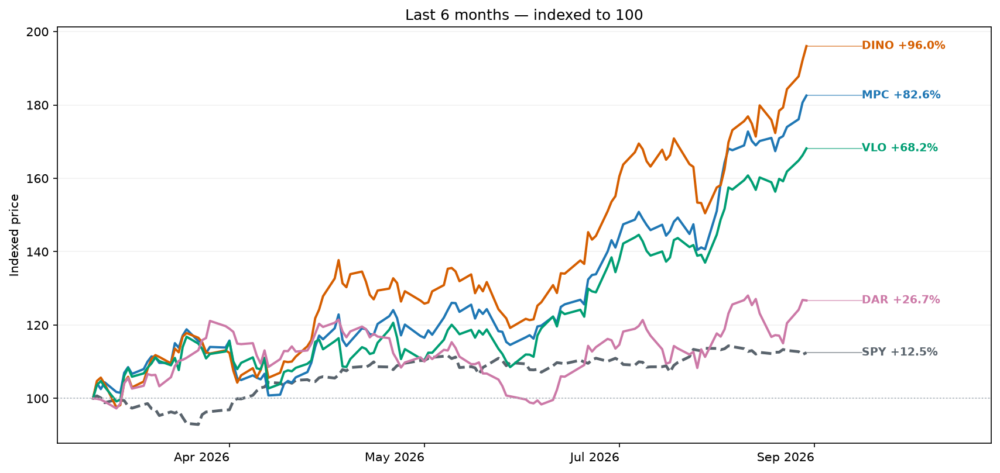

### Last 12 months

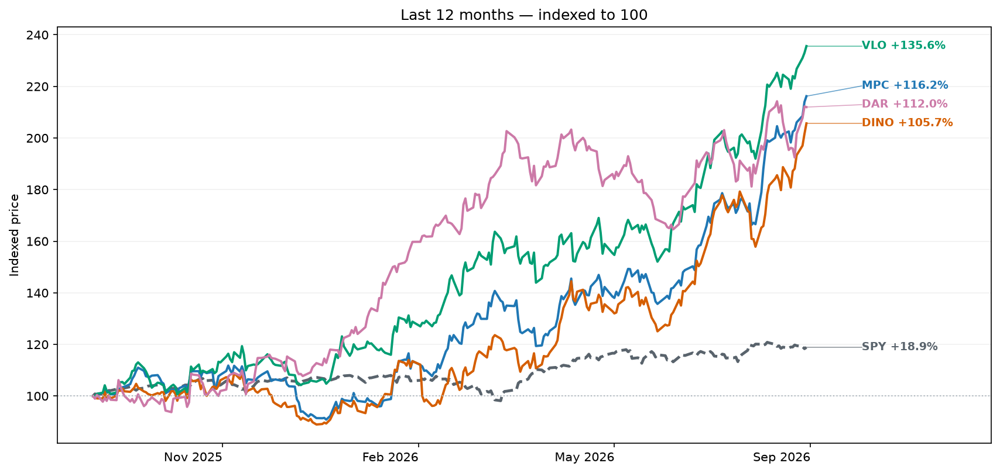

### Last 24 months

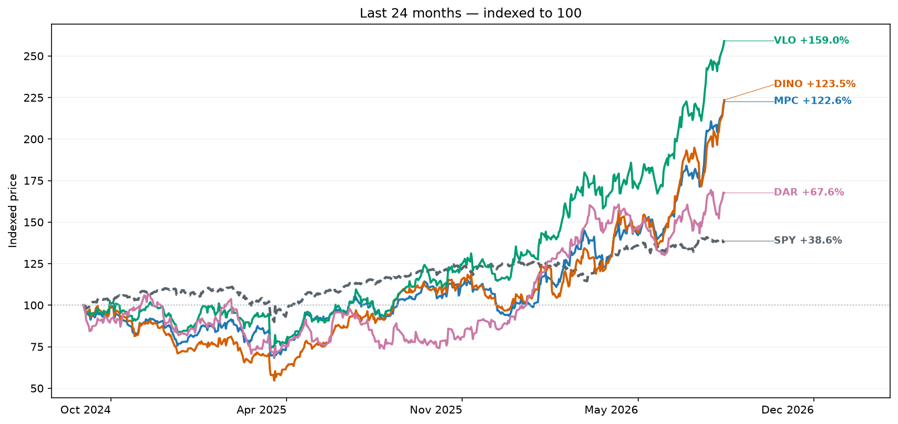

## Current Top Stocks

### Last 3 months

<table class="sortable"><thead><tr><th class="sortable-heading" data-column="0" data-type="number">Rank</th><th class="sortable-heading" data-column="1" data-type="text">Company</th><th class="sortable-heading" data-column="2" data-type="text">Ticker</th><th class="sortable-heading" data-column="3" data-type="number">Market cap</th><th class="sortable-heading" data-column="4" data-type="number">Return</th></tr></thead><tbody><tr><td class="" data-sort="1" style="">1</td><td class="text" data-sort="marathon petroleum" style="">Marathon Petroleum</td><td class="text text" data-sort="mpc" style=""><a href="#company-mpc">MPC</a></td><td class="" data-sort="101307533252.0" style="">$101.3B</td><td class="" data-sort="0.448299090603" style="background:#1a7a3c;color:#ffffff;">+44.8%</td></tr><tr><td class="" data-sort="2" style="">2</td><td class="text" data-sort="hf sinclair" style="">HF Sinclair</td><td class="text text" data-sort="dino" style=""><a href="#company-dino">DINO</a></td><td class="" data-sort="16821907792.4" style="">$16.8B</td><td class="" data-sort="0.446141259885" style="background:#1a7a3c;color:#ffffff;">+44.6%</td></tr><tr><td class="" data-sort="3" style="">3</td><td class="text" data-sort="valero energy" style="">Valero Energy</td><td class="text text" data-sort="vlo" style=""><a href="#company-vlo">VLO</a></td><td class="" data-sort="99697762645.9" style="">$99.7B</td><td class="" data-sort="0.400229489386" style="background:#1a7a3c;color:#ffffff;">+40.0%</td></tr><tr><td class="" data-sort="4" style="">4</td><td class="text" data-sort="bayer" style="">Bayer</td><td class="text text" data-sort="bayry" style=""><a href="#company-bayry">BAYRY</a></td><td class="" data-sort="n/a" style="">n/a</td><td class="" data-sort="0.39939637827" style="background:#1a7a3c;color:#ffffff;">+39.9%</td></tr><tr><td class="" data-sort="5" style="">5</td><td class="text" data-sort="phillips 66" style="">Phillips 66</td><td class="text text" data-sort="psx" style=""><a href="#company-psx">PSX</a></td><td class="" data-sort="96678777737.6" style="">$96.7B</td><td class="" data-sort="0.386668832575" style="background:#1a7a3c;color:#ffffff;">+38.7%</td></tr></tbody></table>

### Last 12 months

<table class="sortable"><thead><tr><th class="sortable-heading" data-column="0" data-type="number">Rank</th><th class="sortable-heading" data-column="1" data-type="text">Company</th><th class="sortable-heading" data-column="2" data-type="text">Ticker</th><th class="sortable-heading" data-column="3" data-type="number">Market cap</th><th class="sortable-heading" data-column="4" data-type="number">Return</th></tr></thead><tbody><tr><td class="" data-sort="1" style="">1</td><td class="text" data-sort="valero energy" style="">Valero Energy</td><td class="text text" data-sort="vlo" style=""><a href="#company-vlo">VLO</a></td><td class="" data-sort="99697762645.9" style="">$99.7B</td><td class="" data-sort="1.35609473549" style="background:#1a7a3c;color:#ffffff;">+135.6%</td></tr><tr><td class="" data-sort="2" style="">2</td><td class="text" data-sort="marathon petroleum" style="">Marathon Petroleum</td><td class="text text" data-sort="mpc" style=""><a href="#company-mpc">MPC</a></td><td class="" data-sort="101307533252.0" style="">$101.3B</td><td class="" data-sort="1.16201117318" style="background:#1a7a3c;color:#ffffff;">+116.2%</td></tr><tr><td class="" data-sort="3" style="">3</td><td class="text" data-sort="darling ingredients" style="">Darling Ingredients</td><td class="text text" data-sort="dar" style=""><a href="#company-dar">DAR</a></td><td class="" data-sort="10563327197.0" style="">$10.6B</td><td class="" data-sort="1.1197492163" style="background:#1a7a3c;color:#ffffff;">+112.0%</td></tr><tr><td class="" data-sort="4" style="">4</td><td class="text" data-sort="hf sinclair" style="">HF Sinclair</td><td class="text text" data-sort="dino" style=""><a href="#company-dino">DINO</a></td><td class="" data-sort="16821907792.4" style="">$16.8B</td><td class="" data-sort="1.05662206709" style="background:#2f9e44;color:#111820;">+105.7%</td></tr><tr><td class="" data-sort="5" style="">5</td><td class="text" data-sort="phillips 66" style="">Phillips 66</td><td class="text text" data-sort="psx" style=""><a href="#company-psx">PSX</a></td><td class="" data-sort="96678777737.6" style="">$96.7B</td><td class="" data-sort="0.96192446181" style="background:#2f9e44;color:#111820;">+96.2%</td></tr></tbody></table>

### Last 24 months

<table class="sortable"><thead><tr><th class="sortable-heading" data-column="0" data-type="number">Rank</th><th class="sortable-heading" data-column="1" data-type="text">Company</th><th class="sortable-heading" data-column="2" data-type="text">Ticker</th><th class="sortable-heading" data-column="3" data-type="number">Market cap</th><th class="sortable-heading" data-column="4" data-type="number">Return</th></tr></thead><tbody><tr><td class="" data-sort="1" style="">1</td><td class="text" data-sort="valero energy" style="">Valero Energy</td><td class="text text" data-sort="vlo" style=""><a href="#company-vlo">VLO</a></td><td class="" data-sort="99697762645.9" style="">$99.7B</td><td class="" data-sort="1.58958760699" style="background:#1a7a3c;color:#ffffff;">+159.0%</td></tr><tr><td class="" data-sort="2" style="">2</td><td class="text" data-sort="hf sinclair" style="">HF Sinclair</td><td class="text text" data-sort="dino" style=""><a href="#company-dino">DINO</a></td><td class="" data-sort="16821907792.4" style="">$16.8B</td><td class="" data-sort="1.23472397809" style="background:#2f9e44;color:#111820;">+123.5%</td></tr><tr><td class="" data-sort="3" style="">3</td><td class="text" data-sort="marathon petroleum" style="">Marathon Petroleum</td><td class="text text" data-sort="mpc" style=""><a href="#company-mpc">MPC</a></td><td class="" data-sort="101307533252.0" style="">$101.3B</td><td class="" data-sort="1.22644114601" style="background:#2f9e44;color:#111820;">+122.6%</td></tr><tr><td class="" data-sort="4" style="">4</td><td class="text" data-sort="casey&#x27;s general stores" style="">Casey&#x27;s General Stores</td><td class="text text" data-sort="casy" style=""><a href="#company-casy">CASY</a></td><td class="" data-sort="30941658841.1" style="">$30.9B</td><td class="" data-sort="1.12326721515" style="background:#2f9e44;color:#111820;">+112.3%</td></tr><tr><td class="" data-sort="5" style="">5</td><td class="text" data-sort="rex american resources" style="">REX American Resources</td><td class="text text" data-sort="rex" style=""><a href="#company-rex">REX</a></td><td class="" data-sort="1444977688.66" style="">$1.4B</td><td class="" data-sort="1.00374531835" style="background:#2f9e44;color:#111820;">+100.4%</td></tr></tbody></table>

## Companies by Subcategory

<h3 id="category-crop-inputs-equipment-and-irrigation"><a href="#subcategory-performance">Crop inputs, equipment, and irrigation</a>Last 3m: +16.7%</h3>

<table class="sortable"><thead><tr><th class="sortable-heading" data-column="0" data-type="text">Company</th><th class="sortable-heading" data-column="1" data-type="text">Ticker</th><th class="sortable-heading" data-column="2" data-type="number">Market cap</th><th class="sortable-heading" data-column="3" data-type="number">3m Return</th><th class="sortable-heading" data-column="4" data-type="number">12m Return</th><th class="sortable-heading" data-column="5" data-type="number">24m Return</th></tr></thead><tbody><tr><td class="text" data-sort="corteva" style="">Corteva</td><td class="text text" data-sort="ctva" style=""><a href="#company-ctva">CTVA</a></td><td class="" data-sort="52421589720.0" style="">$52.4B</td><td class="" data-sort="0.156426735219" style="background:#a9d9a4;color:#111820;">+15.6%</td><td class="" data-sort="0.242851222545" style="background:#a9d9a4;color:#111820;">+24.3%</td><td class="" data-sort="0.619039049847" style="background:#2f9e44;color:#111820;">+61.9%</td></tr><tr><td class="text" data-sort="bayer" style="">Bayer</td><td class="text text" data-sort="bayry" style=""><a href="#company-bayry">BAYRY</a></td><td class="" data-sort="n/a" style="">n/a</td><td class="" data-sort="0.39939637827" style="background:#1a7a3c;color:#ffffff;">+39.9%</td><td class="" data-sort="0.715166461159" style="background:#1a7a3c;color:#ffffff;">+71.5%</td><td class="" data-sort="0.811174333668" style="background:#1a7a3c;color:#ffffff;">+81.1%</td></tr><tr><td class="text" data-sort="basf" style="">BASF</td><td class="text text" data-sort="basfy" style=""><a href="#company-basfy">BASFY</a></td><td class="" data-sort="n/a" style="">n/a</td><td class="" data-sort="0.00272294077604" style="background:#d6ecd4;color:#111820;">+0.3%</td><td class="" data-sort="0.129601226994" style="background:#d6ecd4;color:#111820;">+13.0%</td><td class="" data-sort="0.20737704918" style="background:#a9d9a4;color:#111820;">+20.7%</td></tr><tr><td class="text" data-sort="nutrien" style="">Nutrien</td><td class="text text" data-sort="ntr" style=""><a href="#company-ntr">NTR</a></td><td class="" data-sort="33643310217.0" style="">$33.6B</td><td class="" data-sort="0.166836215666" style="background:#7cc077;color:#111820;">+16.7%</td><td class="" data-sort="0.414054244452" style="background:#7cc077;color:#111820;">+41.4%</td><td class="" data-sort="0.728897502153" style="background:#1a7a3c;color:#ffffff;">+72.9%</td></tr><tr><td class="text" data-sort="cf industries" style="">CF Industries</td><td class="text text" data-sort="cf" style=""><a href="#company-cf">CF</a></td><td class="" data-sort="18012264232.6" style="">$18.0B</td><td class="" data-sort="0.194425385935" style="background:#7cc077;color:#111820;">+19.4%</td><td class="" data-sort="0.642916125988" style="background:#1a7a3c;color:#ffffff;">+64.3%</td><td class="" data-sort="0.760460118822" style="background:#1a7a3c;color:#ffffff;">+76.0%</td></tr><tr><td class="text" data-sort="yara international" style="">Yara International</td><td class="text text" data-sort="yariy" style=""><a href="#company-yariy">YARIY</a></td><td class="" data-sort="n/a" style="">n/a</td><td class="" data-sort="-0.200576161325" style="background:#ee8483;color:#111820;">-20.1%</td><td class="" data-sort="0.238839285714" style="background:#a9d9a4;color:#111820;">+23.9%</td><td class="" data-sort="0.585714285714" style="background:#2f9e44;color:#111820;">+58.6%</td></tr><tr><td class="text" data-sort="mosaic" style="">Mosaic</td><td class="text text" data-sort="mos" style=""><a href="#company-mos">MOS</a></td><td class="" data-sort="7066820210.58" style="">$7.1B</td><td class="" data-sort="0.10643776824" style="background:#a9d9a4;color:#111820;">+10.6%</td><td class="" data-sort="-0.211379626797" style="background:#f5aead;color:#111820;">-21.1%</td><td class="" data-sort="-0.0608378870674" style="background:#fbd5d4;color:#111820;">-6.1%</td></tr><tr><td class="text" data-sort="deere" style="">Deere</td><td class="text text" data-sort="de" style=""><a href="#company-de">DE</a></td><td class="" data-sort="156733767078.0" style="">$156.7B</td><td class="" data-sort="0.18711859797" style="background:#7cc077;color:#111820;">+18.7%</td><td class="" data-sort="0.487412676776" style="background:#2f9e44;color:#111820;">+48.7%</td><td class="" data-sort="0.810702896108" style="background:#1a7a3c;color:#ffffff;">+81.1%</td></tr><tr><td class="text" data-sort="cnh industrial" style="">CNH Industrial</td><td class="text text" data-sort="cnh" style=""><a href="#company-cnh">CNH</a></td><td class="" data-sort="16547953475.8" style="">$16.5B</td><td class="" data-sort="0.236413043478" style="background:#7cc077;color:#111820;">+23.6%</td><td class="" data-sort="0.216577540107" style="background:#a9d9a4;color:#111820;">+21.7%</td><td class="" data-sort="0.352824578791" style="background:#7cc077;color:#111820;">+35.3%</td></tr><tr><td class="text" data-sort="agco" style="">AGCO</td><td class="text text" data-sort="agco" style=""><a href="#company-agco">AGCO</a></td><td class="" data-sort="6969557670.08" style="">$7.0B</td><td class="" data-sort="0.0591038287912" style="background:#d6ecd4;color:#111820;">+5.9%</td><td class="" data-sort="0.173707615342" style="background:#a9d9a4;color:#111820;">+17.4%</td><td class="" data-sort="0.438351498638" style="background:#7cc077;color:#111820;">+43.8%</td></tr><tr><td class="text" data-sort="valmont industries" style="">Valmont Industries</td><td class="text text" data-sort="vmi" style=""><a href="#company-vmi">VMI</a></td><td class="" data-sort="9349921875.14" style="">$9.3B</td><td class="" data-sort="-0.152100010966" style="background:#f5aead;color:#111820;">-15.2%</td><td class="" data-sort="0.263089112146" style="background:#a9d9a4;color:#111820;">+26.3%</td><td class="" data-sort="0.676980913823" style="background:#1a7a3c;color:#ffffff;">+67.7%</td></tr></tbody></table>

<h3 id="category-grain-origination-and-agribusiness"><a href="#subcategory-performance">Grain origination and agribusiness</a>Last 3m: -1.4%</h3>

<table class="sortable"><thead><tr><th class="sortable-heading" data-column="0" data-type="text">Company</th><th class="sortable-heading" data-column="1" data-type="text">Ticker</th><th class="sortable-heading" data-column="2" data-type="number">Market cap</th><th class="sortable-heading" data-column="3" data-type="number">3m Return</th><th class="sortable-heading" data-column="4" data-type="number">12m Return</th><th class="sortable-heading" data-column="5" data-type="number">24m Return</th></tr></thead><tbody><tr><td class="text" data-sort="archer daniels midland" style="">Archer Daniels Midland</td><td class="text text" data-sort="adm" style=""><a href="#company-adm">ADM</a></td><td class="" data-sort="38923055923.1" style="">$38.9B</td><td class="" data-sort="0.0150992747592" style="background:#a9d9a4;color:#111820;">+1.5%</td><td class="" data-sort="0.383344134802" style="background:#7cc077;color:#111820;">+38.3%</td><td class="" data-sort="0.408446057407" style="background:#1a7a3c;color:#ffffff;">+40.8%</td></tr><tr><td class="text" data-sort="bunge" style="">Bunge</td><td class="text text" data-sort="bg" style=""><a href="#company-bg">BG</a></td><td class="" data-sort="21901580022.0" style="">$21.9B</td><td class="" data-sort="-0.0650635415874" style="background:#c0302f;color:#ffffff;">-6.5%</td><td class="" data-sort="0.512495383479" style="background:#2f9e44;color:#111820;">+51.2%</td><td class="" data-sort="0.23726082578" style="background:#7cc077;color:#111820;">+23.7%</td></tr><tr><td class="text" data-sort="the andersons" style="">The Andersons</td><td class="text text" data-sort="ande" style=""><a href="#company-ande">ANDE</a></td><td class="" data-sort="2301165356.1" style="">$2.3B</td><td class="" data-sort="-0.0272939240159" style="background:#ee8483;color:#111820;">-2.7%</td><td class="" data-sort="0.746367889682" style="background:#1a7a3c;color:#ffffff;">+74.6%</td><td class="" data-sort="0.443223443223" style="background:#1a7a3c;color:#ffffff;">+44.3%</td></tr></tbody></table>

<h3 id="category-u-s-ethanol-and-process-technology"><a href="#subcategory-performance">U.S. ethanol and process technology</a>Last 3m: +28.1%</h3>

<table class="sortable"><thead><tr><th class="sortable-heading" data-column="0" data-type="text">Company</th><th class="sortable-heading" data-column="1" data-type="text">Ticker</th><th class="sortable-heading" data-column="2" data-type="number">Market cap</th><th class="sortable-heading" data-column="3" data-type="number">3m Return</th><th class="sortable-heading" data-column="4" data-type="number">12m Return</th><th class="sortable-heading" data-column="5" data-type="number">24m Return</th></tr></thead><tbody><tr><td class="text" data-sort="valero energy" style="">Valero Energy</td><td class="text text" data-sort="vlo" style=""><a href="#company-vlo">VLO</a></td><td class="" data-sort="99697762645.9" style="">$99.7B</td><td class="" data-sort="0.400229489386" style="background:#1a7a3c;color:#ffffff;">+40.0%</td><td class="" data-sort="1.35609473549" style="background:#1a7a3c;color:#ffffff;">+135.6%</td><td class="" data-sort="1.58958760699" style="background:#1a7a3c;color:#ffffff;">+159.0%</td></tr><tr><td class="text" data-sort="green plains" style="">Green Plains</td><td class="text text" data-sort="gpre" style=""><a href="#company-gpre">GPRE</a></td><td class="" data-sort="1123628107.84" style="">$1.1B</td><td class="" data-sort="-0.0430817610063" style="background:#fbd5d4;color:#111820;">-4.3%</td><td class="" data-sort="0.408796296296" style="background:#a9d9a4;color:#111820;">+40.9%</td><td class="" data-sort="0.165900383142" style="background:#d6ecd4;color:#111820;">+16.6%</td></tr><tr><td class="text" data-sort="rex american resources" style="">REX American Resources</td><td class="text text" data-sort="rex" style=""><a href="#company-rex">REX</a></td><td class="" data-sort="1444977688.66" style="">$1.4B</td><td class="" data-sort="-0.0751944684529" style="background:#fbd5d4;color:#111820;">-7.5%</td><td class="" data-sort="0.387133365743" style="background:#a9d9a4;color:#111820;">+38.7%</td><td class="" data-sort="1.00374531835" style="background:#2f9e44;color:#111820;">+100.4%</td></tr><tr><td class="text" data-sort="novonesis" style="">Novonesis</td><td class="text text" data-sort="nvzmy" style=""><a href="#company-nvzmy">NVZMY</a></td><td class="" data-sort="n/a" style="">n/a</td><td class="" data-sort="0.130343007916" style="background:#a9d9a4;color:#111820;">+13.0%</td><td class="" data-sort="0.0240637450199" style="background:#d6ecd4;color:#111820;">+2.4%</td><td class="" data-sort="-0.061897810219" style="background:#fbd5d4;color:#111820;">-6.2%</td></tr><tr><td class="text" data-sort="archer daniels midland" style="">Archer Daniels Midland</td><td class="text text" data-sort="adm" style=""><a href="#company-adm">ADM</a></td><td class="" data-sort="38923055923.1" style="">$38.9B</td><td class="" data-sort="0.0150992747592" style="background:#d6ecd4;color:#111820;">+1.5%</td><td class="" data-sort="0.383344134802" style="background:#a9d9a4;color:#111820;">+38.3%</td><td class="" data-sort="0.408446057407" style="background:#a9d9a4;color:#111820;">+40.8%</td></tr><tr><td class="text" data-sort="the andersons" style="">The Andersons</td><td class="text text" data-sort="ande" style=""><a href="#company-ande">ANDE</a></td><td class="" data-sort="2301165356.1" style="">$2.3B</td><td class="" data-sort="-0.0272939240159" style="background:#fbd5d4;color:#111820;">-2.7%</td><td class="" data-sort="0.746367889682" style="background:#7cc077;color:#111820;">+74.6%</td><td class="" data-sort="0.443223443223" style="background:#a9d9a4;color:#111820;">+44.3%</td></tr></tbody></table>

<h3 id="category-wet-milling-ingredients-and-co-products"><a href="#subcategory-performance">Wet milling, ingredients, and co-products</a>Last 3m: +6.2%</h3>

<table class="sortable"><thead><tr><th class="sortable-heading" data-column="0" data-type="text">Company</th><th class="sortable-heading" data-column="1" data-type="text">Ticker</th><th class="sortable-heading" data-column="2" data-type="number">Market cap</th><th class="sortable-heading" data-column="3" data-type="number">3m Return</th><th class="sortable-heading" data-column="4" data-type="number">12m Return</th><th class="sortable-heading" data-column="5" data-type="number">24m Return</th></tr></thead><tbody><tr><td class="text" data-sort="ingredion" style="">Ingredion</td><td class="text text" data-sort="ingr" style=""><a href="#company-ingr">INGR</a></td><td class="" data-sort="6757305349.85" style="">$6.8B</td><td class="" data-sort="0.0168483647175" style="background:#d6ecd4;color:#111820;">+1.7%</td><td class="" data-sort="-0.197371509035" style="background:#fbd5d4;color:#111820;">-19.7%</td><td class="" data-sort="-0.236038719285" style="background:#f5aead;color:#111820;">-23.6%</td></tr><tr><td class="text" data-sort="darling ingredients" style="">Darling Ingredients</td><td class="text text" data-sort="dar" style=""><a href="#company-dar">DAR</a></td><td class="" data-sort="10563327197.0" style="">$10.6B</td><td class="" data-sort="0.0986190089358" style="background:#2f9e44;color:#111820;">+9.9%</td><td class="" data-sort="1.1197492163" style="background:#1a7a3c;color:#ffffff;">+112.0%</td><td class="" data-sort="0.675836431227" style="background:#1a7a3c;color:#ffffff;">+67.6%</td></tr><tr><td class="text" data-sort="tyson foods" style="">Tyson Foods</td><td class="text text" data-sort="tsn" style=""><a href="#company-tsn">TSN</a></td><td class="" data-sort="20597978527.6" style="">$20.6B</td><td class="" data-sort="-0.0224207391837" style="background:#fbd5d4;color:#111820;">-2.2%</td><td class="" data-sort="-0.00958296362023" style="background:#fbd5d4;color:#111820;">-1.0%</td><td class="" data-sort="-0.138867458726" style="background:#f5aead;color:#111820;">-13.9%</td></tr><tr><td class="text" data-sort="jbs" style="">JBS</td><td class="text text" data-sort="jbs" style=""><a href="#company-jbs">JBS</a></td><td class="" data-sort="45228750792.5" style="">$45.2B</td><td class="" data-sort="0.139730639731" style="background:#1a7a3c;color:#ffffff;">+14.0%</td><td class="" data-sort="-0.15003138732" style="background:#fbd5d4;color:#111820;">-15.0%</td><td class="missing" data-sort="—" style="background:#f0efec;color:#111820;">—</td></tr><tr><td class="text" data-sort="archer daniels midland" style="">Archer Daniels Midland</td><td class="text text" data-sort="adm" style=""><a href="#company-adm">ADM</a></td><td class="" data-sort="38923055923.1" style="">$38.9B</td><td class="" data-sort="0.0150992747592" style="background:#d6ecd4;color:#111820;">+1.5%</td><td class="" data-sort="0.383344134802" style="background:#a9d9a4;color:#111820;">+38.3%</td><td class="" data-sort="0.408446057407" style="background:#2f9e44;color:#111820;">+40.8%</td></tr></tbody></table>

<h3 id="category-fuel-blending-refining-and-retail"><a href="#subcategory-performance">Fuel blending, refining, and retail</a>Last 3m: +35.3%</h3>

<table class="sortable"><thead><tr><th class="sortable-heading" data-column="0" data-type="text">Company</th><th class="sortable-heading" data-column="1" data-type="text">Ticker</th><th class="sortable-heading" data-column="2" data-type="number">Market cap</th><th class="sortable-heading" data-column="3" data-type="number">3m Return</th><th class="sortable-heading" data-column="4" data-type="number">12m Return</th><th class="sortable-heading" data-column="5" data-type="number">24m Return</th></tr></thead><tbody><tr><td class="text" data-sort="valero energy" style="">Valero Energy</td><td class="text text" data-sort="vlo" style=""><a href="#company-vlo">VLO</a></td><td class="" data-sort="99697762645.9" style="">$99.7B</td><td class="" data-sort="0.400229489386" style="background:#1a7a3c;color:#ffffff;">+40.0%</td><td class="" data-sort="1.35609473549" style="background:#1a7a3c;color:#ffffff;">+135.6%</td><td class="" data-sort="1.58958760699" style="background:#1a7a3c;color:#ffffff;">+159.0%</td></tr><tr><td class="text" data-sort="marathon petroleum" style="">Marathon Petroleum</td><td class="text text" data-sort="mpc" style=""><a href="#company-mpc">MPC</a></td><td class="" data-sort="101307533252.0" style="">$101.3B</td><td class="" data-sort="0.448299090603" style="background:#1a7a3c;color:#ffffff;">+44.8%</td><td class="" data-sort="1.16201117318" style="background:#1a7a3c;color:#ffffff;">+116.2%</td><td class="" data-sort="1.22644114601" style="background:#2f9e44;color:#111820;">+122.6%</td></tr><tr><td class="text" data-sort="phillips 66" style="">Phillips 66</td><td class="text text" data-sort="psx" style=""><a href="#company-psx">PSX</a></td><td class="" data-sort="96678777737.6" style="">$96.7B</td><td class="" data-sort="0.386668832575" style="background:#1a7a3c;color:#ffffff;">+38.7%</td><td class="" data-sort="0.96192446181" style="background:#2f9e44;color:#111820;">+96.2%</td><td class="" data-sort="0.896962962963" style="background:#7cc077;color:#111820;">+89.7%</td></tr><tr><td class="text" data-sort="hf sinclair" style="">HF Sinclair</td><td class="text text" data-sort="dino" style=""><a href="#company-dino">DINO</a></td><td class="" data-sort="16821907792.4" style="">$16.8B</td><td class="" data-sort="0.446141259885" style="background:#1a7a3c;color:#ffffff;">+44.6%</td><td class="" data-sort="1.05662206709" style="background:#2f9e44;color:#111820;">+105.7%</td><td class="" data-sort="1.23472397809" style="background:#2f9e44;color:#111820;">+123.5%</td></tr><tr><td class="text" data-sort="cvr energy" style="">CVR Energy</td><td class="text text" data-sort="cvi" style=""><a href="#company-cvi">CVI</a></td><td class="" data-sort="3689472983.3" style="">$3.7B</td><td class="" data-sort="0.208673613067" style="background:#7cc077;color:#111820;">+20.9%</td><td class="" data-sort="0.389446422791" style="background:#a9d9a4;color:#111820;">+38.9%</td><td class="" data-sort="0.710641689916" style="background:#7cc077;color:#111820;">+71.1%</td></tr><tr><td class="text" data-sort="sunoco lp" style="">Sunoco LP</td><td class="text text" data-sort="sun" style=""><a href="#company-sun">SUN</a></td><td class="" data-sort="14487140849.6" style="">$14.5B</td><td class="" data-sort="0.156850870553" style="background:#a9d9a4;color:#111820;">+15.7%</td><td class="" data-sort="0.480813953488" style="background:#a9d9a4;color:#111820;">+48.1%</td><td class="" data-sort="0.438712106948" style="background:#a9d9a4;color:#111820;">+43.9%</td></tr><tr><td class="text" data-sort="casey&#x27;s general stores" style="">Casey&#x27;s General Stores</td><td class="text text" data-sort="casy" style=""><a href="#company-casy">CASY</a></td><td class="" data-sort="30941658841.1" style="">$30.9B</td><td class="" data-sort="-0.0266084552888" style="background:#fbd5d4;color:#111820;">-2.7%</td><td class="" data-sort="0.508386709367" style="background:#a9d9a4;color:#111820;">+50.8%</td><td class="" data-sort="1.12326721515" style="background:#2f9e44;color:#111820;">+112.3%</td></tr><tr><td class="text" data-sort="murphy usa" style="">Murphy USA</td><td class="text text" data-sort="musa" style=""><a href="#company-musa">MUSA</a></td><td class="" data-sort="10444448379.3" style="">$10.4B</td><td class="" data-sort="-0.0400066401062" style="background:#fbd5d4;color:#111820;">-4.0%</td><td class="" data-sort="0.401826115061" style="background:#a9d9a4;color:#111820;">+40.2%</td><td class="" data-sort="0.0209898581713" style="background:#d6ecd4;color:#111820;">+2.1%</td></tr></tbody></table>

<h3 id="category-advanced-biofuels-and-saf"><a href="#subcategory-performance">Advanced biofuels and SAF</a>Last 3m: +11.6%</h3>

<table class="sortable"><thead><tr><th class="sortable-heading" data-column="0" data-type="text">Company</th><th class="sortable-heading" data-column="1" data-type="text">Ticker</th><th class="sortable-heading" data-column="2" data-type="number">Market cap</th><th class="sortable-heading" data-column="3" data-type="number">3m Return</th><th class="sortable-heading" data-column="4" data-type="number">12m Return</th><th class="sortable-heading" data-column="5" data-type="number">24m Return</th></tr></thead><tbody><tr><td class="text" data-sort="neste" style="">Neste</td><td class="text text" data-sort="ntoiy" style=""><a href="#company-ntoiy">NTOIY</a></td><td class="" data-sort="n/a" style="">n/a</td><td class="" data-sort="-0.0240963855422" style="background:#f5aead;color:#111820;">-2.4%</td><td class="" data-sort="0.796198521647" style="background:#1a7a3c;color:#ffffff;">+79.6%</td><td class="" data-sort="0.528301886792" style="background:#1a7a3c;color:#ffffff;">+52.8%</td></tr><tr><td class="text" data-sort="chevron" style="">Chevron</td><td class="text text" data-sort="cvx" style=""><a href="#company-cvx">CVX</a></td><td class="" data-sort="403619489658.0" style="">$403.6B</td><td class="" data-sort="0.116335459385" style="background:#1a7a3c;color:#ffffff;">+11.6%</td><td class="" data-sort="0.339870935088" style="background:#7cc077;color:#111820;">+34.0%</td><td class="" data-sort="0.463984515415" style="background:#1a7a3c;color:#ffffff;">+46.4%</td></tr></tbody></table>

<h3 id="category-international-ethanol"><a href="#subcategory-performance">International ethanol</a>Last 3m: +0.0%</h3>

<table class="sortable"><thead><tr><th class="sortable-heading" data-column="0" data-type="text">Company</th><th class="sortable-heading" data-column="1" data-type="text">Ticker</th><th class="sortable-heading" data-column="2" data-type="number">Market cap</th><th class="sortable-heading" data-column="3" data-type="number">3m Return</th><th class="sortable-heading" data-column="4" data-type="number">12m Return</th><th class="sortable-heading" data-column="5" data-type="number">24m Return</th></tr></thead><tbody><tr><td class="text" data-sort="cosan" style="">Cosan</td><td class="text text" data-sort="csan" style=""><a href="#company-csan">CSAN</a></td><td class="" data-sort="2504672704.64" style="">$2.5B</td><td class="" data-sort="0.0210526315789" style="background:#2f9e44;color:#111820;">+2.1%</td><td class="" data-sort="-0.402464065708" style="background:#c0302f;color:#ffffff;">-40.2%</td><td class="" data-sort="-0.686422413793" style="background:#c0302f;color:#ffffff;">-68.6%</td></tr><tr><td class="text" data-sort="adecoagro" style="">Adecoagro</td><td class="text text" data-sort="agro" style=""><a href="#company-agro">AGRO</a></td><td class="" data-sort="1525335200.62" style="">$1.5B</td><td class="" data-sort="-0.0336341263331" style="background:#c0302f;color:#ffffff;">-3.4%</td><td class="" data-sort="0.420989143546" style="background:#1a7a3c;color:#ffffff;">+42.1%</td><td class="" data-sort="0.0670289855072" style="background:#d6ecd4;color:#111820;">+6.7%</td></tr></tbody></table>

<h3 id="category-logistics"><a href="#subcategory-performance">Logistics</a>Last 3m: +6.5%</h3>

<table class="sortable"><thead><tr><th class="sortable-heading" data-column="0" data-type="text">Company</th><th class="sortable-heading" data-column="1" data-type="text">Ticker</th><th class="sortable-heading" data-column="2" data-type="number">Market cap</th><th class="sortable-heading" data-column="3" data-type="number">3m Return</th><th class="sortable-heading" data-column="4" data-type="number">12m Return</th><th class="sortable-heading" data-column="5" data-type="number">24m Return</th></tr></thead><tbody><tr><td class="text" data-sort="union pacific" style="">Union Pacific</td><td class="text text" data-sort="unp" style=""><a href="#company-unp">UNP</a></td><td class="" data-sort="179291985296.0" style="">$179.3B</td><td class="" data-sort="0.105291267692" style="background:#1a7a3c;color:#ffffff;">+10.5%</td><td class="" data-sort="0.306502525253" style="background:#2f9e44;color:#111820;">+30.7%</td><td class="" data-sort="0.135261157478" style="background:#a9d9a4;color:#111820;">+13.5%</td></tr><tr><td class="text" data-sort="csx" style="">CSX</td><td class="text text" data-sort="csx" style=""><a href="#company-csx">CSX</a></td><td class="" data-sort="93883428793.6" style="">$93.9B</td><td class="" data-sort="0.0475882859604" style="background:#a9d9a4;color:#111820;">+4.8%</td><td class="" data-sort="0.507125154895" style="background:#1a7a3c;color:#ffffff;">+50.7%</td><td class="" data-sort="0.406882591093" style="background:#1a7a3c;color:#ffffff;">+40.7%</td></tr><tr><td class="text" data-sort="canadian pacific kansas city" style="">Canadian Pacific Kansas City</td><td class="text text" data-sort="cp" style=""><a href="#company-cp">CP</a></td><td class="" data-sort="83020241914.6" style="">$83.0B</td><td class="" data-sort="0.00471274685817" style="background:#d6ecd4;color:#111820;">+0.5%</td><td class="" data-sort="0.167709963485" style="background:#a9d9a4;color:#111820;">+16.8%</td><td class="" data-sort="0.0737498501019" style="background:#d6ecd4;color:#111820;">+7.4%</td></tr><tr><td class="text" data-sort="gatx" style="">GATX</td><td class="text text" data-sort="gatx" style=""><a href="#company-gatx">GATX</a></td><td class="" data-sort="6219339017.28" style="">$6.2B</td><td class="" data-sort="0.0539001139157" style="background:#7cc077;color:#111820;">+5.4%</td><td class="" data-sort="0.050373468778" style="background:#d6ecd4;color:#111820;">+5.0%</td><td class="" data-sort="0.300340287025" style="background:#2f9e44;color:#111820;">+30.0%</td></tr><tr><td class="text" data-sort="trinity industries" style="">Trinity Industries</td><td class="text text" data-sort="trn" style=""><a href="#company-trn">TRN</a></td><td class="" data-sort="2359810175.32" style="">$2.4B</td><td class="" data-sort="-0.127725856698" style="background:#c0302f;color:#ffffff;">-12.8%</td><td class="" data-sort="0.00394406597347" style="background:#d6ecd4;color:#111820;">+0.4%</td><td class="" data-sort="-0.128811449907" style="background:#f5aead;color:#111820;">-12.9%</td></tr><tr><td class="text" data-sort="greenbrier" style="">Greenbrier</td><td class="text text" data-sort="gbx" style=""><a href="#company-gbx">GBX</a></td><td class="" data-sort="1407755713.0" style="">$1.4B</td><td class="" data-sort="-0.0877080665813" style="background:#e34948;color:#111820;">-8.8%</td><td class="" data-sort="-0.0670013094718" style="background:#fbd5d4;color:#111820;">-6.7%</td><td class="" data-sort="-0.0967673779844" style="background:#f5aead;color:#111820;">-9.7%</td></tr></tbody></table>

## Upcoming Earnings

### Fuel blending, refining, and retail

<table class="sortable"><thead><tr><th class="sortable-heading" data-column="0" data-type="text">Company</th><th class="sortable-heading" data-column="1" data-type="text">Ticker</th><th class="sortable-heading" data-column="2" data-type="text">Date</th><th class="sortable-heading" data-column="3" data-type="number">Market cap</th><th class="sortable-heading" data-column="4" data-type="number">3m Return</th><th class="sortable-heading" data-column="5" data-type="number">12m Return</th></tr></thead><tbody><tr><td class="text" data-sort="casey&#x27;s general stores" style="">Casey&#x27;s General Stores</td><td class="text text" data-sort="casy" style=""><a href="#company-casy">CASY</a></td><td class="text" data-sort="2026-09-09" style="">September 9, 2026</td><td class="" data-sort="30941658841.1" style="">$30.9B</td><td class="" data-sort="-0.0266084552888" style="background:#c0302f;color:#ffffff;">-2.7%</td><td class="" data-sort="0.508386709367" style="background:#1a7a3c;color:#ffffff;">+50.8%</td></tr></tbody></table>

## Recent Earnings Highlights — 3m Ret

No earnings highlights fall within this report's window.

## Company Overviews

<h3 id="company-ctva">Corteva (CTVA)</h3>

*Crop inputs, equipment, and irrigation · $52.4B · 3m +15.6% · 12m +24.3% · 24m +61.9%*

[Google Finance](https://www.google.com/finance/quote/CTVA:NYSE?tab=earnings&hl=en)

Largest U.S. corn-seed franchise (Pioneer) and a primary input cost for Corn Belt acres.

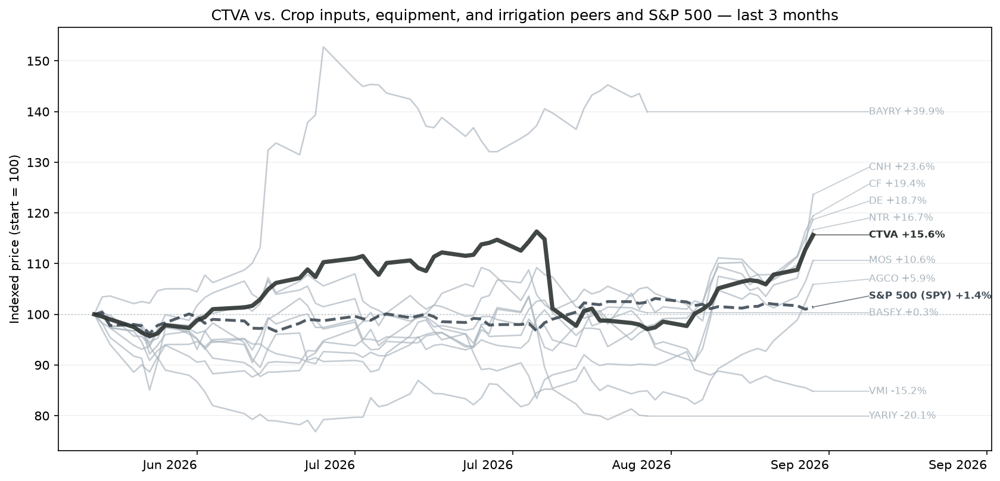

Corteva is an agricultural inputs pure play that was formed in 2019 when it was spun off from DowDuPont. The company is a leader in the development of new seed and crop protection products. Seeds generate the majority of profits with the remainder coming from crop protection products. Corteva plans to spin off its seeds business in late 2026. The seeds business will be named Vylor, while the crop protection business will retain the Corteva name and be a pure-play crop protection company following the divestiture. Corteva operates globally, but around half of revenue comes from North America.

<h3 id="company-bayry">Bayer (BAYRY)</h3>

*Crop inputs, equipment, and irrigation · n/a · 3m +39.9% · 12m +71.5% · 24m +81.1%*

[Google Finance](https://www.google.com/finance/quote/BAYRY:NYSE?tab=earnings&hl=en)

Dekalb and former Monsanto corn-seed brands; together with Corteva dominates U.S. corn seed.

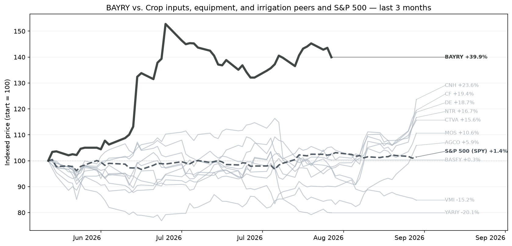

BAYER AG S/ADR

<h3 id="company-basfy">BASF (BASFY)</h3>

*Crop inputs, equipment, and irrigation · n/a · 3m +0.3% · 12m +13.0% · 24m +20.7%*

[Google Finance](https://www.google.com/finance/quote/BASFY:NYSE?tab=earnings&hl=en)

Crop-protection chemistry used on U.S. corn acres.

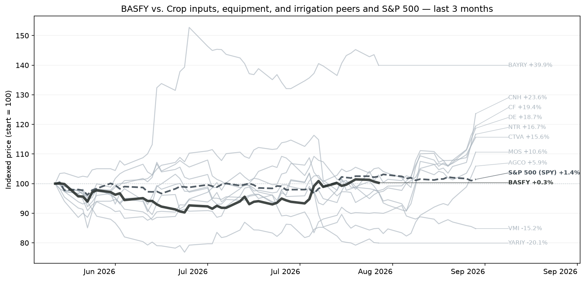

BASF SE S/ADR

<h3 id="company-ntr">Nutrien (NTR)</h3>

*Crop inputs, equipment, and irrigation · $33.6B · 3m +16.7% · 12m +41.4% · 24m +72.9%*

[Google Finance](https://www.google.com/finance/quote/NTR:NYSE?tab=earnings&hl=en)

Largest North American agricultural retailer and a major potash and nitrogen producer.

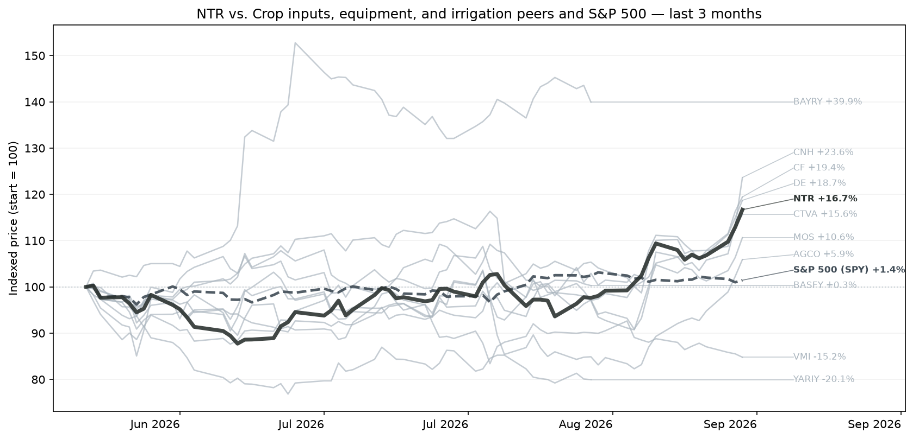

Created in 2018 as a result of the merger between PotashCorp and Agrium, Nutrien is the world's largest fertilizer producer by capacity. Nutrien produces the three main crop nutrients—nitrogen, potash, and phosphate—although its main focus is potash, where it is the global leader in installed capacity with a roughly 20% market share. The company is also the largest agricultural retailer in North America and Australia, selling fertilizers, crop chemicals, seeds, and services directly to farm customers through its brick-and-mortar stores and online platforms.

<h3 id="company-cf">CF Industries (CF)</h3>

*Crop inputs, equipment, and irrigation · $18.0B · 3m +19.4% · 12m +64.3% · 24m +76.0%*

[Google Finance](https://www.google.com/finance/quote/CF:NYSE?tab=earnings&hl=en)

Nitrogen fertilizer producer; corn is the crop that most moves UAN and urea demand.

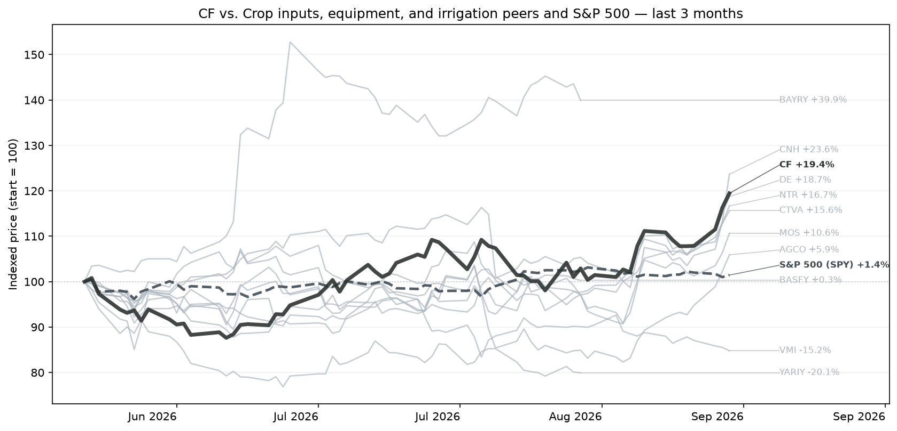

CF Industries is a leading producer and distributor of nitrogen, which is primarily used in fertilizers. The company operates nitrogen manufacturing plants primarily in North America. CF also produces nitrogen in the United Kingdom and holds a joint venture interest in a nitrogen production facility in Trinidad and Tobago. CF makes nitrogen primarily using low-cost US natural gas as its feedstock, making the company one of the lowest-cost nitrogen producers globally. It is also investing in carbon-free blue and green ammonia, which can be used as an alternative fuel to hydrogen or as a means to transport hydrogen.

<h3 id="company-yariy">Yara International (YARIY)</h3>

*Crop inputs, equipment, and irrigation · n/a · 3m -20.1% · 12m +23.9% · 24m +58.6%*

[Google Finance](https://www.google.com/finance/quote/YARIY:NYSE?tab=earnings&hl=en)

Global nitrogen producer that sets the international urea and ammonia reference.

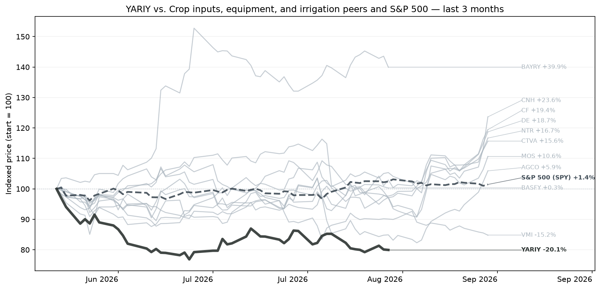

YARA INTL ASA S/ADR

<h3 id="company-mos">Mosaic (MOS)</h3>

*Crop inputs, equipment, and irrigation · $7.1B · 3m +10.6% · 12m -21.1% · 24m -6.1%*

[Google Finance](https://www.google.com/finance/quote/MOS:NYSE?tab=earnings&hl=en)

Phosphate and potash producer that completes corn production budgets.

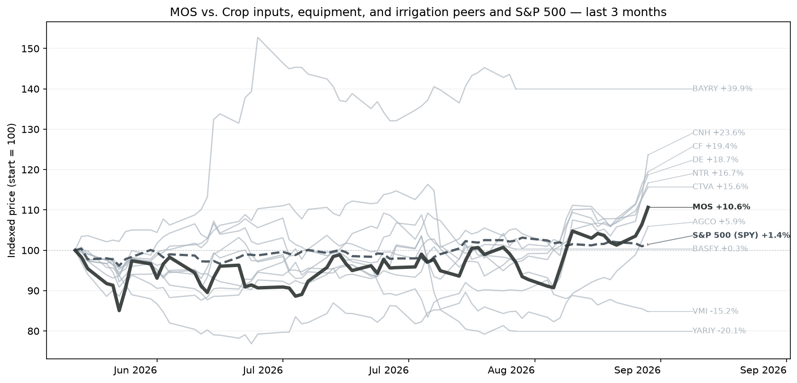

Mosaic is one of the largest phosphate and potash producers in the world. The company's assets include phosphate rock mines in the US and potash mines in Canada. Mosaic also runs a large fertilizer distribution operation in Brazil through its Mosaic Fertilizantes business.

<h3 id="company-de">Deere (DE)</h3>

*Crop inputs, equipment, and irrigation · $156.7B · 3m +18.7% · 12m +48.7% · 24m +81.1%*

[Google Finance](https://www.google.com/finance/quote/DE:NYSE?tab=earnings&hl=en)

Dominant North American farm-equipment maker for corn planting, harvest, and grain handling.

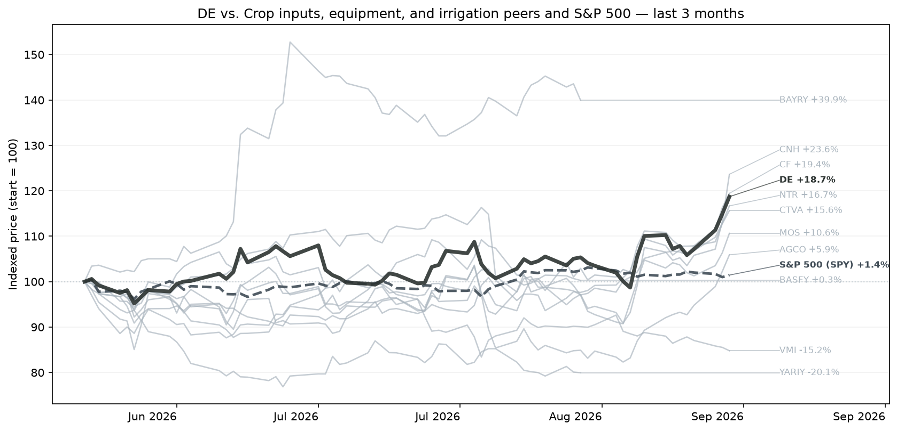

Deere is the world's leading manufacturer of agricultural equipment and a major producer of construction machinery. The company is divided into four reporting segments: production & precision agriculture, or PPA, small agriculture & turf, or SAT, construction & forestry, or CF, and financial services, or FS, its captive finance subsidiary. The core PPA business is the largest contributor to sales and profits by far. Geographically, Deere sales are 60% US/Canada, 17% Europe, 14% Latin America, and 9% rest of the world. Deere goes to market through a robust dealer network that includes over 2,000 dealer locations in North America with reach into over 100 countries. John Deere Financial provides retail financing for machinery to its customers and wholesale financing for dealers.

<h3 id="company-cnh">CNH Industrial (CNH)</h3>

*Crop inputs, equipment, and irrigation · $16.5B · 3m +23.6% · 12m +21.7% · 24m +35.3%*

[Google Finance](https://www.google.com/finance/quote/CNH:NYSE?tab=earnings&hl=en)

Case IH and New Holland farm equipment serving corn growers.

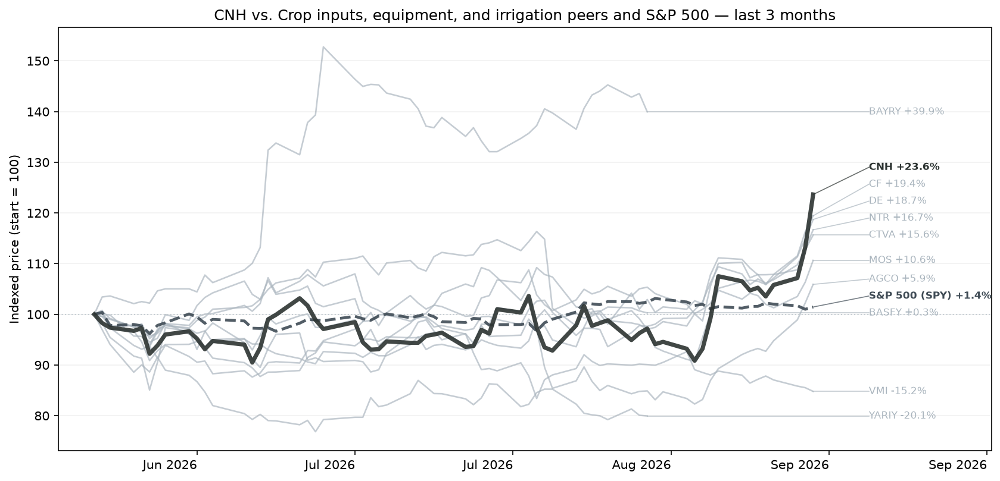

CNH Industrial is the world's second largest manufacturer of agricultural machinery (82% of industrial net sales) as well as a major player in construction equipment (18% of industrial net sales). Its Case and New Holland brands have served farmers for generations. Geographically, agricultural sales are 40% in North America, 32% in Europe, the Middle East, and Africa, 18% in South America, and 10% in Asia-Pacific. CNH's products are available through a robust independent dealer network, which includes over 2,600 dealer and distribution locations and reach into 164 countries. The construction business leverages over 400 dealers. The company's captive finance arm provides retail financing to its customers and wholesale financing to dealers to maintain inventory, thereby supporting sales.

<h3 id="company-agco">AGCO (AGCO)</h3>

*Crop inputs, equipment, and irrigation · $7.0B · 3m +5.9% · 12m +17.4% · 24m +43.8%*

[Google Finance](https://www.google.com/finance/quote/AGCO:NYSE?tab=earnings&hl=en)

Fendt, Massey Ferguson, and Challenger farm equipment with Corn Belt exposure.

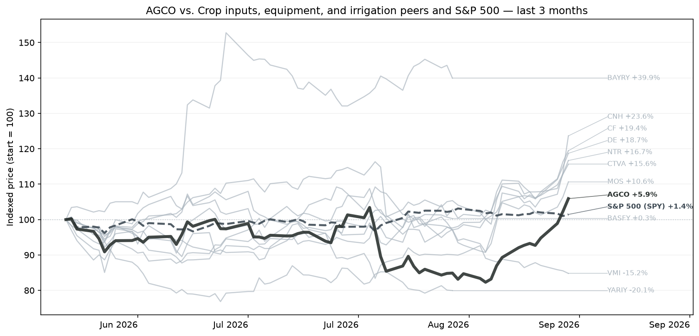

Agco is a global manufacturer of agricultural equipment. Its main machine brands are Fendt, Massey Ferguson, and Valtra; its initiatives in precision agriculture have been organized under the PTx umbrella following a series of acquisitions. While a global business, Agco's sales skew heavily toward Europe/Middle East, representing 50%-60% of sales and even more of operating profits. The company is trying to increase its exposure to the larger North and South American markets. Its products are available through a global dealer network, which includes over 3,000 dealers and distribution locations and reaches into over 140 countries. Additionally, Agco offers retail and wholesale financing to customers through its partnership with Rabobank of the Netherlands, having exited their JV in 2026.

<h3 id="company-vmi">Valmont Industries (VMI)</h3>

*Crop inputs, equipment, and irrigation · $9.3B · 3m -15.2% · 12m +26.3% · 24m +67.7%*

[Google Finance](https://www.google.com/finance/quote/VMI:NYSE?tab=earnings&hl=en)

Center-pivot irrigation (Valley) used on irrigated High Plains corn.

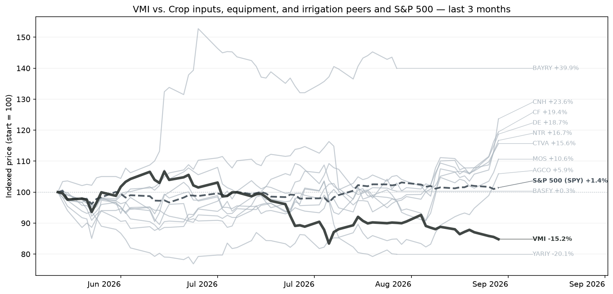

Valmont Industries Inc, along with its subsidiaries, operates as a manufacturer of products and services for infrastructure and agriculture markets. Its reportable segments are Infrastructure and Agriculture. The company generates maximum revenue from the Infrastructure segment, which includes the manufacturing and distribution of products and solutions to serve the infrastructure markets of utility, solar, lighting, transportation, and telecommunications, along with coatings services to protect metal products. The Agriculture segment provides irrigation equipment components, including aftermarket parts and tubular products, and technology solutions for precision agriculture. Geographically, it derives key revenue from the United States, followed by Australia, Brazil, and other regions.

<h3 id="company-adm">Archer Daniels Midland (ADM)</h3>

*Grain origination and agribusiness, U.S. ethanol and process technology, Wet milling, ingredients, and co-products · $38.9B · 3m +1.5% · 12m +38.3% · 24m +40.8%*

[Google Finance](https://www.google.com/finance/quote/ADM:NYSE?tab=earnings&hl=en)

Global grain trader, top U.S. ethanol producer, and major corn wet miller.

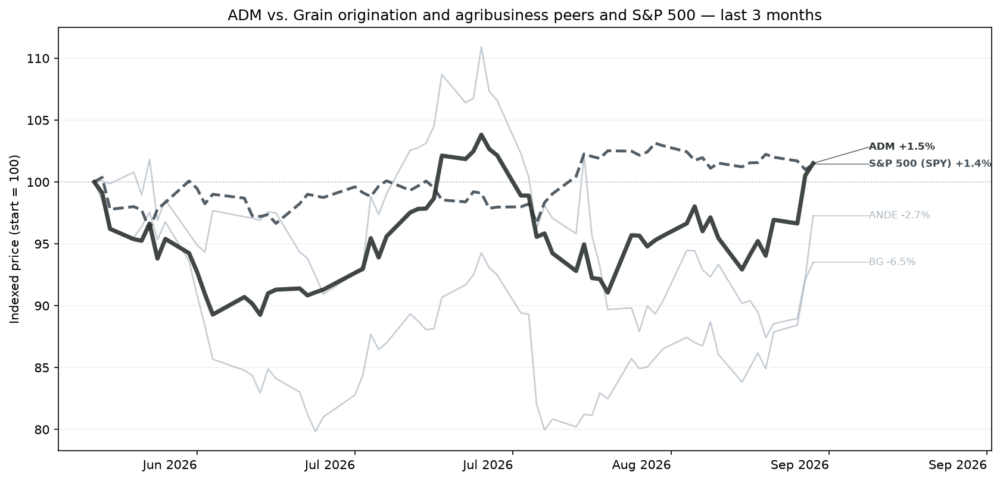

Archer-Daniels-Midland is a major processor of oilseeds, corn, wheat, and other agricultural commodities. The company is also one of the largest grain merchandisers through its extensive network of logistical assets to store and transport crops around the globe. ADM also runs a nutrition business that focuses on both human and animal ingredients and is a large producer of corn-based sweeteners, starches, and ethanol.

<h3 id="company-bg">Bunge (BG)</h3>

*Grain origination and agribusiness · $21.9B · 3m -6.5% · 12m +51.2% · 24m +23.7%*

[Google Finance](https://www.google.com/finance/quote/BG:NYSE?tab=earnings&hl=en)

Global grain and oilseed merchant after the Viterra combination; competitor for corn origination.

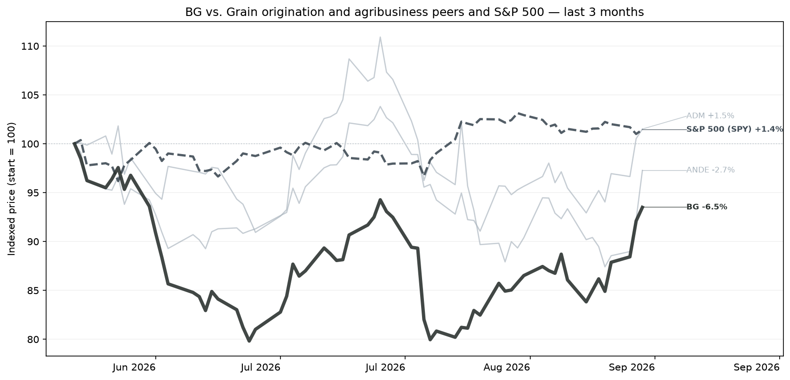

Bunge Global SA is an agribusiness solutions company, connecting farmers to consumers and delivering essential food, feed and fuel to the globe. The company segments include Soybean Processing and Refining; Softseed Processing and Refining; Other Oilseeds Processing and Refining; Grain Merchandising and Milling; and Corporate and Other. It generates maximum revenue from the Soybean Processing and Refining segment, which includes integrated business principally involved in the purchase, storage, transportation, processing, distribution, refining, marketing, and sale of soybeans and soybean related products, as well as biodiesel and fertilizer production and distribution. Geographically, the company operates in United States, Switzerland, Netherlands, and Rest of the World.

<h3 id="company-ande">The Andersons (ANDE)</h3>

*Grain origination and agribusiness, U.S. ethanol and process technology · $2.3B · 3m -2.7% · 12m +74.6% · 24m +44.3%*

[Google Finance](https://www.google.com/finance/quote/ANDE:NASDAQ?tab=earnings&hl=en)

Grain elevators plus four wholly owned ethanol plants totaling about 500 million gallons a year.

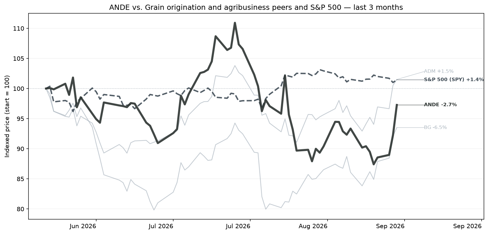

Andersons Inc is an agriculture and renewable fuels company. Its operations are classified into two reportable business segments: Agribusiness, which generates maximum revenue, and Renewables. The Agribusiness segment includes merchandising and managing logistics across various commodities, as well as being a manufacturer, distributor, and retailer of agricultural and related plant nutrients. The segment specializes in the movement of physical commodities such as whole grains, grain products, feed ingredients, and domestic fuel products, among other agricultural commodities. The Renewables segment mainly produces, purchases, and sells ethanol and co-products. Geographically, the company generates maximum revenue from the United States, followed by Canada, Mexico, and other markets.

<h3 id="company-vlo">Valero Energy (VLO)</h3>

*U.S. ethanol and process technology, Fuel blending, refining, and retail · $99.7B · 3m +40.0% · 12m +135.6% · 24m +159.0%*

[Google Finance](https://www.google.com/finance/quote/VLO:NYSE?tab=earnings&hl=en)

World's second-largest corn-ethanol producer with a distinct Ethanol segment and a major blender.

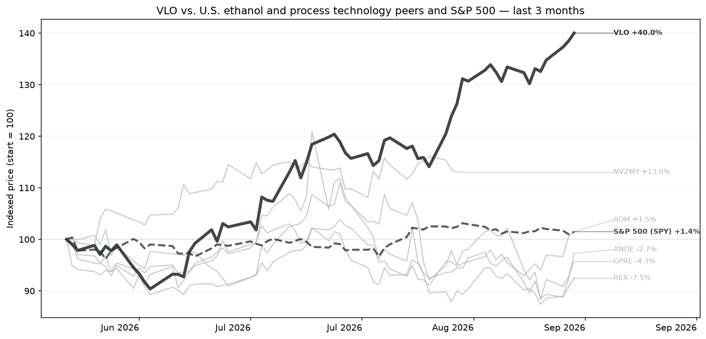

Valero Energy is one of the largest independent refiners in the United States. It operates 15 refineries, with a total throughput capacity of 3.2 million barrels a day in the US, Canada, and the United Kingdom. Valero also owns 12 ethanol plants with capacity of 1.6 billion gallons a year and holds a 50% stake in Diamond Green Diesel, which can produce 1.2 billion gallons per year of renewable diesel.

<h3 id="company-gpre">Green Plains (GPRE)</h3>

*U.S. ethanol and process technology · $1.1B · 3m -4.3% · 12m +40.9% · 24m +16.6%*

[Google Finance](https://www.google.com/finance/quote/GPRE:NASDAQ?tab=earnings&hl=en)

Largest U.S. ethanol pure play, with high-protein feed, corn oil, and Nebraska carbon-capture work.

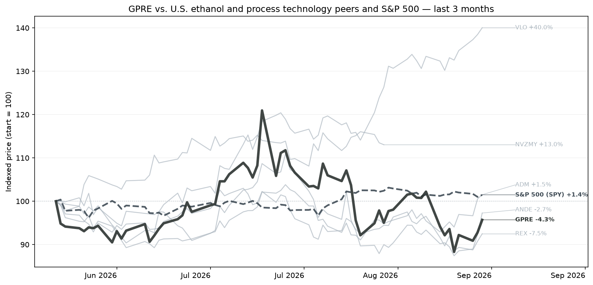

Green Plains Inc manufactures and sells ethanol and ethanol byproducts in two segments based on function. The ethanol production segment, which generates the majority of revenue, includes the production of ethanol, distillers grains, Ultra-High Protein and renewable corn oil. The agribusiness and energy services segment includes grain handling and storage, commodity marketing and merchant trading for company-produced and third-party ethanol, distillers grains, Ultra-High Protein, renewable corn oil, natural gas and other commodities.

<h3 id="company-rex">REX American Resources (REX)</h3>

*U.S. ethanol and process technology · $1.4B · 3m -7.5% · 12m +38.7% · 24m +100.4%*

[Google Finance](https://www.google.com/finance/quote/REX:NYSE?tab=earnings&hl=en)

Holding company with interests in six Corn Belt ethanol plants; cleanest public crush-margin equity.

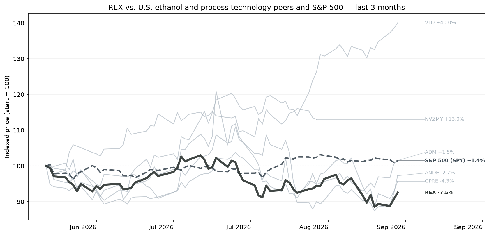

REX American Resources Corp operates as a holding company that engages in investments in alternative energy and ethanol production entities. Its operating segments include Ethanol and By-Products. Its products include Ethanol, dried distillers grains, modified distillers grains, Distillers corn oil, Modified distillers grains, and Other.

<h3 id="company-nvzmy">Novonesis (NVZMY)</h3>

*U.S. ethanol and process technology · n/a · 3m +13.0% · 12m +2.4% · 24m -6.2%*

[Google Finance](https://www.google.com/finance/quote/NVZMY:NYSE?tab=earnings&hl=en)

Dominant supplier of enzymes used in dry-mill ethanol fermentation.

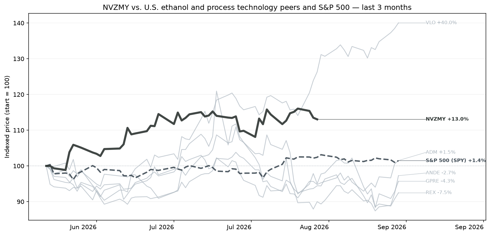

NOVONESIS B UNSP/ADR

<h3 id="company-ingr">Ingredion (INGR)</h3>

*Wet milling, ingredients, and co-products · $6.8B · 3m +1.7% · 12m -19.7% · 24m -23.6%*

[Google Finance](https://www.google.com/finance/quote/INGR:NYSE?tab=earnings&hl=en)

Major corn wet miller producing sweeteners, starches, and specialty ingredients.

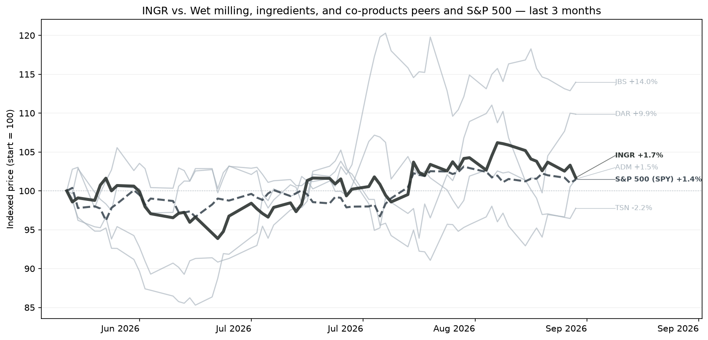

Ingredion is an ingredients provider for the food, beverage, brewing, and animal nutrition industries. The company processes corn, tapioca, potatoes, stevia, grains, fruits, gums, and vegetables into value-added ingredients. The company sells specialty ingredients that include starch-based texturizers and natural alternative sweeteners such as stevia. Ingredion also sells commodity ingredients that include sweeteners, such as high-fructose corn syrup, and starches, such as those used for sustainable packaging, as well as plant-based proteins. The company plans to acquire Tate & Lyle in an all-cash deal that should close in 2027.

<h3 id="company-dar">Darling Ingredients (DAR)</h3>

*Wet milling, ingredients, and co-products · $10.6B · 3m +9.9% · 12m +112.0% · 24m +67.6%*

[Google Finance](https://www.google.com/finance/quote/DAR:NYSE?tab=earnings&hl=en)

Rendering and used cooking oil; 50/50 owner of Diamond Green Diesel with Valero.

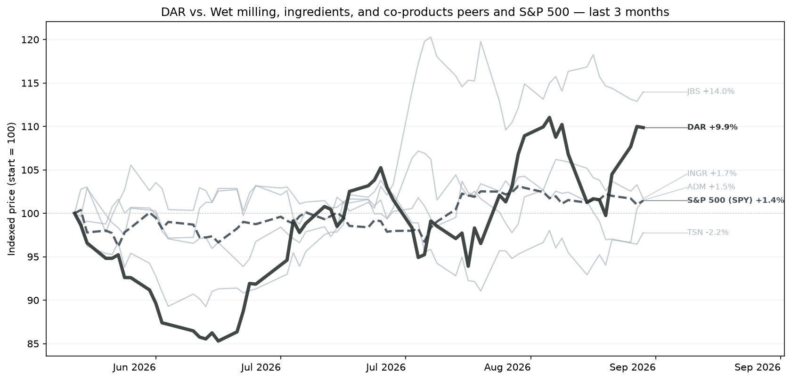

Darling Ingredients Inc is a developer and producer of sustainable natural ingredients from edible and inedible bio-nutrients, creating a wide range of ingredients and customized specialty solutions for customers in the pharmaceutical, food, pet food, animal feed, industrial, fuel, bioenergy and fertilizer industries. It processes by-products from the animal agriculture and food industries into ingredients and products for human nutrition, animal feed, crop inputs, and renewable energy applications. The company operates processing facilities across multiple countries and produces collagen, including gelatin and hydrolyzed collagen, as well as renewable energy products.

<h3 id="company-tsn">Tyson Foods (TSN)</h3>

*Wet milling, ingredients, and co-products · $20.6B · 3m -2.2% · 12m -1.0% · 24m -13.9%*

[Google Finance](https://www.google.com/finance/quote/TSN:NYSE?tab=earnings&hl=en)

Largest U.S. protein company and a primary domestic sink for distillers grains.

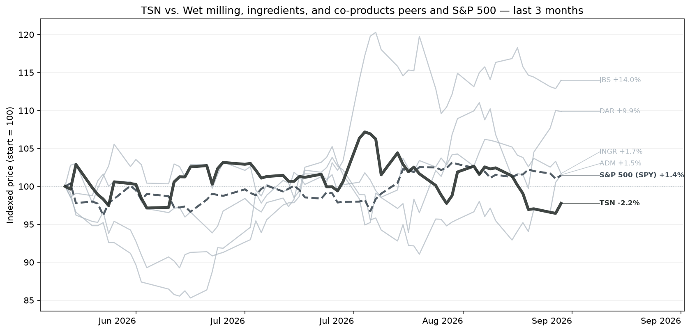

Tyson Foods is a protein-focused food producer, selling raw chicken, beef, pork, and prepared foods. Chicken and beef are its two largest segments, composing about 40% and 30% of sales, respectively. Prepared foods constituted 18% of fiscal 2025 sales and include brands like Tyson, Jimmy Dean, Hillshire Farm, Ball Park, and Sara Lee. However, most of these are in product categories rife with competition where Tyson does not have a massive market share lead. Tyson sells some products overseas, but the international segment accounts for just 4% of total revenue. The company is an active acquirer, with more recent years' purchases focused on international and food-service markets.

<h3 id="company-jbs">JBS (JBS)</h3>

*Wet milling, ingredients, and co-products · $45.2B · 3m +14.0% · 12m -15.0% · 24m n/a*

[Google Finance](https://www.google.com/finance/quote/JBS:NYSE?tab=earnings&hl=en)

World's largest protein company and a major DDGS buyer in the U.S. and Brazil.

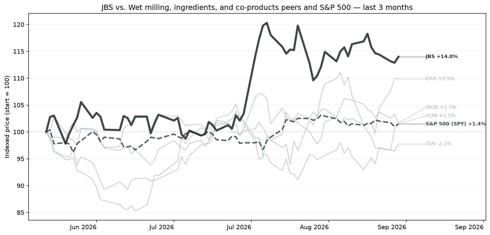

JBS NV is a protein food company, selling protein products, which include fresh and frozen cuts of beef, pork, lamb, fish, whole chickens, and chicken parts, to retailers, and foodservice companies. The food products are marketed under different brands such as Swift, Just Bare, Pilgrim's Pride, Sunnyvalley, Reserva Friboi, Great Southern, etc., globally. The company's reportable segments are Beef North America, which generates maximum revenue, Brazil, Seara, Pork USA, Pilgrim's Pride, Australia, and Others. Geographically, it derives majority of its revenue from United States of America.

<h3 id="company-mpc">Marathon Petroleum (MPC)</h3>

*Fuel blending, refining, and retail · $101.3B · 3m +44.8% · 12m +116.2% · 24m +122.6%*

[Google Finance](https://www.google.com/finance/quote/MPC:NYSE?tab=earnings&hl=en)

Largest U.S. independent refiner and a major Midwest ethanol blender.

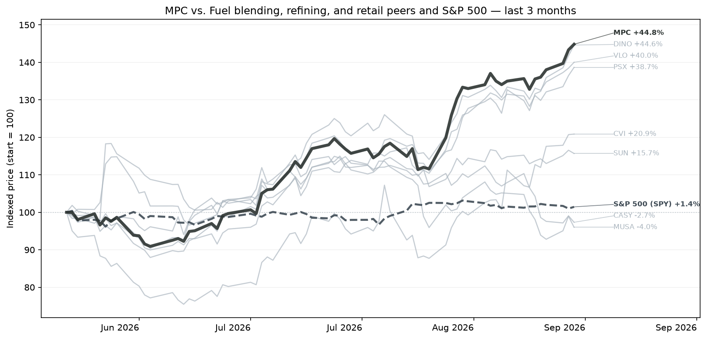

Marathon Petroleum is a leading integrated downstream and midstream energy company that operates 13 refineries in the Gulf Coast, Mid-Continent, and West Coast regions of the United States with an aggregate crude oil refining capacity of 3.0 million barrels per day. The company is one of the largest producers of renewable diesel in the US; its Dickinson, North Dakota facility has the capacity to produce 184 million gallons per year, and its Martinez, California, joint venture facility (a 50/50 partnership with Neste) reached its full capacity of 730 million gallons per year in late 2024. Marathon also owns the general partner and approximately 64% of MPLX LP, a large-cap master limited partnership that owns and operates midstream energy infrastructure and logistics assets.

<h3 id="company-psx">Phillips 66 (PSX)</h3>

*Fuel blending, refining, and retail · $96.7B · 3m +38.7% · 12m +96.2% · 24m +89.7%*

[Google Finance](https://www.google.com/finance/quote/PSX:NYSE?tab=earnings&hl=en)

Large blender and marketer with West Coast renewable-diesel capacity.

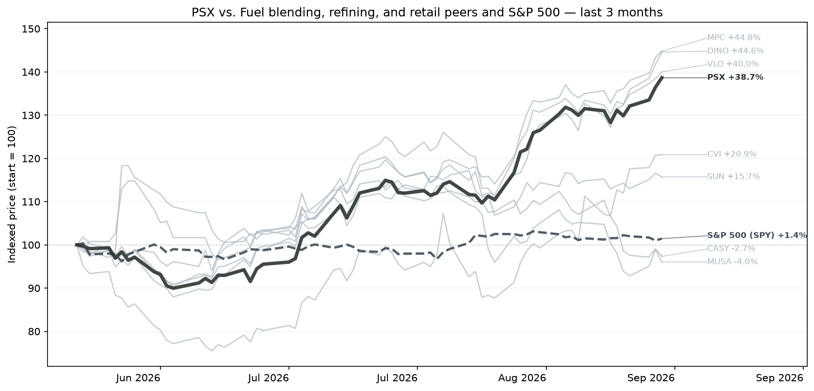

Phillips 66 is an independent refiner that owns or holds interest in 10 refineries with a total crude throughput capacity of 2.0 million barrels per day, or mmb/d, at the end of 2025. The midstream segment comprises extensive transportation and NGL processing assets. It includes 70,000 miles of crude oil, refined petroleum product, NGL and natural gas pipeline systems, and a comprehensive set of refined petroleum product, NGL and crude oil terminals, gathering and processing plants and fractionation facilities and various other storage and loading facilities. Its CPChem chemical joint venture operates facilities primarily in the United States and the Middle East and produces olefins and polyolefins.

<h3 id="company-dino">HF Sinclair (DINO)</h3>

*Fuel blending, refining, and retail · $16.8B · 3m +44.6% · 12m +105.7% · 24m +123.5%*

[Google Finance](https://www.google.com/finance/quote/DINO:NYSE?tab=earnings&hl=en)

Independent Mid-Continent and Rockies refiner with renewable diesel and RFS blending obligations.

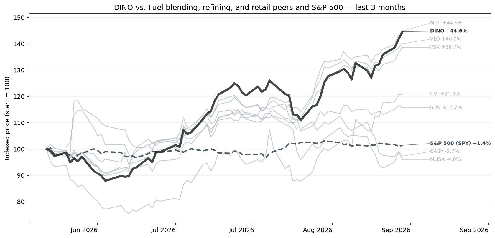

HF Sinclair is an integrated petroleum refiner that owns and operates seven refineries serving the Rockies, midcontinent, Southwest, and Pacific Northwest, with a total crude oil throughput capacity of 678,000 barrels per day. It can produce 380 million gallons of renewable diesel annually. It operates a marketing business with over 350 distributors and 1,700 branded wholesale sites across 30 states. It also owns and operates 4,500 miles of petroleum product pipelines and terminals principally in the Southwestern United States.

<h3 id="company-cvi">CVR Energy (CVI)</h3>

*Fuel blending, refining, and retail · $3.7B · 3m +20.9% · 12m +38.9% · 24m +71.1%*

[Google Finance](https://www.google.com/finance/quote/CVI:NYSE?tab=earnings&hl=en)

Coffeyville, Kansas refiner in the corn complex with renewable diesel and a nitrogen affiliate.

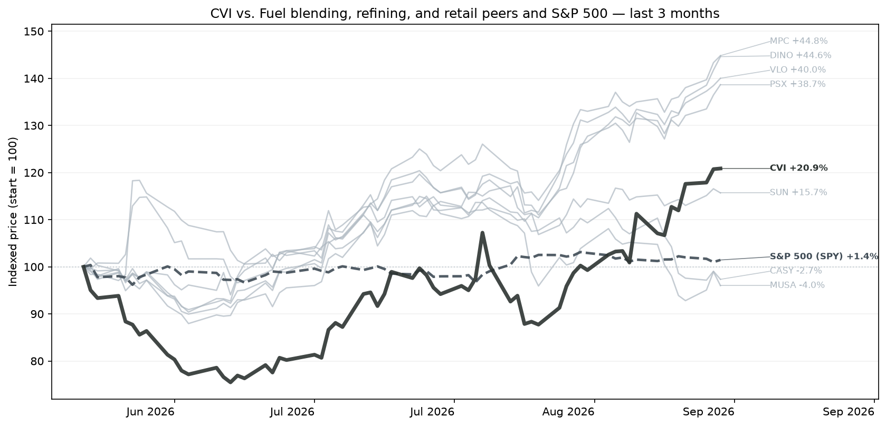

CVR Energy Inc is a holding company that engages in petroleum refining and nitrogen fertilizer manufacturing through its subsidiaries. Subsidiaries include several complex, full-coking crude oil refineries, along with a crude oil gathering system, pipelines, storage tanks, and marketing and supply. The company's refineries can process blends of a variety of crude oil ranging from heavy sour to light sweet crude oil. Crude oil for CVR's refineries is supplied through its wholly-owned gathering system and pipeline. From its refineries, CVR supplies products through tanker trucks directly to customers located in close geographic proximity and customers at throughput terminals. The company's customers include retailers, railroads, and farm cooperatives.

<h3 id="company-sun">Sunoco LP (SUN)</h3>

*Fuel blending, refining, and retail · $14.5B · 3m +15.7% · 12m +48.1% · 24m +43.9%*

[Google Finance](https://www.google.com/finance/quote/SUN:NYSE?tab=earnings&hl=en)

Fuel distributor and terminal operator that moves finished gasoline and ethanol.

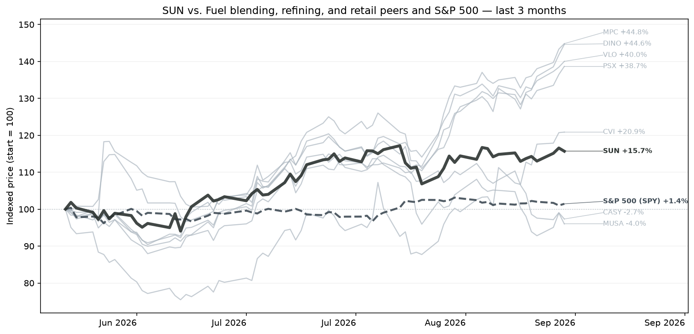

Sunoco LP is engaged in the distribution of motor fuels to independent dealers, distributors, and other commercial customers as well as the distribution of motor fuels to end-use customers at retail sites operated by commission agents. It is a growth-oriented master limited partnership (MLP) that operates as a wholesale and retail fuel distributor in the United States. The firm operates through the Fuel Distribution; Pipeline Systems; Refinery and Terminals segments. It generates the majority of its revenue from the Fuel Distribution segment. It distributes motor fuel to convenience stores, dealers, and commercial customers in various states.

<h3 id="company-casy">Casey&#x27;s General Stores (CASY)</h3>

*Fuel blending, refining, and retail · $30.9B · 3m -2.7% · 12m +50.8% · 24m +112.3%*

[Google Finance](https://www.google.com/finance/quote/CASY:NASDAQ?tab=earnings&hl=en)

Corn Belt convenience-store chain with high E10/E15/E85 exposure.

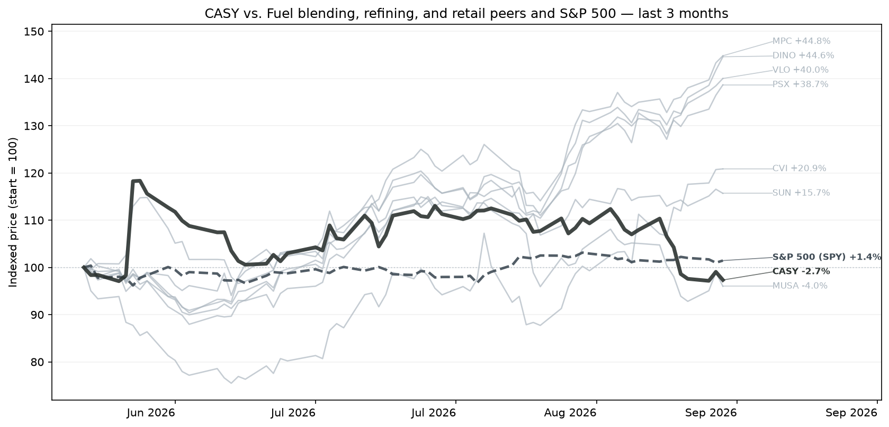

Casey's General Stores Inc, along with its subsidiaries, operates convenience stores mainly under the names Casey's, GoodStop (by Casey's), and Casey's General Store throughout various states in the USA, approximately half of which are located in Iowa, Missouri, and Illinois. These stores offer a broad selection of food items (which includes prepared foods such as regular and breakfast pizza, donuts, hot breakfast items, and hot and cold sandwiches), beverages, tobacco and nicotine products, groceries, health and beauty aids, automotive products, and other non-food items. The majority of the company's revenue is mainly derived from the retail sale of fuel and the products offered inside its stores.

<h3 id="company-musa">Murphy USA (MUSA)</h3>

*Fuel blending, refining, and retail · $10.4B · 3m -4.0% · 12m +40.2% · 24m +2.1%*

[Google Finance](https://www.google.com/finance/quote/MUSA:NYSE?tab=earnings&hl=en)

High-volume fuel retailer and national ethanol blender.

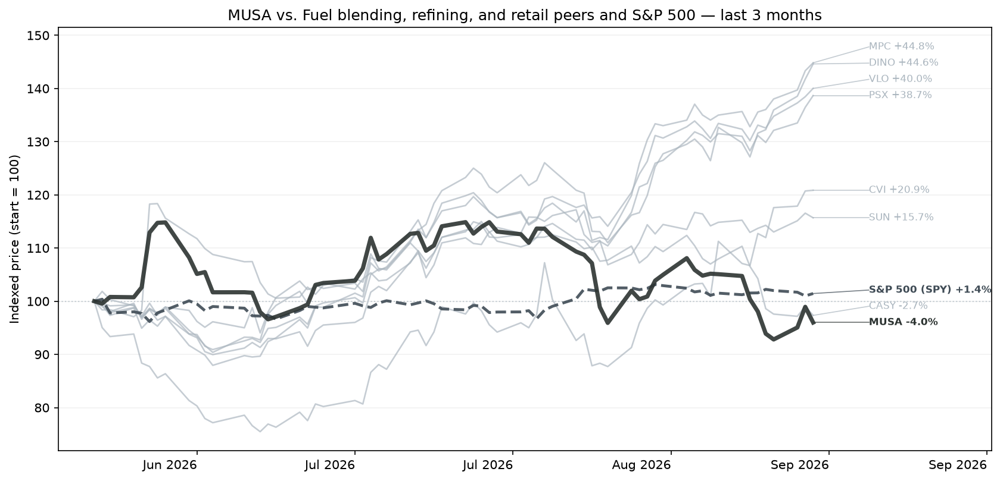

Murphy USA Inc is mainly engaged in the marketing of retail motor fuel products and convenience merchandise through a network of several retail stores in the Southwest, Southeast, Midwest, and Northeast United States. The majority of Murphy USA's stores are located in proximity to Walmart Supercenters, but it also operates standalone stores that market gasoline and other products under the Murphy USA, Murphy Express, and QuickChek brands. In addition, the company also markets fuel to unbranded wholesale customers through a mixture of company-owned and third-party product distribution terminals and pipeline positions. The firm generates maximum revenue through retail sales of petroleum products, and the rest from merchandise sales and wholesale of petroleum products.

<h3 id="company-ntoiy">Neste (NTOIY)</h3>

*Advanced biofuels and SAF · n/a · 3m -2.4% · 12m +79.6% · 24m +52.8%*

[Google Finance](https://www.google.com/finance/quote/NTOIY:NYSE?tab=earnings&hl=en)

Largest global producer of renewable diesel and SAF; sets the price umbrella for corn oil.

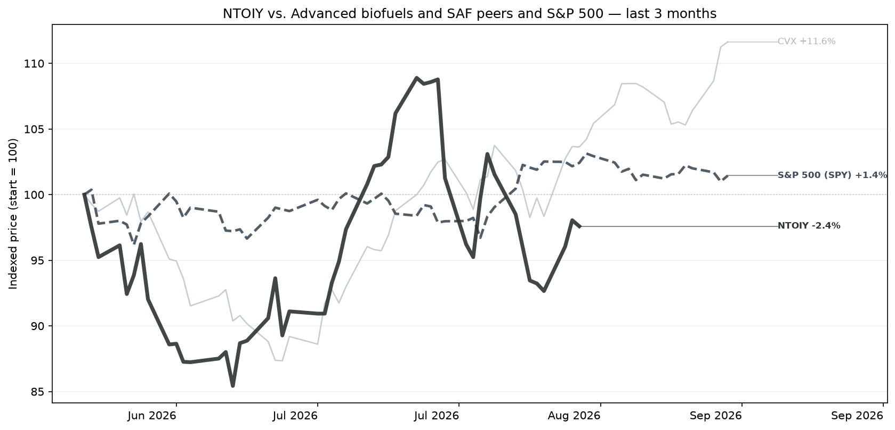

NESTE OYJ UNSP/ADR

<h3 id="company-cvx">Chevron (CVX)</h3>

*Advanced biofuels and SAF · $403.6B · 3m +11.6% · 12m +34.0% · 24m +46.4%*

[Google Finance](https://www.google.com/finance/quote/CVX:NYSE?tab=earnings&hl=en)

Owner of Renewable Energy Group biodiesel and renewable-diesel plants that take corn oil at the margin.

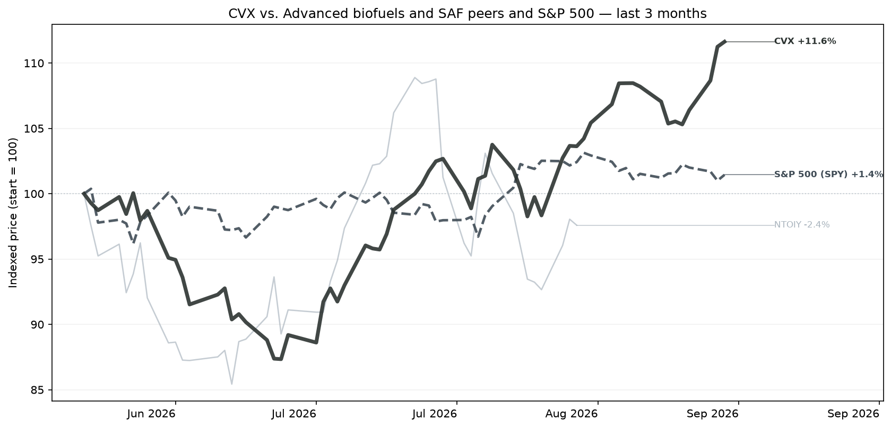

Chevron is an integrated energy company with exploration, production, and refining operations worldwide. It is the second-largest oil company in the United States with 2025 worldwide net oil-equivalent production of 3.7 million barrels per day, including 8.5 billion cubic feet per day of natural gas and 2.3 million barrels of liquids per day. Production takes place in North America, South America, Europe, Africa, Asia, and Australia. The company's refining networks arelocated in the United States and Asia, with a total worldwide refining capacity of 1.8 million barrels of oil a day at year-end 2025. Net proved reserves at year-end 2025 stood at 10.6 billion barrels of oil equivalent, consisting of 5.7 billion barrels of liquids and 29.2 trillion cubic feet of natural gas.

<h3 id="company-csan">Cosan (CSAN)</h3>

*International ethanol · $2.5B · 3m +2.1% · 12m -40.2% · 24m -68.6%*

[Google Finance](https://www.google.com/finance/quote/CSAN:NYSE?tab=earnings&hl=en)

Brazilian holding company and the liquid U.S.-listed proxy for sugarcane ethanol via Raizen.

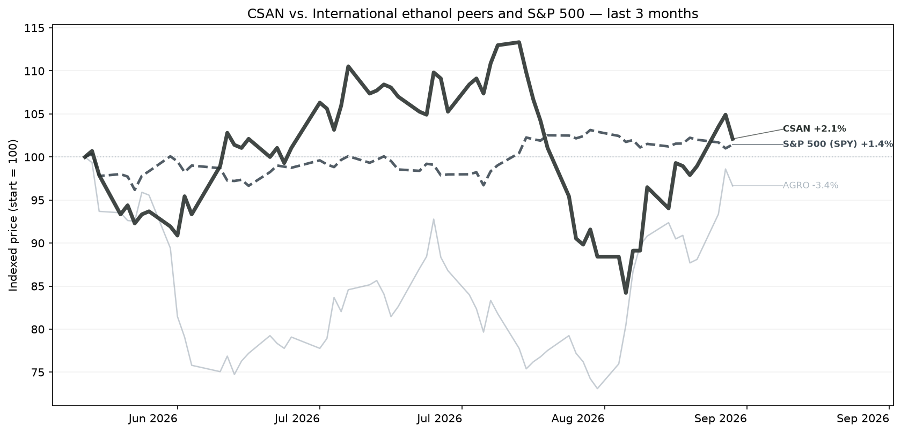

Cosan SA engages in several services throughout the energy and logistics sectors. Its reportable segments are Raizen, Compass, Moove, Rumo, and Radar. It generates the majority of its revenue from Raizen which operates in the production, commercialization, origination, and trading of ethanol, bioenergy, resale, and trading of electricity, renewable sources, marketing, origination, and trading of sugar and fuels, and lubricant.

<h3 id="company-agro">Adecoagro (AGRO)</h3>

*International ethanol · $1.5B · 3m -3.4% · 12m +42.1% · 24m +6.7%*

[Google Finance](https://www.google.com/finance/quote/AGRO:NYSE?tab=earnings&hl=en)

South American farmland and sugar/ethanol producer with U.S.-listed equity.

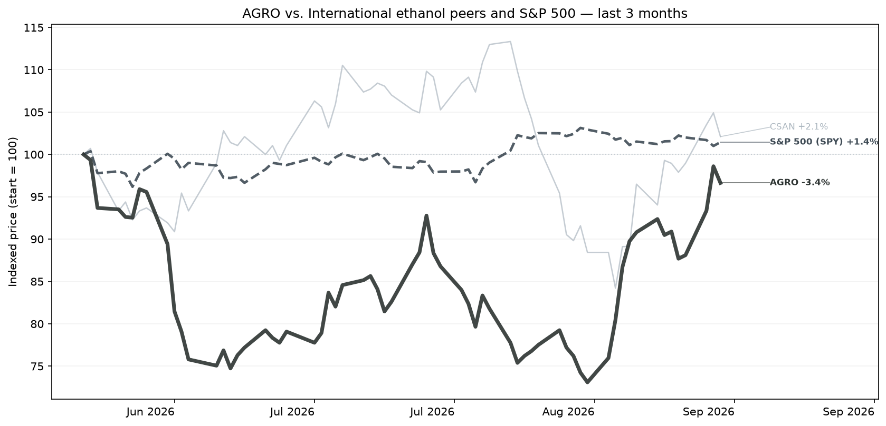

Adecoagro SA is a Luxembourg-based agricultural company. It is involved in a wide range of businesses, including farming crops and other agricultural products, dairy operations sugar, ethanol, energy production, and land transformation. The group operates in two lines of business, namely, Farming and Sugar, Ethanol and Energy. The Farming is further comprised of three reportable segments: Crops, Rice and Dairy. Sugar, Ethanol and Energy Segment, consists of cultivating sugarcane, which is processed in owned sugar mills, transformed into ethanol, sugar and electricity, in addition to biomethane and then marketed.

<h3 id="company-unp">Union Pacific (UNP)</h3>

*Logistics · $179.3B · 3m +10.5% · 12m +30.7% · 24m +13.5%*

[Google Finance](https://www.google.com/finance/quote/UNP:NYSE?tab=earnings&hl=en)

Primary western Class I for Corn Belt corn, ethanol unit trains, DDGS, and corn oil.

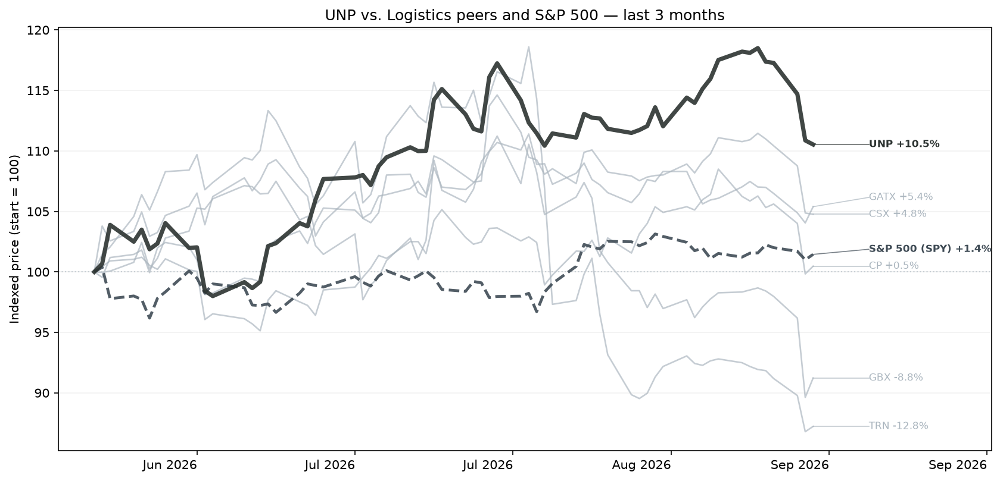

Omaha, Nebraska-based Union Pacific is the largest public railroad in North America. Operating on more than 30,000 miles of track in the western two-thirds of the US, Union Pacific generated $24.5 billion of revenue in 2025 by hauling coal, industrial products, intermodal containers, agricultural goods, chemicals, fertilizers, and automotive goods. Union Pacific owns about one-fourth of Mexican railroad Ferromex and historically derives roughly 10% of its revenue hauling freight to and from Mexico.

<h3 id="company-csx">CSX (CSX)</h3>

*Logistics · $93.9B · 3m +4.8% · 12m +50.7% · 24m +40.7%*

[Google Finance](https://www.google.com/finance/quote/CSX:NASDAQ?tab=earnings&hl=en)

Primary eastern Class I into Northeast and Southeast gasoline markets for ethanol unit trains.

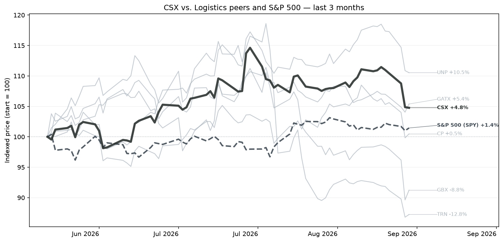

Operating in the Eastern United States, Class I railroad CSX generated revenue of nearly $14 billion in 2025. On its more than 21,000 miles of track, CSX hauls shipments of coal (16% of consolidated revenue), chemicals (17%), intermodal containers (16%), automotive cargo (7%), and a diverse mix of other bulk and industrial merchandise.

<h3 id="company-cp">Canadian Pacific Kansas City (CP)</h3>

*Logistics · $83.0B · 3m +0.5% · 12m +16.8% · 24m +7.4%*

[Google Finance](https://www.google.com/finance/quote/CP:NYSE?tab=earnings&hl=en)

North-south railroad for Midwest corn and ethanol to the Gulf and Mexico.

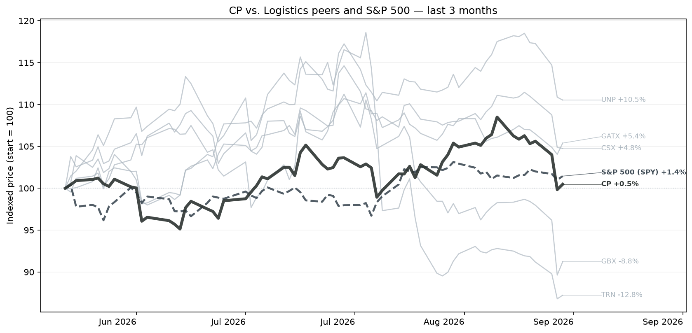

Canadian Pacific Kansas City is a Class I railroad operating on tracks that span most of Canada and into parts of the Midwestern and Northeastern United States. Following the April 2023 Kansas City Southern merger, CPKC operates new single-linehaul services from Canada and the Upper Midwest down through Texas, the Gulf of Mexico, and into Mexico. It also hauls cross-border and intra-Mexico freight via operating concessions on more than 3,000 miles of rail in Mexico. CPKC hauls shipments of grain, intermodal containers, energy products (like crude and frac sand), chemicals, plastics, coal, fertilizer and potash, automotive products, and a diverse mix of other merchandise.

<h3 id="company-gatx">GATX (GATX)</h3>

*Logistics · $6.2B · 3m +5.4% · 12m +5.0% · 24m +30.0%*

[Google Finance](https://www.google.com/finance/quote/GATX:NYSE?tab=earnings&hl=en)

Largest public railcar lessor of ethanol tank cars and grain/DDGS hoppers.

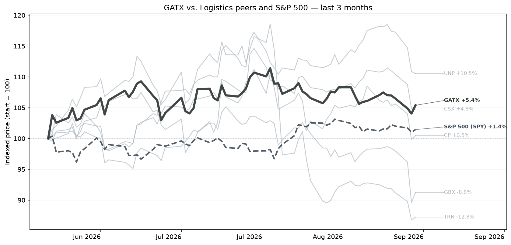

GATX Corp leases transportation assets, including railcars, aircraft spare engines, and tank containers, to customers in North America, Europe, and India. The company's reportable business segments are: Rail North America, Rail International, Engine Leasing, and Other. The majority of its revenue is generated from the Rail North America segment, which is composed of the company's operations in the United States, Canada, and Mexico. This segment mainly provides railcars pursuant to full-service leases under which it maintains the railcars, pays ad valorem taxes and insurance, and provides other ancillary services.

<h3 id="company-trn">Trinity Industries (TRN)</h3>

*Logistics · $2.4B · 3m -12.8% · 12m +0.4% · 24m -12.9%*

[Google Finance](https://www.google.com/finance/quote/TRN:NYSE?tab=earnings&hl=en)

Builds and leases covered hoppers and tank cars used for grain, DDGS, and ethanol.

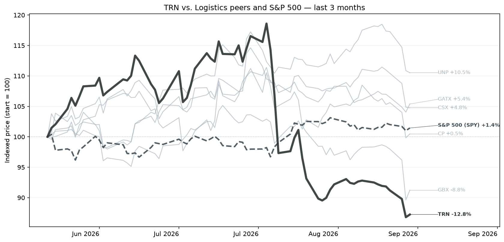

Trinity Industries Inc sells and leases railroad products and railcar maintenance services in North America. The company operates under the name TrinityRail in two main segments: railcar leasing and management services, which owns railcars and provides fleet management and administration services; rail products, which builds, sells, and modifies freight and tank railcars and their components; and all other, which sells highway products such as guardrail and other highway barriers. Customers include railroads, leasing companies, and shipping companies in agriculture, construction, consumer products, energy, and chemicals.

<h3 id="company-gbx">Greenbrier (GBX)</h3>

*Logistics · $1.4B · 3m -8.8% · 12m -6.7% · 24m -9.7%*

[Google Finance](https://www.google.com/finance/quote/GBX:NYSE?tab=earnings&hl=en)

Builds tank cars used for ethanol, renewable fuels, and CO2.

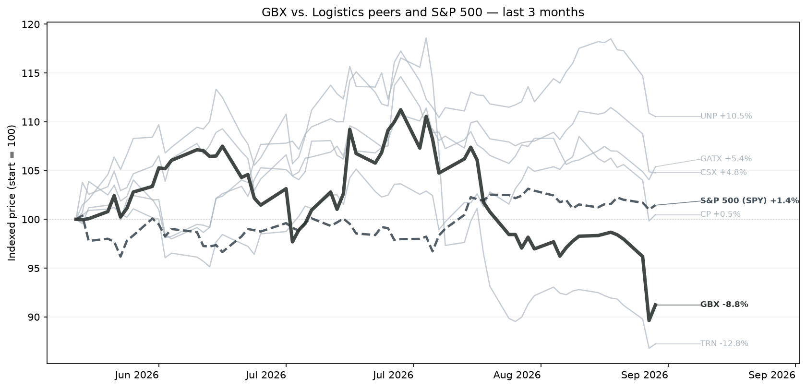

Greenbrier Companies Inc supplies equipment and services to international freight transportation markets, designing and marketing freight railcars in North America, Europe, and Brazil through subsidiaries and joint ventures. It provides railcar wheel services, parts, maintenance, and conversion services in North America. The company owns a lease fleet sourced mainly from its manufacturing operations and offers railcar management, regulatory compliance, and leasing services to railroads and owners. It operates two segments: Manufacturing and Leasing & Fleet Management, with the majority of revenue from Manufacturing. The company operates in the U.S. and internationally, with the majority of revenue from the U.S. market.

